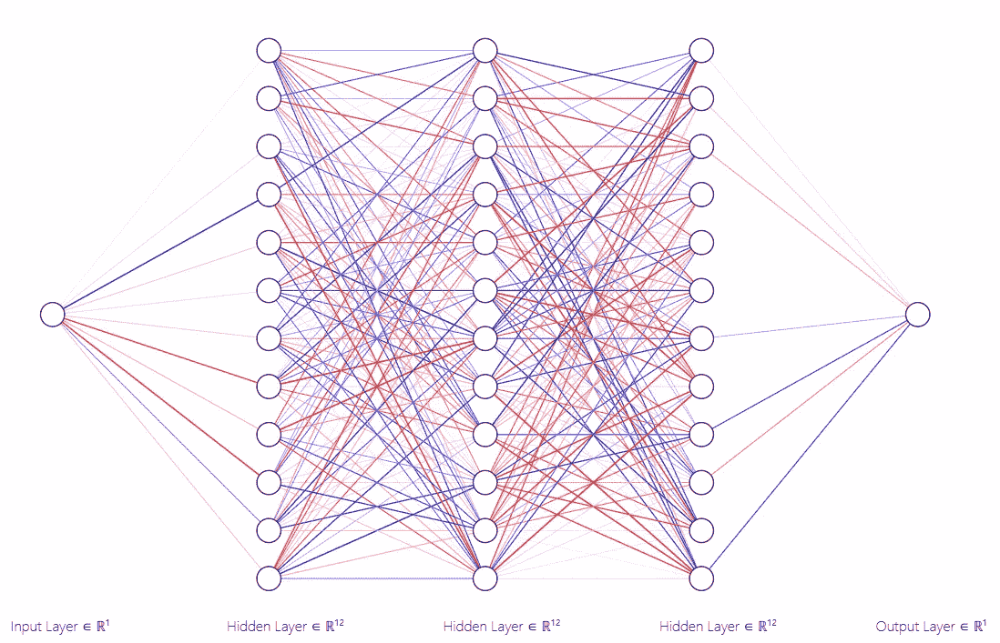
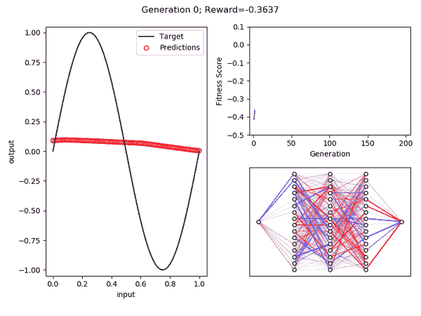
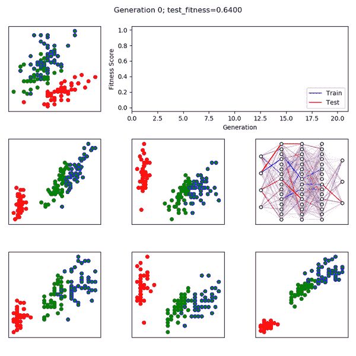
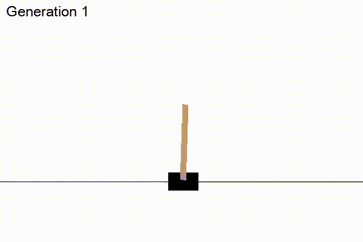

# 进化神经网络

> 原文：<https://towardsdatascience.com/evolving-neural-networks-b24517bb3701?source=collection_archive---------6----------------------->

## 进化算法教程

在过去的十年里，深度学习一直主导着机器学习领域，通常会排斥其他技术。作为一名数据科学家，拥有各种工具是很重要的，我觉得一类经常被忽视的技术是进化算法。这么说可能有点自我放纵(我自己是一个长期运行的进化算法的中间产品)，但我发现设计的进化技术非常棒，在许多情况下比传统的机器学习技术更实用。在本教程中，我们将使用进化算法来训练神经网络，并使用这种技术来解决回归、分类和策略问题。为此，我们将使用 Python 和 NumPy 库。

# 算法

进化算法以[自然选择](https://en.wikipedia.org/wiki/Natural_selection)为前提，包括五个步骤:

1.  创造一个有机体的初始种群。在我们的例子中，这些将是神经网络。
2.  根据一些标准评估每种生物。这是生物体的适应度得分。
3.  从第二步中挑选最好的生物体，让它们繁殖。后代可以是一个父母的完全相同的复制品(无性繁殖)，也可以是两个或更多父母的嵌合体(有性繁殖)。
4.  变异后代。
5.  取新的变异后代群体，回到第二步。重复进行，直到满足某些条件(例如，通过了固定数量的代，达到了目标适应度，等等)。)

## 第一步:有机体

在本教程中，我们将使用全连接前馈[神经网络](https://en.wikipedia.org/wiki/Artificial_neural_network)作为我们的有机体。

Fig 1: A fully-connected (dense) network with dimensions [1, 12, 12, 12, 1]

在设计我们的有机体时，我们有四个指导原则:

1.  我们必须控制生物体的输入和输出维度。从根本上说，我们正试图进化出某种映射ℝᵃ ⟶ ℝᵇ的功能 *f* ，所以 *a* 和 *b* 应该被内置到有机体中。我们通过参数化输入和输出维度来实现这一点。
2.  *我们必须控制输出激活功能。*有机体的输出应该适合手头的问题。我们通过参数化输出激活来实现这一点。
3.  我们必须控制生物体的复杂性。理想的生物体应该足够复杂，能够进化出目标功能，仅此而已。我们通过参数化隐藏层的数量及其尺寸来实现这一点。在一个更先进的算法中，这可以通过让生物体进化自己的结构并用适应度函数惩罚复杂性来实现。
4.  *生物必须兼容有性生殖。幸运的是，上述原则确保了这一点。所有的生物都将有相同的结构，所以“交换遗传物质”在这里意味着后代将从妈妈那里得到一些层重量，从爸爸那里得到一些层重量。*

实现如下:

Snippet 1: The partial Organism class and methods for creating and using it

在`__init__`功能中，我们设置了网络。参数`dimensions`是图层维度列表，第一个是输入的宽度，最后一个是输出的宽度，其他都是隐藏维度。`__init__`函数迭代这些 *n* 维，以使用 [Glorot 正常初始化](http://proceedings.mlr.press/v9/glorot10a/glorot10a.pdf)创建 *n-1* 权重矩阵，这些权重矩阵被存储为`layers`。如果启用了偏置，还会为每个层存储一个非零偏置向量。该模型对所有内部层使用 [ReLU](https://en.wikipedia.org/wiki/Rectifier_(neural_networks)) 激活。使用`output`参数指定输出激活，可以是“ [softmax](https://en.wikipedia.org/wiki/Softmax_function) ”、“ [sigmoid](https://en.wikipedia.org/wiki/Sigmoid_function) ”或“ [linear](https://en.wikipedia.org/wiki/Identity_function) ”，在`_activation`方法中实现。

`predict`方法对输入矩阵反复应用 ReLU 和矩阵乘法。例如，如果网络由三个隐藏层和 softmax 输出构成，则网络将应用该函数

**y**=*soft max*(*relu*(*relu*(*relu*(**xw₁**)**w₂**)**w₃**)**w₄**)

其中 **X** 为输入矩阵， **Wᵢ** 为层 *i* 的权重矩阵， **Y** 为输出矩阵。

我们将创造一群这样的生物，它们都有相同的结构，但每一个都有不同的随机重量。

## 第二步:身体健康

衡量一个有机体的表现如何是进化算法设计的关键，而“好的表现”因任务而异。在回归中，适合度分数可以是负的均方误差。在分类上，可能是分类精度。玩吃豆人，可能是临死前狼吞虎咽的小球数量。因为适应度函数是特定于任务的，所以我们将等到下面的应用部分再来探讨它们。目前，理解我们需要一个函数`scoring_function`就足够了，它接受一个有机体作为输入并返回一个实数输出，其中越大越好。

## 第三步:繁殖

繁殖步骤本身有两个步骤:亲本选择和后代创造。每个新的有机体都需要双亲。在无性繁殖中 k 是 1，而在有性繁殖中 k 是 2 或更多。因此，要生成新一代的 *n* 生物，必须从上一代中选择 *n* 套 *k* 生物；决定哪个(些)有机体将成为每个孩子的父母应该基于它们的适应性分数来完成，其中最适合的有机体应该产生最多的后代。有许多方法可以做到这一点，其中包括:

1.  从生物的前 10%中统一选择每个亲本。
2.  将生物体从最好到最差排序，然后通过从指数分布中取样来选择每个亲本的指数。
3.  将 softmax 函数应用于每个生物体的得分，以创建每个生物体的选择概率，然后从该分布中取样。

我在方法一和方法二之间选择了一个折衷方案，其中前 10%的生物体被选择作为一个孩子的第一个亲本，每个亲本十次，第二个亲本使用指数分布随机选择，如上所述。我还强制要求将某一代中表现最好的生物体克隆到下一代中。以下是相关代码:

Snippet 2: The partial Ecosystem class and the method for simulating a generation

如您所见，第 5 行和第 6 行对生物体进行了评分和排序。然后，`population_size`新的有机体在第 8 行的循环中产生。从第 9 行的前 10%中选择亲本 1(`holdout`是保证后代的生物数量，这里为`population_size` //10)。当`mating`启用时，使用λ= `holdout`的指数分布选择父 2。当交配被禁用时，父代 1 与其自身交配，子代是克隆体。

一旦选择了 n 对亲本，就可以通过随机组合每对亲本的特征来创造后代。在我们的例子中，这些特征是神经网络层中的权重。下面是`Organism`类创建后代的方法:

Snippet 3: The partial Organism class and method for mating two organisms together

如您所见，`mate`方法确认双亲彼此兼容，然后随机选择一个双亲来继承子有机体的每个权重矩阵中的每个列向量。

## 第四步:突变

每一个子生物体产生后，它都要经历突变(片段 3，第 18 行)。在本教程中，变异步骤被实现为将高斯噪声添加到网络中的每个权重。这里我们不改变网络的激活或架构，尽管更高级的进化算法肯定可以通过在隐藏层中添加或删除节点来做到这一点。代码如下:

Snippet 4: the partial Organism class and mutation method

## 重复

这几乎不是一个步骤；剩下要做的就是检查是否满足某些条件，如果不满足，就返回到第二步。我选择以固定的代数运行该算法，但是当适应性分数达到期望的阈值时或者在代数没有改进的情况下停止也是很好的选择。以下是有机体和生态系统类的完整代码:

Snippet 5: The Organism and Ecosystem classes in all their splendor

# 应用

> “酷。我为什么要在乎？”—可能是你

## 回归

让我们将这个过程应用于一个回归问题。我们将进化出一个有机体，在域*x∈【0，1】*中近似*sin(*[*【τ*](https://tauday.com/tau-manifesto)*x)*。显然这是一个微不足道的问题，这就是为什么我们把它作为一个例子。那么我们应该如何设计我们的有机体呢？

1.  这是一个从ℝ到ℝ的函数，所以输入和输出维度都是 1。
2.  正弦的范围是[-1，1]，所以输出激活将是线性的。
3.  适应度函数将是有机体输出的负均方误差。
4.  我们将使用三个宽度为 16 的隐藏层，因为对于这个简单的任务来说，这可能已经足够复杂了。

代码如下:

Snippet 6: Using an Ecosystem of Organisms to evolve the sine function

结果:

Fig 2: The best organism from each of 200 generations of evolution. Predictions vs. target (left), best fitness per generation (top), and network visualization (bottom).

正如你所看到的，在 200 代之后，一个有机体进化出了一个在域*【0，1】内的正弦函数的非常好的近似值。*

## 分类

让我们来看看这种技术如何应对分类问题。这里我们使用[虹膜数据集](https://gist.github.com/netj/8836201)。对于门外汉，(欢迎！)鸢尾数据集是 150 朵鸢尾花的几十年前的萼片和花瓣长度和宽度的集合。每朵花属于三个物种中的一个，任务是根据它的四个测量值按物种对花进行分类。那么这对我们的有机体意味着什么呢？

1.  每朵花有四个实值测量，所以我们的输入维数将是 4。
2.  有三个不同的类，所以我们的输出维将是 3。
3.  因为我们选择了一个类，我们的输出激活将是 softmax。
4.  我们将拿出三分之一的培训数据进行测试。这是为了确保有机体不会记住答案。

代码如下:

Snippet 7: Using an Ecosystem of Organisms to evolve the a flower classifier

结果:

Fig 3: The best organism from each of 20 generations.

每个散点图代表一对彼此相对绘制的不同特征。每个点都是一朵花，其中轮廓颜色代表真实的类，填充颜色代表预测的类。每一代中最佳生物体的训练和测试适应性显示在线图中，最佳生物体显示在中右面板中。在仅仅 15 代的时间里，生态系统演化出一个能够正确分类整个测试集的网络！

## 政策

让我们尝试进化出一种能够玩 OpenAI 的 CartPole“游戏”的生物体，包括在 AI Gym 包中。这是 YouTube 上的一个例子:

Source: [Morvan](https://www.youtube.com/channel/UCdyjiB5H8Pu7aDTNVXTTpcg) on youtube

来自[官方文件](https://gym.openai.com/envs/CartPole-v1/):

> 一根杆子通过一个非驱动关节连接到一辆小车上，小车沿着一条无摩擦的轨道移动。通过对推车施加+1 或-1 的力来控制该系统。钟摆开始直立，目标是防止它翻倒。杆保持直立的每个时间步长提供+1 的奖励。当柱子偏离垂直方向超过 15 度，或者手推车偏离中心超过 2.4 个单位时，该集结束。

在游戏的每个时间步，gamestate 被表示为四个实数的向量，分别对应于手推车的水平位置、手推车的水平速度、杆子的角度和杆子的角速度。然后玩家必须施加一个动作(施加+1 或-1 的力)，游戏前进一个时间步长。如果玩家能够在 500 个时间步内避免失败，他们就“赢得”了游戏。

那么这对我们的生态系统和生物意味着什么呢？

1.  每个时间步长有四个实值测量，因此我们的输入维将是 4。
2.  有两种可能的操作，所以我们的输出维数是 2。
3.  因为我们选择了一个动作，所以我们的输出激活将是 softmax。
4.  适应度函数是存活的时间步数。为了稳健，我们将运行模拟 5 次，并取存活时间步长的平均数。

代码如下:

Snippet 8: Using an Ecosystem of Organisms to evolve a CartPole player

真的这么简单吗？好吧，这是结果:

Fig 4: The best organism in each generation playing CartPole

没错，生态系统只用了 6 代就进化出了打败游戏的生物体。我自己也有点震惊；你会注意到在第 31 行，我期望它会比这多得多。我本来打算像在其他两个问题中一样显示随时间变化的适应性，但我不会用它来打扰你，因为六个数据点并不是一个有趣的数字。

# 结论

进化算法直观有效。尽管上面的例子相当简单，但它们证明了进化算法适用于一大类问题。进化算法在解决方案的适合度是可测量的情况下特别有用，但不是以一种容易允许梯度反向传播的方式，如在掷球游戏中。出于这些原因，将进化算法添加到您的机器学习工具箱中是非常值得的。请继续关注我的下一篇文章，在这篇文章中，我将详细探讨适应度函数，以及合理的假设如何会导致令人捧腹的灾难性结果。