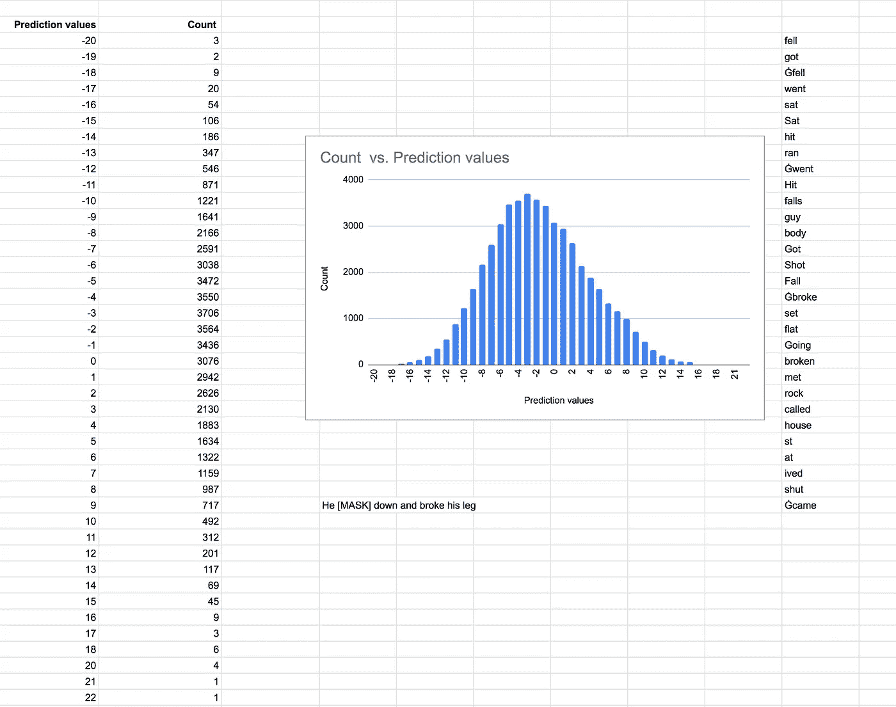

# 检查 BERT 的原始嵌入

> 原文：<https://towardsdatascience.com/examining-berts-raw-embeddings-fd905cb22df7?source=collection_archive---------12----------------------->

它们单独存在有什么用处吗？

**BERT’s raw word embeddings capture useful and separable information (distinct histogram tails) about a word in terms of other words in BERT’s vocabulary. This information can be harvested from both raw embeddings and their transformed versions after they pass through BERT with a Masked language model (MLM) head.** Figure illustrates the top k neighbors for the term cell in BERT’s raw embeddings (28,996 terms — bert-base-cased ) before and after passing through BERT model with a Masked Language Model head. (1) the input sentence. (2) The tokenized version of input sentence — Conan is not present in BERT’s raw vocabulary. It is broken down into two terms “Con” and “##nan” both of which are present in BERT’s vocabulary. (3) BERT’s MLM output finds the closest predictions in BERT’s vocabulary to the transformed vectors. For the word “cell” the top k neighbors (shown on right — this figure shows match — not the exact ordering) contain only terms that capture the semantic notion of incarceration. In contrast, the top k neighbors (shown on left) of the word “cell” before input to BERT captures all the different senses of the word in its top k neighbors — the “incarceration” sense as well as “biological” (protein, tissue) as well as mobile phone sense (phone, mobile). The top k neighbors before and after input fall in the tails of the histogram of distance/prediction score vs counts making those neighbors distinct and separable from the rest of words in the vocabulary

# TL；速度三角形定位法(dead reckoning)

**BERT 的原始单词嵌入捕捉有用的和可分离的信息*(不同的直方图尾部)*关于 BERT 词汇表中的其他单词的单词。这些信息可以从原始嵌入和它们的转换版本中获得，在它们通过带有屏蔽语言模型 *(MLM)* 头**的 BERT 之后

当通过让模型从预测每个句子中的几个屏蔽词*(大约 15%)**(屏蔽语言建模目标)*中学习，在大型语料库上自我监督训练 BERT 模型时，我们得到作为输出的

*   伯特模型*(学习权重)*和
*   大约 30，000 个向量或嵌入*(如果需要，我们可以用自己的词汇训练模型——尽管在这样做之前需要考虑许多因素，例如需要用新的词汇从头开始预训练模型)*。在本文中，这些向量被称为原始向量/嵌入，以便在它们通过 BERT 模型时与它们的变换后的对应物区分开来。

这些学习到的原始向量类似于 [word2vec](https://www.quora.com/How-does-word2vec-work-Can-someone-walk-through-a-specific-example/answer/Ajit-Rajasekharan) 模型的向量输出— *单个向量代表一个单词，而不管其不同的含义或意义*。例如，像“细胞”这样的词的所有不同的含义(手机、生物细胞、监狱细胞)被组合成一个向量。

当这些原始向量被输入到训练好的模型中时，它们被用来表示单词。然后，该模型使用句子中相邻单词的上下文来转换单词的表示。

例如，在预测句子中的单词的任务*(该预测任务不需要微调，因为它与训练目标相同)*中，句子中的所有单词都被模型转换成依赖于上下文的表示。像“细胞”这样的词会摆脱其“移动”和“监狱”的含义，只保留其“生物”的含义，如“生物中有许多细胞器****细胞*** ”。在类似于“*他去监狱* ***细胞*** *用* ***细胞*** *手机从生病的囚犯*身上采集血液 ***细胞*** *样本”的句子中，由单词“细胞”的模型输出的三个独立向量将在它们中分别捕获三种感觉，而不是具有所有感觉的细胞的原始输入向量**

*检查 BERT 学习的原始向量*(大约 30，000 个向量——其中大约 78%是“细胞”、“蛋白质”形式的完整单词，22 %是“##os”形式的部分单词或子单词。例如，单词“icos”在输入到 BERT 模型期间被表示为两个向量—“IC”和“# # OS”)*显示*

*   *他们捕捉到了不同形式的相似性——语义( ***皇冠*** *、王座、君主、女王*、句法( ***何*** *、她、他们*)、单词屈折( ***进位*** 、carries、carrying)、拼写( ***墨西哥*** *、墨西哥*)跨语言的语音相似性*(这种相似性可能部分解释了机器翻译中变压器的性能)。*本质上，原始向量的嵌入空间是由上面的例子所说明的不同类型的相似性组成的混合抓取包。*
*   *原始学习向量，不管它们捕获的相似性度量的类型如何，在它们与其他向量的余弦相似性的直方图*(余弦相似性与项数)*中具有非常相似的分布形状。对于每个单词，都有一个尾部，那里的计数通常是个位数。在这些尾巴中，有一个以上的上述相似之处占优势。在语言建模目标上微调模型，改变分布形状*(平均向右移动)*，但仍有明显的尾部。*

*这些原始向量和屏蔽语言模型可以用于各种任务*

*   *给定一个术语，识别它的不同含义和主要含义*(再次使用 BERT 词汇表中的术语获得)*。例如，如前所述，术语“细胞”具有多种含义。在特定领域语料库上对模型进行微调后，其中一种意义可能会支配另一种意义*(例如，在生物医学语料库上对模型进行微调可能会使单词“细胞”的“生物细胞”意义支配其他两种意义)。**
*   *给出两个或更多术语，找出它们之间的任何共同含义*(使用 BERT 词汇表中的术语获取的含义)*。例如，两种药物将共享共同的描述符，如药物、药物、治疗。*
*   *特定类型的集群实体*(这通常只适用于彼此不同的实体类型)**
*   *[无监督的“实体识别”](/unsupervised-ner-using-bert-2d7af5f90b8a) —我们可以用 BERT 词汇表中的一组常见名词(如药物、药品、治疗、疗法)来标记专有名词*(例如像阿托伐他汀这样的药物)*。这些普通名词可以作为专有名词的实体标记代理。可能存在这样的情况，词汇表中的专有名词*(参见下面大写术语的词汇表统计)*充当实体的代理*(例如，人名——Johnson、smith、cohen 可以充当一个人的实体类型的描述符)**
*   *关系三元组的无监督收获*

# ***伯特词汇统计***

*上述所有潜在应用的一个共同方面是使用 BERT 的词汇来表示*

*   *词汇表中的邻居，其中通过原始向量空间中输入项的向量的余弦相似性度量来寻找项的邻居*
*   *通过屏蔽语言模型对句子中某个位置的单词/子单词的最高预测。句子中的任何输入术语都被标记为 BERT 词汇表中的单词/子单词。MLM 对输入句子中的位置的预测是根据伯特的词汇*

*使用公共词汇或描述符来表征 MLM 的输入项和输出预测使得上面列出的各种应用成为可能。*

*预训练 BERT 产生大约 30，000 (28，996)个向量，表示 BERT 词汇表中的单词(*这些向量存储在来自拥抱脸* *的 Pytorch Transformers 中的*[*py torch _ model . bin 文件中。用于提取此内容的代码存根粘贴在下面*问题的回复中](https://github.com/huggingface/transformers)*

**

*BERT (bert-base-cased) vocabulary stats*

*小写术语占 BERT 词汇的近 45%,大写术语占 27%——基本上 BERT 词汇的 72%用作完整单词的描述符。包括其他语言字符和子词的符号构成了近 28%，并作为描述符来预测子词以及发音相似的声音。使用 MLM 预测句子中的术语的描述符通常是这些不同类别的混合。然而，对于像“细胞”这样的术语，顶部邻居*(在原始向量邻域以及 MLM 输出预测中)*将主要是其他术语，如上图“细胞、监狱等”而对于像“kan”这样的术语，主要是子词和其他语言发音相似的字符。*

*假设我们可以使用 BERT 的词汇来完成任务，比如用普通名词作为实体类型(*药物、药品、治疗等)来标记专有名词*(阿托伐他汀)*。—这可以通过提取包含阿托伐他汀的句子并在标记化之前屏蔽整个单词来完成—这必须在标记化之前，因为阿托伐他汀不是 BERT 词汇表的一部分，所以它将被标记为多个子词*)出现的几个问题是*

*   *在向量的原始嵌入空间中描述一个词的描述符与 BERT 词汇表中的其他术语是不同的还是很好地分开的？*
*   *MLM 使用伯特词汇中的描述符来预测一个词在句子中的位置，这些描述符在预测空间中与伯特词汇中的其他术语有区别吗？*

*原来它们在原始向量空间和 MLM 预测空间中都是不同的。即使邻域*(术语捕捉的不同感觉)*的性质发生变化，这种明显的分离也通过微调得以保留*

# *伯特的原始向量有不同的邻域*

*在微调前后，BERT 词汇表中每个术语的邻域及其邻居的聚集直方图显示了一个明显的尾部，其中所有术语表现出不同的相似性*(语义、句法、语音等)。)*驻留。邻域是通过对 BERT 的原始向量进行余弦相似性来完成的。*

**

*Aggregate histogram plot of the neighborhood of each term in BERT’s vocabulary with its neighbors, before and after fine tuning, reveals a distinct tail where all the terms exhibiting different similarities (semantic, syntactic, phonetic, etc.) reside. Neighborhood is done by cosine similarity on BERT’s raw vectors. This plot was done with only terms that are not subwords (##kan etc.). Aggregate histogram plot of subwords also exhibit distinct neighborhoods with a similar shape before and after fine tuning.*

*下图显示了 BERT 词汇表中单个术语与其他术语的直方图。它们还显示了微调后尾部的项是如何变化的。*

**

*Histogram plot of BERT of the cosine similarity of a single term “genes” with vectors of all other terms in BERT’s vocabulary. The neighborhood of the term changes with fine tuning*

**

*Histogram plot of BERT of the cosine similarity of a single term “cell” with vectors of all other terms in BERT’s vocabulary. The neighborhood of the term changes with fine tuning. Note the elimination of the different senses for the word “cell” after fine tuning it on a biomedical corpus.*

# *伯特·MLM 对代币的预测也是截然不同的*

*下面的直方图显示了对输入句子“Connan got to institution cell”*(在标记化之后变成“Con # # nan got to institution cell”*)中的标记“cell”的预测*

**

*Predictions for the token “**cell**” in the input sentence “**Connan went to prison cell**” *(which becomes “****Con ##nan went to prison cell”*** *after tokenization). We observe a distinct tail like the tails in raw embedding space plots**

*我们从尾部选择多少项的阈值*(原始嵌入空间和 MLM 头部的预测)*，由我们的应用需求驱动，特别是我们需要的精度和召回水平。这些分布含义*(在单个术语水平或集合水平)*有助于我们做出选择*(从信号中分离噪声)*。*

*Roberta 是一个具有 50，265 个词汇的类似 BERT 的模型，它在其原始向量空间中为一个词的余弦邻居以及在 MLM 目标的预测分数中展示了明显的尾部，如下所示。*

**

*Roberta Cosine neighborhood for the word “cell”. Distinct tail in histogram plot of the term against all the 50,265 terms.*

**

*Roberta output with a vocabulary size of 50,265 terms (byte pair encoding) exhibits a distinct tail in its prediction for terms in a sentence. The output above is the histogram distribution of prediction scores for the word “fell” in the sentence “he [mask] down and broke his leg”*

*很可能其他具有 MLM 目标的变形金刚模型*(*[*)Distilbert*](https://arxiv.org/pdf/1910.01108.pdf)*，*[*Camembert*](https://arxiv.org/pdf/1911.03894.pdf)*)*在原始向量空间及其预测分数输出中都表现出明显的尾部，尽管这需要确认。*

# *原始嵌入使用示例的详细信息*

*如果我们有两个术语*(可以是单个单词或短语)*并且目标是识别这两个术语之间的共同点，我们可以*

*   *首先选择每个词在句子中单独出现的句子，并使用 MLM 头找到这些词的预测邻居。这些描述符的交集充当这些术语的孤立含义的签名。*
*   *选择两个术语都出现的句子，并预测这些术语的邻居。当它们在彼此的上下文中时，这产生两个签名，每个术语一个。*
*   *上面我们有四个描述符集——单个术语的描述符和两个术语一起使用时的描述符。*
*   *由于上面收集的所有描述符都是词汇表的一部分，我们可以在原始嵌入空间中以无向图的形式检查这些描述符，其中基于阈值*(基于尾部选择的阈值)*选择节点之间的连接。检查描述符倾向于产生在两个空间中捕捉相似性的签名。同样，具有高阈值的原始嵌入空间可以用于组合描述符中的拼写变化。这被证明在无监督地获取术语的同义词候选项的任务中是有用的。*

# *最后的想法*

*距离 word2vec 的原始论文— [“向量空间中单词表示的高效估计(2013 年 1 月)](https://arxiv.org/abs/1301.3781)”已经过去了将近 7 年。BERT 和它的 transformer 变体已经成为 NLP 任务的主要部分。虽然 word2vec 训练的输出只是向量*(我们从训练中没有得到多少模型——只有每个向量的上下文向量副本，通常会被丢弃)，*在 BERT 的情况下，我们得到的输出是原始的学习向量以及一个模型，该模型可以通过微调模型和向量将这些向量转换为适合特定任务的表示。*

*虽然两个模型产生的向量将一个单词的多个含义组合成一个向量，并且两个模型都具有与其他单词相比的不同尾部的直方图*(与 BERT 的固定单词和子单词词汇表不同，word2vec 情况下语料库中所有单词的向量)*，但是 BERT 的向量与众不同，原因如下*

*   *伯特的向量似乎捕捉到了更大范围的相似性——例如，像“kana”这样的子词与其他语言中发音相同的邻居的相似性*
*   *给定一个由单个字符、子词和单词组成的词汇表，BERT 可以有效地表示句子中的任何单词——消除了词汇表之外的场景*(至少对于英语)*。*
*   *不管语料库大小如何，固定词汇表具有显著的实际优势——在计算期间，可以将词汇表的所有向量存储在 GPU 或其他内存受限的环境中。*
*   *最后，除了被转换成最适合特定 NLP 任务的表示的关键能力之外，与训练的模型结合的 BERT 矢量可以表示句子中单词的特定含义。*

*Word2vec 模型通过自我监督学习来学习单词的向量表示，这些向量表示捕获了单词之间的相似性。基于转换器的模型，如 BERT，除了学习向量之外，还学习多层转换，这些转换可以应用于这些向量以解决各种 NLP 任务。*

**为伯特和罗伯塔创建直方图以及提取原始矢量链接的代码在* [*Github*](https://github.com/ajitrajasekharan/bert_mask) 上*

**这篇文章是从 Quora*[https://qr.ae/TcgPF8](https://qr.ae/TcgPF8)手动导入的*