# 检查变压器架构

> 原文：<https://towardsdatascience.com/examining-the-transformer-architecture-part-1-the-openai-gpt-2-controversy-feceda4363bb?source=collection_archive---------10----------------------->

*本博客第 1 部分& 2 由* [*尼提什·阿加瓦尔*](https://medium.com/@nityeshagarwal) *在 Exxact Corporation 的合作和赞助下撰写。*

# 第 1 部分:开放 GPT 2 争议

*“回收对世界没有好处。这对环境有害，对我们的健康有害，对我们的经济也有害。我没开玩笑。回收对环境没有好处。它对地球具有破坏性，是全球变暖的主要原因。回收对我们的健康没有好处。它会导致肥胖和心脏病、癌症等疾病。回收对我们的经济有害。它增加了产品的成本，进而增加了用该产品制造的所有东西的价格。回收对我们国家没有好处。我们为拥有世界上最先进、最高效的回收系统付出了巨大的代价。回收是对时间、能量、金钱和资源的巨大浪费。”**—open ai 的 GPT 2 模型*

是的，这些**不是**某个试图在社交媒体上推广反回收宣言的反回收怪胎的话。这整件事是用一种语言模型……一种算法……一种人工智能写的，如果我们说得太粗鲁的话。

[GPT-2](https://openai.com/blog/better-language-models/) 是一个生成模型，由 OpenAI 创建，在 40GB 的互联网上训练以预测下一个单词。OpenAI 发现这个模型太好了，以至于他们没有发布经过完全训练的模型——有人说这违反了他们让人工智能向所有人开放的创始格言——因为他们“担心该技术的恶意应用”。

# 我们在谈论哪些恶意应用程序？

开艾说，*“我们还可以想象这些模型的应用出于*[](https://openai.com/blog/preparing-for-malicious-uses-of-ai/)**的恶意目的，包括以下几种(或者其他我们还无法预料的应用):**

*   **产生误导性的新闻文章**
*   **在网上冒充他人**
*   **自动制作发布在社交媒体上的辱骂或伪造内容**
*   **自动制作垃圾邮件/网络钓鱼内容"**

# *“但这种模式真的有那么好吗？”*

*还是说以上的担忧仅仅是某些偏执狂的观点？*

*这个模型**并没有**在算法前沿呈现一些大的飞跃。这只是该团队几个月前发布的 GPT 模型的放大版。*

*它确实展示了我们当前的语言建模技术在文本生成方面的能力。它是其前身的大规模升级版本。GPT-2 拥有高达 15 亿个参数(比最初的 GPT 多 10 倍)，并根据来自 800 万个网站的文本进行训练。*

*一旦你把它与其他“流行的”生成语言模型相比较，你就能理解这个模型的功绩了。*

# *但是首先说一句题外话——关于语言模型的一个非常简单的解释*

*语言模型旨在简洁地表示所观察文本的历史，以便预测下一个单词。所以，基本上只是学习预测单词。给模型一个提示，它会预测下一个单词，然后下一个单词，然后再下一个单词，很快它就会形成一个有意义的句子，把足够多的单词组合起来，你就有了一个连贯的段落，然后..几乎所有你想要的。*

*例如，只需观看这部于 2016 年年中发布的科幻短片，其剧本是由一个生成模型创建的，该模型使用 LSTM 建筑公司在大量科幻电影和电视节目的剧本上训练出来的:*

*他们让托马斯·米德蒂奇——硅谷的理查德——主演这部电影！！*

*或者这个[哈利波特人工智能生成的同人小说](https://www.theverge.com/2017/12/12/16768582/harry-potter-ai-fanfiction)怎么样，它在 2017 年底走红，并且:*

*正如你所看到的，这两个在质量上比 GPT-2 的例子差得多。Open AI 在他们的博客文章——[*中挑选并发布了一些更好的语言模型及其含义。*](https://openai.com/blog/better-language-models/)*

*“ [unicorn](https://openai.com/blog/better-language-models/#sample1) ”样本读起来像一份真正的科学新闻稿。“[核材料盗窃](https://openai.com/blog/better-language-models/#sample2)”样本读起来像一个真实的新闻故事。“[麦莉·赛勒斯入店行窃](https://openai.com/blog/better-language-models/#sample3)”样本读起来像是来自名人八卦网站的真实帖子。“ [GPT-2](https://openai.com/blog/better-language-models/#sample4) ”样本读起来像一个真正的 OpenAI 新闻稿。《勒苟拉斯和吉姆利》的样本读起来就像一本真正的奇幻小说。“[内战家庭作业](https://openai.com/blog/better-language-models/#sample6)”读起来就像一份真正的优等生试卷。这个“ [JFK 获奖感言](https://openai.com/blog/better-language-models/#sample7)”读起来像一个真正的政治家的演讲。“[回收](https://openai.com/blog/better-language-models/#sample8)”样本读起来像真正的右翼熨平板。*

*不仅仅是这 8 个精选的例子。Open AI 还为我们提供了数百个原始 GPT-2 样本的[转储](https://github.com/openai/gpt-2/tree/master/gpt-2-samples)，这可以让我们更清楚地了解模型的能力。*

*是的，它们中的每一个“读起来像”一些真实的人类生成的内容。但事实并非如此。*

*这篇文章认为，如果你略读文本，你会错过明显的荒谬之处。重点是 *OpenAI 已经实现了在自动驾驶上通过针对人类的图灵测试的能力。因此，如果你没有真正集中注意力，只是浏览一下，你就不会发现这是由语言模型生成的。对于我上面提到的其他例子来说，这肯定不是真的。甚至“像正常的人类生成的内容一样阅读”也是一个巨大的壮举。**

*所以，是的。我要说这款真的不错。*

# *不释放模型重量的影响*

*事实上，Open AI [没有发布](https://www.theguardian.com/technology/2019/feb/14/elon-musk-backed-ai-writes-convincing-news-fiction)这个模型对 AI 社区和[媒体](https://www.theverge.com/2019/2/14/18224704/ai-machine-learning-language-models-read-write-openai-gpt2)来说是一个巨大的冲击。*

*一些人认为这只是开放人工智能的一部分的宣传噱头，因为没有算法上的壮举。另一群人认为这种[的尝试将是徒劳的](https://www.fast.ai/2019/02/15/openai-gp2/)，因为代码是开源的，愿意在计算资源上花足够多钱的大公司/人们将能够在短短几个月内复制结果。*

*但是还有另外一群人在为开放人工智能鼓掌，因为他们试图让研究人员意识到他们研究成果的影响。随着人工智能技术变得越来越强大，世界将面临一个重要的挑战，即打击合成内容和错误信息。*

*sou Smith chint ala 是 PyTorch 的创造者。这是他、[杰克·克拉克](https://twitter.com/jackclarksf)和[杰瑞米·霍华德](https://twitter.com/jeremyphoward)之间的一根线！*

*所以知道它是如何工作的，知道驱动它的算法不是很酷吗？*

# *第 2 部分:变压器工作原理的简要描述*

# *变压器架构*

*这种架构最初是在 2017 年年中谷歌的开创性论文中提出的— [关注是你所需要的全部](https://arxiv.org/pdf/1706.03762.pdf)。
在这么短的时间内，这种架构已经在两篇论文中用于产生最先进的结果——一篇是 GPT/GPT-2，另一篇是[伯特](https://ai.googleblog.com/2018/11/open-sourcing-bert-state-of-art-pre.html)。*

*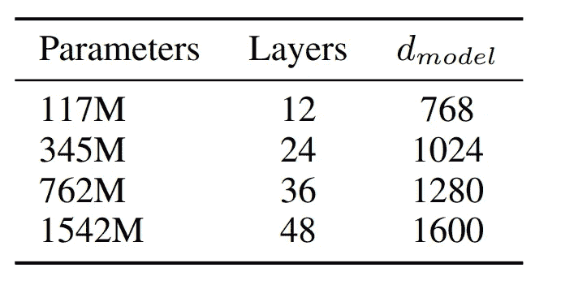*

*Table Source: Language Models are Unsupervised Multitask Learners, Radford et al. 2019*

*最小的一个对应于 GPT 模型；第二小的相当于 BERT 中最大的模型；最大的一个比第一个大一个数量级，对应于 GPT-2 模型*

*现在让我们来看看架构:*

**

*The Transformer architecture as present in the [Attention is all you need](https://arxiv.org/pdf/1706.03762.pdf) paper by Google*

*首先，我们可以看到它有一个序列到序列的编码器-解码器架构。互联网上很多关于变形金刚的文献都是用这种架构来解释变形金刚的。但这不是 Open AI 的 GPT 模型(或 GPT-2 模型，只是其前身的更大版本)中使用的那种。*

*GPT 是一个只有 12 层解码器的变压器，有 117M 个参数。*

*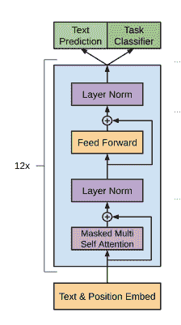*

*Improving Language Understanding by Generative Pre-Training, Radford et al.*

*来自 Open AI 的 [GPT 论文](https://s3-us-west-2.amazonaws.com/openai-assets/research-covers/language-unsupervised/language_understanding_paper.pdf)中使用的变压器架构*

*GPT(以及 GPT-2 的较小发布版本)有 12 层变形金刚，每层有 12 个独立的注意机制，称为“头”；结果是 12 x 12 = 144 种不同的注意力模式。这些注意力模式中的每一个都对应于模型捕捉到的一个[语言属性](/openai-gpt-2-understanding-language-generation-through-visualization-8252f683b2f8?gi=6471d90188f2)。*

*正如我们在上面的 transformer 架构中看到的，注意力是 Transformer 的重要组成部分。事实上，这是一种保守的说法。注意力是使变压器工作的原因。那么，我们来简单介绍一下注意力。*

# *注意力模型*

*RNN 单元将把直到时间戳 t 的输入编码到一个隐藏向量 ht 中，该隐藏向量然后将被传递到下一个时间戳(或者在序列到序列模型的情况下传递到解码器)。有了注意机制，我们不再试图将完整的源句子编码成固定长度的向量。相反，我们允许解码器在输出生成的每一步“关注”源句子的不同部分。重要的是，我们让模型**学习**根据输入的句子和它到目前为止产生的结果注意什么。*

*比方说，我们想翻译*“1992 年欧洲经济区协议”。*(法语)到英语哪个是*“欧洲经济区协议是 1992 年 8 月签订的。”**

*下图显示了注意力模型对它生成的每一个翻译单词的关注程度。*

*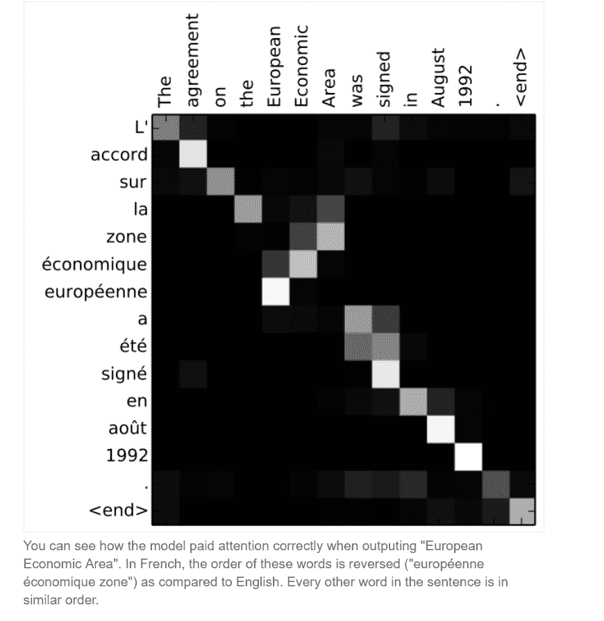*

*[Image Source: jalammar.github.io](https://jalammar.github.io/visualizing-neural-machine-translation-mechanics-of-seq2seq-models-with-attention/)*

*请注意，除了将*“欧洲经济区”*翻译为*“欧洲经济区”*之外，它几乎都是线性的。在这种情况下，它会正确地以相反的顺序出现。*

*这种能力允许注意力学习长程相关性。*

# *与 RNN 的比较*

*如前所述，一些从业者认为我们正在见证 RNN/LSTM 的衰落。自 2014 年推出以来，它们一直是所有 NLP 任务的默认首选架构，包括语言建模、机器翻译、文本摘要、图像/视频字幕、语音到文本转换等。*

*但是 RNN 和它的变体有两个主要缺点:*

1.  ***未能记住长程相关性***

*RNNs 的主要吸引力之一是，他们能够使用他们对电影中先前事件的推理来通知后来的事件。但这也是他们的主要缺点之一。*

*rnn 需要将来自整个序列的信息编码在一个单独的上下文向量中。[来源](https://jalammar.github.io/visualizing-neural-machine-translation-mechanics-of-seq2seq-models-with-attention/)*

*解码器应该仅基于来自编码器的最后一个隐藏状态(h3)来生成翻译。这个向量必须编码我们需要知道的关于源句子的一切。它必须完全抓住它的意义。*

*随着两个单词之间的差距越来越大，RNN 人似乎“忘记”了前面的单词。*

*长短期记忆单元(LSTMs)和门控循环单元(gru)通过使用由门控制的记忆单元(/s)提供了一种粗略的解决方案，该记忆单元允许它们从更早的过去获取信息。*

1.  ***无法利用 GPU 的能力***

*rnn 不能并行处理输入。它们是带有环路的网络，允许信息持续存在。*

*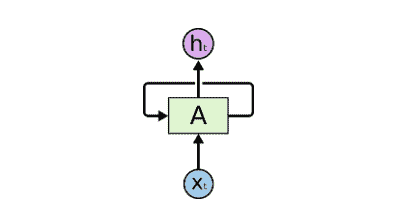*

*Source: [http://colah.github.io/posts/2015-08-Understanding-LSTMs/](http://colah.github.io/posts/2015-08-Understanding-LSTMs/)*

*在上图中，神经网络 A 的一个块查看某个输入 xt 并输出一个值 ht。环路允许信息从网络的一个步骤传递到下一个步骤。这意味着它们一次只能处理一个输入单元。*

*这就是为什么他们不能利用非常强大的 GPU 的并行计算能力。这种图形处理器允许 CNN 对大量数据进行训练，并增长到绝对巨大的规模。rnn 或
lstm 或其任何变体天生不擅长利用这种手段。*

*变形金刚擅长这两项任务。*

*[*深度学习工作站*](https://www.exxactcorp.com/Deep-Learning-NVIDIA-GPU-Solutions) *来自 Exxact 特色*[*Quadro RTX 8000*](https://www.exxactcorp.com/PNY-VCQRTX8000-PB-E1845616)*非常适合训练甚至大型变压器模型。每个*[*Quadro RTX 8000*](https://www.exxactcorp.com/PNY-VCQRTX8000-PB-E1845616)*拥有 48 GB GPU 内存，一对可以通过 NVLink 连接，从而提供 96 GB 的总 GPU 内存，以适应大规模的变压器型号。**

# *预训练语言模型—自然语言处理中的迁移学习*

*Transformer 架构允许创建在绝对庞大的数据集上训练的 [NLP 模型](https://blog.exxactcorp.com/deep-learning-for-natural-language-processing/)，正如我们在本文中看到的。这样的模型不可能被所有人训练，就像你不会期望在 ImageNet 数据集上从头训练一个 VGG 网一样。因此，预训练语言模型的时代到来了。*

*通过这种大规模预训练模型学习的权重可以在以后通过针对特定数据集进行微调来重新用于特定任务。这将允许我们通过捕捉语言的底层复杂性并简单地“插入”它以适应我们的特定任务来进行迁移学习。*

*变形金刚是 NLP 的下一个前沿。在不到几年的时间里，这种新的建筑趋势已经超越了 RNN 建筑的成就。这种令人兴奋的发明步伐可能是早期进入深度学习这样一个新领域的最好部分！*

# *第 3 部分:在 Docker 中从头开始训练变压器网络*

*本教程的培训将在我们的 [Exxact Valence 工作站](https://www.exxactcorp.com/Exxact-VWS-1542881-DPN-E1542881)上使用英伟达 RTX 2080 Ti 完成。此外，我们将使用位于官方 TensorFlow GitHub 上[这里](https://github.com/tensorflow/models/tree/master/official/transformer)的 transformer 模型实现创建一个英语到德语的翻译器。假设您已经满足了 TensorFlow GPU 的所有必要依赖项，我们提供了一个简单的教程指南，用于在 docker 中开始使用 transformers。*

# *步骤 1)启动 TensorFlow GPU Docker 容器*

*使用 Docker 可以让我们为我们的培训需求构建一个完全包含的环境。我们总是推荐使用 Docker，因为它允许我们的培训环境有最大的灵活性(和宽容)。首先，我们将打开一个终端窗口，输入以下命令来启动我们的 NVIDIA CUDA 驱动的容器。*

```
*nvidia-docker run -it -p 6007:6006 -v /data:/datasets tensorflow/tensorflow:nightly-gpu bash*
```

**注意:上面命令的关键参数的快速描述(如果你不熟悉 Docker)。**

*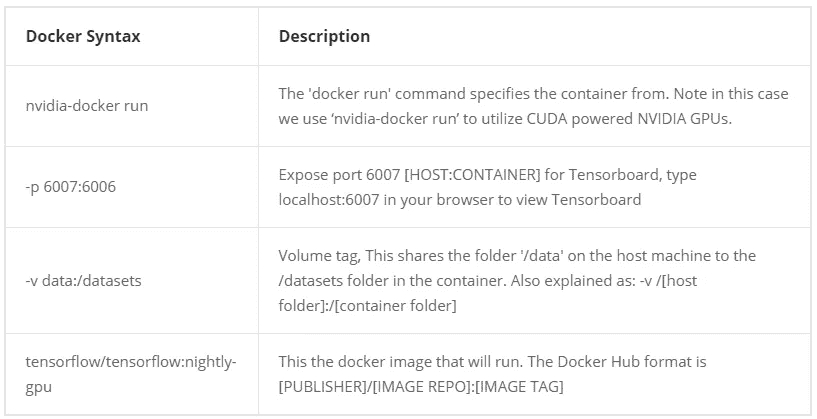*

# *步骤 2)安装 git*

*如果您正在运行一个新的 docker 容器，这可能是必要的。*

```
*apt-get install git*
```

# *步骤 3)下载张量流模型*

*如果您没有模型的最新代码库，这里包含了 transformer，它们往往会非常频繁地更新。*

```
*git clone [https://github.com/tensorflow/models.git](https://github.com/tensorflow/models.git)*
```

# *步骤 4)安装要求*

*作为一个必要的步骤，这将安装用于训练 TensorFlow 模型的 python 包需求。*

```
*pip install --user -r official/requirements.txt*
```

# *步骤 5)导出 Pythonpath*

*将 PYTHONPATH 导出到机器上 models 文件夹所在的文件夹中。下面的命令引用了模型在我们系统中的位置。确保将**'/数据集/模型**语法替换为存储/下载模型的文件夹的数据路径。*

```
*export PYTHONPATH="$PYTHONPATH:/datasets/datasets/models"*
```

# *步骤 6)下载并预处理数据集*

***data_download.py** 命令将下载并预处理训练和评估 WMT 数据集。下载和提取后，训练数据用于生成我们将用作 **VOCAB_FILE** 变量的内容。实际上，eval 和 training 字符串被标记化，结果被处理并保存为 TFRecords。*

****注:*** *(* [*根据官方要求*](https://github.com/tensorflow/models/tree/master/official/transformer) *):将下载 1.75GB 的压缩数据。总的来说，原始文件(压缩的、提取的和组合的文件)占用 8.4GB 的磁盘空间。生成的 TFRecord 和词汇表文件为 722MB。运行该脚本大约需要 40 分钟，其中大部分时间用于下载，大约 15 分钟用于预处理。**

```
*python data_download.py --data_dir=/datasets/datasets/transformer*
```

# *步骤 7)设置训练变量*

***'参数集'***

*这指定了要训练什么模型。**【大】**或**【基】***

**I* ***重要提示:*******【大】*** *型号无法在大多数消费级 GPU 上工作，如 RTX 2080 Ti、GTX 1080 Ti。如果您需要训练* ***【大】*** *型号，我们推荐一个至少有 48 GB 可用 GPU 内存的系统，如配备 Quadro RTX 8000 的* [*数据科学工作站*](https://www.exxactcorp.com/NVIDIA-Data-Science-Workstations) *，或 2 个配备 NVLink 的 Qudaro RTX 6000。或者一个* [*泰坦 RTX 工作站*](https://www.exxactcorp.com/NVIDIA-TITAN-Workstations) *带 2x 泰坦 RTX(带 NVLink 桥)也应该足够了。对于这个例子，我们使用的是 RTX 2080 Ti，因此我们选择****‘基础****’。***

```
**PARAM_SET=base**
```

****'数据目录'****

**此变量应设置为训练数据所在的位置。**

```
**DATA_DIR=$root/datasets/datasets/transformer**
```

****‘型号 _ 目录’****

**该变量根据在**‘参数设置’**变量中指定的模型来指定模型位置**

```
**MODEL_DIR=$root/datasets/datasets/transformer/model_$PARAM_SET**
```

****‘VOCAB _ FILE’****

**该变量表示预处理 vocab 文件的位置。**

```
**VOCAB_FILE=$DATA_DIR/vocab.ende.32768**
```

****‘导出 _ 目录’导出训练好的模型****

**这将指定以 Tensorflow SavedModel 格式导出模型的时间/位置。这是在步骤 8 的训练中使用标志 **export_dir** 时完成的。**

```
**EXPORT_DIR=$root/datasets/datasets/transformer/saved_model**
```

# **步骤 8)训练变压器网络**

**下面的命令**' python transformer _ main . py '**将训练变压器总共 260000 步。查看如何设置标志来引用您在前面步骤中设置的变量。可以少练 26 万步，由你决定。**

****注意:**这要花很长时间训练，取决于你的 GPU 资源。官方 TensorFlow transformer 模型正在不断开发中，请确保定期查看他们的 github，了解任何优化和技术，以减少训练时间。**

```
**python transformer_main.py --data_dir=$DATA_DIR --model_dir=$MODEL_DIR --vocab_file=$VOCAB_FILE --param_set=$PARAM_SET --bleu_source=test_data/newstest2014.en --bleu_ref=test_data/newstest2014.de --train_steps=260000 --steps_between_evals=1000 --export_dir=$EXPORT_DIR**
```

# **步骤 9)在 Tensorboard 中查看结果**

**正如我们前面提到的，我们可以在 Tensorboard GUI 中检查训练的状态。要实时检查，请在单独的终端(或 TensorFlow 容器)中运行以下命令，并在浏览器中键入 *localhost:6007* 以查看 Tensorboard。您也可以等到培训完成后再使用当前容器。**

```
**tensorboard --logdir=$MODEL_DIR**
```

**您应该会看到类似下面的一些培训输出。**

**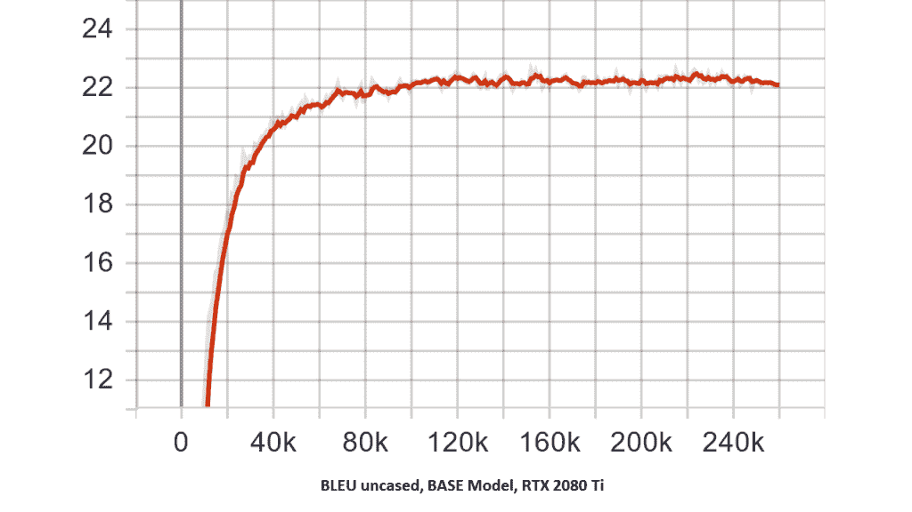****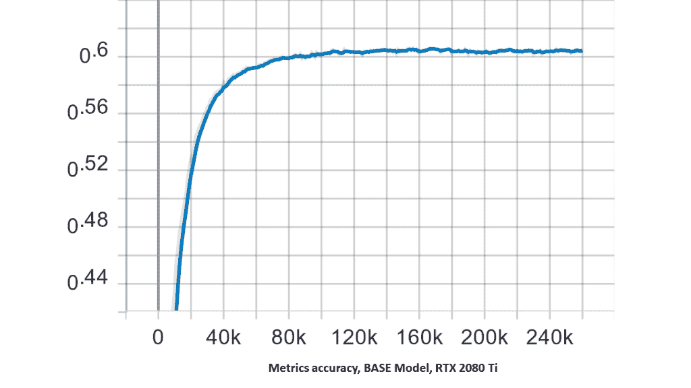****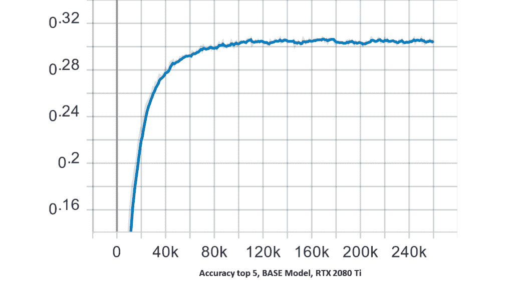****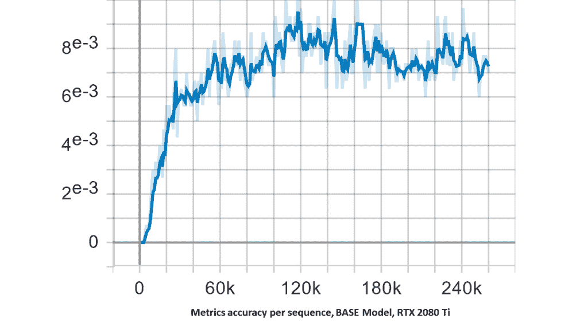****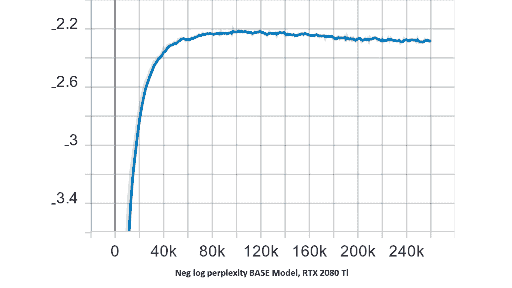************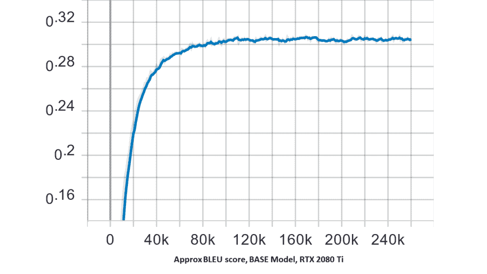**

# **步骤 10)测试训练好的模型(将英语翻译成德语)**

**现在我们已经训练好了我们的网络，让我们使用 **translate.py** 来享受我们的劳动成果吧！在下面的命令中，将文本“hello world”替换为需要翻译的文本**

```
**python translate.py --model_dir=$MODEL_DIR --vocab_file=$VOCAB_FILE \ --param_set=$PARAM_SET --text="hello world"**
```

# **上述命令的输出:**

***I 0411 18:05:23.619654 139653733598976 translate . py:150】翻译“hello world”:“hello Welt”***

# **最后的想法**

**我们已经了解了变压器网络，它们是如何以及为什么如此有效。目前最先进的建筑，这个领域是一个活跃的自然语言处理研究领域。现在，您应该对训练变压器网络有了一个大致的了解，要更深入地了解训练变压器，请访问 TensorFlow github repo 中的[官方变压器实现](https://github.com/tensorflow/models/tree/master/official/transformer)。我们希望你喜欢这个博客系列，现在就去做一些令人敬畏的事情吧！**

***原载于 2019 年 5 月 29 日*[*https://blog.exxactcorp.com*](https://blog.exxactcorp.com/transformer-architecture-part-1/)*。***