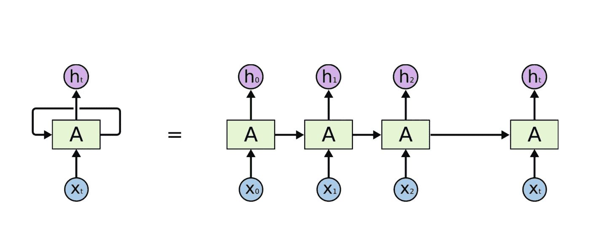

# 在 Tensorflow 2 中检查 LSTM 的权重和偏差

> 原文：<https://towardsdatascience.com/examining-the-weight-and-bias-of-lstm-in-tensorflow-2-5576049a91fa?source=collection_archive---------8----------------------->

## 张量流 2 中 LSTM 权重和偏差混淆结构的解释


source: [https://dnacentre.co.uk/wp-content/uploads/2018/04/blog-uk-genetic-engineering.png](https://dnacentre.co.uk/wp-content/uploads/2018/04/blog-uk-genetic-engineering.png)

好，首先，什么是 LSTM？LSTM 是长短期记忆的缩写。**它是递归神经网络(RNN)中应用最广泛的一种**。基本上， **RNN 将时间序列数据作为输入**。时间序列中的每一个数据从最早的时间步长开始依次成为 RNN 的输入。**某个时步输入的 RNN 输出将与下一个时步**的数据一起作为 RNN 的输入。当 RNN 处理完数据的最后一个时间步长时，将输出实际输出。



How the RNN process the input

LSTM 的神经元结构是这样的:


在时间步长的每个过程中，LSTM 有 4 层神经元。**这 4 层一起形成一个称为门的处理**称为遗忘门- >输入门- >输出门(- >表示序列处理在 LSTM 中发生的顺序)。那就是 LSTM，我不会涉及 LSTM 的细节，因为那会是一篇很长的文章，而且这不是我这次的重点。

长话短说，为了我最近的实验，我需要取回我的 LSTM 的重量和偏差。我用 TensorFlow 2 建立了一个 LSTM。**在 TensorFlow 2 中，我们可以使用下面的代码**访问 LSTM 权重和偏差的结构。

```
import tensorflow as tfsimple_lstm_model = tf.keras.models.Sequential()
simple_lstm_model.add(tf.keras.Input((18,7)))
simple_lstm_model.add(tf.keras.layers.LSTM(2))print(simple_lstm_model.layers[0].trainable_weights)
```

在上面的代码中，我构建了一个接受 18 x 7 形状输入的 LSTM。18 是数据的总时间步长，7 是参数的总数。**对于每个时间步长，LSTM 将采用 7 个参数**。我声明**这个 LSTM 有两个隐藏状态**。**隐藏状态就像每个时间步长**的 LSTM 输出。这意味着**我们的 LSTM 最终将输出 2 个实数**。这也意味着，**LSTM**中每层神经元的数量是 2。当您运行这个脚本时，您将得到如下输出。

```
[<tf.Variable 'lstm/kernel:0' shape=(7, 8) dtype=float32>, <tf.Variable 'lstm/recurrent_kernel:0' shape=(2, 8) dtype=float32>, <tf.Variable 'lstm/bias:0' shape=(8,) dtype=float32>]
```

好了，这里我们有 3 组参数，它由 lstm/kernel(形状为 7x8)、lstm/recurrent_kernel(形状为 2x8)和 lstm/bias(形状为 8)组成。最后一部分(lstm/bias)很明显，就是偏见。为什么我们有 8 个？记住，在 LSTM 中我们有 4 层神经元，我声明这个 LSTM 有 2 个隐藏状态，或者说每层有 2 个神经元。每个神经元有 1 个偏差，4 层中的每层有 2 个神经元，所以总数是 8。

容易混淆的部分是 lstm/kernel 和 lstm/recurrent_kernel。内核在这里的意思是重量。lstm/kernel 表示我们的输入相对于 lstm 每个神经元的权重。我声明输入有 18 个时间步长和 7 个参数，所以**每个参数对每个神经元**有 1 个权重，这就是 lstm/kernel 的形状为 7x8 的原因。最后， **lstm/recurrent_kernel 表示我们的隐藏状态的权重，也称为 lstm 在前一时间步(t-1)相对于 LSTM** 中每个神经元的输出。**我声明隐藏状态是 2，LSTM 的总神经元是 8** ，那么隐藏状态对 LSTM 神经元层的权重形状一定是 2×8。

这就是关于 LSTMin TensorFlow 2 的权重和偏差的解释。您还可以使用 summary()函数看到整个神经网络的结构，如下所示。

```
import tensorflow as tfsimple_lstm_model = tf.keras.models.Sequential()
simple_lstm_model.add(tf.keras.Input((18,7)))
simple_lstm_model.add(tf.keras.layers.LSTM(2))
simple_lstm_model.add(tf.keras.layers.Dense(5))simple_lstm_model.summary()
```

输出是

```
Model: "sequential"
_________________________________________________________________
Layer (type)                 Output Shape              Param #   
=================================================================
lstm (LSTM)                  (None, 2)                 80        
_________________________________________________________________
dense (Dense)                (None, 5)                 15        
=================================================================
Total params: 95
Trainable params: 95
Non-trainable params: 0
```

**这里我将之前的 LSTM 和一个普通的神经网络层**叠加在一起。这个网络的最终输出有 5 个元素。这个堆叠式神经网络的总权重和偏差为 95。

就这些了，下期帖子见。

参考:

[https://medium . com/ai-journal/lstm-gru-recurrent-neural-networks-81 Fe 2 BCD f1 f 9](https://medium.com/ai-journal/lstm-gru-recurrent-neural-networks-81fe2bcdf1f9)，2019 年 12 月 15 日获取

[https://colah.github.io/posts/2015-08-Understanding-LSTMs/](https://colah.github.io/posts/2015-08-Understanding-LSTMs/)，2019 年 12 月 15 日进入