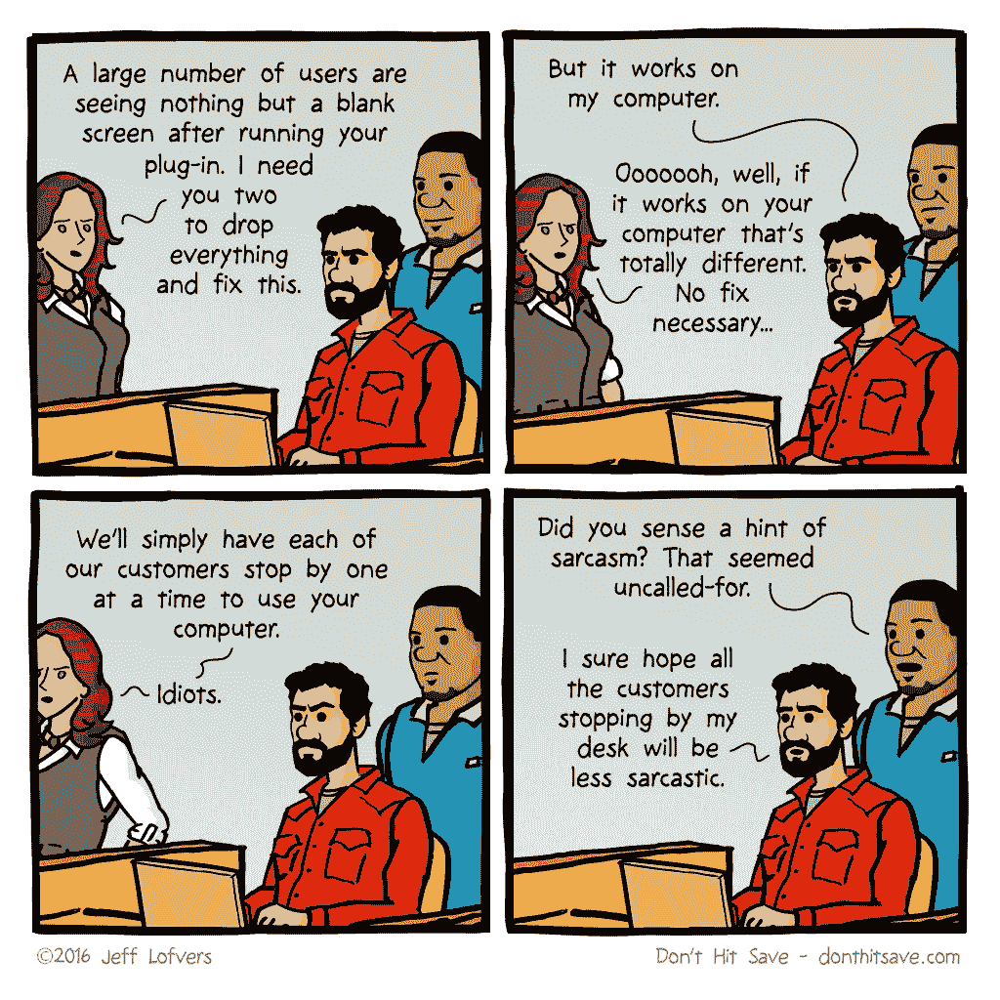
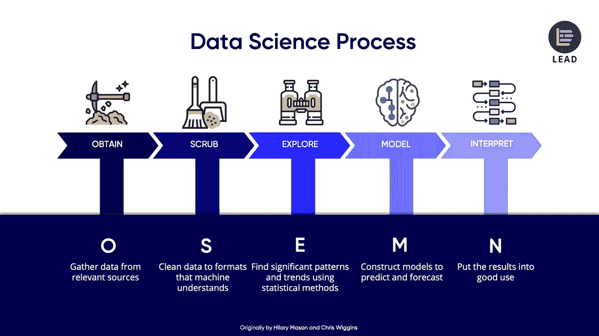

# 数据科学流程中 Docker 的使用案例示例

> 原文：<https://towardsdatascience.com/example-use-cases-of-docker-in-the-data-science-process-15824137eefd?source=collection_archive---------20----------------------->

## …或者如何避免“它只在我的电脑上工作，却不在别的地方工作”的问题

Jeff Lofvers 的精彩漫画展示了你在软件开发和数据科学中经常遇到的问题。您正在准备一个数据分析或预测模型，但是当您想要共享它时，它在其他人的机器上无法工作。它失败了，因为库丢失了，库有错误的版本(“依赖地狱”)，或者配置不同。耗时的故障排除开始了。

解决方案并不遥远: [Docker](https://www.docker.com/) 以一种轻量级的方式解决了再现性的问题，而且还为您提供了许多其他的优势。

**什么是 Docker？**

Docker 是一个执行操作系统级虚拟化的免费软件。Docker 习惯于运行被称为容器的软件包。容器相互隔离，并将它们的应用程序、工具、库和配置文件捆绑在一起。所有容器都由一个操作系统内核运行，因此比虚拟机更轻量级。[ [维基百科上的 Docker](https://en.wikipedia.org/wiki/Docker_(software))

Docker 使创建、运行和分发应用程序变得容易。应用程序打包了运行应用程序所需的一切。这个概念保证了容器可以在每个 docker 运行时环境中运行。

**码头工人的优点**:

*再现性*

使用 Docker，您可以确保您的软件产品(应用程序、数据分析、预测模型等)。)运行在所有 docker 运行时环境上。你的货件更结实，因为集装箱里装着运行你的人工制品所需的一切。您不仅分发代码，还分发环境。

*一致性*

Docker 为各种软件产品提供了一个统一一致的运行时环境。它减少了系统管理的时间，让您专注于核心工作。你可能知道 Anaconda 环境；Docker 对于整个软件生态系统来说是类似的东西。

*可追溯性*

a.)Docker 容器代码的版本控制

Docker 容器是从一个脚本构建的，该脚本是必要的软件依赖关系和环境的可读摘要。这个脚本可以进行版本控制。这个脚本完全可以通过这种方式追踪。

b.)所有人工制品的统一分配环境

Docker 容器可以存储在组织内部的存储库中。你用这种方式保存整个版本历史。

*便携性*

Docker 容器可以很容易地从一个 docker 环境移植到另一个环境。Docker Swarm (或 [Kubernetes](https://kubernetes.io/) )让你自动扩展应用程序。这样可以降低系统管理和操作的成本。

然而，Docker 在数据科学领域有哪些用例？我将专注于数据科学 [OSEMN 流程](https://www.thelead.io/data-science/5-steps-to-a-data-science-project-lifecycle):

# 数据科学流程中 Docker 的用例

今天的现实是，这个过程由各种各样的工具和编程语言组成。Docker 是管理这些异构技术堆栈的首选平台，因为每个容器都提供了运行它所需要的运行时环境，以运行它所包装的应用程序。这样就减少了技术堆栈的干扰。

# 1.获取:从相关来源收集数据

数据是数据科学的润滑油。例如，您可以从调查、临床试验、网络搜索、科学实验、企业应用或模拟中检索信息。通常情况下，数据工程师处理数据，但其他利益相关者也参与其中，这导致了数据库系统和编程语言的广泛多样性。

*   Web 抓取:Python 应用程序与 Selenium 的 Chrome 驱动程序和 Postgres 数据库之间存在底层依赖关系，通过 [Docker Compose](https://docs.docker.com/compose/) 打包成一个多容器应用程序
*   标记图像:使用 vue.js、NodeJS 后端和 MongoDB 的精益 web 应用程序来标记图像
*   调查:小型静态微型网站，由营销团队用纯 HTML 构建，带有集成的 SurveyMonkey 表单
*   企业应用程序:在后台用 AngularJS 和 Java 实现的银行 web 应用程序使用 Oracle 数据库从客户那里产生有价值的银行数据
*   计算机模拟:用 C++编程的模拟将结果存储在亚马逊 S3 的 JSON 中
*   异步数据流:汽车传感器向 Kafka 发送数据，Kafka 在公司内部分发数据

所有这些技术栈都可以在 Docker 容器中独立运行。

# 2.清理:将数据清理和聚合成机器能够理解的格式

步骤 1 中获得的数据是石油，但现在是原油。你需要清理、处理它，并把它结合成你分析和建模所需的数据。

*   聚合:Java 应用程序从 Kafka 流中获取数据，对底层数据进行聚合，并将其存储到 Oracle 数据库中
*   数据分析师清理并预处理来自企业 web 应用程序的数据，为用 RMarkdown 笔记本回答业务问题做准备，他们希望与管理层分享这些数据
*   机器学习工程师组合来自不同数据源的数据，为 Jupyter 笔记本中的预测模型清理和预处理数据
*   在 Tableau 中，对数据进行组合、清理、聚合、预处理和持久化，以用于高级交互式仪表盘

这些用例中的一些可能已经在数据检索步骤中完成，并且有更多的数据工程技术栈。其他用例与探索和建模阶段重叠，并涉及更典型的数据分析技术。

许多数据分析工作都是在需要发布的笔记本(Jupyter，RMarkdown)上完成的。您可以为组织使用中央 Jupyter 实例。这种方法的问题是，您可能会被固定的配置和库版本所困扰。另一种方法是发布一个或多个带有 Docker 容器的笔记本。这样你就可以更加灵活地使用特定的设置。

# 3.探索:寻找模式和趋势

在探索阶段，你要做的就是了解数据手中有什么模式和价值。你想让所有感兴趣的人都能看到结果。

*   数据分析师正在创建 Jupyter 或 RMarkdown 笔记本，以回答一个他们需要与所有感兴趣的人分享的问题。
*   数据分析师将公司的客户分成新的细分市场，这些细分市场保存在 MySQL 的客户细分市场数据库中
*   数据分析师为 RShiny、Dash、Tableau 或 Kibana 中感兴趣的利益相关者构建交互式 web 应用程序，用于高级数据探索。这样管理人员可以自己找到模式(危险区域！).

# 4.模型:构建模型以进行预测和预报

经过清理和预处理的数据用于训练机器或深度学习算法。你以这种方式创建模型，这些模型是观察数据的数学表示。它们可以用来预测、预报和量化不可言喻的事物。

*   用于图像中对象检测的神经网络的完整训练过程被隔离到运行在 Azure、AWS 或 Google Cloud 上的 Docker 容器中
*   由于 Python 的性能问题，Keras 模型被导入到 DeepLearning4J 中，并作为 Java 微服务发布

为了训练神经网络，你需要大量的 GPU 能力。您需要 [Nvidia Docker](https://github.com/NVIDIA/nvidia-docker) 将训练过程隔离到 Docker 容器中，因为使用 GPU 无法以硬件和平台无关的方式完成。

# 5.解释:将结果充分利用

数据科学见解得到交流和可视化。模型作为微服务分发。

*   微型网站讲述数据故事
*   Python 中的预测机器学习模型作为微服务发布
*   带有聚合数据的 Java REST 微服务向付费 B2B 客户发布
*   Python 中的产品推荐服务被集成到该公司的网络应用程序中
*   数据驱动的故事发布在公司的 Tableau 服务器上，供内部和外部使用
*   内容管理团队中的数据故事讲述者在静态 Jekyll 网站上分享来自数据分析师的激动人心的见解

# 结论

Docker 对于数据科学家来说也是一个强大的工具，可以应用于 OSEMN 流程的所有阶段。你可以以一致、可复制和可追踪的方式运送所有种类的人工制品。工件在其技术栈中可能非常不同，这是数据科学项目中的现实。数据工程师使用 Oracle、MySQL、MongoDB、Redis 或 ElasticSearch 等数据库或 Java、Python 或 C++等编程语言。在分析和建模团队中，人们可能会使用 R、Python、Julia 或 Scala，而数据故事讲述者则用 JavaScript 中的 d3.js 或使用 Tableau 来讲述他们的故事。由于专家很少，最好让他们使用熟悉的技术，而不是将他们推向未知的领域。你会更快得到更好的结果。

Docker 是管理数据科学中异构技术环境的好方法。

# 参考

[用 Docker 运行 Jekyll](https://kristofclaes.github.io/2016/06/19/running-jekyll-locally-with-docker/)

[在 Docker 上运行 ki Bana](https://www.elastic.co/guide/en/kibana/current/docker.html)

[how to:Docker 容器中的 Tableau Server Linux](https://databoss.starschema.net/tableau-server-linux-docker-container/)

[在 docker 容器中运行 dash 应用](https://community.plot.ly/t/running-dash-app-in-docker-container/16067)

[学习如何通过 7 个步骤对 ShinyApp 进行分类](https://www.bjoern-hartmann.de/post/learn-how-to-dockerize-a-shinyapp-in-7-steps/)

[如何使用 Docker 编译 R Markdown 文档](https://jlintusaari.github.io/2018/07/how-to-compile-rmarkdown-documents-using-docker/)

[教程:为数据科学运行 Dockerized Jupyter 服务器](https://www.dataquest.io/blog/docker-data-science/) [Kafka-Docker:使用 Docker 运行 Apache Kafka 的步骤](https://medium.com/@rinu.gour123/kafka-docker-steps-to-run-apache-kafka-using-docker-1645e85acd50)

[对接一个角度应用](https://mherman.org/blog/dockerizing-an-angular-app/)

[将 Node.js web 应用程序归档](https://nodejs.org/de/docs/guides/nodejs-docker-webapp/)

[Dockerize Vue.js App](https://vuejs.org/v2/cookbook/dockerize-vuejs-app.html)

[将 MongoDB 作为 Docker 容器运行](https://www.thachmai.info/2015/04/30/running-mongodb-container/)

[Dockerize PostgreSQL](https://docs.docker.com/engine/examples/postgresql_service/)

[带有 Chromedriver 和 Geckodriver 的 Docker 图像](https://cloud.docker.com/repository/docker/jenslaufer/docker-chromedriver-geckodriver)

[对您的 Python 应用程序进行 Dockerize】](https://runnable.com/docker/python/dockerize-your-python-application)

由延斯·劳弗于 2019 年 4 月 4 日撰写

随意分享！

*原载于 2019 年 4 月 4 日*[*jenslaufer.com*](https://jenslaufer.com/data/science/use-cases-of-docker-in-the-data-science-process.html)*。*