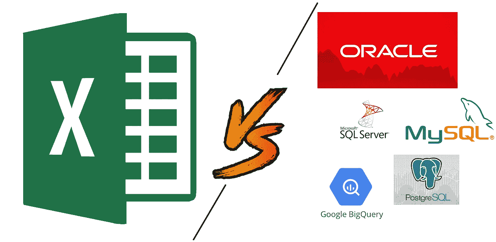

# Excel 与 SQL:概念上的比较

> 原文：<https://towardsdatascience.com/excel-vs-sql-a-conceptual-comparison-dcfbee640c83?source=collection_archive---------4----------------------->

## 一位经验丰富的 Excel 用户对 SQL 的看法以及为什么它值得学习。



## 介绍

我已经在数据分析领域工作了大约 3 年。作为一名医疗保健分析师，我已经在这个领域工作了两年多，最近我完成了数据科学专业的 MBA 课程。

在读硕士期间，我对使用 python 的预测建模技术特别感兴趣(现在仍然如此)。然而，从基本的组织/分析/报告的角度来看，我对使用 Excel 最得心应手。一天花 60-80%的时间盯着 Excel 电子表格对我来说并不陌生。Excel GUI 中嵌套的选项卡、功能区、分组和工具是我的乐队的乐器。他们制造声音，但我指挥并将旋律和和声转化为报告、交付物和分析。在咨询项目、个人预算和兼职工作中，Excel 一直是我的首选工具。

我很早就知道 SQL 及其基本概念。然而，直到最近，由于专业原因，我才决定认真学习它。从一个 Excel 用户的角度来看，SQL 有起有落。在本文中，我希望通过与 Excel 的比较来传达 SQL 的本质和用法。

# 它们是什么？

**Excel 是一个程序。SQL 是一种语言。这是一条需要消化的非常重要的信息。只有点击绿色图标并运行程序后，才能使用 Excel。另一方面，SQL 可以用来与数据库程序进行交互和通信。几个最受欢迎的:**

*   神谕
*   关系型数据库
*   Microsoft SQL Server

我学习 SQL 的方式是通过 Google 的[大查询](https://searchdatamanagement.techtarget.com/definition/Google-BigQuery)。通过免费分析 Google cloud 上的大型数据库来学习/使用 SQL 是一种有趣的方式。

# 数据在哪里？

## 擅长

Excel 是典型的电子表格工具。你把你的数据保存在你电脑上的一个文件里，它通常被组织在标签、列和行里。**excel 文件位于您计算机的本地**。你直接与它互动。没有中间人。没有管理员。当然，使用 API 从另一个位置获取数据是可能的；然而，数据最终是你的，你想怎么做就怎么做。**如果几个人正在协作 Excel 工作簿**，这使得跟踪更改变得很困难……确实有可能[跟踪更改](https://edu.gcfglobal.org/en/excel2016/track-changes-and-comments/1/)，但是不太方便。

## 结构化查询语言

SQL 是一种与数据库交互的语言。它代表结构化查询语言。在这种情况下，您的数据又前进了一步。您用 SQL 编写并向数据库发送[查询](https://www.webopedia.com/TERM/Q/query.html),数据库接收这些查询，然后给出您的请求或进行更改。**数据存储在数据库中，并通过表格进行组织**。查询的美妙之处在于它更具协作性和可追溯性。这些查询可以追溯到谁对哪个表做了什么更改。用户还可以保存有用的查询并与其他人共享，以供将来使用或进行协作。

*基于“bikeid”在大型查询中过滤“austin_bikeshare”表，然后按“duration_minutes”对选择进行排序的查询示例。*

```
SELECT 
   duration_minutes
FROM 
  `bigquery-public-data.austin_bikeshare.bikeshare_trips` 
Where
   bikeid = "446"
ORDER BY 
   duration_minutes desc
```

一旦你知道语法是如何工作的，使用 SQL 操作数据会比使用 Excel 快得多。另一个很棒的方面是它的语法与英语相似，这使得它可以说是最容易学习的计算机语言。

# 它们的最佳用途是什么？

## 擅长

*   较小的数据集:少于 100 万行，甚至超过 100，000 行将会降低你的计算机速度。
*   手动输入数据
*   更灵活的结构:任何单元格都可以是任何数据类型，不管它在哪个列中。
*   输出图表和可视化
*   内置的拼写检查和其他有用的功能
*   独立完成一个项目

## 结构化查询语言

*   更大的数据集:取决于软件和数据库，这可能非常非常大。不会像 Excel 那样变慢。
*   组织/结构:SQL 表对一致的数据类型有更严格的要求，如果用户试图输入错误的类型，就会受到限制。
*   协作工作
*   为在另一个软件中进一步分析准备数据
*   一致的报告或计算:如前所述，您可以保存和共享查询。
*   更安全，因为更改总是可跟踪和可审计的。

# 结论


[Source](https://unsplash.com/photos/HUiSySuofY0)

当我第一次学习 SQL 中的 JOIN 子句时，我最初的本能反应是将其标记为无关紧要，因为我已经知道如何在 Excel 中使用 Vlookups。后来我保持了一段时间的这种态度，但是随着我继续上课，现实情况开始出现。当我了解到 JOIN 子句是多么简单和有用时，我想起了 Vlookups 在执行大量行时所花费的时间。我记得如果你在运行计算后不粘贴值，他们会使文件成倍地变大。我还记得一次只带来一个值是多么有限…在我学习的整个过程中，当我比较 SQL 和 Excel 时，也经历了类似的教训。

总之，在数据分析方面，这两种工具都有自己的位置。两者都有其独特的用途，了解两者对经常使用数据的人都有好处。然而，根据我的经验和对该主题的研究，SQL 是数据分析师更需要和有用的技能。Excel 非常适合小企业主、顾问和学生。SQL 更适合分析师和数据科学家。

**我在 SQL 学习过程中使用的一些有用资源:**

[*SQL For Data Science With Google Big Query*](https://www.udemy.com/share/100RuwB0Mdd11aQXg=/)

[*SQL 是数据分析师必备技能的 5 大理由*](https://www.northeastern.edu/levelblog/2018/07/25/5-reasons-sql-need-know-skill-data-analysts/)

[*常用 Excel 操作的 SQL 命令*](https://www.analyticsvidhya.com/blog/2015/12/sql-commands-common-excel-operations/)

**如果您觉得这很有帮助，请订阅。如果你喜欢我的内容，下面是我参与的一些项目:**

[*优步评论文本分析*](/uber-reviews-text-analysis-11613675046d)

[*简单线性 vs 多项式回归*](/linear-vs-polynomial-regression-walk-through-83ca4f2363a3)

[*随机森林是否优于 Logistic 回归？*(一比较)](/is-random-forest-better-than-logistic-regression-a-comparison-7a0f068963e4)

[*基尼指数 vs 信息熵*](/gini-index-vs-information-entropy-7a7e4fed3fcb)

[*用 Python 中的逻辑回归预测癌症*](/predicting-cancer-with-logistic-regression-in-python-7b203ace16bc)

[二元逻辑回归示例(python)](/univariate-logistic-regression-example-in-python-acbefde8cc14)

[*【从零开始计算 R 平方(使用 python)*](/r-squared-recipe-5814995fa39a)