# 基于机器学习的运动分类(上)

> 原文：<https://towardsdatascience.com/exercise-classification-with-machine-learning-part-i-7cc336ef2e01?source=collection_archive---------11----------------------->

在这篇分为两部分的文章中，我们将深入探讨一个具体问题:对人们进行各种锻炼的视频进行分类。

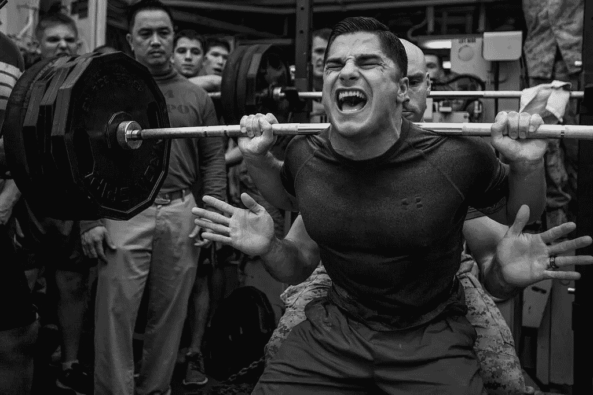

第一篇文章将关注一种更为**的算法**方法，使用*k-最近邻*对未知视频进行分类，在[第二篇文章](https://medium.com/@trevor.j.phillips/exercise-classification-with-machine-learning-part-ii-d60d1928f31d)中，我们将关注一种专门的**机器学习** (ML)方法。

我们将要讨论的所有内容的代码都可以在 GitHub 的 [**这个**](https://github.com/trevphil/TechniqueAnalysis) 资源库中找到。算法方法(第一部分)是用 Swift 编写的，可以作为一个 [CocoaPod](https://cocoapods.org/pods/TechniqueAnalysis) 获得。ML 方法([第二部分](https://medium.com/@trevor.j.phillips/exercise-classification-with-machine-learning-part-ii-d60d1928f31d))是用 Python/TensorFlow 编写的，可以作为 GitHub 资源库的一部分找到。

# 背景

我们想要构建一个系统，它将一个人进行锻炼的视频作为输入，并输出一个描述该视频的**类标签**。理想情况下，视频可以是任何长度，任何帧速率，任何摄像机角度。类别标签的子集可能如下所示:

*   `back squats — **correct** form`
*   `back squats — **incorrect** form`
*   `push-ups — **correct** form`
*   `push-ups — **incorrect** form`
*   诸如此类…

如何构建这样的系统？最棘手的部分之一是我们需要识别帧之间的关系——也就是说，人在每帧的*位置之间的关系。这意味着我们正在处理时域中的数据结构，我们称之为**时间序列**。*

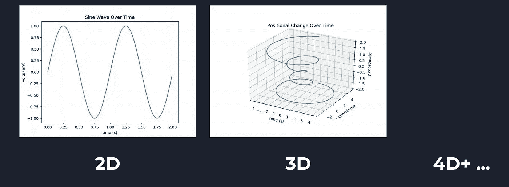

Timeseries in 2 or more dimensions (at least one dimension is always time!)

给定一些从输入视频构建的“未知”时间序列，我们想要根据我们预测的练习给时间序列分配一个**标签**。

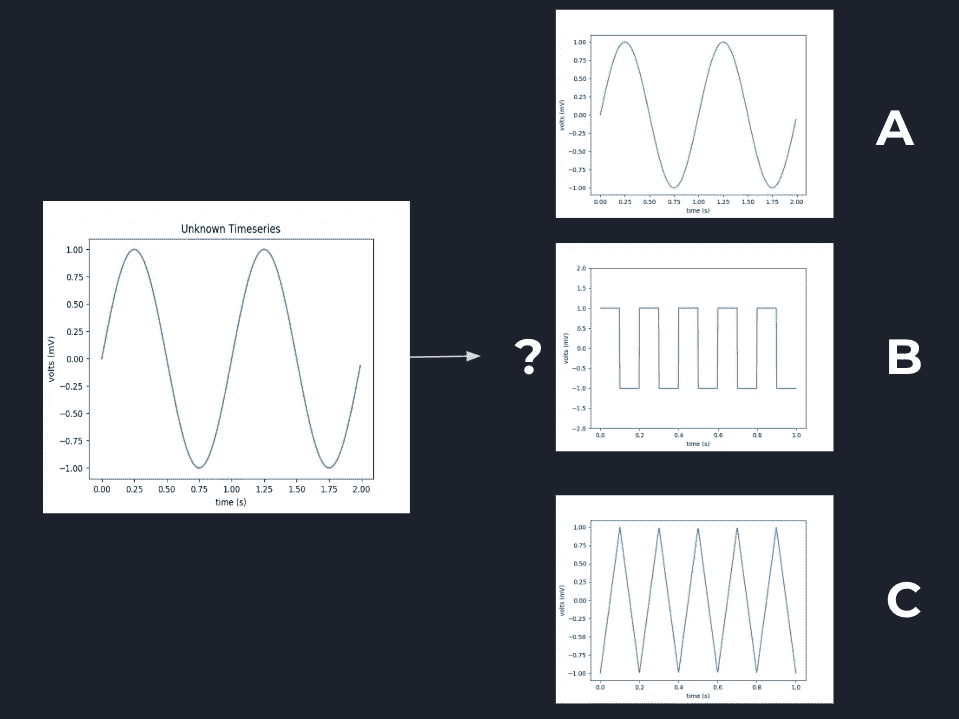

In this example, “A”, “B”, and “C” are potential labels for the unknown timeseries

## 如何制作时间系列？

我提到过我们将从一个输入视频中构建时间序列，但是我们怎么做呢？让我们假设每个视频都包含一个人进行某种锻炼的镜头。我的策略是:

1.  标准化每个视频的长度
2.  对于每一帧，使用 14 个关键身体点来确定人的“姿势”
3.  创建表示姿势随时间变化的时间序列数据结构
4.  过滤掉数据中的噪音

## 标准化视频长度

处理一个 5 分钟的视频是不现实的，所以为了加强数据的一致性，我们将标准化每个视频的长度。我从每个视频的中间对一个 5 秒的片段进行子采样，假设中间发生的事情是整个视频的“代表”。


对于 5 秒以下的视频，我们使用整个东西。

## 确定姿势

给定子剪辑的一帧(图像)，我们想要确定图像中人的姿态。已经可以估计身体点(称为*姿势估计*)，例如使用项目 [OpenPose](https://github.com/CMU-Perceptual-Computing-Lab/openpose) 。

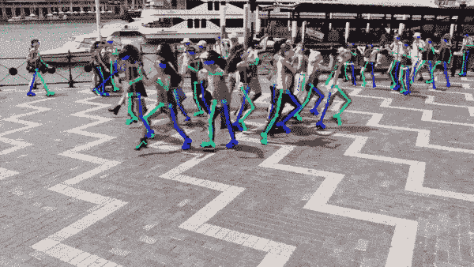

[https://github.com/CMU-Perceptual-Computing-Lab/openpose](https://github.com/CMU-Perceptual-Computing-Lab/openpose)

我从[这里](https://github.com/tucan9389/PoseEstimation-CoreML/tree/master/models)拿了一个预先训练好的卷积神经网络(CNN)并用它来估计每个视频帧的姿势。使用这个 ML 模型，我们为 14 个身体部位中的每一个都获得了一个(x，y)坐标，以及每个身体部位的位置精度的置信水平[0，1]。你可以在 [GitHub repo](https://github.com/trevphil/TechniqueAnalysis) 上看到实现细节。

## 把它放在一起

现在，从视频构建时间序列的一切都已就绪。为了把它放在一起，我们简单地连接每个视频帧的姿态数据。由此产生的时间序列有 4 个维度:

*   **时间**:由视频帧索引
*   **身体部位**:共 14 个身体部位
*   **x 位置**:身体部位的 x 坐标，从[0，1]开始归一化
*   **y 位置**:身体部位的 y 坐标，从[0，1]开始归一化

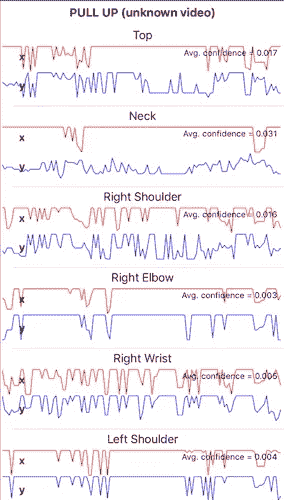

由于有 14 个身体部位和每个部位的(x，y)坐标，我们可以将时间序列数据结构想象成 28 个随时间变化的波(14 x2 = 28)。

(x，y)坐标通过将每个身体部位位置分别除以帧的宽度或高度来归一化。框架的左下角作为我们坐标系的原点。

## 平滑噪声数据

在这一点上，我们有一个时间序列，但当我们试图分类和分配一个类标签时，它包含的噪声可能会导致不准确的预测。为了平滑噪声数据，我使用了一种叫做**黄土** ( *局部加权散点平滑*)的过滤器。

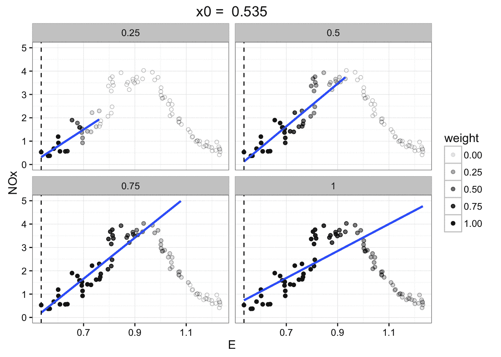

[https://ggbaker.selfip.net/data-science/media/loess.gif](https://ggbaker.selfip.net/data-science/media/loess.gif)

总的想法是，对于每个“原始”数据点，我们通过取相邻点的*加权平均*来得到更好的估计。离我们考虑的点越近的邻居权重越高，因此对平均值的影响也越大。

黄土的好处是(例如，与卡尔曼滤波器相比)只需要考虑一个参数。此参数控制相邻点对加权平均值的影响程度。它越大，邻居的影响就越大，因此产生的曲线就越平滑。

下面是我们的时间序列数据的一个例子，在之前的*和在*黄土过滤之后的*:*

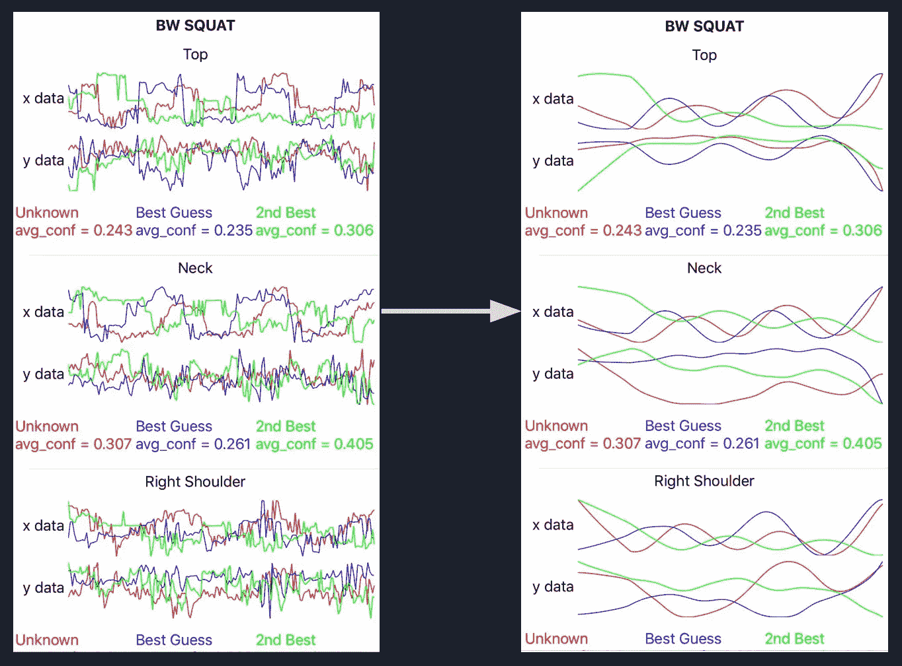

Timeseries before and after LOESS filtering

# 时间序列分析

既然我们有了将输入视频预处理成可用数据的方法，我们需要分析产生的时间序列并对视频进行分类。

分析可以用很多方法来完成，但在这篇文章中，我们将重点关注一种叫做*k-最近邻*的算法。基本上，我们会将**未知**时间序列与大量**已知**时间序列进行比较，找出最接近的匹配(`k=1`)。比较是使用距离函数来完成的，我们将在后面讨论。

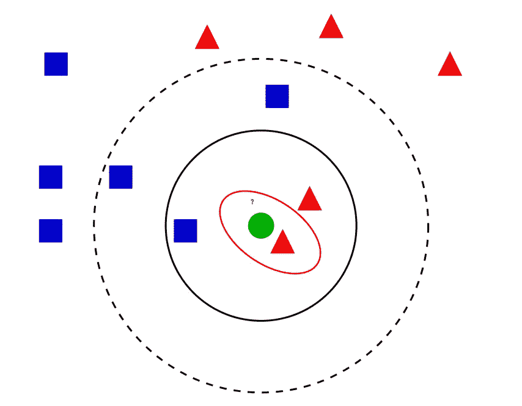

The green item is “unknown,” and we’ll assign it the label of the closest “known” item

一旦我们找到未知视频的最近邻居，我们预测未知视频与已知项目具有*相同的类别标签*，因为根据我们的距离函数它们是最近的。

## 距离函数是什么？

在二维空间中寻找两点之间的距离很容易:

```
dist = sqrt( (x2 — x1)^2 + (y2 — y1)^2 )
```

但是两波之间的距离呢？还是两个时间序列之间的距离？没那么容易…

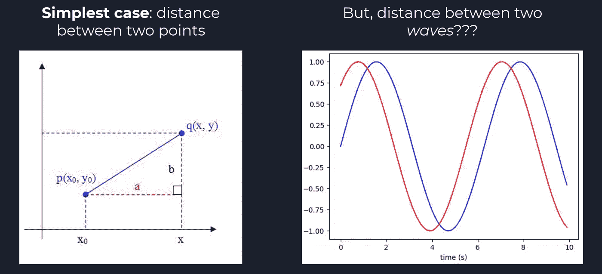

更复杂的是，想象以下场景:

> 我们有一个“已知”标记的时间序列，来自一个人做俯卧撑的视频。他每 2 秒做 **1 个俯卧撑**，并在视频开始 1 秒做**。现在，我们想从其他人做俯卧撑的视频中标记一个“未知”的时间序列。他每 3 秒做 **1 个俯卧撑**，并在视频**的 2 秒后开始做**。**

即使这些时间序列来自相同的练习(俯卧撑)，当我们试图比较“未知”时间序列和“已知”时间序列时，会出现两个问题:不同的**频率**和不同的**相移**。

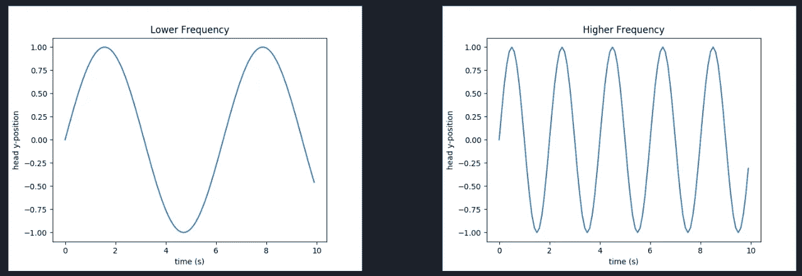

Differing frequency (e.g. push-up rate)

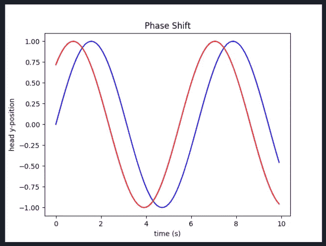

Differing phase shift (e.g. push-up starting time)

## 比较时间序列

为了帮助解决不同频率和相移的问题，我们将采用一种叫做*动态时间扭曲* (DTW)的算法。这是使用动态编程的非线性对齐策略。

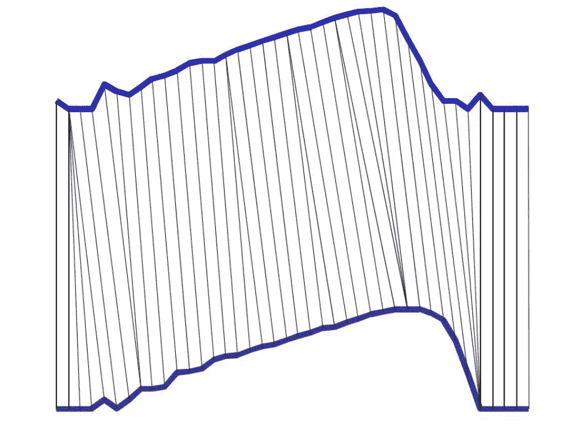

[https://www.cs.unm.edu/~mueen/DTW.pdf](https://www.cs.unm.edu/~mueen/DTW.pdf)

与许多动态规划算法一样，在 DTW 中，我们填充一个矩阵，其中每个单元的值是相对于相邻单元的函数。

假设我们正在比较长度为`M`的时间序列`s`和长度为`N`的时间序列`q`。矩阵的每一行对应于`s`的一个时间点，每一列对应于`q`的一个时间点。这样矩阵就是`MxN`。第`m` ( `0 <= m < M`)行和第`n` ( `0 <= n < N`)列的单元成本如下:

```
cost[m, n] = 
    distance(s[m], q[n]) +
    min(cost[m-1, n], cost[m, n-1], cost[m-1, n-1])
```

将`s[m]`想象为*未知*视频中的人在`m`时刻的姿势，将`q[n]`想象为*已知*视频中的人在`n`时刻的姿势。它们之间的距离`distance(s[m], q[n])`是各个身体部位坐标之间的 2D 距离的**和**。

> 我还对身体各部分之间的距离进行了加权求和，给与特定锻炼相关的身体部分分配了更多的权重。例如，在分析**下蹲**时**脚**是不相关的(因为它们不移动)，所以它们的权重较小。但是对于**跳**来说，脚动的多，重量也大。这项技术稍微提高了算法的准确性。

一旦我们填满了 DTW 成本矩阵，我们计算的最后一个单元实际上是两个时间序列之间的最小“距离”。

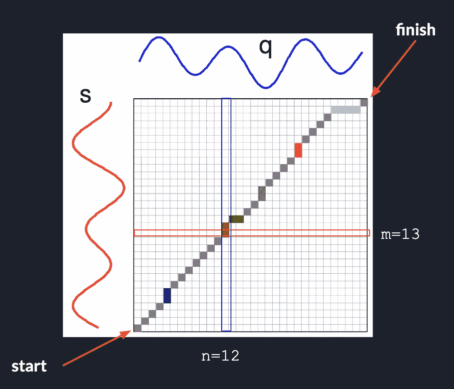

Visualization of DTW (image has been modified from [this presentation](https://www.cs.unm.edu/~mueen/DTW.pdf))

可以通过使用一种叫做“扭曲窗口”的东西来提高 DTW 的效率简而言之，这意味着我们不计算整个成本矩阵，而是计算矩阵的一个较小的对角线部分。如果您有兴趣了解更多信息，请查阅论文 [*快速时间序列分类使用数量缩减*](http://alumni.cs.ucr.edu/~xxi/495.pdf) 。

# 结果

现在我们已经建立了一个系统，它将一个未知的视频作为输入，将其转换为时间序列，并使用 DTW 将其与来自一组已标记视频的时间序列进行比较。最匹配的已知时间序列的标签将用于对未知视频进行分类。

为了评估这个系统，我使用了大约 100 个视频和 3 个练习的数据集:负重深蹲、引体向上和俯卧撑。每个视频中的练习要么是正确的*要么是不正确的*(使用不适当的技术)。从人的正面、侧面和背面记录视频。对于侧面角度，我通过在 y 轴上翻转原始图像生成了第二个视频。 **80%** 的视频被用作“标记”数据，剩余的 **20%** 被保留用于测试算法的准确性。**

**测试结果表明，该算法非常擅长区分练习之间的*(**90–100%准确度**)，但不太擅长对*练习中的变化*进行分类(正确与不正确的技术)。这些变化可能很微妙，很难跟踪，在这方面我能达到的最大精度是 **~65%** 。***

## **丰富**

***k-最近邻*算法的一个主要缺点是推理时间——即对未知视频进行分类的时间——随着标记数据集的大小成比例增长，因为我们将未知时间序列与每个标记项目进行比较。**

**在[第二部分](https://medium.com/@trevor.j.phillips/exercise-classification-with-machine-learning-part-ii-d60d1928f31d)中，我们将探索一种使用 ML 模型对视频进行分类的端到端方法，从而使推理时间**保持恒定**。**

# **资源**

*   **主 [GitHub 库](https://github.com/trevphil/TechniqueAnalysis)带有视频处理和 DTW**
*   **[打开姿势](https://github.com/CMU-Perceptual-Computing-Lab/openpose)**
*   **[iOS 上的姿态估计](https://github.com/tucan9389/PoseEstimation-CoreML)**
*   **[局部加权散点图平滑](https://ggbaker.selfip.net/data-science/content/filtering.html)(黄土)**
*   **[动态时间扭曲](https://en.wikipedia.org/wiki/Dynamic_time_warping) (DTW)**
*   **[DTW《翘曲的窗户》](http://alumni.cs.ucr.edu/~xxi/495.pdf)**