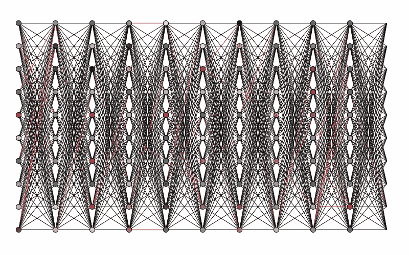
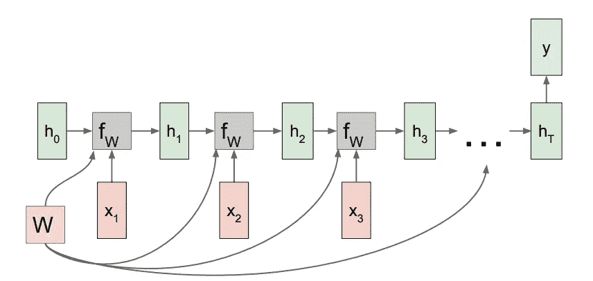
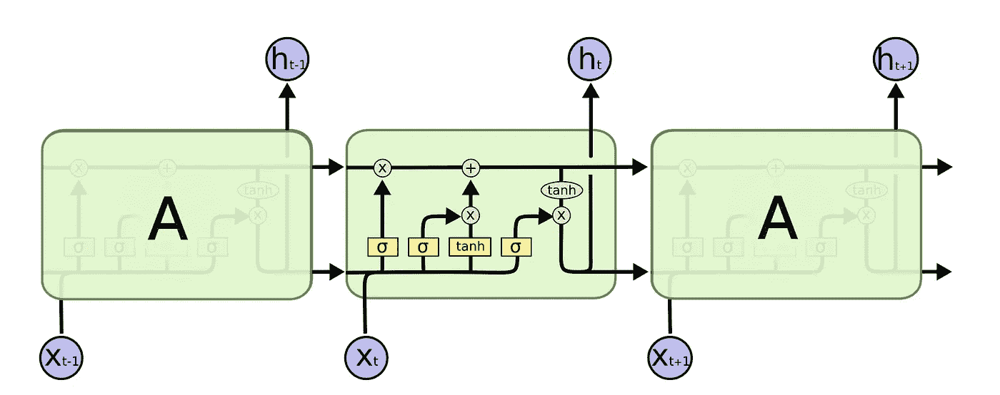
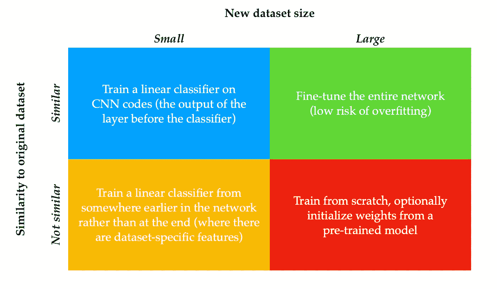
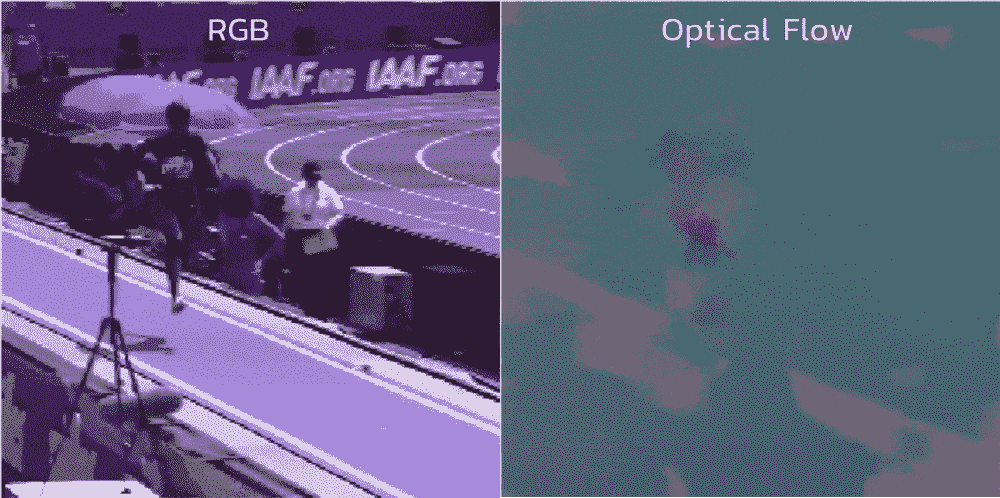
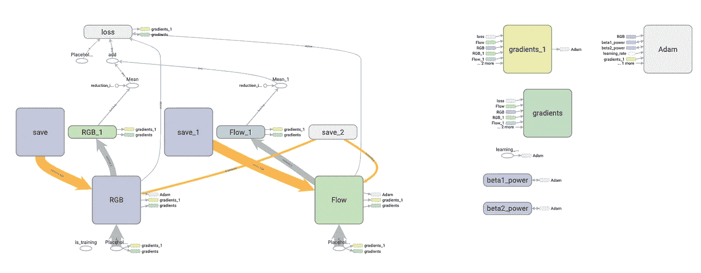

# 基于机器学习的运动分类(下)

> 原文：<https://towardsdatascience.com/exercise-classification-with-machine-learning-part-ii-d60d1928f31d?source=collection_archive---------20----------------------->

## 在这篇分为两部分的文章中，我们将深入探讨一个具体问题:对人们进行各种锻炼的视频进行分类。



在[的上一篇文章](https://medium.com/@trevor.j.phillips/exercise-classification-with-machine-learning-part-i-7cc336ef2e01)中，我们重点关注了一种更为**的算法**方法，使用*k-最近邻*对未知视频进行分类。在这篇文章中，我们将关注一种专门的**机器学习** (ML)方法。

我们将要讨论的所有内容的代码都可以在这个 GitHub 库的 [**中找到。算法方法(**](https://github.com/trevphil/TechniqueAnalysis)**[第一部分](https://medium.com/@trevor.j.phillips/exercise-classification-with-machine-learning-part-i-7cc336ef2e01))用 Swift 编写，可作为 [CocoaPod](https://cocoapods.org/pods/TechniqueAnalysis) 获得。ML 方法(第二部分)是用 Python/TensorFlow 编写的，可以作为 GitHub 资源库的一部分找到。**

# 背景

视频分类与图像分类的根本区别在于我们必须考虑*时间维度*。无论我们使用什么样的 ML 模型，它都需要学习具有时间成分的特征。为此开发了各种架构，现在我们将讨论其中一些。

## 递归神经网络



Unrolled RNN with many-to-one architecture ([source](http://cs231n.stanford.edu/slides/2017/cs231n_2017_lecture10.pdf))

rnn 非常适合输入数据序列，比如文本，或者在我们的例子中，是视频帧。RNN 的每一步都是特定时间点输入的函数，也是前一步的“隐藏状态”。以这种方式，RNN 能够学习时间特征。权重和偏差通常在步骤之间共享。

rnn 的缺点是它们经常遭受消失/爆炸梯度问题。另外，反向传播在计算上是昂贵的，因为我们必须通过网络中的所有步骤进行传播。

## 长短期记忆网络



[https://colah.github.io/posts/2015-08-Understanding-LSTMs/](https://colah.github.io/posts/2015-08-Understanding-LSTMs/)

LSTMs 是普通 rnn 的一个更复杂的变体，旨在捕获长期依赖关系。LSTM 的一个“单元”包含 4 个可训练门:

*   *遗忘门*:一个 sigmoid 函数，确定从先前单元的状态中“遗忘”什么
*   *输入门*:一个 sigmoid 函数，决定我们将哪些输入值写入单元格
*   *双曲正切门*:双曲正切函数，将输入门的结果映射为-1 和 1 之间的值
*   *输出门*:一个 sigmoid 函数，过滤前面门的输出

一般来说，LSTM 架构有助于防止消失梯度，因为它的附加相互作用。

## 三维卷积神经网络(CNN)

神经网络的 2D 卷积层使用一组“过滤器”(内核)，这些过滤器滑过输入数据并将其映射到输出空间。下面，我们可以看到一个过滤器的动画示例:


[https://mlnotebook.github.io/img/CNN/convSobel.gif](https://mlnotebook.github.io/img/CNN/convSobel.gif)

将 2D 卷积层扩展到时间维度相对简单，我们有一个 3D 输入，其中第三维是时间，而不是 2D 滤波器，我们使用一个 3D 滤波器(想象一个小盒子)，它在 3D 输入(一个大盒子)中滑动，执行矩阵乘法。

通过这个简单的 3D 膨胀，我们现在可以(希望)使用 CNN 来学习时间特征。然而，将内核扩展到 3D 意味着我们有更多的参数，因此模型变得更加难以训练。

# 膨胀的 3D ConvNet (I3D)

让我们回到文章的目标:对人们进行锻炼的视频进行分类。我选择了最后一个架构的变体，3D CNN，基于论文“ [Quo Vadis，动作识别？新模型和动力学数据集](https://arxiv.org/abs/1705.07750)。

在本文中，作者介绍了一种称为“膨胀 3D conv nets”(I3D)的新架构，该架构将过滤器和池层扩展到 3D 中。I3D 模型基于 [Inception v1](https://arxiv.org/abs/1409.4842) 和[批量规格化](https://arxiv.org/abs/1502.03167)，因此非常深入。

## 迁移学习

我们训练 ML 模型变得善于检测数据中的特定特征，例如边缘、直线、曲线等。如果两个领域相似，则模型用于检测一个领域中的特征的权重和偏差对于检测另一个领域中的特征通常很有效。这叫做**迁移学习**。



General guidelines for transfer learning

I3D 的创造者依靠迁移学习，使用 Inception v1 模型的权重和偏差，该模型在 ImageNet 上预先训练。当将 2D 模型膨胀到 3D 时，他们只是简单地将每个 2D 层的权重和偏差“叠加”起来，形成第三维度。以这种方式初始化权重和偏差(与从头开始训练相比)提高了测试精度。

最终的 I3D 架构是在 [Kinetics](https://deepmind.com/research/open-source/open-source-datasets/kinetics/) 数据集上训练出来的，该数据集是 YouTube 上 400 多个人类动作和每个动作 400 多个视频样本的大规模汇编。鉴于动力学数据集和手头任务(对人们做运动的视频进行分类)之间的相似性，我相信使用[公开可用的 I3D 模型](https://github.com/deepmind/kinetics-i3d)进行迁移学习有很大的机会。

## 数据预处理

先说数据预处理。I3D 模型使用双流架构，其中视频被预处理成两个流: *RGB* 和*光流*。我用来创建这些流的代码在这里[可用](https://github.com/trevphil/TechniqueAnalysis/blob/master/video-classifier/process_video.py)并且基于 [I3D GitHub repo](https://github.com/deepmind/kinetics-i3d) 的实现细节。



RBG and optical flow visualizations of a long jump

我使用 Python 的`cv2`库中的函数`calcOpticalFlowFarneback()`生成了光流数据。注意，I3D 模型不像在 RNN 或 LSTM 中那样具有显式递归关系，然而光流数据是隐式递归的，因此我们获得了类似的优点。

在测试时，通过添加具有相等权重的逻辑并使用结果来形成类预测，来组合这两个流。

# 进一步的细节

我剥离了 I3D 模型的最后两层(逻辑层和预测层)并用类似的层替换它们，这样新的逻辑层就有了我的用例的正确数量的`output_channels`(下面列出了 6 个类)。

```
bw-squat_correct
bw-squat_not-low
pull-up_chin-below-bar
pull-up_correct
push-up_correct
push-up_upper-body-first
```

每个流的逻辑值、 *RGB* 和*光流*被组合并用于形成类似于原始实现中的预测。我使用了一个由 128 个视频组成的数据集(不幸的是这个数据集很小),这些视频是从不同的摄像机角度录制的，我只对新图层*和*进行了反向传播，依靠现有图层的权重和偏差将视频映射到相关的特征中。

我用的是批量`1`，正则化强度`0.25` (L 范数)，学习率`5e-4`的`tf.train.AdamOptimizer`。训练-测试分割为 80% — 20%，在训练数据集中，另外 20%被保留用于验证和超参数调整。TensorBoard 的计算图如下所示:



Modified I3D computational graph from TensorBoard

# 结果

训练通常需要大约 30 个历元，直到损失达到稳定，在最好的情况下，最后 100 次迭代的平均损失是`0.03058`。测试精度达到`69.23%`。

这个项目的结果受到小数据集大小的限制，但随着更多的视频，我相信一个微调版本的 I3D 模型可以实现更高的测试精度。

将端到端的 ML 模型集成到移动客户端提出了一个不同的挑战。例如，在 iOS 领域，模型必须采用 CoreML 可接受的格式。存在诸如 [tfcoreml](https://github.com/tf-coreml/tf-coreml) 的工具，用于将 TensorFlow 模型转换为 coreml 模型，但是支持转换的 op 数量有限。

在撰写本文时，tfcoreml 不支持 T2 或任何三维操作，这意味着还不能将 I3D 模型集成到 iOS 应用程序中。