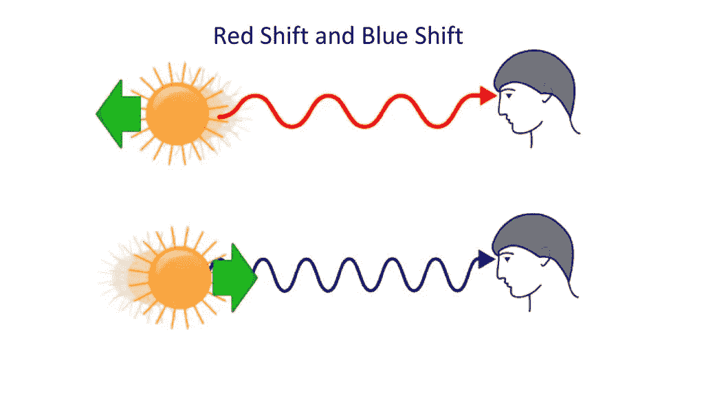

# 系外行星 I:方法和发现

> 原文：<https://towardsdatascience.com/exoplanets-i-methods-and-discoveries-b653eee48cf2?source=collection_archive---------20----------------------->

## [用数据科学了解系外行星](https://towardsdatascience.com/tagged/exoplanets-with-ds)

## 探索宇宙

Source: L. Calçada, ESO.

*7 年前，17 岁的我在高中最后一年选择探索系外行星领域，名为“成熟之旅”。我联系了第一颗系外行星的共同发现者 Didier Queloz* *，他曾在日内瓦大学任教，讨论我论文的分析部分，并征求他对可居住性前景以及系外行星重要性的看法。他很大方地抽出时间和我见面接受采访，后来还带我参观了日内瓦天文台和他的实验室。*

*我的项目工作获得了满分，随后我也被邀请到****CERN****在一个著名的瑞法学生科学分享活动上公开展示我的见解。*

我的演讲很受欢迎，尤其是在理论和研究驱动的领域，如天体物理学，带来了与人类生存相关的焦点。事实上，在别处发现生命的前景，可以帮助我们更好地了解作为人类的自己，受到了观众的赞赏，并植根于我自己的经历中。

**Left**: CERN ‘Science-Sharing’ event flyer. **Right**: Group picture of presenters and public at the event in question.

*2019 年 10 月，同样是迪迪埃·奎洛兹教授，与米歇尔·马约尔、詹姆斯·皮布尔斯共同被授予* ***诺贝尔物理学奖*** *。*

**Left**: observatory tour by Didier Queloz, 2012\. (I was too naive to think of taking a selfie). **Right**: Nobel Prize Winners, 2019.

这篇文章是我当时用他的投入写的报告的一部分，作为对系外行星的介绍。鉴于最近的新闻，我现在可以查看它，因为它非常相关，并在数据科学的背景下，即如何收集、分析和解释数据的背景下，提供了对系外行星发现的见解。我们还可以将这些发现与许多物理定律联系起来，如开普勒第三定律，并观察宇宙中的所有行星如何遵循完全相同的模式。

*我已经将内容分成多个部分，如下所示:*

*   第一部分:方法和发现
*   **第二部分** : [数据解释](https://medium.com/@eklavyaS/exoplanets-ii-interpretation-of-data-c9e554c4f3fe)
*   **第三部分** : [可居住性和结论](https://medium.com/@eklavyaS/exoplanets-iii-habitability-and-conclusion-5fe70b97f3c7)

# 外行星学简史

安金德很久以来就一直在推测除了我们自己以外的行星系统。几个世纪前，哲学家们就假设我们的太阳系不是独一无二的；事实上在看似无限的恒星海洋中存在着无数更多的恒星。围绕另一颗恒星运行的行星上存在生命的可能性不仅仅是一个似是而非的理论，而且它还具有优势。事实上，在可观测的宇宙中有几千亿个星系，每个星系包含几千亿颗恒星；认为地球可能是整个宇宙中唯一有能力支持生命的星球，这看起来几乎是荒谬的。

然而，缺乏科学证据来支持这一富有远见的观点意味着在过去的两千年里，这种思想跨越了所有的极端。一方面，有些人——比如伊壁鸠鲁——相信宇宙中除了我们之外还存在其他世界，并且相信它们有能力容纳生命。另一方面，许多人——比如亚里士多德——坚信地球在宇宙中是独一无二的，其他类似的世界不可能存在。基督教和其他信仰也声称上帝之手创造了地球和所有生物。

因此，寻找太阳系外的行星成了一个紧张的科学研究课题。由于缺乏证据，我们不知道它们有多普遍，它们与太阳系的行星有多相似，或者与其他恒星周围的行星系统相比，我们自己的太阳系的构成有多典型。可居住性也是一个重要的问题。如果有其他行星，它们是否也有必要的表面条件来支持某种形式的生命？问题很多，但答案很少。主要的障碍在于无法直接观察这些未知的天体。

哈勃太空望远镜也许宠坏了我们所有人——我们现在开始期望经常看到遥远星系和星云的图像。因此，拍摄一颗太阳系外行星的图像应该不会比拍摄一个遥远星系的图像更困难。然而，问题出现了，因为主星完全超过了它的小而暗淡的行星。在大多数情况下，行星离它们各自的恒星太近，无法直接成像，特别是从地球表面，考虑到我们大气层的干扰效应。

直到 1995 年，日内瓦大学的米歇尔·马约尔和迪迪埃·奎洛兹才首次报告了对太阳系外行星的明确探测。尽管几年前射电天文学家亚历山大·沃尔兹森和戴尔·弗莱尔已经进行了一些其他的探测，但它们不是在一颗普通恒星周围发现的，而是在一颗脉冲星周围发现的——一颗作为超新星爆炸的大质量恒星的超致密残余物。马约尔和奎洛兹于 1995 年 10 月在日内瓦宣布了太阳系外行星 Pegasi b 51 T1，这被认为是第一次明确的太阳系外行星探测。多年来，还有其他几个可以被视为里程碑的发现，如探测到多个行星系统和首次探测到行星大气层。

自 1995 年以来，这一领域取得了惊人的进展。新的发现和重大发展继续以每月一次的速度公布，这在任何科学领域都是前所未有的进步。截至 2019 年 11 月，通过使用几种不同的探测方法，共发现了 4128 颗系外行星。寻找系外行星已经迅速成为一个受人尊敬的科学研究领域和一个能够独立存在的天文学领域。这一领域的进步不仅伴随着数千篇科学论文的发表，还见证了光学天文仪器的改进，这导致了*开普勒*望远镜的发射和新的探测技术。

# 检测的方法

在过去的二十年里，几种不同的技术被用来探测系外行星。如前所述，母星发出的光总是会冲掉其行星反射的少量光。因此，科学家必须想出替代和间接的方法来探测系外行星，因为直接观察它们几乎是不可能的。本章概述了已经取得成功的最成熟的方法以及它们背后的逻辑和科学，同时讨论了每种方法的优缺点。

## **径向速度法**

也被称为 RV 方法，是迄今为止最成功的技术。1995 年，米歇尔·马约尔和迪迪埃·奎洛兹用这种方法发现了第一颗公认的系外行星。此后它被用于定位 863 颗太阳系外行星(截至 2019 年 11 月)。

如图 1 所示，多年来，科学家们已经能够探测到各种各样的行星。系外行星的质量是相对于木星质量来表示的，即*木星质量。然而，行星的质量测量不确定性高达 *sin(i)* ，其中 *i* 是行星围绕其恒星运行的倾角。因此，质量被绘制为 *M*sin(i)* ，而不仅仅是 *M* 。多年来，这项技术在灵敏度和准确性方面都有所提高，科学家们现在已经发现了许多木星质量低于 0.1 的行星，这一壮举直到 2004 年左右才得以实现。*

这种技术对于探测围绕其母星运行的大质量行星最为有效。值得注意的是，这种方法只提供了行星质量的下限，这是它最大的缺点。一颗行星的真实质量只有当这项技术和凌日法结合起来使用时才能确定，这将在后面描述。

RV 方法基于自然重力系统和轨道，由*牛顿万有引力定律定义。*

如前所述，行星的引力使其母星在自己的小轨道上摇摆。虽然恒星和行星相互施加的力是相同的，但它们的加速度之间的差异是巨大的，因为恒星和行星的质量不同，至少等于 10^3。由于行星的加速度是基于恒星的质量，而恒星的质量非常高，所以行星的移动量很大。相反，恒星的加速度很小，因为它是基于行星的质量，而行星的质量相对较小。这种微弱的加速度导致恒星在其小轨道上“摇摆”。

这种“摆动”会对恒星的可观测属性造成微小的扰动，比如它在天空中相对于地球的角位置。一个更重要的变化是*变化*在*速度*上，恒星以这种速度靠近或远离地球，在那里它被观察到。为了更好地理解 RV 方法，我们首先需要对多普勒效应和普通光谱学有一个基本的了解，因为这两者被结合起来用于探测系外行星。

## 多普勒效应

让我们以消防车的警笛为例来理解这个概念。让我们想象一辆不动的消防车开着警报器。这个固定声源产生恒定频率λ的声波，声波以恒定的声速*c*= 340*m/s*向外传播。由于声波从声源向*所有*方向传播，如果它们可见，它们将呈现为圆形，所有观察者将听到*相同的*频率，在这种情况下，这是声源的实际频率。换句话说，观测频率等于发射频率 0。

A stationary and moving fire-truck emitting sound waves at a constant frequency.

但是，如果消防车开始向一个方向移动，由于波长的差异，声波会变得不均匀。在两种情况下，警报器发出的声波的频率相同。然而，由于震源现在正在移动，每个新波的中心在消防车的方向上略有位移(如右图所示)。结果，声波开始在消防车的前部聚集，并在后面扩散。这种现象被称为多普勒效应。由于声波的波长不同，观察到的频率也会受到影响。因此，声源前方的观察者会听到较高频率的汽笛声，而其后方的观察者会听到较低频率的汽笛声。观察到的频率变化是导致警报声音调变化的原因。观察到的频率可以使用以下公式计算:

其中:

*   *c* 是介质中波的速度，在我们的例子中是空气，大约等于 340 [m/s]。
*   *v_observer* 是观测者的速度，用【m/s】表示。如果观察者正朝着光源移动，它将是正的，如果远离光源，它将是负的。
*   *v_source* 是震源的速度，也用[m/s]表示。如果观察者正朝着光源移动，它将是正的，如果远离光源，它将是负的。类似地，如果源远离接收器，它将是正的，如果向接收器移动，它将是负的。
*   \ _ 0 是声源发出的频率，单位为[Hz]。

为了观察到这种效应，相对运动必须沿着观察者和波源的连线，也就是朝向或远离观察者。沿着这条直线方向的运动称为*径向运动*，该运动的速度称为 ***径向速度*** 。如果观察者相对于波源既不靠近也不远离，就没有影响。多普勒效应是一种影响任何形式波动的波长和频率的现象，例如声波、水波、光波以及所有电磁波。

现在让我们把我们的类比与天文学联系起来。让我们想象一颗恒星发出光波，而不是消防车发出声波。我们，地球上的人类，是观察者，恒星是光波的来源。如果这颗恒星没有系外行星，它就不会有明显的径向速度，因为它是静止的。然而，如前所述，当一颗行星绕着一颗恒星运行时，后者也在其非常小的轨道上运动，以响应前者的引力。或者更确切地说，它们都绕着它们共同的质量中心运行，而这个质量中心恰好在恒星本身的内*,这导致了恒星的轻微摆动。因此，*如果*我们可以观察到这种“摆动”，*那么*我们可以得出结论，一颗真正的系外行星可能正在围绕它旋转。这种“摆动”实际上是恒星径向速度的变化。天文学家可以通过将光谱学应用于多普勒效应来探测这些变化。*

## 光谱学

现在让我们想象我们上面提到的恒星*有一颗外行星围绕它运行，导致它的径向速度变化，这被我们这些观察者“看到”。就像消防车一样，当恒星看起来朝着我们移动时，它发出的波长会更小，也就是说，被压缩和聚集得更多，因此观察到的频率更高。相反，当它移动*远离*我们时，波长将会更大，也就是说，更加拉伸和分散，观察到的频率更低。然而，光波的行为与声波略有不同:光波改变的不是其可听的*音调*，而是其*光谱颜色*。换句话说，光波的频率、波长和光谱颜色都是相互关联的。*

The Electromagnetic Spectrum, with the visible light section highlighted.

对应于可见光谱的波长如下:

Variation in wavelength and frequency by colour

Wavelengths according to colour

当光波的波长很短且频率很高时，光波会发生蓝移，这意味着它们具有蓝色光谱。当光波波长较长且频率较低时，它们会发生*红移*，这意味着它们获得了红色光谱。

Change of Spectrum Colour due to the direction of the Radial Motion of the Star

由于多普勒效应，我们知道当光波红移时，由于波长增加(因此频率降低)，它们会以径向运动的方式远离。同样，当光波蓝移时，我们知道它们正在向我们移动，因为波长变短，频率变高。

因此，当我们观察我们选择的恒星发出的光波的光谱颜色时，我们看到它们不断地从红色变为蓝色。这种周期性的光谱移动之所以发生，是因为恒星在它的小轨道上不断运动，从而周期性地缩短和增加它与我们观察者的距离。

“Wobble” of star causing a Periodic Spectral Colour Change. The motion of the star has been exaggerated to illustrate the point.

总之，通过使用高精度光谱仪器，我们可以有效地探测到主星光谱颜色的周期性光谱变化，这意味着其可见光波长的周期性变化，进而表明一种明显的径向运动，这种运动只能由系外行星的引力引起，因为它迫使恒星围绕两个天体的质量中心运动，从而证实了它的存在。

## 运输方法

另一种已经在探测系外行星方面取得成果的方法是凌日法，这种方法因基于太空的任务而广为人知，如 *CoRoT* 和*开普勒*。这项技术的基本原理很简单:如果一颗行星从它所绕转的恒星前面经过，地球上接收到的光的强度会有小幅下降。

The Observable Drop of Light during a Transit

通过观察由行星凌日引起的恒星光亮度的变化，人们能够探测到系外行星。虽然光度的下降取决于恒星和行星的相对大小，但典型的量估计在 0.01%和 1.7%之间。凌日的持续时间也取决于行星离恒星的距离和恒星的大小。

这种技术有一个明显的缺陷:只有当行星的轨道平面与我们的视线对齐时才适用，这样我们就可以目睹行星挡住了恒星的一些光线。

Varying Orbital Inclinations determine the Observation of a Planetary Transit from Earth

一颗行星以日地距离(1 AU)围绕一颗太阳大小的恒星运行，将有 0.47%的概率产生可观测的凌日。因此，人们会认为这种方法可能是不切实际和无益的。然而，通过在包含数千颗恒星的大面积天空中扫描恒星，原则上可以发现太阳系外的行星，其速度可能超过径向速度法。正是出于这种希望，许多任务已经启动，特别是*开普勒*任务。2012 年 12 月，用这种方法已经发现了 291 颗行星，开普勒发现的 2000 多颗候选系外行星正在等待确认。今天，使用凌日方法，已确认的行星数量为 2966 颗，候选行星为 2428 颗。

凌日方法的另一个缺点是需要很长时间来确认候选行星的真实性。事实上，由于高错误探测率，单次凌日的观测不足以被完全接受为一颗行星。因此，候选行星可能需要很多年才能被确认为太阳系外行星，因为人们必须等待它绕轨道运行几次。这种方法也更倾向于检测轨道较小的大型行星，这些行星被称为热木星，因为它们过境更频繁，因此更容易被检测到。

另一方面，凌日法的优点之一是光线的下降提供了对行星大小的估计。但到目前为止，最大的优势是我们可以确定系外行星的大气成分，这对确定其可居住性的潜力至关重要。当行星凌日恒星时，星光在到达地球之前会穿过行星的大气层，让我们有机会探测其中是否存在氧等元素。

当穿过恒星的行星有大气层时，恒星发出的光会下降更多，因为除了已经被行星主体阻挡的光波之外，行星中的元素还会吸收一些光波。行星的大气层本质上就像是恒星光波的过滤器，根据大气元素的不同，阻挡一些，释放一些。

大气中存在的元素阻挡了相应的波长，导致光谱中出现黑线，被称为*吸收线*。

An example of Absorption Lines

每种元素都与一组特定的波长相关联，由于其化学性质，这些波长会被阻挡。因此，当我们在一颗有行星经过的恒星的光谱中发现吸收线时，我们就知道这颗行星有大气层。通过分析吸收线，我们可以通过观察与波长相对应的元素来确定大气的化学成分。如果恒星光谱的吸收线与一种元素的吸收光谱完全一致，那么它就表明它的存在。

Absorption Lines in the Spectrum of a star matching those of Hydrogen, confirming its presence

例如，通过在恒星的光谱中找到与氧相匹配的吸收线，我们可以确定围绕它运行的系外行星是否可能适合居住。

*延伸阅读:*

*   **第二部分** : [数据解释](https://medium.com/@eklavyaS/exoplanets-ii-interpretation-of-data-c9e554c4f3fe)
*   **第三部分** : [可居住性和结论](https://medium.com/@eklavyaS/exoplanets-iii-habitability-and-conclusion-5fe70b97f3c7)
*   原报道:[https://eklavyafcb.github.io/exoplanets.html](https://eklavyafcb.github.io/exoplanets.html)

参考资料:

*   长度卡尔萨达，埃索。[https://luiscalcada.com/](https://luiscalcada.com/)
*   美国宇航局的想象宇宙，*多普勒频移。*
*   美国宇航局，*可见光波。* (2013)。
*   拉斯坎布雷斯天文台全球望远镜网络，*凌日法。* (2013)。

维基百科，[https://www.wikipedia.com](https://www.wikipedia.com)【2013 年访问】:

*   *红移*
*   *径向速度*
*   *灯*