# 系外行星 II:数据解释

> 原文：<https://towardsdatascience.com/exoplanets-ii-interpretation-of-data-c9e554c4f3fe?source=collection_archive---------14----------------------->

## [用数据科学了解系外行星](https://towardsdatascience.com/tagged/exoplanets-with-ds)

## 了解宇宙

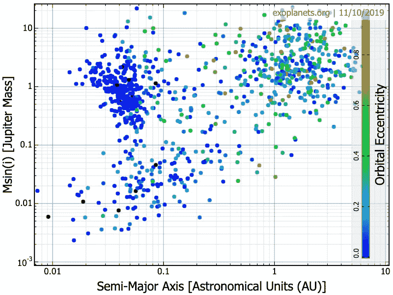

Discovered Exoplanets Visualised

*这是系外行星系列的第二部分。*

*   **第一部分** : [方法和发现](https://medium.com/@eklavyaS/exoplanets-i-methods-and-discoveries-b653eee48cf2)
*   **第二部分**:数据解释
*   **第三部分** : [可居住性和结论](https://medium.com/@eklavyaS/exoplanets-iii-habitability-and-conclusion-5fe70b97f3c7)

现在我们已经看到并理解了历史背景、研究的科学价值以及这些发现的意义，我们将看看太空任务发现并编辑的实际数据，这样我们就可以将它们与实际物理联系起来。通过绘制数据图表，我们可以直观地看到与几个世纪前由著名物理学家如牛顿和开普勒建立的理论或物理定律的相关性。

为了充分理解系外行星领域背后的科学，人们必须查看经常公开的实际研究数据。几个团队已经将所有信息汇编成大型数据库，供公众通过互联网查看，如美国宇航局系外行星档案馆或太阳系外行星百科全书。这些网站中最有用的工具是绘图仪，它允许人们以几种不同的方式直观地探索、理解和分析数据。

在接下来的几页中，我们将分析一组使用来自[www.exoplanets.org](http://www.exoplanets.org,)的数据生成的有趣图表，这是一个由加州行星调查联盟维护的网站，显示了已确认的系外行星(即没有候选行星)的列表，以及它们的特征。

## 轨道周期的概率分布；

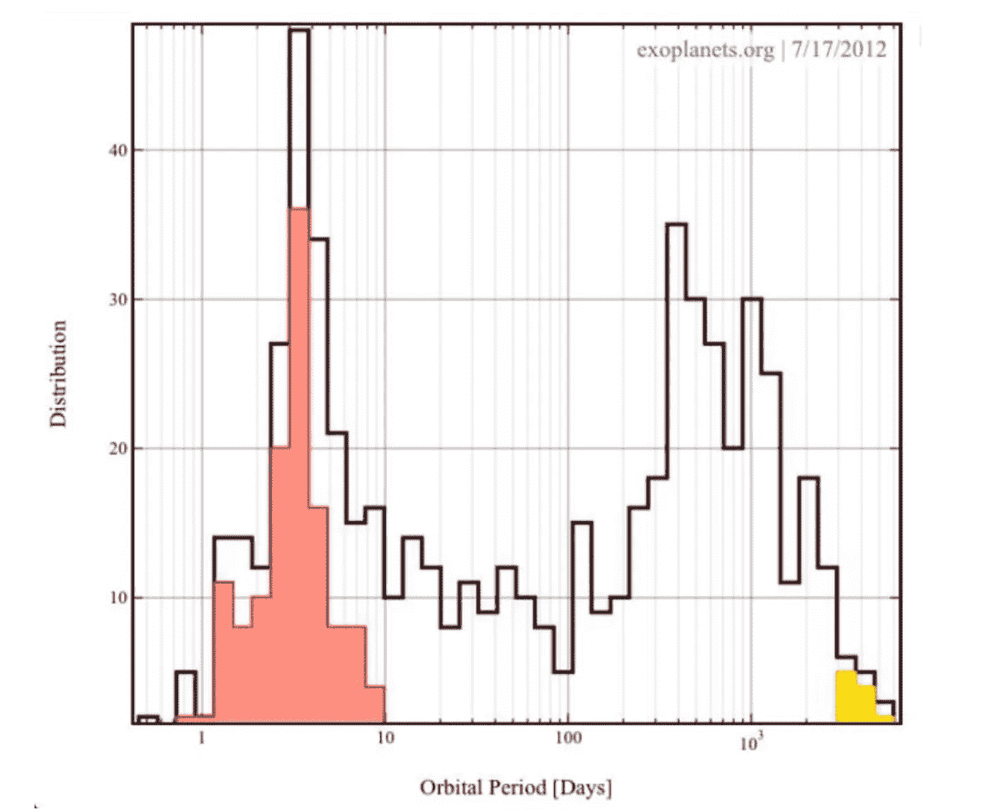

Graph 2: The Number of Exoplanets found for each value of Orbital Period

上图显示了探测到的系外行星的数量与其轨道周期的关系，即它们围绕母星完成一个完整轨道所需的天数。

快速浏览一下，该图中有几个突出的特征。首先，有两个大的峰值，一个在 3 到 4 个轨道周期日之间，窄而长，另一个短而宽，峰值在大约 400 个轨道周期日。另一个值得注意的特征是两个峰值之间的深度下降。

现在，如果我们把我们太阳系行星的轨道周期，八个行星中的五个将符合第二个峰值。然而，我们似乎在第一个峰值的参数范围内找到了同样多的系外行星。此外，似乎还没有发现任何行星的轨道周期超过 5000 天，这仅仅比木星的轨道周期多一点点。即使许多被探测到的行星似乎没有木星的轨道周期，但它们中的大量确实具有木星的质量。

该图显示了两个彩色部分。较小的黄色部分代表*类木星*，即在质量和轨道周期方面与我们的木星相似的系外行星。较大的红色部分代表*热木星*，它们在质量上也类似于木星，但它们的轨道周期要小得多，这意味着它们的轨道非常靠近它们的母星，因此接收到大量的光和热，正如它们的名字所示，使它们变得很热。如(第二张)图表所示，这些热木星的轨道比水星的轨道小，水星是我们太阳系中离其主星最近的行星。图中显示了 125 颗热木星，但只有 11 颗木星类似物。这是寻找系外行星的最大惊喜。

研究人员已经发现了许多这种有趣的模式，与预期不符。让热木星的发现对我们来说不同寻常的是，在我们开始发现许多行星之前，普遍的共识是，较小的行星会靠近恒星运行，而大质量的行星可能会留在行星系统的外围。然而，许多新发现的行星绕其恒星运行的距离相对较小，不到太阳到太阳系最内层行星水星距离的六分之一。没有人预料到类似木星的行星会存在于离它们的恒星如此之近的地方。有了这些新数据，我们认为是太阳系的基础知识现在不再是最新的了。我们现在也必须重新评估我们在宇宙中的位置:我们太阳系的类型有多普遍？是独一无二的吗？我们是稀有类型还是典型类型？我们真正了解和理解了多少？

目前，系外行星是通过使用其母星作为工具来探测的。换句话说，我们正在发现新的太阳系外行星系统，并且已经有足够的数据得出以下统计数据:迄今为止发现的至少 50%的系外行星在行星定位方面与我们的太阳系不同。这意味着我们的太阳系充其量只占宇宙中所有行星系统的一半*。本质上，当我们观察恒星时，我们看到每两颗恒星中只有一颗有类地行星。这表明像我们这样的系统不是宇宙中的大多数，而是 T4。即使是已经发现的类地行星也比地球大几倍，因此被称为“超级地球”。*

*提出来解释热木星之谜的理论之一是**迁移理论**，该理论认为行星随着时间向内迁移，因此我们看到它们处于形成的后期阶段。事实上，这些巨大的行星一定是从 100 倍远的地方开始的，随着时间的推移，它们向内迁移，达到了现在与恒星的距离。*

*这当然引出了一个问题，即假设他们迁移了，他们是如何迁移的，更重要的是，为什么要迁移？它们最初的轨道不稳定吗？是什么产生了能量给这些巨大的物体以动力？也许真相永远不会为我们所知，但是行星迁移理论确实为我们提供了一些热木星出现的解释。*

## *相对于半长轴的最小质量:*

*下图很好地说明了热木星:*

**

*Graph 3*

*该图的 X 轴代表半长轴，即恒星到其轨道行星的距离。Y 轴代表系外行星的质量，这是相对于木星的质量来测量的，以使尺度与热木星的问题更相关。*

*最后，添加一个色标，如图表右侧所示，来表示每个行星的轨道偏心率。轨道偏心率是行星轨道偏离正圆的程度。零度时，行星的轨道是完美的圆形，用蓝色表示。随着偏心率的增加，轨道变得更加抛物线化，如上图 3 中的红色部分所示。*

*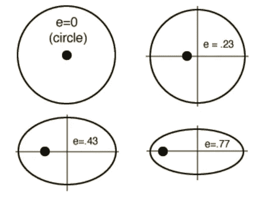*

*Variations in Orbital Eccentricities*

*在图 3 中，人们可以清楚地看到两个主要的集中的行星群。如前所述，大多数的质量与木星相同。左上角的星系团由温度更高的行星组成，因为它们离恒星更近。这些是典型的热木星，大多数是用**凌日法**探测到的。我们还可以看到，几乎所有这些行星都用蓝色表示，这意味着它们的轨道偏心率接近于零，意味着圆形轨道。*

*然而，另一个行星群在一个更冷的区域，离它的恒星更远。半长轴约为 1 AU。与之前的星团不同，这个星团具有混合的轨道偏心率:它们的范围从 0 到 0.8，这意味着它们倾向于具有更偏心的轨道。这些似乎是典型的气态巨行星，也称为木星类似物，主要是通过**径向速度**方法检测到的，如下图 4 所示。*

*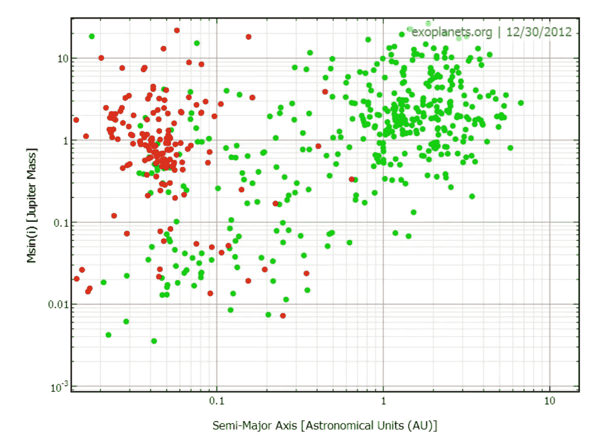*

*Planets detected by Transit Method (Red) and Radial Velocity (Green)*

*这两个团块之间的偏心率差异是惊人的。左边行星丛中的大多数行星都有完美的圆形轨道，而右边行星丛中的行星则更加多样，更倾向于偏心。正是两个团块之间的半长轴的差异造成了这种差异。左边的行星群有一个较小的半长轴，这意味着它们更靠近它们的恒星，因此*被其巨大的引力锁定*。一个潮汐锁定的天体绕着它自己的轴旋转的时间和它绕着它的伙伴旋转的时间一样长。这导致一边不断面对伴侣的身体。说明这种现象的一个主要例子是月球，它被潮汐锁定在地球上，因为它总是向我们展示同一个半球。然而，右手边的行星没有被潮汐锁定，因为它们离恒星太远，因此受到的引力较弱。在 1 AU 处，它们是地球的镜像:它们有必要的角动量来持续环绕它们的母星，但没有被它锁定。*

*图表 3 也提出了一个有趣的问题:来自两个不同星系团的两颗行星会存在于同一个行星系统中吗？换句话说，一个行星系统可能同时包含一颗热木星和一颗木星类似物吗？到目前为止，只发现了*一个*，被认为是稀有配置。*

*然而，要正确回答这个问题，我们需要增进我们对热木星形成的了解。回想一下，这些类型的行星大多是用凌日法发现的。当一颗行星从它的恒星前面经过时，我们可以有效地测量它的轨道倾角。当我们查看统计数据时，我们看到大多数热木星的轨道不垂直于恒星的旋转轴，这很奇怪，因为它不像我们太阳系中的任何行星。对于行星以一个倾斜的平面绕其恒星运行，人们认为发生了某种暴力事件或机制。因此，热木星可能是由一些未知的戏剧性和动态现象形成的，这些现象“打破”了这些行星的整个系统。这也意味著，迁移理论无法解释热木星形成的所有原因，因为热木星本身不可能是暴力机制的催化剂。因此，只有一颗行星变成热木星，而同一星系中的另一颗行星保持不变的概率非常低，而且会被认为是奇怪的。大多数被确认的热木星是孤立的，这意味着它们是*绕其恒星运行的*单一行星。他们确实过着孤独的生活。*

*但也许这个图表中最引人注目的特征是间隙的存在。事实上，我们似乎没有在右下角和更低的范围内找到任何行星，在 0.01 木星质量之间，这是岩石类地行星应该在的地方，这令人惊讶。如果我们输入我们自己行星的数据，金星和地球会发现自己处于图表的底部，孤独而孤立。我们所有的行星都不会被放在左边的丛中。*

*此外，两个团块之间还有一个很大的间隙*。真实的宇宙是这样的吗？类地行星真的如此罕见，还是我们所看到的实际上是一种选择效应，被我们的探测方法所偏向？**

*事实上，我们没有探测到右下角行星的原因不是因为选择效应，而是因为我们处于当前探测能力的阈值。让我们考虑图上的一个小质量，比如 0.03 木星质量。对于这个给定的质量，我们可以看到我们能够在短距离内相对容易地探测到系外行星。然而，当我们增加距离，即半长轴，行星变得更加难以探测。事实上，对于我们选择的质量，在 0.4 天文单位之后，我们似乎根本找不到任何行星。这是因为径向速度方法探测行星所需的振幅信号减弱了。这种减弱是因为所需的信号直接取决于系外行星的轨道周期。*

*对于任何系外行星，RV 方法的以下方程与其振幅和轨道周期(以及半长轴，因为两者直接相关)相关:*

*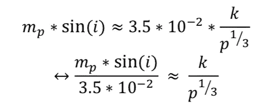**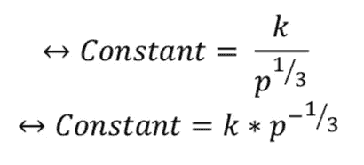*

*   **m_p*sin(i)* 是系外行星的固定最小质量，用木星质量单位表示[ *M_Jupiters* ]。*
*   **i* 是行星轨道相对于天球切线平面的倾角。*
*   **k* 是信号的振幅，单位为米/秒[ *m/s* ]*
*   **p* 是系外行星的轨道周期，以年*年*计量。*

*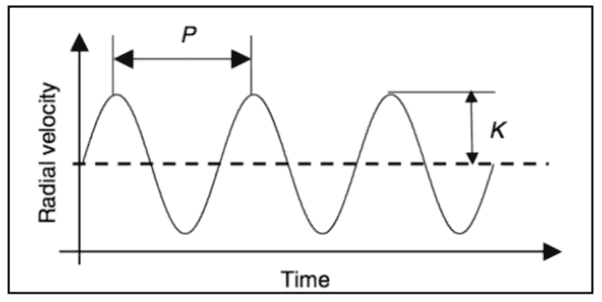*

*The relation between the orbital period p and the amplitude k, in a graphical form*

*由于系外行星的质量和倾角是固定的，我们可以简化原始方程，看到振幅和轨道周期的乘积等于一个常数。这意味着两个变量之间成反比关系。我们可以看到，随着轨道周期 *p* 增加，振幅 *k* 减小。相反，随着轨道周期的减少，振幅增加。径向速度方法不能探测具有高半长轴值(即大轨道周期)的行星，因为信号的振幅变得非常低。因此，参照图 3，我们无法探测到该区域中发出低振幅信号的任何行星。这就是为什么在左上角探测到了很多行星，而在右下角却没有。*

*为了能够检测到图表右下角区域的行星，我们必须提高测量仪器的灵敏度，以便更准确地检测到信号的幅度。自从检测到 **51 Pegasi b** 以来，我们已经取得了重大进展，并将继续这样做。图 5 描述了该过程，该图还显示了检测线。检测线对应于信号的幅度 *k* 。我们看到，我们实际上是从左上角到右下角沿对角线移动。左上方的对角线检测线具有较大的振幅，而下方的检测线具有较小的振幅，最小的振幅约为每秒 1 米。*

*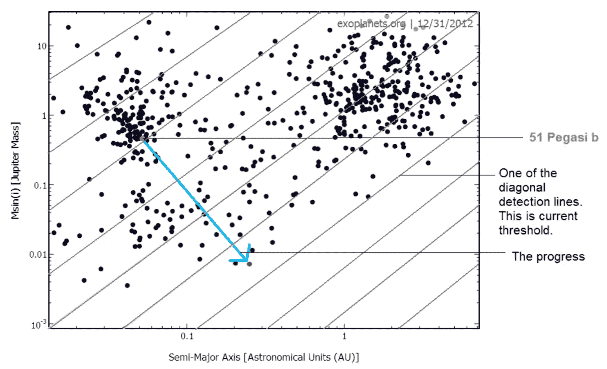*

*The lines in this graph have been manually added to better illustrate the point. They are not accurate.*

## *与轨道周期相关的半长轴:*

*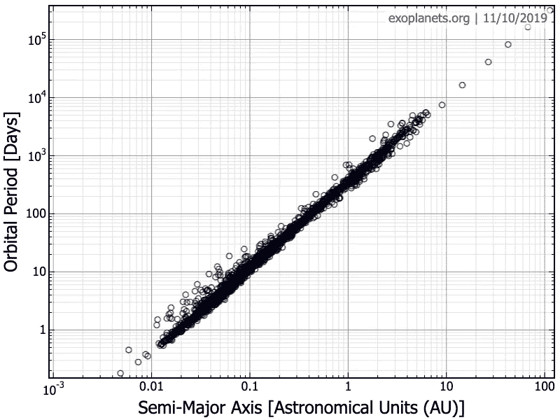*

*Graph 6*

*图表 6 清楚地显示了半长轴和系外行星轨道周期之间的惊人关系。与之前的图表不同，我们可以看到行星绕其轨道运行一周所用的时间与距其恒星的距离之间存在紧密的相关性。我们简单地改变了 Y 轴的参数，我们得到了一个完全不同的视图。这一次，如果我们放入我们自己的行星，它们将会完全适合。*

*这张图表也许是一个特殊的图表，因为它证明了物理学基本定律之一的普遍应用:开普勒行星运动第三定律，早在发现系外行星之前就已经存在。这对寻找系外行星很重要，因为它可以有效地用于计算系外行星与其恒星之间的距离，并确定它是否位于可居住带内。*

*根据该定律，半长轴 *a^3* 的立方与轨道周期 *p^2* 的平方之比是常数，即:*

*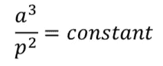*

*然而，在基于从系外行星获得的数值的图表 6 中，我们注意到这条线代表相同的比率。如果在上图的对数刻度中，我们选择 x 轴上的两点(*a1；a2* )和 y 轴上的对应点(*P1；p2* ，则:*

*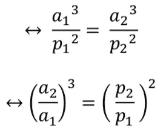*

*如果 *a1* = 0.1、 *a2* = 1，那么 *p1* = 10、 *p2* = 320。因此:*

*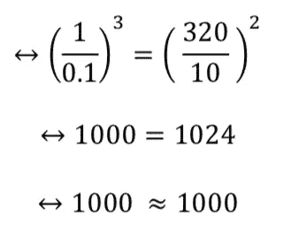*

*这证明了对于线上的任何给定点，即对于任何行星的值，这两个参数的比率是恒定的。这和开普勒第三定律是一致的。开普勒通过观察我们太阳系的行星得出的定律适用于现在正在被发现的太阳系外行星，大约三四百年后。我们可以看到，图 5 和图 6 中直线的斜率是相同的。这证明了重力在行星系统中的作用是一样的。开普勒定律表明，跨越不同系统和不同环境的所有行星都以完全相同的方式服从重力。*

*我们还可以观察到，除了左下角的数据看起来更分散之外，大多数数据的线都是直的。这个区域中的行星与图 3 中左侧星团中的行星相同。我们可以看到在 1 天的轨道周期之上*的行星比之之下要多。这就引出了一个问题，为什么散射只是单侧的。一个可能的解释是，我们目前的科学技术还不够先进，不足以正确测量不到一天的行星轨道。通过检查左下栏中 11 颗行星的数据，我们看到其中 7 颗行星是使用**凌日方法**探测到的，另外 4 颗是通过**径向速度**方法探测到的。**

*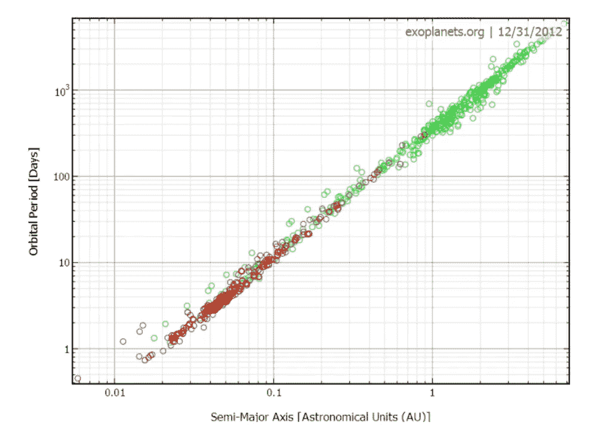*

*Planets detected by Transit Method (Red) and Radial Velocity (Green)*

*另一个问题是为什么散射只出现在半长轴小的区域。为什么右上角没有散点反而？原因是行星离它们的恒星很近。在小距离上，行星受到宿主恒星更强的引力，使它们的轨道更圆。如图 8 所示，蓝色表示轨道偏心率低，意味着轨道更圆。*

*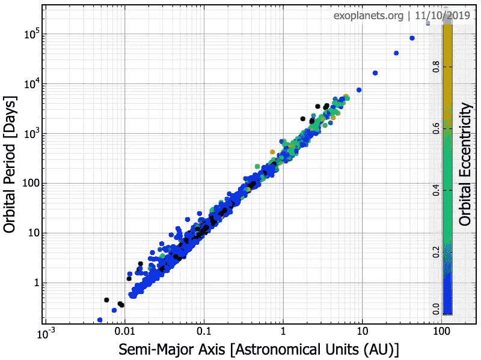*

*它们实际上变得像月亮对地球一样:它们被潮汐锁定并以圆周运动的方式旋转。随着偏心率的增加，轨道变得更加椭圆。在轨道偏心率低的情况下，更难正确地确定半长轴。因此，蓝色点比其他点有更大的误差。因此，我们可以假设这些行星要么由于它们的低偏心率和与恒星的极度接近而不完全符合开普勒定律，要么它们确实符合该定律，但我们在测量轨道周期时犯了微小的错误。*

*总之，我们可以看到，在图表上绘制数据不仅有助于直观地表示所有已发现的系外行星，而且有助于对它们进行分类和区分。通过解释图表，我们可以质疑不同现象的原因，如热木星，并试图通过阐述行星迁移等理论来解释它们。另一方面，我们也可以注意到所有的系外行星在遵守相同的引力和运动定律方面是如何相似的，这使我们得出结论，某些物理规则适用于宇宙中的每一种元素。*

*此外，通过解释这些图表，我们还认识到了目前天文仪器的局限性，并试图对其进行改进，以探测更广泛的系外行星。通过尝试进一步完善技术，我们可以专注于实现在这些图表的未探索区域中找到可居住的类地行星的目标。*

**延伸阅读:**

*   ***第一部分** : [方法和发现](https://medium.com/@eklavyaS/exoplanets-i-methods-and-discoveries-b653eee48cf2)*
*   ***第三部分** : [可居住性和结论](https://medium.com/@eklavyaS/exoplanets-iii-habitability-and-conclusion-5fe70b97f3c7)*
*   *原报道:[https://eklavyafcb.github.io/exoplanets.html](https://eklavyafcb.github.io/exoplanets.html)*

*参考资料:这项研究利用了系外行星轨道数据库
和 www.exoplanets.org[的系外行星数据探测器](http://www.exoplanets.org)*