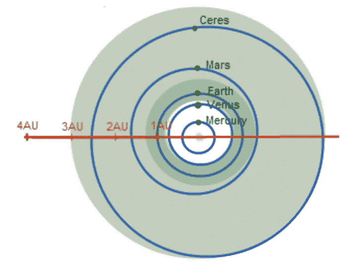

# 系外行星 III:可居住性和结论

> 原文：<https://towardsdatascience.com/exoplanets-iii-habitability-and-conclusion-5fe70b97f3c7?source=collection_archive---------27----------------------->

## [用数据科学了解系外行星](https://towardsdatascience.com/tagged/exoplanets-with-ds)

## 生活在宇宙中

Source: [NASA](http://www.nasa.gov/), [ESA](http://www.spacetelescope.org/), and G. Bacon ([STScI](http://www.stsci.edu/))

这是系外行星系列的第三部分。

*   **第一部分** : [方法和发现](https://medium.com/@eklavyaS/exoplanets-i-methods-and-discoveries-b653eee48cf2)
*   **第二部分** : [数据解释](https://medium.com/@eklavyaS/exoplanets-ii-interpretation-of-data-c9e554c4f3fe)
*   第三部分:可居住性和结论

> 存在两种可能性:要么我们在宇宙中是孤独的，要么我们不是。两者都同样可怕。
> 
> *-亚瑟·C·克拉克*

# 可居住

虽然寻找其他行星的部分动机是为了了解它们的形成和增进对我们自己的太阳系的了解，但最终目标是找到地外生命。现在，我们已经看到并分析了由太空任务收集的实际数据，并将它们与实际的物理定律联系起来，我们到了这出戏的最后一幕:可居住性。到目前为止，我们只谈到了对已确认的系外行星的探测和定位，但我们对它们孕育生命的能力了解不多，即它们的可居住性。

对于一颗孕育任何形式生命的行星来说，它必须满足某些特定的参数，才能适合居住。生命只存在于某些条件下，这些条件对于创造生命生长和进化所必需的可持续环境是必不可少的。目前没有理由相信满足这些条件的行星不会大量存在。虽然到目前为止我们还不能找到这样的行星，但这很可能只是时间问题。

人们应该记住，对一颗行星是否适合支持生命的评估在很大程度上是基于地球的特征，因为它是宇宙中我们确定可居住的唯一一颗行星。因此，我们只能寻找我们所知的生命。很可能生命存在于不同的条件下，但我们只能推测它的存在。这最后一章将涵盖生命(正如我们所知)在系外行星上生存所需的主要因素，如距离、质量和大气。

## 德雷克方程

在我们开始定义生命的不同条件之前，让我们先来看看天文学中的两位著名人物，以及他们对其他地方存在生命的可能性的看法。

卡尔·萨根是美国著名的天文学家，以他对外星生命可能性的研究和思考而闻名。像许多天文学家一样，他认为我们的银河系充满了生命，理论上应该存在大量的地外文明。然而，由于缺乏这种文明的证据，他相信这样一种理论，即一旦它们在技术上足够先进，它们就会自毁。

第一颗太阳系外行星的共同发现者迪迪埃·奎洛兹(Didier Queloz)同意萨根的观点，即宇宙中的其他地方也存在生命，但他强调，生命的出现需要一系列连续的事件，因此“运气”是一个关键因素。因此，这个星系可能不太拥挤。

萨根和奎洛兹都坚信地外生命的存在，这仅仅是因为可能性很小。另一位著名的天体物理学家弗兰克·德雷克提出了一个数学方程，理论上可以估计银河系中可探测到的地外文明的数量。它指出:

Drake’s Equation

其中:

*   *N* 是我们银河系中可以进行通信的文明的数量(通过检测它们的电磁辐射)。
*   *R** 是我们银河系每年恒星形成的平均速率，用[ *颗/年*表示。
*   f_p 是那些有行星系统的恒星的分数。
*   n_e 是每一个太阳系中可能维持生命的行星数量。
*   f_l 是适合生命实际出现的行星的比例。
*   f_i 是有智慧生命出现的行星的一部分。
*   f_c 是开发出一种技术的文明的一部分，这种技术可以向太空释放它们存在的可探测的迹象。
*   *L* 是此类文明向太空释放可探测信号的时间长度，以*年*表示。

德雷克的方程不同于之前任何一个与系外行星探测相关的方程，因为它包含了大量的未知变量。由于目前的这些不确定性，没有明确的“正确”或“错误”答案，而只是一个估计。随着我们对我们在宇宙中的位置了解得越来越多，一些未知慢慢变得越来越清晰，最终结果也越来越准确。

科学家们承认德雷克方程中存在非常大的不确定性，并往往倾向于做出非常粗略的估计来取得进展。以我们目前的知识水平，我们知道方程的前三项更接近于 10 而不是 1，并且所有的因子都比 1 小。然而，仍然是最大的未知数。通过做一些假设，我们可以简化这个方程，得到一个可能更有用的德雷克方程:

这将意味着我们可能接触的文明的数量大约等于它们的寿命，这也是德雷克和他的同事在 1961 年得出的结论。这也意味着，除非很大，否则会很小。如果 SETI 成功探测到外星文明发出的信号，这将意味着平均来说信号一定很大，因为我们不可能通过观察银河系中的一小部分恒星来发现信号。由于探测到的外星信号传播的速度是有限的，当它们到达我们这里时，它会告诉我们它们的过去，因为它们离我们有许多光年远。但是因为外星文明必须足够大，我们才能探测到这样的信号，这可以告诉我们我们自己的未来是否漫长。另一个出现的问题是，即使我们真的发现了生命迹象，我们如何与他们交流，用什么与他们交流？

## 生活的秘诀

当我们从太空看地球时，我们看到几乎 75%的地球被水覆盖，水是所有生物的重要自然资源。植物用水从土壤中的矿物质中获取一些养分。这些矿物质必须溶于水才能被植物吸收。广阔的海洋和其他水体为各种海洋生物提供了庇护所。地球的大气层是由水分子构成的云调节的。当然，为了生存，所有动物都需要定期喝水。地球上的生命是围绕水建立的。

因此，正如我们所知，一颗行星要孕育生命，它必须含有水。与普遍的看法不同，水不是宇宙中的稀有商品。相反，它在宇宙中到处都大量存在。在我们银河系和其他星系的星际云中已经发现了水。人们只要看看水的化学性质就能理解它的平凡。一个水分子由两个氢原子和一个氧原子共价键合而成。

The Atomic Structure of a Water Molecule

氢是整个宇宙中最丰富的元素，在“大爆炸”期间产生。氧是第三丰富的元素，由恒星的核聚变产生。这两者一起形成水。除了天王星和海王星之外，太阳系中的所有行星在其大气层中都有少量的水蒸气，范围从 0.0004%(木星)到 3.4%(水星)。土星的卫星之一，恩克拉多斯，有 91%的水蒸气组成，被认为是太阳系中最有可能居住的地方之一。

然而，对于生命的发展来说，水不是以蒸汽或冰的形式存在，而是以液体的形式存在，这种液体非常罕见，因为它取决于表面温度，而表面温度又取决于大气压力，而大气压力是由行星的表面重力决定的。所有这些要求只能同时在可居住区找到。此外，液体只能存在于表面，这意味着气态行星无法维持水。

Different states of water

本质上，任何行星上孕育生命所需的主要因素似乎都取决于它的质量、大气层以及与母星的距离。这些将在下面详细阐述。

## 1)距离

一颗行星必须有一个坚固的岩石表面，并且与它的恒星保持完美的距离，以保持其表面的液态水。在太远的地方，行星将会太冷而无法维持其表面的液态水，因为表面温度将会降至冰点以下，导致海洋变成冰。太近的话，地球的温度会超过水的沸点，海洋会变成蒸汽。因此，水能够以液体形式存在的完美区域是这两个极端之间的地带，称为可居住区。

The Habitable Zone (green) of our solar system.

这个地区也被称为“金发姑娘区”，源于著名的故事“T2”、“金发姑娘和三只熊”,在这里，金发姑娘选择不冷不热的汤。同样，对于遵循这一原则的行星来说，它既不应该离它的恒星太近，也不应该太远，而是应该在适当的距离。

每个行星系统的宜居带将从离其恒星不同的距离开始，因为它取决于中心恒星的质量。恒星的质量越大，散发的热量就越多，将可居住区域的内部边缘推得越远，如下图所示。

The Habitable Region (blue) depending on the Star’s Mass. **Source**: Astrobiology Magazine

因此，当我们寻找系外行星时，我们会在可居住区内寻找，因为这是找到类地行星的最佳选择。目前还不知道在可居住带发现的几颗行星是类地行星还是气态行星。被确认为类地行星的*不是*位于适居带。此外，仅仅在可居住区找到行星并不能保证存在生命，因为还有其他几个关键因素发挥着重要作用。

## *2)质量*

对于位于可居住区的行星来说，行星的引力必须足够强，才能容纳大气层，大气层可以作为缓冲，有助于保持稳定的表面温度。行星的表面重力可以用下面的公式计算:

其中:

*   g 是引力常数= 6.67 * 10^-11 [ *N* ]
*   m 是行星的质量[ *kg*
*   r 是行星的半径[ *米*

正如我们所见，重力取决于行星的质量和半径。这很关键。例如，如果地球更小，比方说大约有火星那么大，重力就会弱得多，因为质量和半径都会更小，因此它无法阻止水分子飞入太空，导致大气层非常稀薄。这将降低大气缓冲的有效性，允许极端温度的存在，从而防止水的积累。这就是为什么液态水不能在火星上存在，尽管它位于可居住带的边缘。小质量几乎不允许水在极地冰盖以固态存在。这就是为什么为了评估一颗系外行星的可居住性，了解它的质量是至关重要的。

## 3)大气

这也许是判断一个星球维持生命能力的最重要的因素。没有大气的压力，液态水无法生存。让我们以月球为例:它没有大气层，甚至没有像火星那样稀薄的大气层。因此，如果我们在月球上洒一些水，它要么会蒸发成蒸汽，要么会冻结固体，形成冰。因此，为了孕育生命，一颗行星必须有大气层，并且足够厚，足以让行星保持恒定的温度，并对水施加压力，使其保持液态。

然而，大气层的厚度并不是可居住性之谜的唯一重要组成部分。它的实际*成分*也必须正确。让我们以金星为例。金星在物理特征上是最接近地球的行星:同样位于宜居带，表面重力 8.9 [ *m/s^2* ]，是地球重力的 90%，质量是地球的 82%，体积是地球的 86%，密度几乎相同。一个观察我们太阳系的外星天文学家会认为金星是生命存在的好机会。

Size comparison of Venus and Earth, drawn to scale. **Source**: NASA, Wikipedia Commons.

然而，正如我们所知，金星不适合生命居住，因为它太热了。它的大气层是太阳系中密度最大的类地行星，其表面压力是地球的 92 倍。它的大气层几乎完全由二氧化碳和其他温室气体组成，并且完全没有任何分子氧。因此，金星的平均表面温度约为 464 摄氏度，是太阳系中最高的，远远高于水的沸点。与地球不同，它也缺乏磁场，这使得太阳风无法将游离氢(水的基本成分)吹到行星际空间。因此金星的表面非常干燥，并被沙漠覆盖。尽管金星在许多方面与地球相似，但它肯定不适合居住。

因此，寻找与地球质量、距离和大气相同的系外行星仅仅是个开始。与金星一样，这些因素不一定足以让生命发展。我们必须仔细观察构成大气的**，并确定那些至关重要的元素，如氢、氧，还有氮和碳，是否以正确的***的百分比存在。这些为我们所知的生命的基础和发展奠定了 ***基础*** 。实际的生命成分清单要大得多，而且可以无止境地详细列出。正确的行星轨道和自转，正确的地球化学和地质机制都可以将行星的状态从宜居变为不宜居。因素是无限的。*****

**然而，生命出现所需的一系列连续现象依赖于一个无法控制或分类的因素:偶然性。根据我们目前的理解，是偶然使一个小天体与另一个小天体碰撞形成星子，这些星子后来发展成为类地行星。也许正是由于一颗彗星与地球相撞的偶然机会，水被引进了这个星球。事实上，“运气”可能是创造生命本身的另一个必要成分。**

**而我们**不知道的生活呢？如果它需要一种液体而不是水才能出现并繁荣呢？也许是我们是不同的生物，生活在一个不寻常和极端的环境中。或者也许地球只是众多可居住世界中的一种。我们可以无休止地推测，但唯一能确定的方法是走出去探索。****

# ***结论***

***在这篇论文中，我提出了一个关于系外行星的广泛文献综述的精华，并解释了将它们与基本物理定律联系起来的探测方法。我使用了公开可用的系外行星研究数据，并在一位天文学专家的指导下，使用相关参数的组合生成了一系列图表。我研究了这些图表，并将它们与基本的物理定律联系起来，比如开普勒的行星运动第三定律和牛顿的万有引力定律。以图表为基础，我采访了著名的天体物理学家 Didier Queloz 教授，以进一步了解当前的发现和对热点木星反复出现的发现等问题的科学思考。最后，我确定并解释了影响生命出现的一些因素，包括偶然性等非理性因素。基于这一回顾和分析，我能够解释*为什么*我们寻找系外行星，以及这一探索实际上有多么有意义。***

**自从 1995 年发现第一颗系外行星以来，我们已经走过了漫长的道路。这个领域已经发展成为一个巨大的科学领域，超越了纯粹的物理学，并慢慢深入到天体生物学和化学领域。我们已经看到，系外行星的发现率一直在稳步上升，在我们的银河系中，行星似乎在它们的恒星周围很常见。一些已经在可居住区被探测到，但是不幸的是它们看起来不像是地球上的。事实上，发现的行星系统并不像我们的太阳系，因为它们中的许多都含有热木星和超级地球，这两者在我们的系统中都不存在。这可能是由于我们有限的探测方法的选择效应，或者可能是宇宙的方式。**

**通过对系外行星的探测，我们已经了解了地球本身的性质以及它自近 40 亿年以来所维持的不同生命形式。我们对我们在浩瀚宇宙中的独特位置有了批判性的认识，并且有实际的科学证据证明，我们似乎处于一张图中的一个孤立的角落，不同于我们所有其他的宇宙邻居。通过寻找*和*，我们不仅扩展了我们的物理和概念边界，而且理解了在地球上*这里*所发生的独特性。在这个过程中，一个人更好地将*的价值观根植于我们自己的生活中。我们确实是幸运的活着，并且像许多信仰自古以来宣称的那样是特别的。自早期哲学家开始思考以来，没有任何其他科学领域给了我们如此多的实质内容来回答这些问题。这就是我们继续寻找系外行星的原因。***

**尽管我们还没有发现其他生命，但我们正在积极地向自己提问，并通过开展新的科学项目来寻找答案，这一事实表明我们正在不断地努力扩展我们的知识。亚瑟·C·克拉克曾经说过，我们在宇宙中要么孤独，要么不孤独，这两种可能性都同样可怕。我想说两者都同样令人敬畏。因为即使我们*是单独的*，我们思考、思考、梦想和问这些问题的事实实际上可能是宇宙中最重要和最有用的元素之一。这表明我们对知识和理解的追求永远不会变得乏味。事实上，我们知道的越多，我们的宇宙似乎就越不可思议，更多的问题似乎就要浮出水面。**

**正是这些没有答案的问题驱使我们的好奇心去推动当前科学思想和努力的前沿。因此，通过提出更多的问题，也许是自然本身推动人类不断努力寻找答案。如果外星生物*真的*存在于这个看似空虚的海洋中的某个地方，我衷心希望我们分享对知识的渴望，因为这是将我们聚集在一起的唯一力量。与此同时，我们只能尝试短暂地捕捉大自然的美，因为它在宇宙的尺度上顺其自然。**

***延伸阅读:***

*   ****第一部分** : [方法和发现](https://medium.com/@eklavyaS/exoplanets-i-methods-and-discoveries-b653eee48cf2)**
*   ****第二部分** : [数据解释](https://medium.com/@eklavyaS/exoplanets-ii-interpretation-of-data-c9e554c4f3fe)**
*   **原报道:[https://eklavyafcb.github.io/exoplanets.html](https://eklavyafcb.github.io/exoplanets.html)**

**参考资料:**

*   **美国宇航局[、](http://www.nasa.gov/)[欧空局](http://www.spacetelescope.org/)和 g .培根 [STScI](http://www.stsci.edu/)**
*   **天体生物学杂志**
*   **美国国家航空航天局**
*   **维基共享**