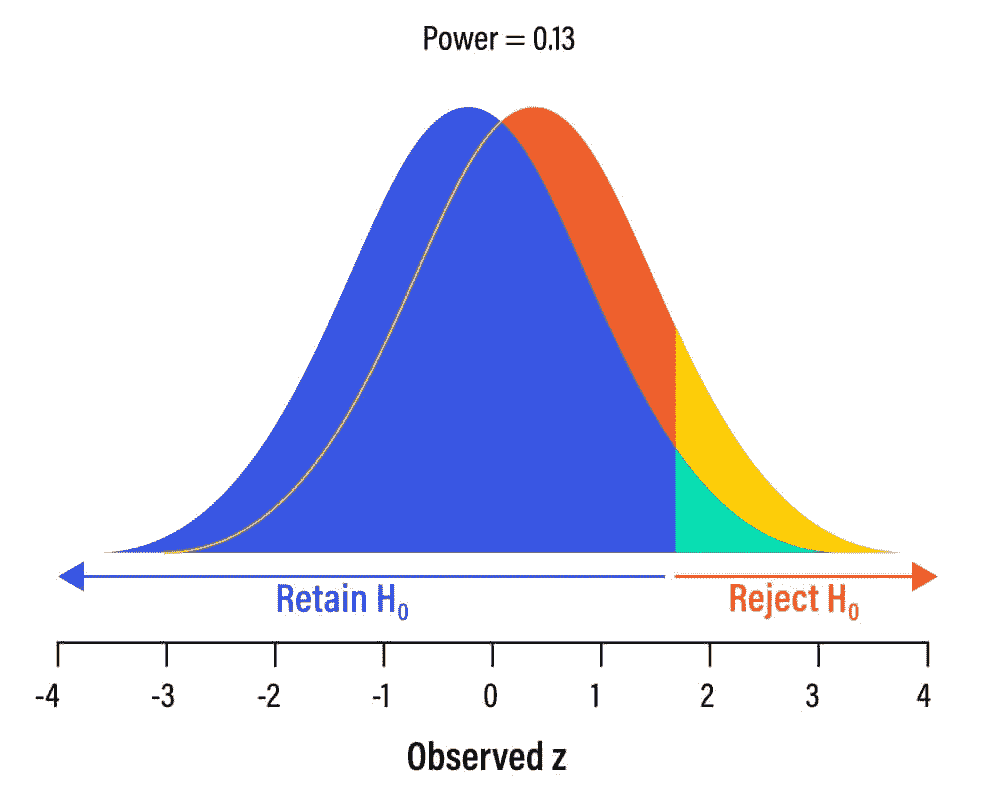
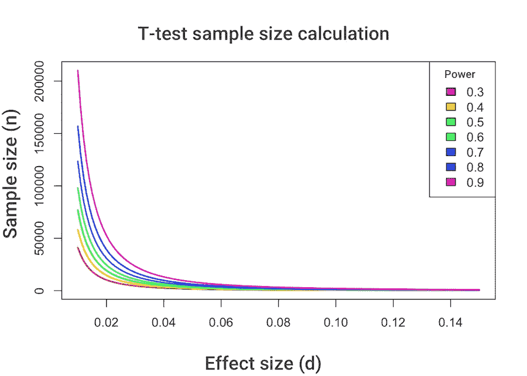

# 利用功效分析计算实验样本量

> 原文：<https://towardsdatascience.com/experiment-sample-size-calculation-using-power-analysis-81cb1bc5f74b?source=collection_archive---------9----------------------->


如果你用实验来评估一个产品的特性，我希望你这样做，那么得到有统计学意义的结果所需的最小样本量的问题经常被提出来。在本文中，我们解释了如何应用数理统计和功效分析来计算 AB 测试样本量。

在启动实验之前，计算 ROI 和估计获得统计显著性所需的时间是至关重要的。AB 测试不可能永远持续下去。然而，如果我们没有收集足够的数据，我们的实验得到的统计能力很小，这不允许我们确定获胜者并做出正确的决定。

# 什么是统计能力



先说术语。[统计功效](https://en.wikipedia.org/wiki/Power_(statistics))是在替代假设 H1 为真的情况下，一个或另一个统计标准能够正确拒绝零假设 H0 的概率。统计测试的能力越高，你犯第二类[错误](https://en.wikipedia.org/wiki/Type_I_and_type_II_errors)的可能性就越小。

第二类错误与以下因素密切相关

1.  样本之间的差异幅度—影响大小
2.  观察次数
3.  数据的传播

功效分析允许您确定具有特定置信水平的样本量，该置信水平是识别效应大小所必需的。此外，这种分析可以估计在给定样本量下检测差异的概率。

> *对于“足够”大的样本，即使很小的差异也具有统计学意义，反之亦然，对于小样本，即使很大的差异也难以识别。*

最重要的是观察次数:样本量越大，统计功效越高。对于“足够”大的样本，即使很小的差异也具有统计学意义，反之亦然，对于小样本，即使很大的差异也难以识别。通过了解这些模式，我们可以预先确定获得有统计学意义的结果所需的最小样本量。在实践中，通常，等于或大于 80%的检验功效被认为是可接受的(相当于 20%的β风险)。这一水平是α风险和β风险水平之间所谓的“一比四权衡”关系的结果:如果我们接受显著性水平α = 0.05，那么β = 0.05 × 4 = 0.20，标准的功效为 P = 1–0.20 = 0.80。

现在我们来看看效果尺寸。计算所需样本有两种方法

1.  使用置信水平、效应大小和功效水平进行计算
2.  应用顺序分析，允许在实验过程中计算所需的样本量

# 让我们研究第一种情况，对两个独立的样本使用 t 检验


让我们假设我们测试了一个旨在提高“商品到愿望清单”转化率的假设。Delta，涵盖了六个月回报率> = 5%的实验成本。这种> = 5%的收益导致了额外的利润，这涵盖了实验中投入的所有资源。除此之外，你要有 90%的把握你会发现差异，如果它们存在的话，还有 95%的把握——你不接受随机波动的差异。

# d — delta，siglevel —置信水平，power —功率水平

```
pwr.t.test(d=.05, sig.level=.05, power=.9, alternative="two.sided") ## Two-sample t test power calculation 
## 
## n = 8406.896 
## d = 0.05 
## sig.level = 0.05 
## power = 0.9 
## alternative = two.sided 
## 
## NOTE: n is number in *each* group
```

让我们看看另一个案例，利益相关者希望在几周内得到结果。在这种情况下，我们有一个大约 4000 名访问者的样本量，delta >=5%。我们想知道在上述情况下获得统计显著结果的概率。

# 添加 n，移除电源

```
pwr.t.test(d=.05, n=2000, sig.level=.05, alternative="two.sided") ## Two-sample t test power calculation 
## 
## n = 2000 
## d = 0.05 
## sig.level = 0.05 
## power = 0.3524674 
## alternative = two.sided 
## 
## NOTE: n is number in *each* group
```

确定差异的概率(如果有的话)是 35%，这不算太低，而错过期望效果的概率是 65%，这太高了。

让我们看看下面的图表。它清楚地表明，效应越大，获得显著结果所需的样本越少。



在计划实验时，计算所需的数据量至关重要，因为任何实验都需要资金和时间成本。因此，为了估计实验的潜在 ROI，提前计划所有未知变量是很重要的。

*最初发表于*[*【awsmd.com】*](https://awsmd.com/calculate-sample-size-statistical-power.html)*。*