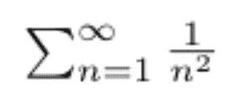
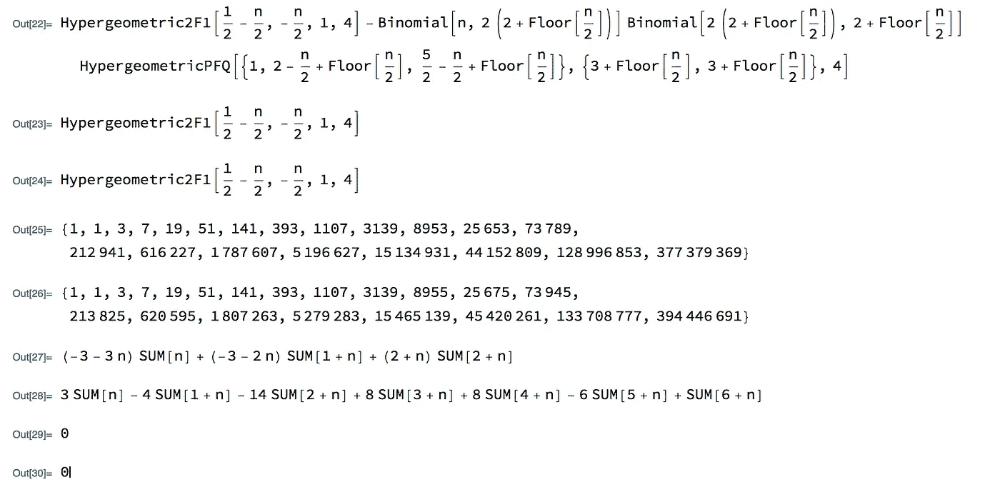
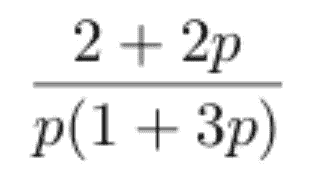
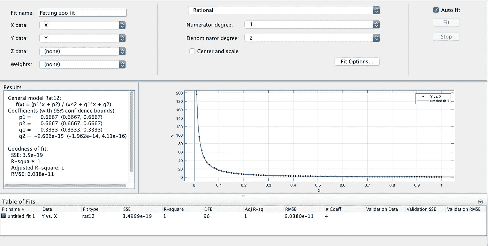

# 数据科学时代的实验数学

> 原文：<https://towardsdatascience.com/experimental-math-in-the-age-of-data-science-d6ae666c7017?source=collection_archive---------22----------------------->

## 两个关于我们如何使用猜测和统计工作来做真正的数学的故事

在我们高中的第一堂数学课后，我们的新老师给了我们一页纸，上面有 7 个涉及多项式的问题。虽然我不记得任何具体的问题，但我记得接下来几天课堂上的恐慌程度。全班都很震惊，因为以前我们最多只遇到过二次方程……现在他要我们解决涉及这些神秘生物的问题，这些生物可以达到他们想要的 n，谁知道他们是否有解析解？([伽罗瓦知道](https://en.wikipedia.org/wiki/Galois_theory)。他们大多不会)

他教我们的下一件事是生成函数和递归。他向我们展示了斐波那契数列的[一般公式，以及欧拉如何得出他著名的](https://en.wikipedia.org/wiki/Fibonacci_number#Closed-form_expression)[巴塞尔问题](https://en.wikipedia.org/wiki/Basel_problem)的求和。

然后，我取得了我的第一个数学学位。令我惊讶的是，我再也没有遇到过这些东西。回到高中，我确信这就是数学的全部，但现在作为一个更成熟、更有教养的学者，我知道这些是古老的数学和儿童游戏。

想象一下，当我攻读硕士学位，处理与博弈论相关的问题时，我的第二个惊喜是，多项式和递归这些精确的主题以最自然的方式出现了..！

抛开我感人的个人故事，我希望在这篇文章中给出一些实验在数学中的重要地位，以及如何“像数据科学家一样做数学”。当然，将数学视为实验被认为是完全的异端——这是[归纳谬误](https://en.wikipedia.org/wiki/Problem_of_induction)，对吗？但实际上，猜测的艺术在数学中有很多位置，如果你能在以后用一个完整的论证来包装你的猜测，那么你就能得到严格有效的结果。

让我们从一些必备软件开始。有很多符号数学软件——CoQ、sage、maple 等等。在这个世界里，你不能像在软件开发创业世界里那样吹毛求疵——对于软件的任何特定用途，如果它不是完全标准的，很可能只有一种实现——所以无论是在 Maple、Matlab 还是在某人为微波芯片汇编开发的专有框架中，你都必须学会使用它。无论如何，为了阅读这篇文章，我建议你安装 python，Mathematica 和 Matlab。如果您不知道，您仍然可以跟踪简单的代码解释和结果。

# 10 行 Mathematica 中的一篇欧拉文章

在奥地利林茨的 RISC 研究所，他们为 Mathematica 开发了令人惊叹的 RISCErgosum 包。这个包基本可以证明你能想到的任何身份。让我们看看它如何证明 250 年前的欧拉论文——正如这篇[精彩文章摘要](http://eulerarchive.maa.org/hedi/HEDI-2005-08.pdf)中所描述的。

在这篇文章中，欧拉用求中心三项式系数满足的递推公式的方法，导出了中心三项式系数的一般公式。他用了整整一章来讲述他的一次失败的尝试，其中一个基于斐波那契数列的简单递归似乎成立，但通过计算该数列的足够多的项，欧拉最终设法发现这个递归一般不成立，并找到了正确的表达式。我们可以用下面简单的 10 行代码继续他在 Mathematica 方面的努力:

*   首先我们定义欧拉试图确定的级数，作为 myf 的通称。
*   我们还将其拆分为奇数和偶数索引系列(myfodd，myfeven)，这样就可以避免使用 Floor[]。这将使 Mathematica 更容易证明我们提取的递归实际上一般成立。
*   我们将它的前 20 个值导出为 fres。
*   然后我们定义欧拉怀疑能够表达原始序列的序列，并将其前 20 个值导出为 GRE。
*   Guess 成功地分别为 frec 和 grec 两个系列找到了一个递归。但是它们是不同的。
*   现在，我们将原始级数的符号项输入到递归中，FullSimplify 象征性地为我们验证了它确实在一般情况下成立，产生了应用于项的递归关系，它们的总和等于零。
*   瞧啊。我们完了。

下面是代码和结果:

我只欺骗了一点点——full simplify 并不总是值得信任的，实际上可能会出错。但是考虑到这种循环，无论是通过计算机代数还是手工，都有可能验证它确实普遍成立。“困难的部分”是猜测。

# 通过简单模拟得到随机过程练习解

让我们来看另一个在更新过程中解决问题的实验方法的例子。想象一下下面这个由无聊少年管理的宠物动物园。

孩子们轮流去宠物动物园。每当一群孩子进来，id 间隔 T1，T2，T3，…分布为 Geo(p)，因为青少年有时做他的工作，但有时也懈怠了越来越长的时间。但是因为他知道他要偷懒，他输入了许多孩子 Nk，所以 Nk-s 是独立的，但是给定 Tk+1 = n 的 Nk 的条件分布是 Uni{1，…，n+2}。所以即使他在偷懒，还是会有更多的孩子进去，所以应该没问题。问题是，从长远来看，孩子们在宠物动物园的平均时间是多少？

解析地解决它并不太难——你定义一个匹配的奖励更新过程，通过奖励更新定理和一些总结，你最终会得出公式

p 是几何分布参数。但这需要一些随机过程分析和基本概率方面的知识。即使你对自己的分析能力很有把握，也可以和模拟进行比较。因此，即使不了解太多，您也可以编写以下代码:

*   你做了一百万次实验
*   当你模仿问题的描述时，你会有下一组孩子在某个随机的几何时间间隔内到来，相应地，他们的数量是一致随机的。你把孩子们在网站上花的时间加起来，最后除以访问网站的孩子总数。然后，您将它视为对我们结果的模拟估计。

以下是实现此过程的简单 python 代码:

我们对不同的 p 值运行这个代码，然后我们有一个解的 p 中的函数的估计。但是这怎么能给我们一个公式呢？嗯，即使不做精确的计算，你也可以很确定我们要找的公式是一个有理函数。这是因为它将是涉及均匀分布和几何分布的期望之间的某个比率，这可能是 p 中的低阶多项式。然后我们可以使用任何工具来拟合我们获得的模拟数据的有理函数，我使用了 Matlab 的 cftool

在解释器中键入:

X = 1:100

X = X/100

Y = python_simulation_results

cftool(X，Y)

你可以看到它非常合身。在现实生活中，我没有使用 cftool，而是因为我在分析计算中不断出现算术错误，所以我使用模拟通过猜测一些值来确定确切的表达式。如果我在最初的几次猜测中遇到困难，我会求助于某种有理函数拟合程序。

# 多少次实验就够了？

现在，也许关于进行实验最重要的问题是什么时候停止。试几次就够了？

对于一些有度数或维数概念的代数实体，我们知道答案。n 次多项式由 n+1 个点决定。因此，对多项式的 n+1 个点进行采样就足以唯一地确定其完整形式。类似的事情适用于 n 阶递归——如果我们知道递归适用于我们的级数，并且我们有 n 个点，其中我们的级数表达式与递归的解一致，那么假设递归表达式没有太坏的事情发生，我们可以归纳并获得真正的一致。

至于更新过程和一般的马尔可夫链，模拟可以产生非常精确的数字，有时比分析计算要少得多，并且保证如下:

[马尔可夫链的收敛速度](https://galton.uchicago.edu/~lalley/Courses/313/ConvergenceRates.pdf)

我将从那里引用一个很酷的结果:

当你想得到一副均匀分布的牌时，最安全的方法是先随机拿一张牌，然后再从剩下的牌中随机拿一张，以此类推。但是这需要你在第一步从 52 张牌中做出选择，第二步从 51 张中做出选择…你最终需要从可能的 52 张牌中选择一副牌！。

但是，现实生活中也会发生这样的事情，你拿着一副不是随机的牌，你相信经过几次洗牌后，它会和随机的一样好。很明显，如果你只移动一两张牌，不会有什么不同。而且很明显，如果你一直这样做，那么这副牌将会被随机化。什么时候停止比较合适？阅读概述，你会看到，大约 NlogN ~ 400 单卡更换应该做到这一点。[这里](http://math.uchicago.edu/~may/REU2013/REUPapers/Liang.pdf)他们想出了 277 这个数字。当然，如果你做步枪走步，它会花更少的时间，因为在每一次“走步”中，你会有更多的单步发生。

如果这篇文章让你对计算机代数、实验数学或随机模拟产生了一点兴趣，我强烈推荐这些作为进一步的阅读材料:

[A=B](https://www.math.upenn.edu/~wilf/AeqB.html) ，一本关于使用递归关系证明恒等式的艺术和科学的巨著

《A=B》一书的作者多伦·泽尔伯格的实验数学宣言

一本关于随机模拟的伟大而实用的书

