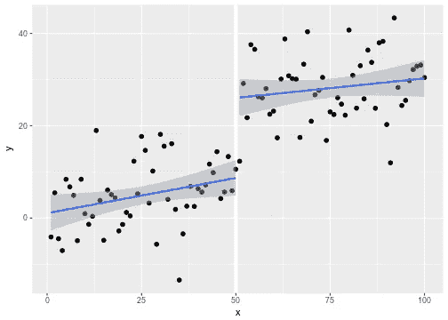
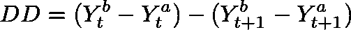
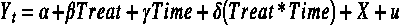
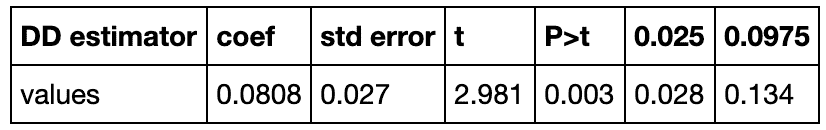

# 数据科学实验

> 原文：<https://towardsdatascience.com/experimentation-in-data-science-90521e74ee4c?source=collection_archive---------7----------------------->

## 当 AB 测试没有切断它

今天，我要谈谈数据科学中的实验，为什么它如此重要，以及当 AB 测试不合适时，我们可能考虑使用的一些不同的技术。实验旨在确定变量之间的因果关系，这在许多领域都是一个非常重要的概念，对于今天的数据科学家来说尤其重要。假设我们是在产品团队中工作的数据科学家。很有可能，我们的很大一部分职责将是确定新特性是否会对我们关心的指标产生积极影响。也就是说，如果我们引入一个新的特性，使用户更容易向他们的朋友推荐我们的应用，这是否会提高用户增长？这些是产品团队感兴趣的问题类型，实验可以帮助提供答案。然而，因果关系很少是容易识别的，在许多情况下，我们需要稍微深入思考我们的实验设计，这样我们就不会做出不正确的推断。在这种情况下，我们可以使用经常使用的技术取自计量经济学和我将讨论其中一些下面。希望到最后，您将更好地了解这些技术何时应用以及如何有效地使用它们。

# AB 测试

大多数读过这篇文章的人可能听说过 AB 测试，因为这是一种极其常见的工业实验方法，用来了解我们对产品所做的更改所产生的影响。这可能很简单，只需更改网页布局或按钮颜色，然后衡量这一更改对点击率等关键指标的影响。在这里，我不会过多地介绍细节，因为我想重点介绍一些替代技术，但是对于那些有兴趣进一步了解 AB 测试的人来说，下面关于 [Udacity](https://eu.udacity.com/course/ab-testing--ud257) 的课程提供了一个非常好的概述。一般来说，我们可以采用两种不同的方法来进行 AB 测试。我们可以使用频繁方法和贝叶斯方法，这两种方法各有利弊。

## 频率论者

我会说 frequentist AB 测试是迄今为止最常见的 AB 测试类型，直接遵循 frequentist 统计学的原则。这里的目标是通过观察我们在 A 组和 B 组中的度量之间的差异是否在某种显著性水平上具有统计学显著性来测量我们治疗的因果效应，通常选择 5%或 1%。更具体地说，我们需要定义一个零假设和替代假设，并确定我们是否能够拒绝零假设。根据我们选择的指标类型，我们可能会使用不同的统计测试，但在实践中通常会使用**卡方检验和 t 检验**。然而，频率主义方法有一些限制，我认为与贝叶斯方法相比，它更难解释和说明，但可能因为贝叶斯设置中的基础数学更复杂，所以它不常用。frequentist 方法的一个关键点是，我们计算的参数或度量是一个常数。因此，没有与之相关的概率分布。

## 贝叶斯定理的

贝叶斯方法的关键区别在于，我们的指标是一个随机变量，因此有一个概率分布。这是非常有用的，因为我们现在可以结合我们的估计的不确定性，并作出概率陈述，这对于人们来说往往比频率主义者的解释更直观。使用贝叶斯方法的另一个优点是，与 AB 测试相比，我们可以更快地找到解决方案，因为我们不一定需要为每个变量分配相同数量的数据。这意味着贝叶斯方法可以使用更少的资源更快地收敛到一个解决方案。选择哪种方法显然取决于个人情况，这在很大程度上取决于数据科学家。无论你选择哪种方法，它们都是识别因果关系的强有力的方法。

# 当 AB 测试不奏效时

然而，在许多情况下，抗体检测并不适合用来鉴定因果关系。例如，为了使 AB 测试有效，我们必须将**随机选择**到 A 组和 B 组。这并不总是可能的，因为一些干预措施可能因特定原因针对个人，使他们与其他使用者有根本的不同。换句话说，进入每个组的**选择是非随机的**。稍后，我将讨论并提供我最近遇到的一个具体例子的代码。

AB 测试可能无效的另一个原因是当我们有*混淆时。在这种情况下，查看变量之间的相关性可能会产生误导。我们想知道 X 是否导致 Y，但也可能是其他变量 Z 驱动了两者。这使得不可能理清 X 对 Y 的影响，从而很难推断出任何因果关系。这也经常被称为 ***省略变量偏差*** ，会导致我们高估或者低估 X 对 Y **的真实影响。**除此之外，从商业角度来看，设计随机实验可能不可行，因为如果我们给一些用户提供新功能，而不给其他用户提供这些功能，可能会花费太多资金，或者被视为不公平。在这种情况下，我们必须依靠准随机实验。*

*好了，我们已经讨论了我们可能无法应用 AB 测试的一些原因，但是我们能做些什么来代替呢？这就是 ***计量经济学*** 的用武之地。与机器学习相比，计量经济学更关注因果关系，因此，经济学家/社会科学家开发了一系列统计技术，旨在了解一个变量对另一个变量的因果影响。下面我将展示一些技术，数据科学家可以也应该从计量经济学中借鉴这些技术，以避免从实验中得出错误的推论，而这些实验会受到上述问题的困扰。*

## *工具变量*

*假设我们是一家拥有类似 medium 的应用程序的公司，用户可以订阅主题以获取与这些主题相关的内容更新。 ***现在想象你的产品负责人带着一个假设来找你:订阅更多的话题会让用户更投入，因为他们会获得更多相关和有趣的新内容来阅读*** 。嗯，这听起来像是一个合理的假设，我们可能认为这很可能是真的，但我们如何用实验来测量呢？*

*您可能考虑做的第一件事是通过将用户随机分成两组来进行传统的 AB 测试。然而，这将是非常困难的，因为用户已经有不同数量的主题订阅，我们不能真正随机地给用户分配主题订阅。主要的问题是，由于一些不为人知的原因，订阅更多主题的用户可能会比其他用户更投入。这本质上是 ***内生性*** ，因为有一些看不见的因素在推动这些用户的参与度。*

*幸运的是，经济学有答案。我们可以使用被称为 ***的工具变量*** 来帮助我们解决这个内生性问题。如果我们可以找到一个变量(工具)与我们的内生变量(订阅数量)相关，但与我们的因变量(参与度)无关，我们可以用它来清除看不见的因素的影响，并获得订阅数量对参与度的影响的无偏因果估计。但是我们能用什么作为工具呢？这通常是经济学中最大的问题，因为在许多情况下很难找到工具。然而，在我们的案例中，如果我们在一家进行大量 AB 测试的公司，我们可以利用这一点。要获得有效的工具，我们需要两个假设:*

1.  ****强第一阶段****
2.  ****排除限制****

*假设过去我们运行了一个 AB 测试，将用户随机分成两组，并在主页上向 B 组显示订阅主题的提示。让我们假设这个 AB 测试也显示了积极的影响，接受治疗的用户最终比控制组订阅了更多的主题。我们可以用这个实验作为工具，来帮助我们识别参与度问题中的因果关系。为什么会这样？嗯，*第* ***个假设*** *已经得到满足，因为 AB 测试对订阅数量产生了统计上显著的正面影响*。 ***第二个假设*** 也得到满足，因为*分配是随机的，因此被处理与敬业度无关，仅通过增加订阅数量来影响敬业度。**

*现在，为了实际实现这一点，我们可以使用所谓的**两阶段最小二乘法**。好消息是这很容易做到，只需要估计两个回归。顾名思义，有两个阶段，在第一阶段，我们将回归处理变量(虚拟变量，识别用户是否在 AB 测试的处理或控制组中)的订阅数量。这将为我们提供治疗组和对照组的预测订阅数。在第二阶段，我们回归第一阶段的预测值。这将为我们提供订阅数量对参与度的因果影响的无偏估计。*

****概要:****

1.  ****对订阅数进行回归处理:得到预测值****
2.  ****回归约定的预测值。****

*您可以使用 statsmodels 库在 Python 中实现这一点，它看起来类似于下面的代码。*

```
***import** **statsmodels.formula.api** **as** **smf****reg1 = smf.ols(formula = "number_of_subscriptions ~ treated", data = data).fit()
pred = reg1.predict()****reg2 = smf.ols(forumla = "engagement ~ pred", data = data)***
```

## *回归不连续设计(RDD)*

*RDD 是另一种可以从经济学中获得的技术，当我们有一个连续的自然分界点时，它特别适合。那些刚好低于临界值的人得不到治疗，而那些刚好高于临界值的人得到了治疗。这个想法是，这两组人非常相似，所以他们之间唯一的系统性差异是他们是否接受过治疗。因为这些组被认为非常相似，这些分配基本上近似于随机选择。特别是，两组间 Y 变量的任何差异都归因于治疗。*

*使用 RDD 的经典例子有望使这个观点更加清晰，那就是杰出的学术成就获得社会认可(奖状)会有什么影响？与那些没有得到这种社会认可的人相比，它会带来更好的结果吗？我们可以将 RDD 应用到这个例子中的原因是，奖状只颁发给那些在测试中得分超过某个阈值的个人。使用这种方法，我们现在可以在阈值比较两组之间的平均结果，看看是否有统计学上的显著影响。*

*这可能有助于想象 RDD。下图显示了低于和高于阈值的平均结果。实际上，我们所做的只是测量截止点旁边两条蓝线之间的差异。在经济学中使用 RDD 的例子还有很多，这里的一些例子有望让你了解不同的用例。对于那些想了解这些话题更多背景知识的人，你可以查看以下免费的[课程](https://campus.datacamp.com/courses/causal-inference-with-r-instrumental-variables-rdd/introduction-to-instrumental-variables?ex=1)。*

**

*[Source](https://jrnold.github.io/intro-methods-notes/regression-discontinuity.html): Example: RDD cutoff: Threshold at 50 on the x-axis*

## *差异中的差异(差异中的差异)*

*我将在 Diff 中更详细地介绍 Diff，因为我最近在一个项目中使用了这种技术。这个问题是许多数据科学家在日常工作中可能会遇到的，并且与防止流失有关。对于公司来说，尝试识别可能流失的客户，然后设计干预措施来防止它是非常常见的。现在，识别客户流失是机器学习的一个问题，我不会在这里深入探讨。我们关心的是，我们能否找到一种方法来衡量我们的流失干预措施的有效性。能够凭经验衡量我们决策的有效性是非常重要的，因为我们希望量化我们特征的效果(通常以货币形式)，这是为企业做出明智决策的重要部分。其中一种干预措施是给那些有被大量购买风险的人发一封电子邮件，提醒他们注意自己的账户，实际上是试图让他们更多地参与我们的产品。这是我们将在这里研究的问题的基础。*

*好的，我们想知道这封电子邮件活动是否有效，我们该怎么做呢？嗯，我们需要做的第一件事是想出一些我们想要衡量的指标，我们预计会受到活动的影响。从逻辑上考虑，如果我们阻止用户搅动，那么他们将继续使用我们的产品，并为公司创造收入。这似乎有道理，所以让我们使用**平均收入作为我们的衡量标准**。您选择的指标在很大程度上取决于问题，如果我们不希望我们的指标以相对直接的方式影响收入，那么它可能不是本实验的最佳选择。总而言之，我们的假设是 ***将这封邮件发送给有客户流失风险的人会阻止他们流失，从而提高这些客户*** 的平均收入。如果这个假设是真的，我们可以预计治疗组的平均收入将高于对照组(那些没有收到电子邮件的人)的平均收入。*

*现在你可能认为这听起来像一个常规的老 AB 测试，但是这种方法有一个主要问题。A 组和 B 组根本不同，因为进入这两个组的选择不是随机的。根据我们的机器学习模型的结果，B 组中的用户更有可能流失，而 A 组中的用户不太可能流失。在这种情况下，我们不会比较苹果，这将导致我们的结果有偏差。专业术语称之为**选择偏差。***

*然而，我们可以用 Diff 中的 Diff 来处理这个问题。本质上，它比较了治疗发生前后对照组和治疗组中度量的差异。这样做允许我们控制组间预先存在的差异，减少选择偏差。在方程形式中，它看起来与下面类似:其中 a 是对照组，b 是治疗组，t 表示干预前的时间段，t+1 是干预后的时间段。*

**

*Figure 1: diff in diff estimator*

*这种方法的好处是它很容易估计，我们可以使用回归框架来完成。这还提供了额外的好处，即能够控制其他特征，如用户的年龄和位置，从而减少遗漏可变偏差的可能性。使用这种方法时需要注意的一点是，要使该技术有效，必须满足某些假设。其中最重要的可能是**平行趋势假设**。简而言之，它表明如果没有干预，那么治疗组和对照组之间的差异将随着时间的推移而保持不变。这在实践中很难测试，通常最好的方法是直观地观察一段时间内的趋势。*

*接下来，我将通过一个使用 python 的 Diff 中的 Diff 的快速示例来演示如何在实践中评估这种类型的模型。*注意:不幸的是，因为我使用的数据是敏感的，我不能深入数据集，但是* [*这里的*](https://www.kaggle.com/c/kkbox-churn-prediction-challenge/data) *是一个类似的数据集，包含客户人口统计信息和交易信息。**

## *差异案例研究中的差异*

*继续上面的解释，我们现在将在 Python 中实现 Diff 中的 Diff，向您展示在实践中估计它是多么简单。在下面的代码中，我假设我们有两个主要的数据源，一个是记录每个用户交易的交易表，另一个是包含客户信息(如年龄和位置等)的用户表。我们的目标是估计以下形式的方程:*

**

*Figure 2: Diff in Diff regression equation*

*   *y 是我们的平均收入指标*
*   *如果用户属于治疗组，Treat = 1，否则为 0*
*   *如果是后处理，时间= 1，如果是预处理，时间= 0*
*   ***𝛿** 是上图 1 中的差分估计量(DD)*
*   *x 是我们控制变量的矩阵*

*根据上面的等式，我们首先需要定义治疗和时间虚拟变量，这将有助于我们将用户分为对照组和治疗组，以及治疗前和治疗后。然后，我们可以通过将这两个特征相乘来定义 DD 相互作用项。最终结果是一个数据帧，包含我们的用户特征(X)、两个虚拟变量和我们最感兴趣的交互项。现在，我们要做的就是在我们的平均收入指标上回归这些变量，看看 **𝛿** 在我们选择的显著性水平(5%)上是否具有统计显著性。statsmodels 库使得回归的实现非常简单。为简洁起见，我省略了任何数据清理和特征工程，但这是该过程的重要部分，是您应该作为正常工作流程的一部分来做的事情。*

```
***import** **statsmodels.formula.api** **as** **smf****reg1 = smf.ols(formula='revenue ~ treated + time_dummy + DD + X', data = data)
res = reg1.fit()***
```

**

*Figure 3: Diff in Diff Results*

*我们可以从图 3 的结果中看到，我们的 DD 估计值在 5%的水平上是显著的和正的，表明我们的治疗产生了积极的影响。更具体地说，这个 p 值意味着，假设零假设(干预没有效果)为真，我们观察到如此大的影响的概率非常小。因此，我们可以拒绝零假设，并得出结论，我们的电子邮件活动已经成功地减少了客户流失，因此，我们为该群体带来了更高的平均收入，因为他们继续使用我们的产品。*

*好了，伙计们，这个帖子到此为止。希望这突出了在数据科学中进行实验的相关性，以及当我们面临内生性和样本选择偏差等问题时，计量经济学技术如何在确定因果关系方面特别有用。下面是一些有用的链接，可以帮助任何想更深入了解这些概念的人。*

****参考资料及有用资源:****

*   *[https://github . com/Nate matias/research _ in _ python/blob/master/Regression _ discontinuity/Regression % 20 discontinuity % 20 analysis . ipynb](https://github.com/natematias/research_in_python/blob/master/regression_discontinuity/Regression%20Discontinuity%20Analysis.ipynb)*
*   *[http://pub docs . world bank . org/en/555311525379751882/TT 6 regressiondiscontinuity ferre . pdf](http://pubdocs.worldbank.org/en/555311525379751882/TT6RegressionDiscontinuityFerre.pdf)*