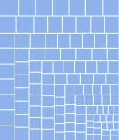
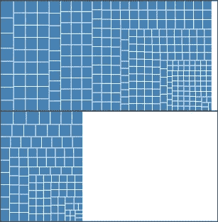
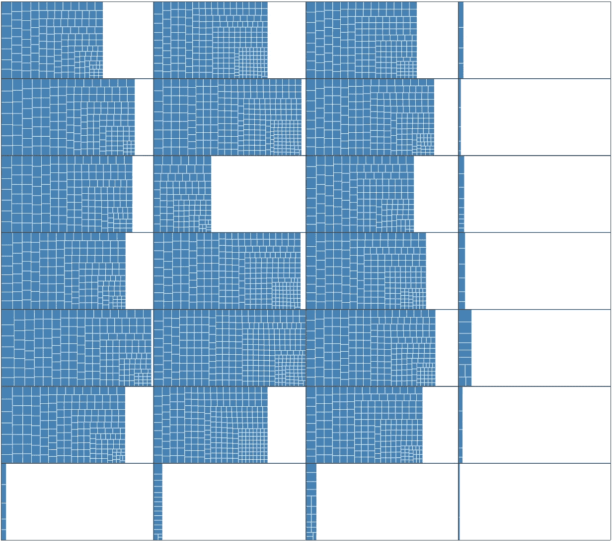
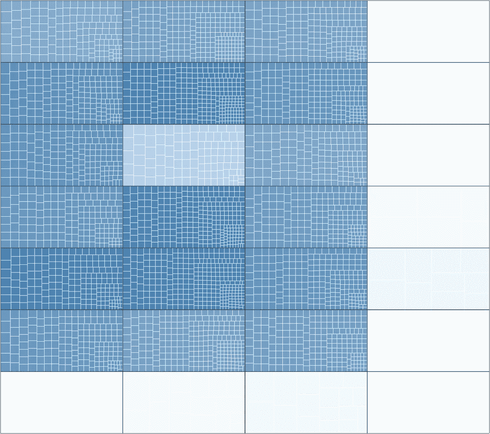
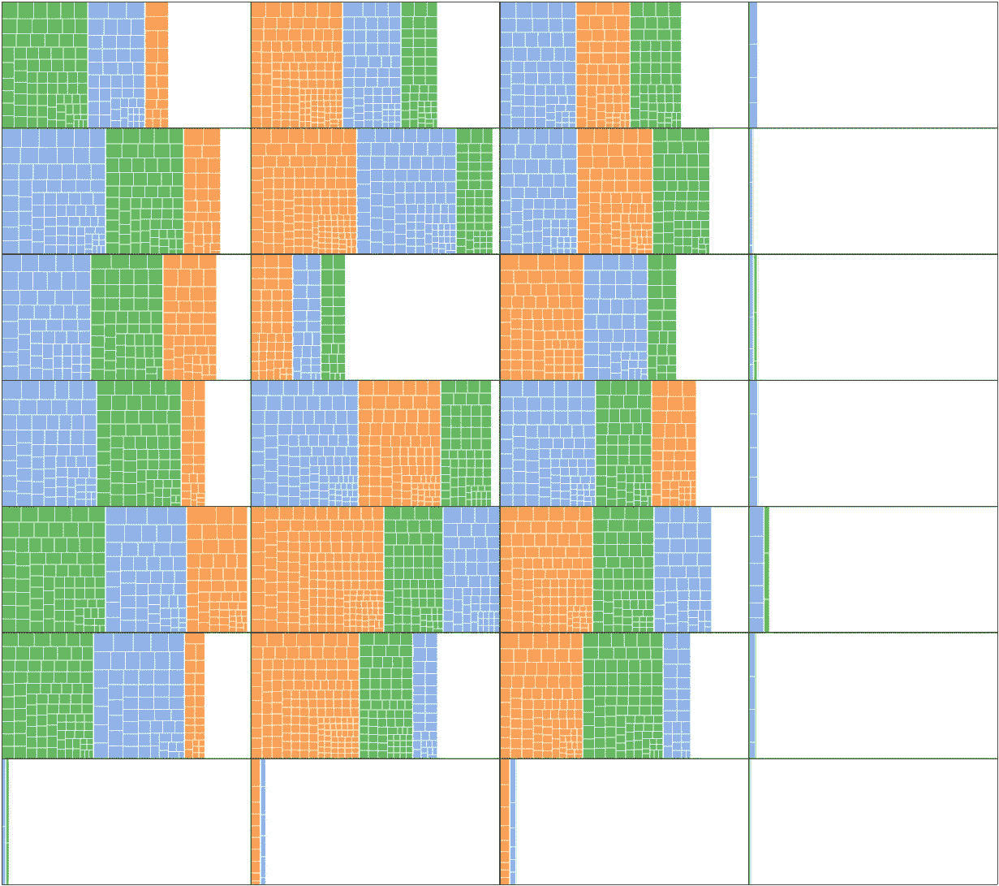
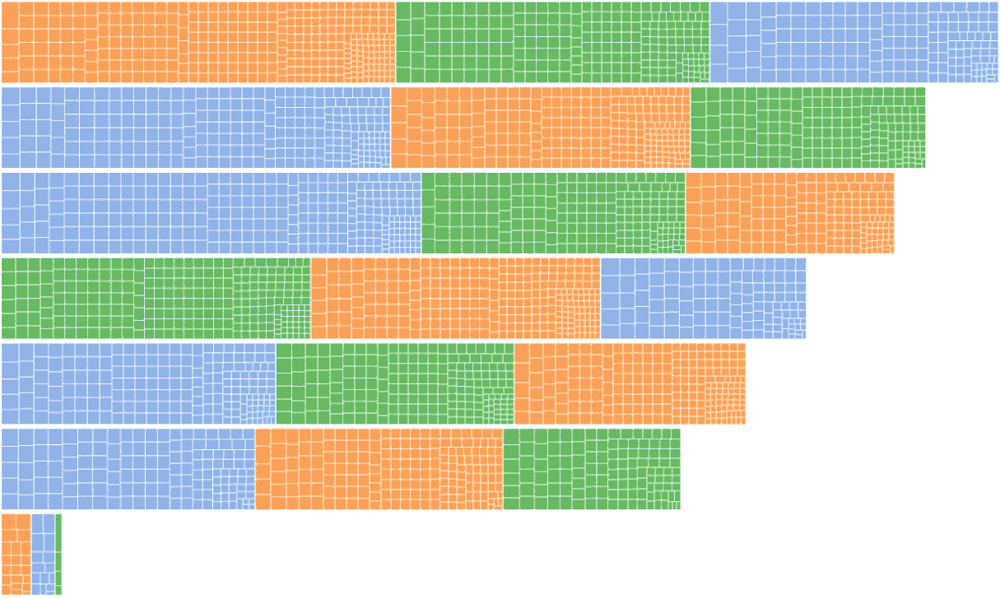
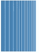
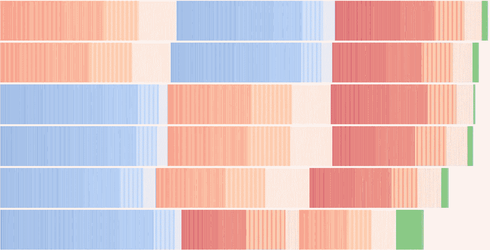

# 树状图和快乐小意外的实验

> 原文：<https://towardsdatascience.com/experiments-with-treemaps-and-happy-little-accidents-e9e1c5360dce?source=collection_archive---------27----------------------->

在我的[目标导向图表](https://medium.com/@etienne.ramstein/goal-oriented-data-visualization-tools-supported-by-object-constancy-f3f4296a3151)实验中，数据集中的每一项都由一个小矩形表示。根据用户想要看到的内容，它们会飞来飞去，堆叠成各种形状。因此，我需要针对分类和/或定量维度的不同组合的可视化类型。

例如，假设我们的矩形是电影，用户想看看他们有多少预算。我们有 1 个量化维度来表示，因此我们可以简单地根据预算按比例调整每部电影的大小:

这是一个简单类型的[树形图](http://www.cs.umd.edu/hcil/treemap-history/)。

现在用户想知道电影的预算是多少，取决于它们的类型。我们增加了一个范畴。矩形飞来飞去形成一个条形图，每个条形代表一个流派的电影总预算。与一个简单的条形图相比，条形图是一个树形图，我们可以看到各个元素，这给了我们额外的洞察力:这种类型的第一名是因为一些大型电影，还是许多普通电影？

用户再一次添加了另一个分类维度:他们想按类型和来源国查看电影的预算。矩形再次飞来飞去，这次为每个流派/国家组合形成一个树状图。它们按流派垂直排列，但现在水平分布在每个国家的一栏中。

已满的“单元格”(第 2 列，第 5 行)是总预算最大的一个，其余部分的大小与此相比。

这是一种热图，我们确实可以使用每个单元格的整体大小，并使用梯度来显示它们各自承载的价值。但在我看来，这让事情更难比较:

最后，让我们添加第三个分类维度。这一次我们可以使用颜色——每个树形图都被分割成子部分，每种颜色一个子部分。部分在树形图中按总值降序排序:

对于二维版本，我们还可以使用条形图和颜色:

关于实现的一些注意事项。

当构建一个树形图时，我们有以下问题:我们需要定位和确定矩形的大小，以便它们填充一个目标区域，同时每个矩形的表面等于它的重量。这是一个挑战，因为解决方案还必须使可视化对人类有用——我们需要看到有多少个项目，它们各自的大小是多少，并能够按需点击它们查看详细信息。

我发现可读性最好的方法是将它们“方形化”,使它们看起来尽可能的方形，同时满足上面的约束。不幸的是，为了进行计算，我们不能独立地逐个放置矩形，我们需要在每次迭代中考虑整个数据集。这使得一个完美的解决方案规模很小，实际上这是一个 NP 难题。所以我们需要寻求妥协。来自埃因霍温大学的这篇论文提出了一种实用、高效的方法，并产生了非常令人满意的结果。它也很容易理解和实现，绝对是我推荐的一本有趣的读物。

这就是我在应用程序中编写的代码。然而，当我在为那个模块搭建脚手架的时候，我有一个占位符 treemap 函数来提前开始测试整个模块。它使用了最简单的方法:只在一个维度上进行插值，即只在一行薄矩形上进行插值:

我并不期望这是一个非常有用的可视化，然而就在那时，一些意想不到的有趣的事情发生了。我使用了一个带有简单 2D 上下文的 HTML 画布。事实证明，如果在有限的区域中有成千上万个这样的矩形，尤其是在这样薄的布局中，浏览器没有足够的像素来显示所有的矩形及其 1 像素宽的白色分隔符。所以它试图平滑事物，1 蓝+ 1 白+ 1 蓝变成了 1 淡蓝色。

它创造了这样的梯度:

这非常有用，因为它回答了我们的问题:条形的大小是由几个大元素(亮色部分)还是许多小元素(亮色部分)决定的。我最终在应用程序中保留了这一点，以防我们有大量的矩形，而“方形”算法开始出现问题。诸如此类的事情使得数据可视化的开发变得非常有趣。