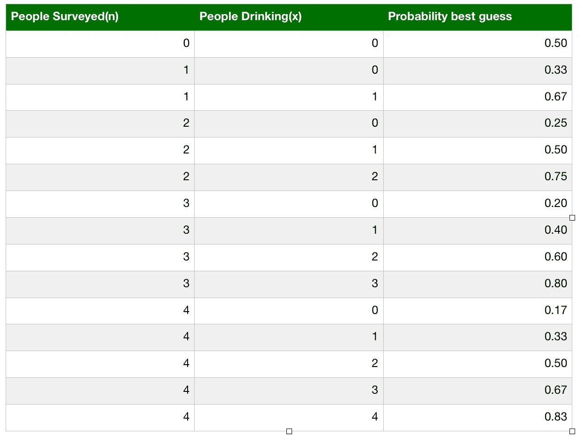

# 专业知识和推理

> 原文：<https://towardsdatascience.com/expertise-and-inference-570bd535bce3?source=collection_archive---------42----------------------->

## 理解的统计探索

推理被定义为“基于证据和推理的结论”。我们在生活中做的许多或大多数事情都是基于某种形式的推理。有些，我们有很多经验，比如知道小心地过马路是非常安全的，而有些，我们不知道，比如是否接受某个工作邀请，或者搬到另一个国家。然而，在这两种情况下，我们最终都必须做出一些决定，主要是基于从我们所拥有的(通常是有限的)信息中得出的结论。

**案例研究:圭亚那人饮酒**

如果你是来决定移居哪个国家的，那么你来错了地方，因为这篇文章的目的不是通过哲学来研究推理，而是从数学这个受限的、可预测的世界来研究推理。让我们说，你试图估计一个随机选择的圭亚那人在周五晚上喝酒的概率。为了这个思想实验的目的，我假设你对圭亚那或其人口的饮酒习惯一无所知。如果你有这方面的知识，请原谅我，想象一个你没有的世界。

在没有任何信息的情况下，我们应该假设概率应该是多少？让我们进一步忽略我们对饮酒或周五可能性的认知。在没有信息的情况下，我们最好的“猜测”概率是 50%。但是如果我们随便问一个圭亚那人，他们正在喝酒，会怎么样呢？如果我们发现另外两个圭亚那人不是呢？我建议探索这个问题的方法是使用贝叶斯定理。这是一种基于新信息更新你对世界的“看法”的有力方式。

**编码解决方案**

我导入了 math 和 numpy Python 模块来帮助我:

```
import numpy as np
import math as math
```

由于我们没有关于这些习惯的信息，我们现在可以假设 0 到 100%之间的每个概率都是同等可能的，因此，我们应该给它们同等的权重:

```
probs= np.linspace(0,1,101)
weights= np.ones(len(probs))
```

**似是而非**

但是当信息开始出现时，我们如何处理它呢？当我们看到第一个人，他正在喝酒，我们知道概率不可能是 0%。这也是一个结果，我们看到 90%的概率是 10%的概率的 9 倍。根据贝叶斯定理，概括这种直觉，每个概率的“似真性得分”等于其先验权重乘以该概率下“现实”发生的可能性。实际概率不可能是 0%，所以给它一个‘似真得分’0。

我们如何看到在某种假设下，某种结果发生的可能性有多大？在我们的简单模型中，我们使用所谓的二项分布。我使用了一个名为“f”的辅助函数来使二项式函数看起来更漂亮:

```
def f(num):
    return math.factorial(num)def binomial_prob(n,x,p):
    return (f(n)/ (f(n-x)*f(x) ) * p**(x) * (1-p)**(n-x))
```

我们结合所有这些来创建我们的贝叶斯概率估计函数。我们用可能性的权重来平均概率。我们设置了概率和先验概率的默认值，以使用户的工作更容易:

```
def bayes_prob_est(n,x, probs=np.linspace(0,1,101), priors='q')):
    if type(probs)==list:
        probs=np.array(probs)

    if len(probs)!= len(priors): priors= np.ones(len(probs)) if type(priors)== list:
        priors== np.array(priors) plausability = priors* binomial_prob(n,x,probs)

    return sum(plausability*probs)/sum(plausability)
```

**圭亚那实验的结论**

现在我们已经准备好了贝叶斯函数，我们终于可以做一些估计了。下表显示了接受调查的人数、饮酒人数以及随机选择的人饮酒的可能性，使用的是我们的推断方法:



由此产生的有趣模式是，我们对概率的最佳猜测是(x+1)/(n+2)，这在逻辑上相当于在我们的样本中添加一个饮酒者和一个不饮酒者。这是一种特殊形式的[拉普拉斯平滑](https://en.wikipedia.org/wiki/Additive_smoothing)

**案例分析:扑克**

**小样**

这是否意味着推论就像(x+1)/(n+2)那么简单？这是不是意味着世界上所有的专业知识都可以用(x+1)/(n+2)代替？听到答案是否定的，你不会感到惊讶。这听起来像是常识，但数学并不纯粹通过常识工作，它需要逻辑证据。让我们看一个不同的例子来强调专业知识的价值。

假设我们在一个赌场玩扑克游戏，一桌有 9 个人。一名新玩家来到牌桌前，开始玩他的前 3 手牌。他可能会玩多少手牌？使用我们的贝叶斯函数或上表，我们得到以下结果:

```
bayes_prob_est(3,3) #0.80
```

那么我们应该假设他玩了大约 80%的牌吗？完全没有扑克知识，是的，这是一个公平的假设。然而，之前我们定义了一个先验函数，并决定每个概率都是同等可能的。任何一个扑克玩家都会告诉你，80%的牌局是一个令人厌恶的数字。让我们替代性地假设一个扑克高手认为 10%的玩家比较鲁莽，玩了 60%的手牌，80%的玩家比较理智，玩了 20%，10%的玩家比较害怕，玩了 10%。如果我们现在将这些信息放入我们的贝叶斯函数，我们会得到以下结果:

```
bayes_prob_est(3,3, [.6, .2, .1], [10,80,10]) #0.51
```

因此，专家可以根据他的专业知识将他的概率从 80%调整到大约 51%。这是一个巨大的意见分歧，这是有道理的，因为复杂的游戏，如扑克，是非常难以理解没有太多的经验。让我们看看，如果我们观察同一个玩家 200 手牌会发生什么，但现在他已经玩了 200 手牌中的 45 手。

**大样本**

非专家:

```
bayes_prob_est(200,45) #0.23
```

专家:

```
bayes_prob_est(200,45, [.6, .2, .1], [10,80,10]) #0.20
```

在这种情况下，非专家推断的概率约为 23%，而专家推断的概率约为 20%。两者之间的差距已经明显缩小，几乎相同。随着样本越来越大，这些值越来越接近。

**结论:专业知识的价值**

我们在上面已经看到，在面对有限的信息时，先前的专业知识可以给你一个非常不同的世界感知，然而，在“足够”的时间后，这收敛到一个天真但有感知的观察者的感知。那么，人们一定想知道，在这个我们可以获得关于各种主题的数千甚至数百万个数据点的时代，在仅仅几百次观察之后，观点似乎趋于一致，为什么还需要专业知识。

在某种程度上，这是对的，面对铺天盖地的数据，先前的观点确实变得不那么重要了。然而，许多重要的问题并不像估计一种简单结果的可能性那样简单。现实生活中有很多输入，例如，在给定 50 种不同的社会经济统计数据的情况下，确定一个社区中不同类型犯罪的可能频率。

最后，即使我们能够从数据中提取概率，我们也必须知道如何使用它们。这些概率最多只能给我们相关性，但要改变世界上的结果(研究数据的目的)，我们需要理解原因，而这尤其需要专业知识。因此，虽然数据降低了某些形式的专业知识的价值，但其他形式在这个数据驱动的世界中仍然有价值。