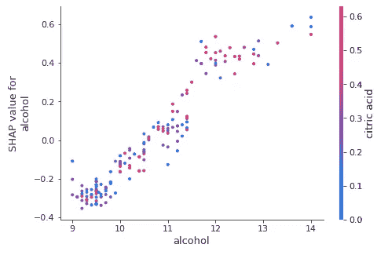

# 解释任何具有 SHAP 值的模型—使用内核解释器

> 原文：<https://towardsdatascience.com/explain-any-models-with-the-shap-values-use-the-kernelexplainer-79de9464897a?source=collection_archive---------0----------------------->

对 SHAP 值使用 KernelExplainer


自从我发表了文章“[用 SHAP 值](/explain-your-model-with-the-shap-values-bc36aac4de3d)解释你的模型”，这是建立在一个随机的森林树上，读者们一直在问是否有一个通用的 SHAP 解释器适用于任何 ML 算法——无论是基于树的还是非基于树的算法。这正是*内核解释器*，一个模型不可知的方法，被设计来做的。在本文中，我将演示如何使用 KernelExplainer 构建 KNN、SVM、Random Forest、GBM 或 H2O 模块的模型。如果你想了解更多关于 SHAP 价值观的背景，我强烈推荐“[用 SHAP 价值观](/explain-your-model-with-the-shap-values-bc36aac4de3d)解释你的模型”，其中我详细描述了 SHAP 价值观是如何从沙普利价值观中产生的，什么是博弈论中的沙普利价值观，以及 SHAP 价值观是如何在 Python 中工作的。除了 SHAP，你可能还想在“[用 LIME](https://medium.com/@Dataman.ai/explain-your-model-with-lime-5a1a5867b423) 解释你的模型”中查看 LIME，在“[用微软的 InterpretML](https://medium.com/@Dataman.ai/explain-your-model-with-microsofts-interpretml-5daab1d693b4) 解释你的模型”中查看微软的 InterpretML。我还在“[SHAP 和更优雅的图表](https://dataman-ai.medium.com/the-shap-with-more-elegant-charts-bc3e73fa1c0c)”和“[SHAP 价值和 H2O 模型](https://medium.com/dataman-in-ai/the-shap-values-with-h2o-models-773a203b75e3)”中记录了 SHAP 的最新发展。

想深入了解机器学习算法的读者，可以查看我的帖子[我的随机森林、梯度提升、正则化、H2O.ai](https://medium.com/analytics-vidhya/a-lecture-note-on-random-forest-gradient-boosting-and-regularization-834fc9a7fa52) 讲义。对于深度学习，请查看“[以回归友好的方式解释深度学习](https://levelup.gitconnected.com/a-tutorial-to-build-from-regression-to-deep-learning-b7354240d2d5)”。对于 RNN/LSTM/GRU，查看“[RNN/LSTM/GRU 股价预测技术指南](https://medium.com/swlh/a-technical-guide-on-rnn-lstm-gru-for-stock-price-prediction-bce2f7f30346)”。

**用 SHAP 价值观诠释你的精致模型**

考虑这个问题:“你复杂的机器学习模型容易理解吗？”这意味着您的模型可以通过具有商业意义的输入变量来理解。你的变量将符合用户的期望，他们已经从先前的知识中学习。

Lundberg 等人在其出色的论文“[解释模型预测的统一方法](https://papers.nips.cc/paper/7062-a-unified-approach-to-interpreting-model-predictions.pdf)”中提出了 SHAP (SHapley 附加解释)值，该值为模型提供了高水平的可解释性。SHAP 价值观提供了两大优势:

1.  *全局可解释性*-SHAP 值可以显示每个预测值对目标变量的贡献大小，无论是正面还是负面。这类似于变量重要性图，但它可以显示每个变量与目标之间的正或负关系(参见下面的汇总图)。
2.  *局部可解释性*——每个观察值都有自己的一套 SHAP 值(见下面的个体力图)。这大大增加了它的透明度。我们可以解释为什么一个案例得到它的预测和预测者的贡献。传统的可变重要性算法只显示整个群体的结果，而不是每个案例的结果。本地可解释性使我们能够精确定位和对比这些因素的影响。

SHAP 值可以由 [Python 模块 SHAP](https://shap.readthedocs.io/en/latest/) 产生。

**模型的可解释性并不意味着因果关系**

需要指出的是，SHAP 值并不提供因果关系。在“**识别因果关系**”系列文章中，我展示了识别因果关系的计量经济学技术。这些文章涵盖了以下技术:回归不连续性(参见“[通过回归不连续性确定因果关系](https://medium.com/@Dataman.ai/identify-causality-by-regression-discontinuity-a4c8fb7507df)”)、差异中的差异(DiD)(参见“[通过差异中的差异确定因果关系](https://medium.com/@Dataman.ai/identify-causality-by-difference-in-differences-78ad8335fb7c)”)、固定效应模型(参见“[通过固定效应模型确定因果关系](https://medium.com/@Dataman.ai/identify-causality-by-fixed-effects-model-585554bd9735)”)以及采用因子设计的随机对照试验(参见“[您的变更管理实验设计](/design-of-experiments-for-your-change-management-8f70880efcdd)”)。

内核解释器是做什么的？

KernelExplainer 通过使用您的数据、预测以及预测预测值的任何函数来构建加权线性回归。它根据博弈论的 Shapley 值和局部线性回归的系数计算可变的重要性值。

KernelExplainer 的缺点是运行时间长。如果你的模型是基于树的机器学习模型，你应该使用已经优化的树解释器`TreeExplainer()`来快速渲染结果。如果你的模型是深度学习模型，使用深度学习讲解器`DeepExplainer()`。[SHAP Python 模块](https://shap.readthedocs.io/en/latest/)还没有专门针对所有类型算法的优化算法(比如 KNNs)。

在“[用 SHAP 值解释你的模型](/explain-your-model-with-the-shap-values-bc36aac4de3d)”中，我用函数`TreeExplainer()`创建了一个随机森林模型。为了让您比较结果，我将使用相同的数据源，但是使用函数`KernelExplainer()`。

我将为所有算法重复以下四个图:

1.  摘要情节:使用`summary_plot()`
2.  依赖情节:`dependence_plot()`
3.  个体力图:`force_plot()`对于给定的观察值
4.  集体力剧情:`force_plot()`。

完整的代码可以在文章末尾找到，或者通过 Github 找到。

[](https://dataman-ai.medium.com/membership) [## 通过我的推荐链接加入 Medium-Chris Kuo/data man 博士

### 阅读 Chris Kuo/data man 博士的每一个故事。你的会员费直接支持郭怡广/戴塔曼博士和其他…

dataman-ai.medium.com](https://dataman-ai.medium.com/membership) 

**随机森林**

首先，让我们加载在“[用 SHAP 值解释您的模型](/explain-your-model-with-the-shap-values-bc36aac4de3d)”中使用的相同数据。

```
import pandas as pd
import numpy as np
np.random.seed(0)
import matplotlib.pyplot as plt
df = pd.read_csv('/winequality-red.csv') # Load the data
from sklearn.model_selection import train_test_split
from sklearn import preprocessing
from sklearn.ensemble import RandomForestRegressor
# The target variable is 'quality'.
Y = df['quality']
X =  df[['fixed acidity', 'volatile acidity', 'citric acid', 'residual sugar','chlorides', 'free sulfur dioxide', 'total sulfur dioxide', 'density','pH', 'sulphates', 'alcohol']]
# Split the data into train and test data:
X_train, X_test, Y_train, Y_test = train_test_split(X, Y, test_size = 0.2)
```

让我们构建一个随机森林模型，并打印出变量重要性。SHAP 建立在最大似然算法的基础上。如果你想深入了解机器学习算法，可以查看我的帖子“[我关于随机森林、梯度提升、正则化、H2O.ai](https://medium.com/analytics-vidhya/a-lecture-note-on-random-forest-gradient-boosting-and-regularization-834fc9a7fa52) 的讲义”。

```
rf = RandomForestRegressor(max_depth=6, random_state=0, n_estimators=10)
rf.fit(X_train, Y_train)  
print(rf.feature_importances_)importances = rf.feature_importances_
indices = np.argsort(importances)features = X_train.columns
plt.title('Feature Importances')
plt.barh(range(len(indices)), importances[indices], color='b', align='center')
plt.yticks(range(len(indices)), [features[i] for i in indices])
plt.xlabel('Relative Importance')
plt.show()
```


Figure (A) Random Forest Variable Importance Plot

你可以从这个[Github](https://github.com/slundberg/shap)pip 安装 SHAP。下面的函数`KernelExplainer()`通过采用预测方法`rf.predict`和您想要执行 SHAP 值的数据来执行局部回归。这里我使用测试数据集 X_test，它有 160 个观察值。这一步可能需要一段时间。

```
import shap
rf_shap_values = shap.KernelExplainer(rf.predict,X_test)
```

1.  概要情节

此图加载了信息。该图与常规变量重要性图(图 A)的最大区别在于，它显示了预测值与目标变量之间的正相关和负相关关系。它看起来有点古怪，因为它是由列车数据中的所有点组成的。让我向您介绍一下:

```
shap.summary_plot(rf_shap_values, X_test)
```


*   *特征重要性:*变量按降序排列。
*   *影响:*水平位置显示该值*的影响是否与更高或更低的预测*相关联。
*   *原始值:*颜色显示该变量对于该观察值是高(红色)还是低(蓝色)。
*   *相关性:*高*水平的“酒精”含量对质量评级有高*和正*的影响。“高”来自红色，而“积极的”影响显示在 X 轴上。同样，我们会说“挥发性酸度”与目标变量负相关。*

*您想要保存汇总图。虽然 SHAP 没有内置的保存图的功能，但是您可以使用`matplotlib`输出图:*

*2.依赖图*

**部分依赖图*，简称依赖图，在机器学习结果中很重要( [J. H. Friedman 2001](https://statweb.stanford.edu/~jhf/ftp/trebst.pdf) )。它显示了一个或两个变量对预测结果的边际效应。它表明目标和变量之间的关系是线性的、单调的还是更复杂的。我在文章“[中提供了更多详细信息:如何计算部分相关图？](https://dataman-ai.medium.com/how-is-the-partial-dependent-plot-computed-8d2001a0e556)”*

*假设我们想得到“酒精”的依赖图。SHAP 模块包括另一个与“酒精”互动最多的变量。下图显示“酒精”与目标变量之间存在近似线性的正趋势，“酒精”与“残糖”频繁交互。*

```
*shap.dependence_plot("alcohol", rf_shap_values, X_test)*
```

**

*3.个体力图*

*您可以为每个观察值绘制一个非常优雅的图，称为*力图*。我任意选择了 X_test 数据的第 10 个观测值。下面是 X_test 的平均值，以及第 10 次观察的值。*

**

*Pandas 像 base R 一样使用`.iloc()`来划分数据帧的行。其他语言开发者可以看我的帖子“[你是双语吗？精通 R 和 Python](/are-you-bilingual-be-fluent-in-r-and-python-7cb1533ff99f) ”中，我比较了 R dply 和 Python Pandas 中最常见的数据争论任务。*

```
*# plot the SHAP values for the 10th observation 
shap.force_plot(rf_explainer.expected_value, rf_shap_values[10,:], X_test.iloc[10,:])*
```

**

*   **输出值*是该观测值的预测值(该观测值的预测值为 5.11)。*
*   **基值*:[原始论文](http://papers.nips.cc/paper/7062-a-unified-approach-to-interpreting-model-predictions.pdf)解释说，基值 E(y_hat)是“如果我们不知道当前输出的任何特征，将会预测的值。”换句话说，它是均值预测，或均值(yhat)。你可能会奇怪为什么是 5.634。这是因为 Y_test 的预测均值为 5.634。你可以通过产生 5.634 的`Y_test.mean()`来测试一下。*
*   **红色/蓝色*:将预测值推高(向右)的特征显示为红色，将预测值推低的特征显示为蓝色。*
*   *酒精:对质量评级有积极影响。这种酒的酒精度是 9.4，低于平均值 10.48。所以它把预测推到左边。*
*   *二氧化硫总量:与质量等级正相关。高于平均水平的二氧化硫(= 18 > 14.98)将预测推向右边。*
*   *该图以位于`explainer.expected_value`的 x 轴为中心。所有 SHAP 值都与模型的期望值相关，就像线性模型的效果与截距相关一样。*

*4.集体力量图*

*每个观察都有它的力图。如果把所有的力图组合起来，旋转 90 度，水平叠加，我们就得到整个数据 X_test 的力图(见 Lundberg 等贡献者的 [GitHub](https://github.com/slundberg/shap/blob/master/README.md) 的解释)。*

```
*shap.force_plot(rf_explainer.expected_value, rf_shap_values, X_test)*
```

**

*合力图上面的 Y 轴是单个力图的 X 轴。在我们的 X_test 中有 160 个数据点，所以 X 轴有 160 个观察值。*

***GBM***

*我用 500 棵树(缺省值是 100)构建了 GBM，这对于过度拟合应该是相当健壮的。我使用超参数`validation_fraction=0.2`指定 20%的训练数据提前停止。如果验证结果在 5 次后没有改善，该超参数和`n_iter_no_change=5`将帮助模型更早停止。*

```
*from sklearn import ensemble
n_estimators = 500
gbm = ensemble.GradientBoostingClassifier(
            n_estimators=n_estimators,
            validation_fraction=0.2,
            n_iter_no_change=5, 
            tol=0.01,
            random_state=0)
gbm = ensemble.GradientBoostingClassifier(
            n_estimators=n_estimators,
            random_state=0)
gbm.fit(X_train, Y_train)*
```

*像上面的随机森林部分一样，我使用函数`KernelExplainer()`来生成 SHAP 值。那我就提供四个情节。*

```
*import shap
gbm_shap_values = shap.KernelExplainer(gbm.predict,X_test)*
```

1.  *概要情节*

*当与随机森林的输出相比较时，GBM 对于前四个变量显示相同的变量排序，但是对于其余变量不同。*

```
*shap.summary_plot(gbm_shap_values, X_test)*
```

**

*2.依赖图*

*GBM 的依赖图也显示“酒精”和目标变量之间存在近似线性的正趋势。与随机森林的输出相反，GBM 显示“酒精”与“密度”频繁交互。*

```
*shap.dependence_plot("alcohol", gbm_shap_values, X_test)*
```

**

*3.个体力图*

*我继续为 X_test 数据的第 10 次观察制作力图。*

```
*# plot the SHAP values for the 10th observation 
shap.force_plot(gbm_explainer.expected_value,gbm_shap_values[10,:], X_test.iloc[10,:])* 
```

**

*该观察的 GBM 预测是 5.00，不同于随机森林的 5.11。推动预测的力量与随机森林的力量相似:酒精、硫酸盐和残余糖分。但是推动预测上升的力量是不同的。*

*4.集体力量图*

```
*shap.force_plot(gbm_explainer.expected_value, gbm_shap_values, X_test)*
```

**

***KNN***

*因为这里的目标是展示 SHAP 价值观，所以我只设置了 KNN 15 个邻居，而不太关心优化 KNN 模型。*

```
*# Train the KNN model
from sklearn import neighbors
n_neighbors = 15
knn = neighbors.KNeighborsClassifier(n_neighbors,weights='distance')
knn.fit(X_train,Y_train)# Produce the SHAP values
knn_explainer = shap.KernelExplainer(knn.predict,X_test)
knn_shap_values = knn_explainer.shap_values(X_test)*
```

1.  *概要情节*

*有趣的是，与随机森林或 GBM 的输出相比，KNN 显示了不同的变量排序。这种背离是意料之中的，因为 KNN 容易出现异常值，这里我们只训练一个 KNN 模型。为了缓解这一问题，建议您使用不同数量的邻居构建几个 KNN 模型，然后获取平均值。我的文章“[异常检测与 PyOD](/anomaly-detection-with-pyod-b523fc47db9) ”也分享了这种直觉。*

```
*shap.summary_plot(knn_shap_values, X_test)*
```

**

*2.依赖图*

*KNN 的输出显示在“酒精”和目标变量之间存在近似线性的正趋势。与随机森林的输出不同，KNN 显示“酒精”与“总二氧化硫”的交互频繁。*

```
*shap.dependence_plot("alcohol", knn_shap_values, X_test)*
```

**

*3.个体力图*

```
*# plot the SHAP values for the 10th observation 
shap.force_plot(knn_explainer.expected_value,knn_shap_values[10,:], X_test.iloc[10,:])*
```

**

*该观察的预测值为 5.00，与 GBM 的预测值相似。KNN 确定的驱动力是:“游离二氧化硫”、“酒精”和“残糖”。*

*4.集体力量图*

```
*shap.force_plot(knn_explainer.expected_value, knn_shap_values, X_test)*
```

**

***SVM***

*支持向量机(AVM)找到最佳超平面以将观察结果分成类别。SVM 使用核函数变换到更高维度的空间中进行分离。为什么在更高维的空间中分离会变得更容易？这还得回到 Vapnik-Chervonenkis (VC)理论。它说，映射到更高维度的空间通常会提供更大的分类能力。关于进一步的解释，请参见我的文章“使用 Python 的维度缩减技术”。常见的核函数有径向基函数(RBF)、高斯函数、多项式函数和 Sigmoid 函数。*

*在这个例子中，我使用带参数`gamma`的径向基函数(RBF)。当`gamma`的值很小时，模型受到的约束太大，无法捕捉数据的复杂性或“形状”。有两种选择:`gamma='auto'`或`gamma='scale'`(参见 [scikit-learn api](https://scikit-learn.org/stable/modules/generated/sklearn.svm.SVC.html) )。*

*另一个重要的超参数是`decision_function_shape`。超参数`decision_function_shape`告诉 SVM 一个数据点离超平面有多近。靠近边界的数据点意味着低置信度决策。有两个选项:一对一对休息(' ovr ')或一对一(' ovo ')(参见 [scikit-learn api](https://scikit-learn.org/stable/modules/generated/sklearn.svm.SVC.html) )。*

```
*# Build the SVM model
from sklearn import svm
svm = svm.SVC(gamma='scale',decision_function_shape='ovo')
svm.fit(X_train,Y_train)# The SHAP values
svm_explainer = shap.KernelExplainer(svm.predict,X_test)
svm_shap_values = svm_explainer.shap_values(X_test)*
```

1.  *概要情节*

*这里，我们再次从随机森林和 GBM 的输出中看到不同的汇总图。这是意料之中的，因为我们只训练了一个 SVM 模型，而 SVM 也容易出现异常值。*

```
*shap.summary_plot(svm_shap_values, X_test)*
```

**

*2.依赖图*

*SVM 的输出在“酒精”和目标变量之间显示出温和的线性正趋势。与随机森林的输出相反，SVM 表明“酒精”经常与“固定酸度”相互作用。*

```
*shap.dependence_plot("alcohol", svm_shap_values, X_test)*
```

**

*3.个体力图*

```
*# plot the SHAP values for the 10th observation 
shap.force_plot(svm_explainer.expected_value,svm_shap_values[10,:], X_test.iloc[10,:])*
```

**

*此次观测的 SVM 预测值为 6.00，不同于随机森林的 5.11。驱使预测降低的力量类似于随机森林的力量；相比之下，“二氧化硫总量”是推动预测上升的强大力量。*

*4.集体力量图*

```
*shap.force_plot(svm_explainer.expected_value, svm_shap_values, X_test)*
```

**

***型号内置开源 H2O***

*许多数据科学家(包括我自己)喜欢开源的 H2O。它是一个完全分布式的内存平台，支持最广泛使用的算法，如 GBM、RF、GLM、DL 等。它的 AutoML 功能自动运行所有算法及其超参数，生成最佳模型排行榜。其企业版 [H2O 无人驾驶 AI](https://www.h2o.ai/products/h2o-driverless-ai/?utm_source=google&utm_medium=test&utm_campaign=aiforbiz&utm_content=business-insights&gclid=Cj0KCQiA-4nuBRCnARIsAHwyuPq2IvnV5e8B0KAgwp_IBswaNcTEWf657Kd453yzHW2AzxFTlYaASSQaAvwIEALw_wcB) 内置 SHAP 功能。*

*如何将 SHAP 价值观应用于开源的 H2O？我非常感谢 [seanPLeary](https://github.com/SeanPLeary/shapley-values-h2o-example/blob/master/shap_h2o_automl_classification.ipynb) 在如何用 AutoML 产生 SHAP 价值观方面为 H2O 社区做出的贡献。我使用他的类“H2OProbWrapper”来计算 SHAP 值。*

```
*# The code builds a random forest model
import h2o
from h2o.estimators.random_forest import H2ORandomForestEstimator
h2o.init()X_train, X_test = train_test_split(df, test_size = 0.1)
X_train_hex = h2o.H2OFrame(X_train)
X_test_hex = h2o.H2OFrame(X_test)
X_names =  ['fixed acidity', 'volatile acidity', 'citric acid', 'residual sugar','chlorides', 'free sulfur dioxide', 'total sulfur dioxide', 'density','pH', 'sulphates', 'alcohol']# Define model
h2o_rf = H2ORandomForestEstimator(ntrees=200, max_depth=20, nfolds=10)# Train model
h2o_rf.train(x=X_names, y='quality', training_frame=X_train_hex)X_test = X_test_hex.drop('quality').as_data_frame()*
```

*让我们仔细看看 SVM 的代码`shap.KernelExplainer(svm.predict, X_test)`。它采用了类`svm`的函数`predict`，以及数据集`X_test`。因此，当我们应用 H2O 时，我们需要传递(I)预测函数，(ii)一个类，以及(iii)一个数据集。棘手的是，H2O 有自己的数据框架结构。为了将 h2O 的预测函数`h2o.preict()`传递给`shap.KernelExplainer()`,[Sean pleay](https://github.com/SeanPLeary/shapley-values-h2o-example/blob/master/shap_h2o_automl_classification.ipynb)将 H2O 的预测函数`h2o.preict()`包装在一个名为`H2OProbWrapper`的类中。这个漂亮的包装器允许`shap.KernelExplainer()`接受类`H2OProbWrapper`的函数`predict`和数据集`X_test`。*

```
*class H2OProbWrapper:
    def __init__(self, h2o_model, feature_names):
        self.h2o_model = h2o_model
        self.feature_names = feature_namesdef predict_binary_prob(self, X):
        if isinstance(X, pd.Series):
            X = X.values.reshape(1,-1)
        self.dataframe= pd.DataFrame(X, columns=self.feature_names)
        self.predictions = self.h2o_model.predict(h2o.H2OFrame(self.dataframe)).as_data_frame().values
        return self.predictions.astype('float64')[:,-1]* 
```

*因此，我们将计算 H2O 随机森林模型的 SHAP 值:*

```
*h2o_wrapper = H2OProbWrapper(h2o_rf,X_names)h2o_rf_explainer = shap.KernelExplainer(h2o_wrapper.predict_binary_prob, X_test)
h2o_rf_shap_values = h2o_rf_explainer.shap_values(X_test)*
```

1.  *概要情节*

*当与随机森林的输出相比较时，H2O 随机森林对于前三个变量显示出相同的变量排序。*

```
*shap.summary_plot(h2o_rf_shap_values, X_test)*
```

**

*2.依赖图*

*输出显示“酒精”和目标变量之间存在线性的正趋势。H2O·兰登森林发现“酒精”经常与“柠檬酸”相互作用。*

```
*shap.dependence_plot("alcohol", h2o_rf_shap_values, X_test)*
```

**

*3.个体力图*

*此次观测的 H2O 随机森林预测值为 6.07。推动预测向右的力量是“酒精”、“密度”、“残糖”、“总二氧化硫”；左边是“固定酸度”和“硫酸盐”。*

```
*# plot the SHAP values for the 10th observation 
shap.force_plot(h2o_rf_explainer.expected_value,h2o_rf_shap_values[10,:], X_test.iloc[10,:])*
```

**

*4.集体力量图*

```
*shap.force_plot(h2o_rf_explainer.expected_value, h2o_rf_shap_values, X_test)*
```

**

*R 中的 SHAP 值如何？*

*这里提到几个 SHAP 值的 R 包很有意思。R package [shapper](https://cran.r-project.org/web/packages/shapper/shapper.pdf) 是 Python 库 SHAP 的一个端口。R 包 [xgboost](https://cran.r-project.org/web/packages/xgboost/xgboost.pdf) 有内置函数。另一个包是 [iml](https://cran.r-project.org/web/packages/iml/index.html) (可解释机器学习)。最后，R 包 [DALEX](https://cran.r-project.org/web/packages/DALEX/DALEX.pdf) (描述性机器学习解释)也包含各种解释器，帮助理解输入变量和模型输出之间的联系。*

***SHAP 价值观没有做到的事情***

*自从我发表了这篇文章和它的姊妹文章“[用 SHAP 价值观解释你的模型](/explain-your-model-with-the-shap-values-bc36aac4de3d)”之后，读者们分享了他们与客户会面时提出的问题。这些问题不是关于 SHAP 价值观的计算，而是观众思考 SHAP 价值观能做什么。一个主要的评论是“你能为我们确定制定策略的驱动因素吗？”*

*上面的评论是可信的，表明数据科学家已经提供了有效的内容。然而，这个问题涉及到相关性和因果性。**SHAP 值不能识别因果关系，通过实验设计或类似方法可以更好地识别因果关系。**有兴趣的读者，请阅读我的另外两篇文章《[为你的变革管理设计实验](/design-of-experiments-for-your-change-management-8f70880efcdd)》和《[机器学习还是计量经济学？](https://medium.com/analytics-vidhya/machine-learning-or-econometrics-5127c1c2dc53)*

***所有代码***

*为了方便起见，所有的行都放在下面的代码块中，或者通过[这个 Github](https://github.com/dataman-git/codes_for_articles/blob/master/Explain%20any%20models%20with%20the%20SHAP%20values%20-%20the%20KernelExplainer%20for%20article.ipynb) 。*

*如果您发现这篇文章很有帮助，您可能想要查看模型可解释性系列:*

*第一部分:[用 SHAP 值解释你的模型](/explain-your-model-with-the-shap-values-bc36aac4de3d)*

*第二部分:[图表更优雅的 SHAP](https://dataman-ai.medium.com/the-shap-with-more-elegant-charts-bc3e73fa1c0c)*

*第三部分:[部分依赖图是如何计算的？](https://dataman-ai.medium.com/how-is-the-partial-dependent-plot-computed-8d2001a0e556)*

*第六部分:[对可解释人工智能的解释](https://medium.com/analytics-vidhya/an-explanation-for-explainable-ai-xai-d56ae3dacd13)*

*第五部分:[解释任何具有 SHAP 值的模型——使用内核解释器](/explain-any-models-with-the-shap-values-use-the-kernelexplainer-79de9464897a)*

*第六部分:[H2O 模型的 SHAP 值](https://medium.com/dataman-in-ai/the-shap-values-with-h2o-models-773a203b75e3)*

*第七部分:[用石灰解释你的模型](https://medium.com/@Dataman.ai/explain-your-model-with-lime-5a1a5867b423)*

*第八部分:[用微软的 InterpretML](https://medium.com/@Dataman.ai/explain-your-model-with-microsofts-interpretml-5daab1d693b4) 解释你的模型*

*[](https://dataman-ai.medium.com/membership) [## 通过我的推荐链接加入 Medium-Chris Kuo/data man 博士

### 阅读 Chris Kuo/data man 博士的每一个故事。你的会员费直接支持郭怡广/戴塔曼博士和其他…

dataman-ai.medium.com](https://dataman-ai.medium.com/membership) 

建议读者购买郭怡广的书籍:


*   可解释的人工智能:[https://a.co/d/cNL8Hu4](https://a.co/d/cNL8Hu4)
*   图像分类的迁移学习:[https://a.co/d/hLdCkMH](https://a.co/d/hLdCkMH)
*   现代时间序列异常检测:[https://a.co/d/ieIbAxM](https://a.co/d/ieIbAxM)
*   异常检测手册:[https://a.co/d/5sKS8bI](https://a.co/d/5sKS8bI)*