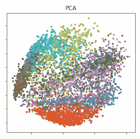
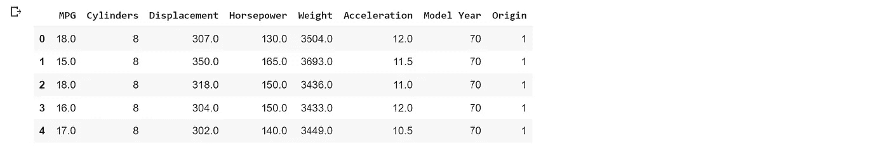
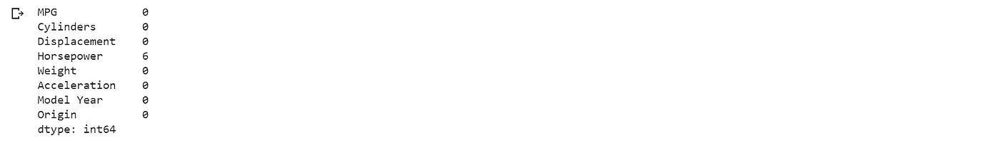
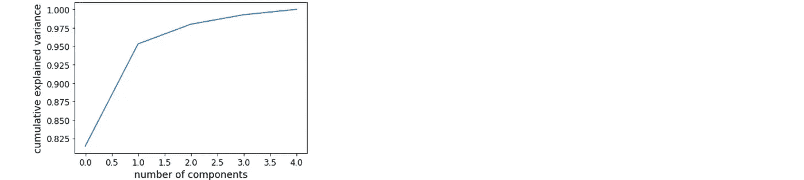
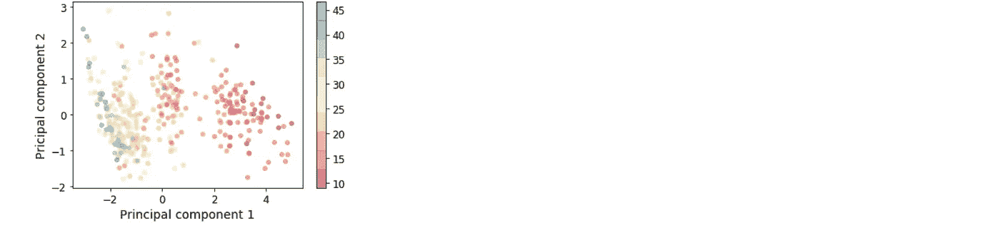

# 特征变化解释

> 原文：<https://towardsdatascience.com/explain-feature-variation-employing-pca-in-scikit-learn-6711e0a5c0b7?source=collection_archive---------19----------------------->

## 在 Scikit-Learn 中使用 PCA



Visualization of PCA results[1]

作为一种多元排序技术，主成分分析(PCA)可以对多元数据集中的因变量进行分析，以探索它们之间的关系。这导致以更少的维度显示数据点的相对位置，同时保留尽可能多的信息[2]。

在本文中，我将使用 Scikit-learn 库对 auto-mpg 数据集(来自 GitHub)应用 PCA。本文分为数据预处理、主成分分析和主成分可视化三个部分。

## a)数据预处理

我们首先需要导入数据集预处理所需的库:

```
import tensorflow as tf
from tensorflow import kerasimport numpy as np
import pandas as pd
import seaborn as sns!pip install -q git+https://github.com/tensorflow/docs
import tensorflow_docs as tfdocs
import tensorflow_docs.plots
import tensorflow_docs.modeling
```

然后，我们可以导入数据:

```
datapath = keras.utils.get_file(“auto-mpg.data”, “http://archive.ics.uci.edu/ml/machine-learning-databases/auto-mpg/auto-mpg.data")datapath
```

并更改列的标题:

```
columnTitles = [‘MPG’,’Cylinders’,’Displacement’,’Horsepower’,’Weight’, ‘Acceleration’, ‘Model Year’, ‘Origin’]rawData = pd.read_csv(dataPath, names=columnTitles, na_values = “?”, comment=’\t’, sep=” “, skipinitialspace=True)
```

数据如下所示:

```
data = rawData.copy()
data.head()
```



然后，我们需要清理数据:

```
data.isna().sum()
```



```
data = data.dropna()
```

下一步是定义特征，将它们从响应变量中分离出来，并将其标准化为 PCA 的输入:

```
from sklearn.preprocessing import StandardScalerdf = pd.DataFrame(data)features = [‘Cylinders’, ‘Displacement’, ‘Horsepower’, ‘Weight’, ‘Acceleration’]X = df.loc[:, features].valuesy = df.loc[:,[‘MPG’]].valuesX = StandardScaler().fit_transform(X)
```

## b)五氯苯甲醚

在 PCA 中，我们首先需要知道需要多少成分来解释至少 90%的特征变化:

```
from sklearn.decomposition import PCApca = PCA().fit(X)plt.plot(np.cumsum(pca.explained_variance_ratio_))plt.xlabel(‘number of components’)plt.ylabel(‘cumulative explained variance’)
```



在本案例研究中，选择了两个组件作为组件的最佳数量。然后，我们可以开始进行 PCA:

```
from sklearn.decomposition import PCApca = PCA(n_components=2)principalComponents = pca.fit_transform(X)
```

如下所示，总体而言，这两个组件解释了数据集约 95%的特征变化:

```
pca.explained_variance_ratio_array([0.81437196, 0.13877225])
```

## c)主成分可视化

给定响应变量值(当前数据集中的 MPG ),两个主要成分可以如下所示:

```
plt.scatter(principalComponents[:, 0], principalComponents[:, 1],c=data.MPG, edgecolor=’none’, alpha=0.5,cmap=plt.cm.get_cmap(‘Spectral’, 10))plt.xlabel(‘Principal component 1’)plt.ylabel(‘Pricipal component 2’)plt.colorbar()
```



# 结论

主成分分析(PCA)降低了大数据集的维数，增加了数据的可解释性，同时最小化了信息损失。它通过创建新的不相关成分来实现方差的最大化[3]。

# **参考文献**

[1][https://commons . wikimedia . org/wiki/File:PCA _ vs _ Linear _ auto encoder . png](https://commons.wikimedia.org/wiki/File:PCA_vs_Linear_Autoencoder.png)

[2] C. Syms。主成分分析。(2008)，*生态百科*，2940–2949。doi:10.1016/b978–008045405–4.00538–3。

[3] T. I .乔利夫和 j .卡迪马。"主成分分析:回顾与最新发展."(2016)，*英国皇家学会哲学汇刊 A:数学、物理与工程科学*，第 374 卷，第 2065 期，第 2015–2020 页，doi:10.1098/rsta.2015.0202。