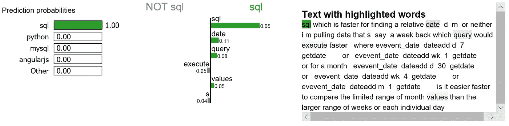

# 用莱姆和 SHAP 解释自然语言处理模型

> 原文：<https://towardsdatascience.com/explain-nlp-models-with-lime-shap-5c5a9f84d59b?source=collection_archive---------5----------------------->


## 文本分类解释

上周，我在 QCon New York 做了一个关于 NLP 的“ [***动手特征工程”的演讲。作为演示的一小部分，我简单演示了一下***](https://qconnewyork.com/ny2019/presentation/techniques-and-best-practices-prepping-data-ml-projects)***[***LIME***](https://github.com/marcotcr/lime)&[***SHAP***](https://github.com/slundberg/shap)在文本分类解释方面是如何工作的。***

我决定写一篇关于它们的博客，因为它们很有趣，易于使用，视觉上引人注目。

所有在比人脑可以直接可视化的维度更高的维度上运行的机器学习模型都可以被称为黑盒模型，这归结于模型的可解释性。特别是在 [NLP](https://en.wikipedia.org/wiki/Natural_language_processing) 领域，总是出现特征维数非常巨大的情况，解释特征重要性变得更加复杂。

[***石灰***](https://github.com/marcotcr/lime)&[***SHAP***](https://github.com/slundberg/shap)帮助我们不仅向最终用户，也向我们自己提供一个关于 NLP 模型如何工作的解释。

利用[栈溢出问题标签分类数据集](https://storage.googleapis.com/tensorflow-workshop-examples/stack-overflow-data.csv)，我们将构建一个多类文本分类模型，然后分别应用*&***【SHAP】***来解释该模型。因为我们之前已经做了很多次文本分类，我们将快速构建 NLP 模型，并关注模型的可解释性。*

# *数据预处理、特征工程和逻辑回归*

*preprocessing_featureEngineering_logreg.py*

**

*我们在这里的目标不是产生最高的结果。我想尽快潜入莱姆 SHAP，这就是接下来发生的事情。*

# *用 LIME 解释文本预测*

*从现在开始，这是有趣的部分。下面的代码片段大部分是从 [LIME 教程](https://marcotcr.github.io/lime/tutorials/Lime%20-%20multiclass.html)中借来的。*

*explainer.py*

**

*我们在测试集中随机选择一个文档，它恰好是一个标记为 ***sql*** 的文档，我们的模型预测它也是 ***sql*** 。使用该文档，我们为标签 4(即 ***sql*** 和标签 8(即 ***python*** )生成解释。*

```
*print ('Explanation for class %s' % class_names[4])
print ('\n'.join(map(str, exp.as_list(label=4))))*
```

**

```
*print ('Explanation for class %s' % class_names[8])
print ('\n'.join(map(str, exp.as_list(label=8))))*
```

**

*很明显这个文档对标签 ***sql 的解释最高。*** 我们还注意到，正负符号都是相对于某个特定标签而言的，比如单词“sql”正对类 ***sql*** 而负对类 ***python*** ，反之亦然。*

*我们将为该文档的前两个类生成标签。*

```
*exp = explainer.explain_instance(X_test[idx], c.predict_proba, num_features=6, top_labels=2)
print(exp.available_labels())*
```

**

*它给了我们 ***sql*** 和 ***python。****

```
*exp.show_in_notebook(text=False)*
```

**

*Figure 1*

*让我试着解释一下这种形象化:*

*   *对于该文档，单词“sql”对于类别 ***sql*** 具有最高的正面得分。*
*   *我们的模型预测这个文档应该以 100%的概率被标记为 ***sql*** 。*
*   *如果我们将单词“sql”从文档中删除，我们会期望模型以 100% — 65% = 35%的概率预测标签 ***sql*** 。*
*   *另一方面，word“SQL”对于 class ***python*** 是负数，我们的模型已经了解到 word“range”对于 class ***python*** 有一个很小的正数分数。*

*我们可能想要放大并研究对类 ***sql*** 的解释，以及文档本身。*

```
*exp.show_in_notebook(text=y_test[idx], labels=(4,))*
```

**

*Figure 2*

# *用 SHAP 解释文本预测*

*以下过程都是从[本教程](https://stackoverflow.blog/2019/05/06/predicting-stack-overflow-tags-with-googles-cloud-ai/)中学到的。*

*tf_model.py*

*   *在模型被训练后，我们使用前 200 个训练文档作为我们的背景数据集进行集成，并创建一个 SHAP 解释器对象。*
*   *我们在测试集的子集上得到个体预测的属性值。*
*   *将索引转换为单词。*
*   *使用 SHAP 的`summary_plot`方法显示影响模型预测的主要特征。*

```
*attrib_data = X_train[:200]
explainer = shap.DeepExplainer(model, attrib_data)
num_explanations = 20
shap_vals = explainer.shap_values(X_test[:num_explanations])words = processor._tokenizer.word_index
word_lookup = list()
for i in words.keys():
  word_lookup.append(i)word_lookup = [''] + word_lookup
shap.summary_plot(shap_vals, feature_names=word_lookup, class_names=tag_encoder.classes_)*
```

**

*Figure 3*

*   *单词“want”是我们的模型使用的最大信号词，对类 ***jquery*** 预测贡献最大。*
*   *单词“php”是我们的模型使用的第四大信号词，当然对类 ***php*** 贡献最大。*
*   *另一方面，单词“php”可能对另一个类产生负面信号，因为它不太可能出现在 ***python*** 文档中。*

*就机器学习的可解释性而言，莱姆& SHAP 有很多东西需要学习。我只介绍了 NLP 的一小部分。 [Jupyter 笔记本](https://github.com/susanli2016/NLP-with-Python/blob/master/LIME_SHAP_StackOverflow.ipynb)可以在 [Github](https://github.com/susanli2016/NLP-with-Python/blob/master/LIME_SHAP_StackOverflow.ipynb) 上找到。享受乐趣！*