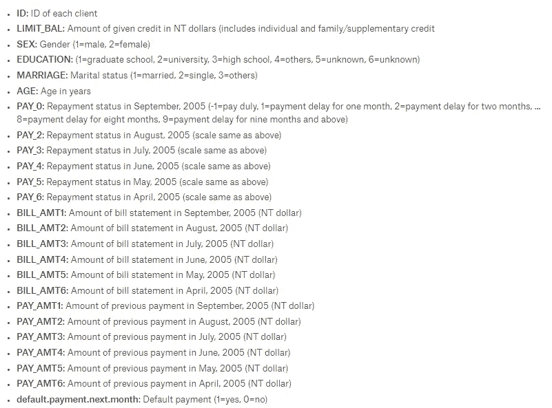
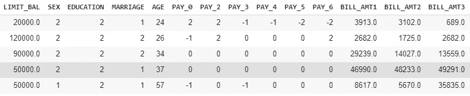
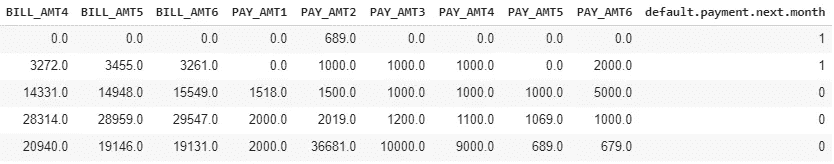
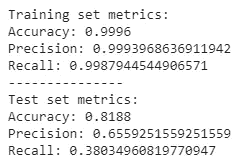

# 用特征重要性解释你的机器学习

> 原文：<https://towardsdatascience.com/explain-your-machine-learning-with-feature-importance-774cd72abe?source=collection_archive---------5----------------------->

让我们想象一下，你在一家银行找到了一份咨询工作，这家银行要求你找出那些很有可能拖欠下个月账单的人。有了你所学习和实践的机器学习技术，假设你开始分析你的客户给出的数据集，并且使用了一个随机森林算法，它达到了相当高的准确度。您的下一个任务是向客户团队的业务利益相关者展示您是如何实现这些结果的。你会对他们说什么？他们能理解你为了最终模型而调整的算法的所有超参数吗？当你开始谈论随机森林的估计数和基尼系数时，他们会有什么反应？


Image by [Tumisu](https://pixabay.com/users/Tumisu-148124/?utm_source=link-attribution&utm_medium=referral&utm_campaign=image&utm_content=3385451) from [Pixabay](https://pixabay.com/?utm_source=link-attribution&utm_medium=referral&utm_campaign=image&utm_content=3385451)

虽然精通理解算法的内部工作很重要，但更重要的是能够将发现传达给可能没有任何机器学习理论/实践知识的观众。仅仅表明算法预测得好是不够的。您必须将预测归因于对准确性有贡献的输入数据元素。幸运的是， [sklearn](https://scikit-learn.org/stable/) 的随机森林实现给出了一个名为“[特征重要性](https://scikit-learn.org/stable/auto_examples/ensemble/plot_forest_importances.html)的输出，这有助于我们解释数据集中特征的预测能力。但是，这种方法有一些缺点，我们将在本文中探讨，还有一种评估特性重要性的替代技术可以克服这些缺点。

# 数据集

正如我们在简介中看到的，我们将使用来自 UCI 机器学习库的[信用卡默认数据集](https://archive.ics.uci.edu/ml/datasets/default+of+credit+card+clients)，该数据集托管在 [Kaggle](https://www.kaggle.com/uciml/default-of-credit-card-clients-dataset) 上。该数据集包含从 2005 年 4 月到 2005 年 9 月台湾信用卡客户的违约付款、人口统计因素、信用数据、付款历史和账单等信息，并且包含连续变量和分类变量的良好组合，如下所示:



Columns available in the dataset and their descriptions



default.payment.next.month 是我们的目标变量。值 1 表示客户将在下个月拖欠付款。让我们看看这个变量的分布:

```
credit.groupby([‘default.payment.next.month’]).size()
>default.payment.next.month
>0    23364 
>1     6636 
>dtype: int64
```

这是一个不平衡的数据集，约有 22%的记录的默认值为 1。因为我们的重点是评估特性的重要性，所以在这篇文章中，我不会深入研究数据集及其特性。相反，我会快速建立一个模型，并开始查看分数。在建立模型之前，让我们先对分类变量进行一次性编码。

让我们看看普通随机森林模型在该数据集上的表现:



很明显我们有一个过度拟合的算法。测试集上的准确率低于训练集，但不算太差。因为我们正在处理一个不平衡的数据集，所以精度和召回数量更加重要。训练集和测试集之间在精确度和召回率上有巨大的差异。

让我们来看看该模型背后的主要特性:

Feature importances of the Random Forest model

令人惊讶的是，年龄是影响模型预测的首要因素。我们还应该注意随机森林模型中特征重要性的一个重要方面:

> 随机森林中的要素重要性是根据提供给模型的定型数据计算的，而不是根据测试数据集的预测。

因此，这些数字并不能表明模型的真实预测能力，尤其是过度拟合的模型！此外，我们看到模型在训练数据集和测试数据集上的性能有很大的不同。因此，我们需要一种替代技术，能够计算测试数据集上的特征重要性，并基于不同的度量标准(如准确度、精确度或召回率)来计算它。

# 置换特征重要性

置换特征重要性技术用一个非常简单的概念克服了我们在上面看到的缺点:如果只有一个特征的值被随机打乱，模型会如何执行？换句话说，如果我们使一个特征对模型不可用，对性能有什么影响？

关于这项技术的一些想法:

*   如果我们想要评估模型的性能，为什么要打乱数据集中的某个要素，而不是将其完全移除？删除该功能意味着需要重新进行培训。我们想用这个特性来训练模型，但却不用它来测试模型。
*   如果我们让特征全为零呢？在某些情况下，零对模型确实有一些价值。此外，在一个要素中调整值可以确保值保持在数据范围内。

对于我们的场景，让我们将排列重要性定义为由一个特性的排列引起的基线度量的差异。当给定一个已经训练好的分类器时，下面的函数计算排列重要性:

现在，让我们通过置换所有特征，在测试数据集上绘制召回分数的百分比变化:

Percentage change in recall scores

令人惊讶的是，当我们绘制排列重要性时，年龄并没有出现在前 25 个特征中。这是因为随机森林的要素重要性方法倾向于具有高基数的要素。在我们的数据集中，年龄有 55 个唯一值，这使得算法认为它是最重要的特征。

特征重要性构成了机器学习解释和可解释性的关键部分。希望这篇文章能帮助你了解更多。

这篇文章的代码可以在 Github 上找到。