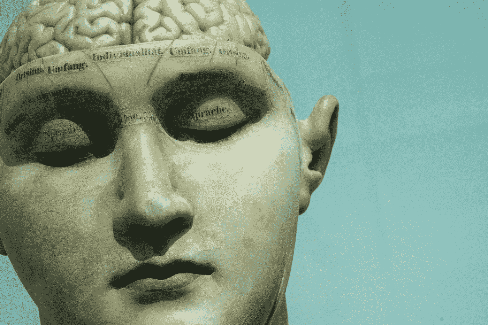

# 我们讲述的关于自己的故事

> 原文：<https://towardsdatascience.com/explainability-and-the-art-of-confabulation-d4fb176de982?source=collection_archive---------25----------------------->

## …人工智能研究中遇到的问题如何反映了我们自己的认知偏差

Photo by [David Matos](https://unsplash.com/@davidmatos?utm_source=medium&utm_medium=referral) on [Unsplash](https://unsplash.com?utm_source=medium&utm_medium=referral)

大脑是一个复杂的器官，数十亿个神经元通过数万亿个连接形成了一个非常复杂的非线性动力系统。这可以说是宇宙中最复杂的结构(至少是我们所知道的)。它可以解决看似无穷无尽的任务，让我们在不断变化的环境中导航和生存。

这可能是你熟悉的说唱，但同时它的一些后果很容易被忽视。因为我们和我们的个性是大脑行为的产物，我们和我们的个性与它的复杂性联系在一起。

这篇文章深入探讨了构成我们的(大部分)不可言喻的机制与我们不断渴望拥有一个关于我们在做什么和想什么的令人信服和连贯的故事之间的冲突。 ***理解我们自己的输出*** 的问题与人工智能研究中的 ***可解释性*** 有一些相似之处。

这种冲突的一些副产品在心理学上被称为 ***认知偏差*** ，其中我们发现了两种可爱的效应，称为 ***认知失调*** 和 ***虚构、*** ，这使我们对自己内心的理解程度产生了疑问。

## 潜意识

> “你没注意到，但你的大脑注意到了。”

在西格蒙德·弗洛伊德假设潜意识存在的 100 多年后，他认为我们在自己的房子里不是真正的主人的观点在某种程度上已经融入了我们的身份。

考虑到大脑的复杂性，你可能会说，大多数时候，我们不知道自己到底在做什么是很自然的，但只是在二十世纪的过程中，人们才开始接受这样一个事实，即我们内心发生的事情比我们有意识意识到的要多得多。我们生活的大部分时间都处于自动驾驶状态，只有当紧急的事情发生时，我们的意识注意力才会集中到它上面(正如我在我之前的文章中提到的关于注意力)。

大脑每秒钟过滤 ***数量惊人的信息*** ，而有意识的头脑只意识到其中的极小一部分，其中大部分都经过了 ***重重的预过滤*** 。几乎所有的过程，无论是运动的、认知的还是情感的， ***都是自动化的，并在主动意识控制之外受到调节*** 。

不仅信息摄取是自动化的，而且决策的做出也与我们每天看到的截然不同:研究表明，如果我们将大脑的情感成分排除在外，仅仅依靠前额叶活动，决策几乎是不可能的(参见安东尼奥·达马西奥的 书 ***事物的奇怪顺序*** 中的概述)。

相反，我们的许多决定严重依赖于身体[和内脏脑](https://www.ncbi.nlm.nih.gov/pmc/articles/PMC3845678/)的 ***模拟能力*** ，与特殊类型的非回肠化神经元进行分布式[并行处理。根据你的 ***直觉行动*** 有着比你可能认为的更精确的科学含义。](https://www.ncbi.nlm.nih.gov/pmc/articles/PMC3845678/)

正如 ***丹尼·卡尼曼和*** 阿莫斯·特沃斯基指出的，由*启动*或*锚定* [引起的偏见会对我们在不确定情况下的决策](https://www.its.caltech.edu/~camerer/Ec101/JudgementUncertainty.pdf)产生强烈影响，我们通常对它们的发生很警觉。

更糟糕的是:有意识地知道我们正在被锚定或启动，仍然不能让我们对它们可能引发的偏见免疫。

## 机器学习和可解释性

人工智能和计算神经科学的研究人员面临着一个有点类似的问题，总结在术语 ***可解释性*** 下。我们如何解释我们的人工智能系统中的新兴智能，并让系统向我们解释它们如何做出决策，同时仍然能够解释它们如何处理信息的细节？

现代机器学习方法不是构建算法来解决某些任务并将它们硬连线到计算机中，而是允许计算机通过处理指定的输入和期望的输出来自行开发算法(有关更详细的概述，请参见 ***Pedro Domingos 的“主算法*** ”)。

Photo by [Sai Kiran Anagani](https://unsplash.com/@_imkiran?utm_source=medium&utm_medium=referral) on [Unsplash](https://unsplash.com?utm_source=medium&utm_medium=referral)

这向我们表明，理解机器在做什么变得越来越困难，而矛盾的是，它们在做各种事情(图像分类、语音识别、下围棋等)方面变得越来越成功。).

有时，它们似乎在没有任何人工干预或试图手动教授它们知识的情况下表现得最好。这促使 Frederick Jelinek(语音识别之父之一)在 IBM 开发语音识别软件时宣称*“每当我解雇一名语言学家，语音识别器的性能就会提高”。*

大型神经网络中的计算 ***分布*** 在整个网络中(在深度神经网络中，也通过几个层，称为隐藏层，具有非线性激活函数)，使得 ***几乎不可能通过构成网络*** 的层来跟踪计算的细节。

网络所代表的算法中隐含的知识同样 ***分布在网络*** 的整个权重结构中，所以你无法看一眼权重就直观地掌握网络擅长的，比如说，对猫或狗的分类。

正如我在我的一些其他文章(例如[蚂蚁和神经网络的问题](/ants-and-the-problems-with-neural-networks-778caa73f77b))中所述，请注意，这是一种与[图灵机](https://medium.com/discourse/a-non-technical-guide-to-turing-machines-f8c6da9596e5)的符号操作非常不同的方法(尽管你当然可以在图灵机上运行神经网络，就像我们在自己的计算机上所做的那样)，现代计算机基于图灵机，其符号操作更类似于理性的逐步推理。

因此，当涉及到“理解”复杂分布式系统中的信息处理时，我们可能会面临原则性的限制，或者至少当涉及到构建高效且能够对自己的行为保持满分的智能系统时，我们会面临限制。

## 叙事的需要

所以毫不奇怪，对于我们大脑中正在进行的一些信息处理，我们人类对于*的可解释性有自己的问题。*

*行为主义者将大脑视为一个黑匣子(类似地专注于输入-输出-关系)，但在心理和社会背景下，我们不断需要找到一种叙事来解释我们正在做什么以及为什么要这样做。*

****但这种叙述，真的有多靠谱？****

*人类是从动物进化而来的，动物们做得非常好，没有不断地告诉彼此是什么激发了它们的故事。*

*但后来我们发展出了不祥的能力，可以互相交谈(更重要的是，可以和自己交谈)。社会和性压力(正如我在关于性选择的文章中所详述的那样)可能是引发像语言这样的高级认知能力发展的最前沿。即使在今天，我们的大量脑力都花在了八卦上，花在了跟踪我们周围的人发生的事情上。*

*从进化的角度来说， ***新皮层*** ，也就是我们的语言能力所在的地方，是我们神经回路的最新成员(在我的文章[为什么智力可能比我们想象的简单](/why-intelligence-might-be-simpler-than-we-think-1d3d7feb5d34)中有更多关于新皮层及其架构的内容)。就其绝对质量而言，它构成了我们大脑的大部分，但这并不意味着它一直在负责，一直“知道”发生了什么。*

*这是大脑功能观的结果:如果大脑的一部分(如语言中心或创建自我模型的大脑区域)想要了解另一部分的活动，指定所述活动的信号需要传播到该大脑区域。*

*应该清楚的是，对于所有时间的所有大脑活动来说，这既不可行也没有效率，甚至在任何情况下都没有必要*。**

**因此，这最终只会增加可解释性的问题:试图进行解释的大脑区域有时会简单地从信息流 中 ***切断，而信息流***会给它们必要的洞察力，就像我们将在裂脑症患者的案例中看到的那样。**

*****还有，我们试着解释一下。*****

**能够保持一个持续不断的叙述有它的用处，而且似乎是社会功能成员非常渴望的。但是我们应该意识到，这并不意味着我们对自己或他人的所思所言都是真实的。**

*****实际上完全相反。*****

## **我们讲述的关于自己的故事**

> **“如果一个特定的观念已经在人类头脑中存在了许多代，就像我们几乎所有的共同观念一样，需要真诚和持续的努力才能消除它；如果这是我们所拥有的最古老的思想之一，一个伟大的、普遍的、不容置疑的世界思想之一，那么那些寻求改变它的人的劳动是巨大的。”夏洛特·珀金斯·吉尔曼**

****

**Even people within stories like compelling stories. Photo by [Road Trip with Raj](https://unsplash.com/@roadtripwithraj?utm_source=medium&utm_medium=referral) on [Unsplash](https://unsplash.com?utm_source=medium&utm_medium=referral)**

**我们对故事有一种强烈的心理倾向。我们在叙述中感知世界(看看[海德尔-西美尔错觉](https://www.youtube.com/watch?v=8FIEZXMUM2I)，它让我们相信两个点和一个三角形参与了一场戏剧性的打斗场景)。作为我们*过度社交的副产品，我们一直在寻找外部世界的代理和因果关系。随之而来的是对我们自己有一个连贯的叙述的渴望:因为这个或那个原因，我是这样或那样的。***

***但正如我们所见，对于许多任务来说，大脑和身体中有大量分布式并行计算，这使得理解和描述我们的动机变得很棘手。***

***因此，我们最终会不断猜测自己行为的原因。***

***此外，很难实现消除矛盾想法的过程。这意味着我们最终都会带着巨大的矛盾走来走去，这只能通过艰苦的批判性思维来克服，即使是受过良好教育的批判性思考者也无法持续练习这一技能。***

***老实说，从进化的角度来说，我们的生存并不真的需要一个 ***完全一致的世界观*** ，所以如果他们不太妨碍彼此，我们的大脑就让他们这样。***

**故事有塑造我们感知的力量，即使我们没有注意到它。大脑(正如我在关于[贝叶斯大脑假说](/the-bayesian-brain-hypothesis-35b98847d331)的文章中所回避的)不断预测其感知输入的内容，所以你会根据你对世界状态的预期看到和听到不同的东西(这使得认知科学家将现实虚构为 ***受控幻觉*** )。当我们不断试图将世界上复杂和混乱的现象转化为简单的，有时明显自相矛盾的故事时，这些故事最终会戏剧性地改变我们对现实的看法。**

## **认知偏差和认知失调**

> **"他很少怀疑，当事实与他对生活的看法相矛盾时，他闭上眼睛表示反对。"
> ― **赫尔曼·黑塞，**赫尔曼·黑塞的童话**

**1957 年，利奥·费斯汀格引入了术语 ***认知失调*** 来表示当我们经历一些与我们的世界观相矛盾的事情时所感到的不适。但这种不适往往是潜意识的，我们倾向于通过对我们不喜欢的事件提出替代性解释，或简单地抛弃它们来应对它。**

**我们避免认知失调的冲动让我们停留在世界观的舒适区，让我们下意识地忽略信息或重构我们认知中令人不安的方面。**

**认知失调通常通过自我辩护来解决，这可能发生在外部和内部。**

**在她的书 ***中，错误是犯了，但不是由我犯的******卡罗尔·塔弗里斯*** 描述了许多案例 ***认知失调回避战术*** 产生了严重后果，从法西斯国家公民社会道德的下降，越战期间的美国政府(参见本·伯恩斯和琳恩·诺维克的[精彩而令人震惊的纪录片](http://www.pbs.org/kenburns/the-vietnam-war/home/))或伊拉克战争，法律制度在面对迟来的无罪证据时的偏见**

**许多决定，特别是道德决定， ***是在对其基础*** 没有任何清晰和理性的理解的情况下做出的(当受试者被巧妙地操纵时，这在实验中变得很明显)，但在做出决定后，它们会导致过度的 ***自我辩护*** ，这反过来会引起受试者世界观的调整，以恢复连贯性并最小化认知失调。**

**一个流行的例子是吸烟者。他或她可能下意识地意识到吸烟的不健康和不合理，但当被问到时，他或她总是以这样或那样的方式为自己辩护(“我只是喜欢这种味道/仪式/社交/在外面/无论哪种方式都不是那么不健康”)。我们中的许多人都有过类似的情况(用吸烟来换取酒精或任何其他不健康的习惯)。我们经常这样做。**

## **分裂的大脑和虚构的艺术**

**有时，大脑试图在事实 变得 ***透明到模仿*** 的程度后，用 ***来证明自己的行为。*****

**也许没有任何地方像裂脑患者这样清楚，他们连接左右半球的胼胝体已经被切断(在[这个短视频](https://www.youtube.com/watch?v=aCv4K5aStdU&t=1s)，你可以看到 ***迈克尔·加扎尼加*** ，这些实验背后的先驱之一，解释了基本的前提)。**

**左右半球不能再交流了，所以左右视野是独立处理的。语言中枢位于 ***左半球*** ，意味着它无法进入*(记住视觉是交叉连线的，所以左半球处理右视野，反之亦然)。***

***如果你只在左视野显示某些东西，这些信息在右半球进行处理，这可以表现为身体反应(例如，当你显示裸体人的照片时，紧张的脸红或傻笑，或者用左手指着某个地方)，但不能被大脑的语言处理部分直接访问。因此，当被问及他/她为什么咯咯笑或指指点点时，病人会当场做出解释。***

***当我们在猜测对自己行为的解释却没有一条至关重要的信息时，我们通常不会说 ***【我不知道】*** ，而只是简单地以 ***编造一些*** ，然后回溯性地将这条信息解释为*。****

***这被称为 ***虚构*** ，每个人几乎一直都在做。虽然在日常生活中，通常无法清楚地表明我们对行为原因的无知程度，但可以肯定地说，我们 ***永远不会完全理解*** 是什么决定了我们的决定(根源可以追溯到复杂信息处理系统的可解释性问题)，因此我们总是编造东西到 ***来理顺叙述*** 。***

## **从中我们能学到什么**

**探究认知偏见可能有点可怕([维基百科列出了 157 个](https://en.wikipedia.org/wiki/List_of_cognitive_biases)，是的，我数过了)，但正如有人曾经说过的，知识是走向智慧的第一步。后退一步，观察你对自己不断的评论，并将其与你内心生活的复杂性进行对比，这可能会很有趣。**

**这可以帮助我们更加留意自己的偏见和虚构。我试着记录那些我发现自己公然胡说八道自己的行为，或者明显试图为自己辩护的时刻，但我并不幻想自己摆脱了偏见。它们在我们心中根深蒂固，以至于认为我们可以克服它们可能只是另一种认知偏见***。如果连[丹尼尔·卡内曼都说](https://www.youtube.com/watch?v=iKLE3TmtFhY)他没有取得太大的进步，这可能是不可能的。*****

**最后，我认为人工智能社区也应该注意这一点。我们的偏见表明，当涉及到我们自己的行为时，我们严重高估了 ***可解释性*** ，所以我们应该意识到机器为自己的行为辩护的能力的潜在局限性。我们强烈希望他们能与我们交流，并公开他们的动机(正如 Lex Fridman 和 David Ferrucci 所言[花一些时间在这里讨论](https://www.youtube.com/watch?v=Whtt2H5_isM))，但我们应该注意他们不会变得太像我们人类。**

**毕竟，我们不希望有整天闲聊的机器人霸主。**