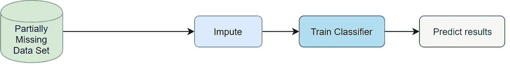

# 缺失数据替换的可解释性

> 原文：<https://towardsdatascience.com/explainability-of-missing-data-replacements-8eb164d68222?source=collection_archive---------23----------------------->

## 替换缺失的数据会让你的机器学习模型更难解释。以下是如何…

Image by [Anemone123](https://pixabay.com/users/Anemone123-2637160/?utm_source=link-attribution&utm_medium=referral&utm_campaign=image&utm_content=2736480) from [Pixabay](https://pixabay.com/?utm_source=link-attribution&utm_medium=referral&utm_campaign=image&utm_content=2736480)

# 介绍

输入缺失值是处理真实数据时的一个重要步骤。有几种常见的方法可以解决这个问题。一些流行的方法包括删除有缺失值的实例，为缺失元素创建一个单独的类别，或使用均值插补。它们不一定有效，还有其他算法，如 [KNN、MICE、MissForest](/why-using-a-mean-for-missing-data-is-a-bad-idea-alternative-imputation-algorithms-837c731c1008) 或 [GANs](/gans-and-missing-data-imputation-815a0cbc4ece) 可以更准确地估算缺失值。

在我的研究实习项目期间，我注意到在用 KNN、小鼠和 MissForest 估算的数据集上训练的分类器实现了更高的准确性，通常是 3-4%。这是一个相当可观的精度增益，而且几乎没有现存的 [Python 库](/why-using-a-mean-for-missing-data-is-a-bad-idea-alternative-imputation-algorithms-837c731c1008)实现这些算法。听起来不错，对吧？

Scheme for computing Classifier accuracy on the dataset with missing values [2]

不幸的是，在获得更高的精确度和得到可解释的结果之间有一个权衡。在这篇文章中，我们将看看缺失数据填补如何影响 ML 模型的可解释性。我文章的一部分将基于[这篇研究论文](https://arxiv.org/pdf/1907.12669.pdf)【1】。我们开始吧！

*我喜欢数据科学的原因是，它吸引了许多对人工智能和数据科学充满热情的志同道合的人。所以在*[*Linkedin*](http://www.linkedin.com/in/kacperkubara?source=post_page---------------------------)*上和你联系会很棒！*

# 不应估算的缺失数据

保存关于缺失的信息对于 ML 模型有时可能是有用的。它还可以使模型更具解释力。

设想一个数据集，其中包含医院患者的信息，这些患者接受了某种疾病的检查。

Hospital patient data with missing values

3 号病人没有被诊断为患病。这就是为什么医生决定不再对*症状 _A* 和*症状 _ b*做进一步的实验室测试。这里的遗漏有一个意思:*患者没有生病，因此遗漏了其他测量值*。如下图所示，患者 3 的输入值是错误的，没有意义。

Hospital patient data with imputed missing values

要保留关于缺失的信息，最好对数据进行一次性编码，并添加新的特性来指示缺失值的出现，如下所示。*(为了避免* [*【哑变量陷阱】*](https://www.algosome.com/articles/dummy-variable-trap-regression.html) *我们可能应该去掉 Symptom_A_No 和 Symptom_B_No，但为了简单起见还是保留在这里)*

Retaining information about missingness — rather than trying to replace it

在输入数据集之前，我们必须谨慎思考。这种归罪有意义吗？如果我们这样做，是否会造成重大信息损失？如果是，在这种情况下，将更难解释基于该估算数据训练的 ML 模型的结果。

重要的是要注意，与我们的直觉相反，如果我们将缺失信息作为另一个特征，ML 模型的准确性可能会得到较低的准确性分数。这取决于估计器算法的性质以及它们在训练和测试阶段如何处理数据。这也是我在文章开头提到的在可解释性和准确性之间的权衡。

# 缺失数据的分布可能不同

数据可能以 3 种不同的方式丢失:MCAR(完全随机丢失)、马尔(随机丢失)和 NMAR(非随机丢失)。详细解释它们超出了本文的范围(如果您想了解更多，可以看看[这篇文章](/how-to-handle-missing-data-8646b18db0d4))。相反，我将关注 NMAR，它通常对可解释性有最大的负面影响。

NMAR 是一种缺失类型，其中缺失的数据取决于要素本身。例如，想象一下在美国进行的一项关于人民收入的调查:

Annual Income with undisclosed data

一些调查参与者没有透露他们的工资。然而，我们不知何故从一个秘密来源得到了这些数据。没有丢失值的完整(真实)数据集如下所示。

Annual Income with a complete (true) set of data

现在知道他们为什么不提工资了吧！他们只是比大多数人挣得多，他们可能不想和其他人分享这些信息。这正是 NMAR 的现状。*数据的缺失与特征本身有关。*在这种情况下，收入高于某个门槛的人在调查中没有透露他们的收入信息。

在 NMAR 的案例中，数据的估算可能会出错。问题是插补算法不知道这些缺失值的分布是什么。他们会假设它类似于整个数据集的分布，这显然是错误的！

让我们看看一个简单的均值插补是如何处理这种情况的:

Missing data replaced with the mean

在 NMAR 的例子中，这些插补的可解释性会受到影响，模型的准确性会下降。正如数据科学家所说:“垃圾进，垃圾出”。

# 摘要

数据插补是机器学习管道中非常重要的一步，因为它会影响数据的质量。数据插补可以通过不同的方式降低机器学习模型的可解释性。有时，应通过创建附加要素来指示值何时缺失，从而保留关于缺失值的信息。NMAR，这种类型的数据缺失，可以使插补更难解释和不正确。还需要记住的是，更复杂的插补算法倾向于以更难解释的方式对数据进行插补，这会影响 ML 模型的可解释性。

# 参考

[1][https://arxiv.org/pdf/1907.12669.pdf](https://arxiv.org/pdf/1907.12669.pdf)

[2] [IT 创新中心](http://www.it-innovation.soton.ac.uk/)