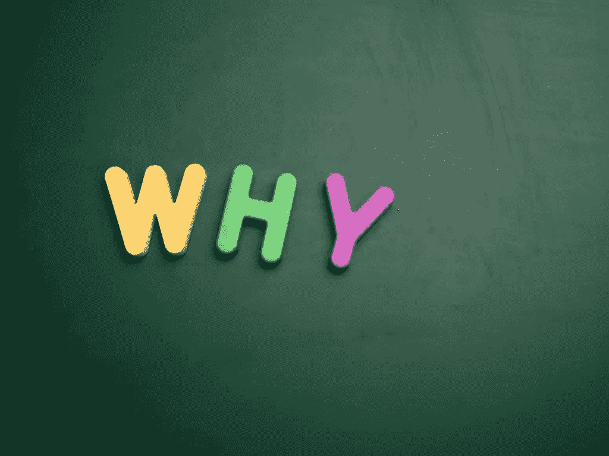

# 可解释性——下一个前沿

> 原文：<https://towardsdatascience.com/explainability-the-next-frontier-d2dd5e572d0b?source=collection_archive---------25----------------------->

## 为什么不确定性是人工智能的一个特征，而不是一个缺陷

The billion dollar question

50 多年来，计算机一直是我们生活的一部分。它们最初是只有大公司才使用的巨大装置，它们的最新版本是我们放在口袋里的微型智能手机。

纵观我们与计算机互动的历史，我们主要把它们作为扩展我们能力的一种手段。它们让我们能够更高效地写作，更轻松地编辑照片和视频，即时获取信息。

在这样做的时候，他们遵循了古老的机器范式:以可靠的方式运行的人类结构，其存在的唯一目的是为了让我们的生活更容易完成某项特定任务。从战车，到引擎和汽车，再到计算机，所有这些东西都是为了帮助我们解决特定问题而创造的。

尽管我们人类喜欢抱怨我们的机器无法正确为我们服务的各种方式，从史前战车抛锚到现代计算机显示可怕的蓝屏死亡，但事实是，大多数时候这些机器工作得惊人地好。

考虑一下你的车多久坏一次。如果你特别不幸，那可能是每三个月一次。或者想想现在你需要多长时间重启一次电脑。每周一次？也许每隔一周？这在他们的功能周期中所占的比例非常小。

更重要的是，能工作的机器和不能工作的机器之间有一条清晰的分界线。你的车要么前进，要么不前进，你很清楚是前进还是不前进。你的电脑要么运行，要么不运行——同样，这里没有模糊的界限。

这使得我们与机器的交互变得异常简单。我们需要从他们那里得到某种效用。我们的汽车应该把我们从 A 点送到 B 点，它们要么能做到，要么不能。我们的电脑应该帮助我们写作、编辑照片或网上冲浪，反过来，它们要么胜任这项任务，要么不胜任。作为用户，我们可以立即判断出这是一个还是另一个。

更重要的是，我们从来不会再三考虑是否存在某种中间状态，一种中间状态，在这种状态下，事情可以做，也可以不做。当然，我们的汽车发动机罩下可能会有一些我们没有意识到的问题，但我们的汽车会很高兴地缓慢前行，直到问题变得足够严重，足以抛锚。或者在我们电脑的操作系统中可能有某种未知的病毒，但我们不会意识到这一点，直到事情开始严重失灵。

我们与机器的互动是基于这种基本的二进制操作模式。它们要么“开”要么“关”，要么完全不起作用，要么 100%可靠。

但是在过去的几年里发生了一些变化。我们的机器变得能够以不同的模式运行，一种新的状态，在这种状态下，事情不会“只是”工作或不工作。他们现在已经进入了不确定的领域，这是迄今为止计算机尚未探索的领域，也是迄今为止人类独有的特权。

## 不确定状态

什么是不确定性？这是一个与世界特定地区有着内在联系的概念。当你想到明天的天气时，会有一定的不确定性。或者，股票市场因其带来的不确定性而臭名昭著。即使被认为是简单的任务也有相关的不确定性:这条信息是真实的吗？那真的是我想买的咖啡机吗？我是真的生病了，还是只是过敏？

直到最近，这些问题只能向我们自己或其他人提出。在大多数情况下，我们不会得到简单的是或否的答案。即使我们这样做了，我们也会(或者应该)要求一些正当的理由。毫无疑问，有时我们可能会与某种更高的权威对话:例如医生、律师或牧师。但即使是他们也不能免于证明他们对感兴趣的主题的观点(也许除了牧师！).

为什么我们拒绝接受一个不合理的观点？这是因为我们知道，每一种观点中都有一种固有的不确定性概念。这也是因为这些问题的答案将为达成进一步的决定提供一个垫脚石。我们希望有一个坚实的基础来构建我们的生活，这就是为什么我们需要对别人告诉我们的有一些信心。

## 信任

> 建立信任需要付出巨大的努力，但却极易失去

一个人避免向他人证明自己观点的唯一方法是培养一种难以置信的信任感，让他们的观点不受审查(顺便说一句，牧师就是这样逃脱的！).这将使他们能够避免为他们所有的答案找理由，因为他们在过去已经有了做对事情的良好记录。

信任需要付出巨大的努力来建立，但却极易失去。这是一个众所周知的人性事实，尤其是因为失去对被证明会把我们引入歧途的人的信任是一种非常有用的防御机制，可以抵御那些试图利用其权威地位的人。

## 可解释性

> 他们错了，因为任何实体在不确定的情况下做出选择的那一刻，这些选择有能力影响人类的生活，然后这个实体成为我们社会生态系统的一部分，因此，它获得了改变我们世界的能力——无论是好是坏

这和电脑有什么关系？如前所述，他们现在正走向不确定的领域。他们需要表达意见或做出不确定的决定。我们要求亚马逊为我们找到价格合适的产品。我们请求谷歌为我们提供准确的信息，请求脸书提供最新的新闻。我们有算法可以监测我们的健康状况，决定我们再次犯罪的可能性，或者浏览一堆简历来找到合适的候选人。

我们知道没有万无一失的方法来满足这些要求，我们当然也不会要求人类做出 100%正确的决定。然而，如果我们没有办法仔细检查专家的诚意和可靠性，我们永远不会相信人类专家会为我们做所有这些决定。事实上，如果一个对这一切负责的人只是为所欲为，却从未被要求解释他们的行为，我们会认为这是对我们民主的绝对冒犯。如果提供任何一种解释都超出了他们的思维能力，那就更荒谬了。我们绝对不会允许一个人这么做，是吗？我们会吗？

那么，我们为什么允许机器使用它呢？听起来可能很可笑，因为这个想法直到最近才出现在我们的脑海中。还记得我们是如何习惯于把我们的机器想象成总是在“开”和“关”两种状态之间运行的有限生物吗？还记得我们如何从未预料到可能会有某种形式的中间地带，一个薛定谔的盒子，在那里我们的机器将同时开启和关闭，或者，更好的是，它们将进入不确定的领域，我们人类认为这是机器智能的最后一个前沿。

他们确实进入了那个领域。当我们决定使用算法为我们做出这种重要决定的时候，当我们决定使用算法来模拟世界中具有内在不确定性的部分的时候，他们就做到了。

我们认为，在我们遇到这种伦理困境之前，我们需要创造一个具有人类思维能力的机器，一个真正的通用人工智能。这就是为什么我们高兴地让我们的算法承担人类专家的角色，因为我们从未想过这会产生任何问题。

甚至在今天，人们还在谈论机器，认为它们是冷酷的计算实体，不偏不倚，因此在决策方面比人更好。他们永远不会不公平或有偏见，因为他们没有感情或经历偏见。遗憾的是，这种言论也来自当今数据科学前沿的人们。

事实是他们错了。

更不用说隐私、平衡数据集、公平或任何其他目前吸引机器学习社区的流行语了。他们错了，因为任何实体在不确定的情况下做出选择的那一刻，这些选择有能力影响人类的生活，然后这个实体成为我们社会生态系统的一部分，因此，它获得了改变我们世界的能力——无论是好是坏。

在谷歌和其他公司在我们的社会中获得如此突出的地位后，我们发现自己正处于这种状态。我们没有想过这些算法可能在引擎盖下出现故障，这种故障是他们设计的一部分——一个功能，而不是一个错误。直到问题开始出现，我们才注意到。

任何涉及不确定性的决策，世界上任何不确定的部分(我们的世界中没有任何东西是确定的)，都不能以模仿我们习惯的机器可靠性的方式进行建模。天气预报准确率可以达到 90%。可能 99%。可能是 99.9999999%。没关系。总会有一个错误，这个错误导致了不确定性的过渡。

你什么时候是对的？你什么时候错了？我什么时候能相信你？这些是每个正常人在向机器提出这些问题时都应该问的问题。如果在接收端有一个人，我们会问这些问题。

但是我们没有。我们已经被与机器互动的漫长历史所愚弄，这些机器明确无误地“开”或“关”，以至于我们放松了警惕。我们被允许被机械“神谕”所统治，这些机器声称会如实回答我们所有的问题。除了他们永远不能做到这一点，不是吗？

## 接受

> 如果你的医生说他们在医学院的考试中获得了 95%的分数，但不幸的是，他们不能为他们的专业意见提供额外的理由，你会满意吗？你会相信他们的话吗？

我们怎样才能摆脱这种困境？我们怎样才能让公众知道他们现在面对的机器是不可靠的，永远也不会可靠？我们如何处理这种认识的后果？我们如何回来帮助智能机器在我们的世界中重新获得应有的地位，尽管是以一种更负责任的方式？

我们只有一种方法来处理这种不确定性。作为人类，我们经常需要证明我们的决定和信念是正确的，而正是我们论据的有力度(或不足)决定了其他人对我们观点的重视程度。我们应该让我们的算法保持同样的高标准。

我们目前用来创造智能机器的方式。我们定义一个问题。这个问题可能很简单:你在这张图片中看到的是一只猫还是一只狗？然后我们收集了很多猫狗的图片，我们反复的给我们的算法看，让它回答我们的问题，并且好心的让它知道它什么时候回答对了，什么时候回答错了。然后，我们在一组它从未见过的图片上测试它的新知识。我们测量它得到的正确答案的百分比，并高兴地报告我们的算法的准确性。然后我们把这个算法部署在一个真实世界的系统中，这个系统试图回答不同人提出的同一个问题。

如果我们只是想让我们的智能手机在我们的照片上自动标记我们的狗，这可能是非常无辜的，甚至当它误认为我们邻居的猫时，它可能会很可爱，但如果我们谈论一个更严重的应用程序，事情可能会变得很糟糕。

比方说，在你做完检查后，你走进一个医生的办公室，医生告诉你你得了癌症。你可能会说，“等一下，医生”。“你是如何得出那个结论的？”

如果你的医生说他们在医学院的考试中获得了 95%的分数，但不幸的是，他们不能为他们的专业意见提供额外的理由，你会满意吗？你会相信他们的话吗？

如果一个医生说:你的检查显示了这个和那个，这就是为什么我认为你得了癌症，你不会更开心吗？即使你不明白他们在说什么，难道你不会更信任他们吗？

作为科学家和实践者，这是我们应该坚持的标准。

## 继续前进

> 我们可以停止认为自己超越了一个功能社会中每个成员的道德标准

它也不在我们手中。无论我们是否愿意，更广泛的公众将很快开始支持我们的算法达到同样的标准。在一些地区，他们已经开始了。我们可以继续否认这一事实，我们可以继续坚持机器学习算法不需要解释它们自己，它们在某种程度上超越了这一点(就像牧师曾经是！)，而且我们应该只是专注于让他们表现得更好。

我们可以，但当公众超越我们时，我们不应该抱怨。当规章制度降临到我们头上时。我们可以抗议他们，我们可以谈论落后的监管者，他们看不到进步的道路。我们可以认为自己精神上高人一等，因为我们是科学家。我们可以看不起我们本该服务的社会。

或者我们可以承认这样一个事实，我们还没有达到我们想要的目标。我们可以承认公众的恐惧。我们可以专注于我们的算法确实可以改善人类生活的情况，远离那些弊大于利的情况。我们可以停止认为自己超越了一个功能社会中每个成员的道德标准。

离开学术界进入现实世界就是这样。

你长大了。