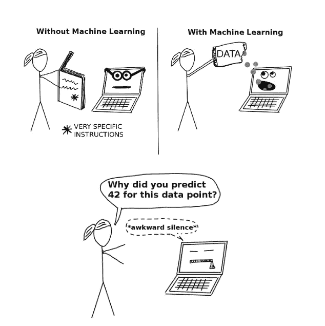

# 可解释的人工智能(第一部分):解释和机会

> 原文：<https://towardsdatascience.com/explainable-ai-part-i-explanations-and-opportunities-5c2734c23d6e?source=collection_archive---------20----------------------->

*本文基于 2019 年 10 月 7 日在柏林机器学习小组上提交的材料。原故事首发于* [*丹工作室网站*](https://dainstudios.com/2019/10/24/explainable-ai-part-1/) *。*

随着 ML / AI 领域的成熟和复杂模型在新的(和关键的)行业中的部署，新的挑战出现了。其中最常见的一个是认为这些模型就像黑盒一样，也就是说，很难理解它们是如何工作的以及它们预测背后的推理。与此同时，消除偏差(即发现模型在预测中使用了歧视性特征)的努力也在不断增加。这两者都导致对这些人工智能系统的不信任程度上升。解决这些问题的领域被称为可解释的人工智能，简称 xAI。在这篇博文中，我将带你了解这个领域背后的动机。

## 警告/夸大其词

在开始之前，我想提出一些警告。虽然机器学习的“黑盒子”不是一个新话题，自从第一个算法被创建以来就一直是一个问题，但新一波的可解释性方法是一个相对较新的发展。由于这是最近的事，该领域的许多方法还没有在不同的环境中彻底测试过，关于该主题的学术工作也很少。这就是为什么在关键生产系统中使用这些方法时要非常小心，并且在盲目应用之前要彻底研究这些方法。

不幸的是，赛也陷入了炒作和流行词风暴，而一般人工智能领域是受害者。这种炒作会掩盖使用这些方法的价值和危险，并使选择最佳方法变得困难。

## 什么是 xAI？

作为第一步，让我们定义 xAI。尽管这两个术语在这个领域有所不同，但为了简单起见，我们将交替使用可解释性和可解释性这两个词。我找到的最佳定义是这个:

> *可解释性是人类能够理解决策原因的程度(Miller，2017)。*

我们可以把重点放在这个定义中的两个具体的词上——**人**和**决策**。这表明该领域最重要的思想是帮助人类理解机器学习系统。

## 我们为什么需要它

在机器学习出现之前的计算世界中，机器做出的决定是以非常严格的方式执行的。这使得这类程序的结果更容易理解，因为你所要做的就是理解源代码。然而，如今，即使是经验丰富的数据科学家也可能难以解释他们模型的预测原理，这个过程似乎很神奇——给出数据，为预测(决策)添加目标，然后得到结果——中间没有任何东西向你展示决策过程的暗示。下图说明了这个问题:

*Image source: Interpretable Machine Learning (C. Molnar)*

xAI 领域发展的另一个非常重要的推动因素是关键行业中生产级 ML 系统的日益成熟。虽然在 2009 年左右，大多数部署的机器学习系统都是在技术领先公司(即谷歌、Youtube)的产品中，错误的预测会导致向应用程序用户显示错误的建议，但现在这些算法部署在军事、医疗保健和金融等领域。这些新的人工智能行业的预测结果可能会对许多人的生活产生深远而巨大的影响——因此，我们必须知道这些系统是如何做出决定的。

*Image source: DARPA (*[*https://www.darpa.mil/program/explainable-artificial-intelligence*](https://www.darpa.mil/program/explainable-artificial-intelligence)*). DoD stands for Department of Defense.*

与这一主题相关的还有《GDPR》和“解释权”等法律。将机器学习模型部署到生产中的数据科学家可能有法律义务解释它如何做出决定，如果这个决定对人有很大影响的话。

xAi 也有利于应用程序的最终用户。有了这样的系统，他们会更加信任。让我们以一个人工智能驱动的医疗保健应用为例。在这种情况下经常发生的是，技术团队向领域专家(或应用程序用户，在这种情况下)报告模型性能。工程师们报告说，该模型在预测病人是否患有某种疾病方面达到了 95%的准确率。大多数时候，医疗从业者会对这样的结果表示怀疑——说这根本不可能那么准确。如果在这种情况下，我们使用诸如本地可解释的模型不可知解释(LIME)的方法来解释为什么某个患者被分类为没有生病，则应该提高系统中的信任级别。医生应该能够看到，在提供诊断时，模型与他们的逻辑非常相似。这种情况如下图所示，模型显示，即使患者有一些症状，如打喷嚏和头痛，他们也没有生病，因为他们没有表现出疲劳。

*Image source: Ribeiro, M. T., Singh, S., & Guestrin, C. (2016). “Why Should I Trust You?”: Explaining the Predictions of Any Classifier.* [*https://doi.org/10.18653/v1/N16-3020*](https://doi.org/10.18653/v1/N16-3020)

现在，我们介绍了 xAI 的基础知识及其机遇。在接下来的文章中，我们将分享哪些方法和相关的软件工具可用于 xAI。

如果 10 月 29 日你在柏林，我将会和我的同事 Thomas Nguyen 在柏林的 AI in Action 上就这个话题展开讨论。这里有一个报名链接**。**