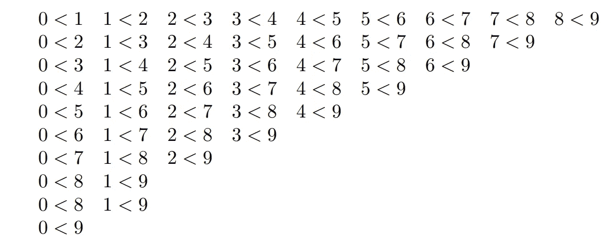
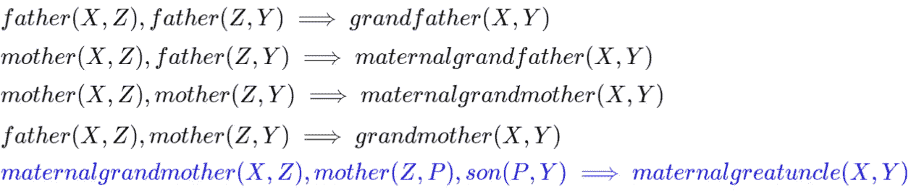

# 可解释的人工智能与解释人工智能——第二部分

> 原文：<https://towardsdatascience.com/explainable-ai-vs-explaining-ai-part-2-statistical-intuitive-vs-symbolic-reasoning-systems-8b05f8e0a3a0?source=collection_archive---------19----------------------->

## 统计直觉与符号推理系统


20 世纪初，聪明的马汉斯表现出非凡的回答算术问题的能力。汉斯用蹄子敲击数字或字母来回答问题。这种行为吸引了全世界的注意，他是第一个聪明的动物。然而，经过一些实验后，汉斯似乎有偏见，从他的人类观察者那里读取潜意识线索，并挖掘出适当的答案。

> 汉斯是如何做出决定的？

聪明的汉斯利用统计偏差来完成他的任务；这种方法在不理解背景符号推理模型的情况下寻找数据集中的关系。

在前一部分，我们介绍了两种思维系统以及它们与可解释性、概括能力和学习速度的关系。这一部分对系统 1 和系统 2 进行了更深入的比较，我将这两个系统分别称为统计直觉系统(“聪明的汉斯”系统)和符号推理系统。

# 统计直观系统

直觉与自动决策和反思有关。[直觉](https://www.lesswrong.com/posts/GSQsAReasGjETP3e9/biases-of-intuitive-and-logical-thinkers)是在没有完全信息的情况下做出决定的能力，它使我们能够在没有对某个领域[深刻逻辑理解](https://www.lesswrong.com/lw/1yq/understanding_your_understanding/)的情况下做出决定。直觉系统使用历史证据来证明其论点的力量。直觉系统更关心两个历史事件 A(下雨)和 B(打伞)之间的相关性，而不是对它们之间的关系进行推理。因此，为了证明:**如果下雨，那么人们带着雨伞，**直觉系统使用频繁一起观察两个事件的历史统计证据。而逻辑系统将解决这个问题，并试图用一些常识和逻辑背景来证明它，例如:雨由水组成，水使人潮湿，人们不喜欢淋湿，雨伞挡住了雨。逻辑系统知道带伞并不意味着下雨，所以下雨导致带伞，而不是相反。所以直觉系统是我们大脑中懒惰的部分(聪明的汉斯诡计)，不一定是明智的部分，但在大多数时候可能是正确的，特别是如果历史证据是强有力的。

经典的统计机器学习算法使用直觉来做出决策。他们都建立了一个过去经验的数学模型，并利用它来进行自动反思。深度学习通过构建高级特征添加了一些推理，但它仍然使用统计偏差做出最终决策(决策层)。

大多数基于深度学习的统计直观系统具有以下特征:

1.  窄(用于特定领域，如数字识别)
2.  从历史数据或经验中学习(监督、非监督或强化学习)
3.  克服维数灾难:构建低级输入 x 的高级表示
4.  依赖于 i.i.d .假设:假设测试分布与训练分布相同
5.  由于 i.i.d .的假设，这个系统需要大量的训练数据。训练分布必须尽可能的一般，而这个系统在训练分布之外的推理能力很弱
6.  从输入到输出的映射不包含搜索过程，即在许多可能的决策空间中搜索最优决策，或搜索逻辑论证以实现其决策

在本文中，我将使用深度学习(DL)作为直观系统的主要代表，它接受低级输入(语音、图像或文本)，降低维度，并将输入映射到高级表示空间，在该空间中，它可以轻松地在不同目标(类、事件)之间建立决策函数，参见图 1。


Figure 1: [http://colah.github.io/posts/2014-03-NN-Manifolds-Topology/](http://colah.github.io/posts/2014-03-NN-Manifolds-Topology/)

目前有很多 DL 可以做什么的例子，比如语音识别、自动驾驶汽车和机器翻译，但我们来讨论一下什么对深度学习具有挑战性。

> 当涉及到符号计算时，深度网络往往在泛化方面失败。

以标量恒等函数为例，它是最简单的符号计算之一。已经完成了一个[实验](https://arxiv.org/abs/1808.00508)来训练一个自动编码器，该自动编码器采用一个标量输入(例如，数字 4)，在一个潜在空间(分布式表示)中对其进行编码，然后再次预测输入值(数字 4)作为最后一个隐藏层的线性回归。使用不同的自动编码器，它们具有不同的激活功能和范围在-5 和 5 之间的输入。在本实验中，对范围> 5 或< -5 内的输入进行了泛化测试。结果显示，所有的网络都未能一般化(图 2)。


[Figure 2: MLPs learn the identity function only for the range of values they are trained on. The mean error ramps up severely both below and above the range of numbers seen during training](https://arxiv.org/abs/1808.00508)

符号运算的另一个例子是使用比较运算符(< > ≤ ≥ =)。在论文 [*从嘈杂的数据*](https://deepmind.com/blog/learning-explanatory-rules-noisy-data/) 中学习解释规则，Deepmind 的科学家们实验训练了一个 CNN 模型，该模型比较了两幅 MNIST 图像，并在右侧图像中识别的数字大于左侧图像中的数字时给出真实值(图 3)。


*Figure 3: A DNN system that compares two MNIST images and give a true value when the recognized number of the right image is greater than the number of the right image.* [*Learning explanatory rules from noisy data*](https://deepmind.com/blog/learning-explanatory-rules-noisy-data/)

如果我们训练 CNN 模型来完成这项任务，我们需要创建一个数据集，其中包含每对数字的几个例子；只有这样，它才能概括。例如，在下图中，我们看到一组介于 0 和 9 之间的所有可能的数字对，应用< relation (Figure 4).



Figure 4: *Application of the ‘<’ (less-than) relation to every possible pair of digits between 0 and 9*

So, if the training data set contains a set of different images for every pair of digits in Figure 4, then the DL system will be able to generalize correctly. However, it will generalize visually rather than symbolically. In other words, whenever this system receives two images, it will map them to their similar training pair (again “Clever Hans” trick), and if that training pair is part of the list in Figure 4, then it will predict 1, or True.

> How to test if the system generalizes the symbolic relation?

Suppose the training set of pairs is like that depicted in Figure 5; then, the system will most likely fail to predict the relations 7<9, 2<8, and so forth (Figure 6). It will be able to recognize the 7, 9, 2 and 8 digits because it has seen many images of them (i.e in 8<9). So it generalizes visually but not symbolically.


Figure 5: *Application of the “less-than” relationship with some pair of digits between 0 and 9 removed*


Figure 6: the difference between Visual and Symbolic generalization, [*Learning explanatory rules from noisy data*](https://deepmind.com/blog/learning-explanatory-rules-noisy-data/)

Most symbolic operations, such as simple arithmetic, propositional logic, first-order logic and spatial relations (e.g. object 1 is above, under, before or after object 2) are challenging for the intuitive system, especially when it comes to generalization.

# Symbolic Reasoning System

[推理](https://arxiv.org/ftp/arxiv/papers/1102/1102.1808.pdf)可以被定义为历史知识的代数操作，以便回答一个新问题。这种操作可以包括在不同解的代数空间中搜索。

该推理系统具有以下特点:

1.  它需要一个知识库(关系、非关系或图形数据库)。参见图 7 中的系谱图。
2.  它需要符号事实、规则和关系的集合，如图 8 所示。


Figure 7: [A knowledge graph of a family tree](https://deepmind.com/blog/differentiable-neural-computers/), [*Learning explanatory rules from noisy data*](https://deepmind.com/blog/learning-explanatory-rules-noisy-data/)



Figure 8: Symbolic clauses about the family tree

3.它需要一个推理引擎，通过使用一组规则和知识库，接受一个问题或查询并生成一个答案。例如，如果我问“谁是芙蕾雅的外叔祖？”，推理机将在图 8 的子句空间中搜索解决方案，并应用演绎规则，如**替换**。

第一个选择将是最后一个子句(在图中用蓝色表示)。这条规则的第一个谓词是 maternal 祖母(芙蕾雅？).通过检查第三个子句，我们看到“maternal 祖母”有谓词 mother(X，Z)，mother(Z，Y)的连词，基本上说的是“如果 Y 是 Z 的母亲，Z 是 X 的母亲，那么 Y 是 X 的外祖母。”

因此，引擎将首先使用第三个子句找到芙蕾雅的外祖母，即夏洛特，然后是夏洛特的母亲，即林赛，最后是林赛的儿子，即弗格斯，他是芙蕾雅的外祖父(图 9)。


Figure 9 : Reasoning about the family tree, [*Learning explanatory rules from noisy data*](https://deepmind.com/blog/learning-explanatory-rules-noisy-data/)

正如我们在前面的例子中看到的，符号人工智能涉及一个搜索过程。在这方面，研究人员提出了不同的搜索算法，如目标树搜索(也称为 And-Or 树)和蒙特卡罗树搜索。

让我们再举一个例子，看看我们如何在归纳逻辑编程中使用树搜索，这是一个符号人工智能领域，专注于从数据中学习逻辑子句——这也被认为是机器学习的一部分。假设我们有图 10 中的真值表，我们想要找到正确的逻辑子句来预测给定三个输入 *A、B* 和 *C* 的 *Y* 。


Figure 10: A truth table

第一步是写出所有的迷你表达式，其中 *Y* 为真，如下所示:


(1)

符号简化系统应该找到的目标表达式是:


(2)

为了解决这个问题，自动符号简化 AI 将需要一组简化(问题简化)规则。然后，它将启动一个搜索树，在树的每个节点，它将选择一个或多个术语，然后它将应用一个最适合的简化规则。


Figure 11: A Search tree for logic simplification

在图 11 中，我们看到了一个例子，说明了如何使用树搜索结合背景知识(简化法则)来查找图 10 中真值表的最简单的布尔表达式。

这个问题的 python 实现如下:

```
from sympy import *  # python symbolic package
from sympy.logic import SOPformimport numpy as np
import time # will use it to estimate the processing timea, b, c = symbols('a b c') # create the four three symbols in Fig 10minterms = [[0, 0, 1], [1, 0, 1],[0, 1, 1], [1, 1, 0], [1, 1, 1]] # the terms/rows in Fig 10, where y = 1tic = time.clock()expr = SOPform([a,b,c], minterms)toc = time.clock()
print('expression :', expr)
print('processing time:', toc-tic)
```

结果是:

```
expression : c | (a & b) 
processing time: 0.0005342439999989068
```

正如我们所见，实现它并从训练数据/真值表中找到正确的布尔表达式是非常容易的。直到现在，到目前为止，我们已经看到了两个象征性 AI 可以做什么的例子。但是

> 符号系统中的挑战是什么？

**符号系统的局限性**

上面的例子是归纳逻辑编程的一个简单例子，我们用来寻找最优解的技术有以下限制:

1.  **计算开销大**:假设我们有一个包含 15 个变量的真值表。目标表达式和 python 代码如下:


```
from sympy import *  # python symbolic package
from sympy.logic import SOPform
import itertools
import pandas as pd
import numpy as npsm = symbols('x0:10')# create the truth table out of 15 boolean variablesimport itertools
import pandas as pd
n = len(sm)
truth_table = list(itertools.product([0, 1], repeat=n))# create a DataFrame of the truth tabletruth_table_df= pd.DataFrame(truth_table, columns= np.asarray(sm).astype('str'))# write a target logical expression, that the sympy should findy=(truth_table_df['x0'] & ~truth_table_df['x1'] & truth_table_df['x2']) | (truth_table_df['x3'] & ~truth_table_df['x4'] & truth_table_df['x5']) | (truth_table_df['x6'] & truth_table_df['x7'] & ~truth_table_df['x8'] & ~truth_table_df['x9'])# find the miniterms, where y is trueminterms=truth_table_df[y==1].values.tolist()# Run simplification codetic = time.clock() # starting timeexpr = SOPform(sm, minterms) # find the expressiontoc = time.clock() # end timeprint('expression :', expr)
print('processing time:', toc-tic)
```

结果是:

```
expression : (x0 & x2 & ~x1) | (x3 & x5 & ~x4) | (x6 & x7 & ~x8 & ~x9)
processing time: 2.3627283299997544
```

如果我们将这个例子的处理时间与只有三个变量的例子进行比较，我们会发现，根据变量的数量和解决方案的复杂性，处理时间会呈指数增长。

2.**对噪声敏感**:假设上一步的问题又增加了两个变量。这两个变量被赋予一些随机值，并且目标表达式是相同的:

```
from sympy import *  # python symbolic package
from sympy.logic import SOPform
import itertools
import pandas as pd
import numpy as npsm = symbols(‘x0:12’)# create the truth table out of 15 boolean variablesn = len(sm)
truth_table = list(itertools.product([0, 1], repeat=n))# create a DataFrame of the truth tabletruth_table_df= pd.DataFrame(truth_table, columns= np.asarray(sm).astype(‘str’))# write a target logical expression, that the sympy should findy=(truth_table_df[‘x0’] & ~truth_table_df[‘x1’] & truth_table_df[‘x2’]) | (truth_table_df[‘x3’] & ~truth_table_df[‘x4’] & truth_table_df[‘x5’]) | (truth_table_df[‘x6’] & truth_table_df[‘x7’] & ~truth_table_df[‘x8’] & ~truth_table_df[‘x9’])# find the miniterms, where y is trueminterms=truth_table_df[y==1].values.tolist()# Run simplification codetic = time.clock() # starting timeexpr = SOPform(sm, minterms) # find the expressiontoc = time.clock() # end time
print(‘expression :’, expr)
print(‘processing time:’, toc-tic)
```

结果是:

```
expression : (x0 & x2 & ~x1) | (x3 & x5 & ~x4) | (x6 & x7 & ~x8 & ~x9)
processing time: 207.635452686
```

正如我们所看到的，解决方案是正确的，但是尽管我们只添加了两个变量，处理时间却要长一百倍。

3.**对错误标签敏感**:假设我们反转一些 *Y* 值:

```
from sympy import *  # python symbolic package
from sympy.logic import SOPform
import itertools
import pandas as pd
import numpy as npsm = symbols('x0:10')# create the truth table out of 15 boolean variablesimport itertools
import pandas as pd
n = len(sm)
truth_table = list(itertools.product([0, 1], repeat=n))# create a DataFrame of the truth tabletruth_table_df= pd.DataFrame(truth_table, columns= np.asarray(sm).astype('str'))# write a target logical expression, that the sympy should findy=(truth_table_df['x0'] & ~truth_table_df['x1'] & truth_table_df['x2']) | (truth_table_df['x3'] & ~truth_table_df['x4'] & truth_table_df['x5']) | (truth_table_df['x6'] & truth_table_df['x7'] & ~truth_table_df['x8'] & ~truth_table_df['x9'])#reverse 2 random rows (mislabled)mislabels= abs(1-y.sample(n=2))
y.iloc[mislabels.index] = mislabels# find the miniterms, where y is true
minterms=truth_table_df[y==1].values.tolist()# Run simplification codetic = time.clock() # starting timeexpr = SOPform(sm, minterms) # find the expressiontoc = time.clock() # end time
print(‘expression :’, expr)
print(‘processing time:’, toc-tic)
```

那么结果就是

```
expression : (x0 & x2 & ~x1) | (x3 & x5 & ~x4) | (x6 & x7 & ~x8 & ~x9) | (x1 & x2 & x4 & x5 & x7 & x8 & ~x0 & ~x3 & ~x6 & ~x9) | (x0 & x2 & x9 & ~x3 & ~x4 & ~x5 & ~x6 & ~x7 & ~x8)
processing time: 2.4316794240000945
```

正如我们所看到的，只有两个标签错误的行创建了一个不正确的表达式。如果噪音和错误标签结合在一起会怎样？

那么结果就更糟了:

```
expression : (x3 & x5 & ~x4) | (x0 & x11 & x2 & ~x1) | (x0 & x2 & x5 & ~x1) | (x0 & x2 & x8 & ~x1) | (x0 & x2 & x9 & ~x1) | (x0 & x2 & ~x1 & ~x10) | (x0 & x2 & ~x1 & ~x3) | (x0 & x2 & ~x1 & ~x4) | (x0 & x2 & ~x1 & ~x6) | (x6 & x7 & ~x8 & ~x9) | (x1 & x11 & x3 & x4 & x8 & ~x0 & ~x10 & ~x2 & ~x5 & ~x6 & ~x7 & ~x9)processing time: 181.49175330699995
```

**4。对**的敏感**的暧昧**:

逻辑项 X0 = 1，意味着 X0 等于 1 且仅等于 1。如果我们不确定 X0 = 1 呢？

> 不确定性在符号系统中具有挑战性

考虑两个 MNIST 图像比较的例子(见上文)。给定使用归纳一阶逻辑编程的小训练示例，我们可以分别容易地学习和概括操作


Figure 12: Logical clause for the < operation

Basically, X is a number and Y is a number; Y is greater than X if there is a number Z, where Z is a successor of Y and X is a successor of Z. But what if the inputs X and Y for this system are images and not numbers, and we want first to recognize the digits of X and Y and then apply the clause in Figure 12?

How can that be done with symbolic AI? Suppose the digit image dimensions are 5 x 5, so we have 25 Boolean inputs. Then, the binary images of the two digits 0,1 are as follows:


and the the expressions for 0 and 1 are:


Other digits from 2 till 9 can be represented in the same way. By using these expressions we can recognize the digit in the image first and then apply the clause in Figure 11\. But what if the training set consists of non binary images and the digits are ambiguous as in Figure 13, then the symbolic solution will become much more complex to find and to generalize, while a statistical machine learning approach would do the job much better.


Figure 13: Ambiguous image of digit 0

# Summary:

I introduced a brief comparison between statistical and symbolic machine learning, which I referred to as *直观*和*符号*系统。每个系统的优点和缺点都已经介绍过了，并可以在下表中进行总结:


最近，有很多研究来克服直觉和符号系统的局限性。大多数提出的技术结合了两个系统的特征来实现目标。在接下来的部分中，我们将介绍这些旨在弥合符号人工智能和统计人工智能之间鸿沟的技术。

最后，我将以下面的论点来结束这一部分:

> 为什么 4 比 5 小？你可以用你的符号系统很容易地解释原因(例如，因为 5 = 4+1，或者 5 是 4 的后继者)
> 
> 现在如果我问你为什么你现在看到下面的数字 4，你能回答吗？不，因为这是我们直觉系统的作用。

敬请期待！