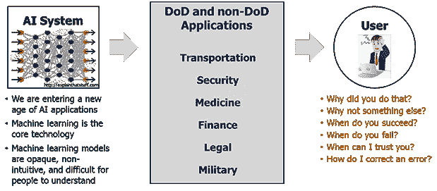
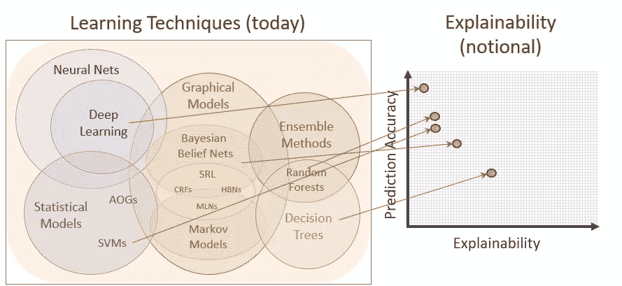

# 可解释的人工智能(XAI)在 DARPA 的议程上——为什么你应该关注

> 原文：<https://towardsdatascience.com/explainable-artificial-intelligence-xai-is-on-darpas-agenda-why-you-should-pay-attention-b63afcf284b5?source=collection_archive---------24----------------------->

Explainable Artificial Intelligence — DARPA

## 当 DARPA 决定资助一项计划时，我们马上就能确定几件事。

1.  这是个大问题
2.  解决这个问题具有巨大的潜在影响——通常对地球上的每个人都是如此

DARPA 的 XAI 计划是任何对数据科学感兴趣的人都应该关注的计划，不仅因为它的未来影响，还因为它们雄辩地阐述了数据科学中最普遍的挑战之一。可解释性是一个容易被掩盖的问题，尤其是当人工智能处于一个主要的炒作周期中时——但它是人工智能/人工智能实现的致命弱点。[https://www . DARPA . mil/program/explaible-artificial-intelligence](https://www.darpa.mil/program/explainable-artificial-intelligence)

DARPA XAI Industry Presentation

这张来自 DARPA 可解释人工智能(XAI)计划的图表是我见过的最好的图表，它有助于透视数据科学家每天面临的困境，当他们被赋予提供准确预测和见解的双重任务时。我们人类认为，为了准确预测一个复杂系统的结果，我们必须了解这个系统的一切。然而，我们不能用同样的过程来告诉我们为什么事情是这样的，就像我们告诉我们最有可能的结果是什么一样。最复杂的模型(如深度学习)可能惊人地准确，但复杂性阻止我们知道**为什么**机器/算法选择了一个结果而不是另一个。随着时间的推移，DARPA 和其他致力于 XAI 的组织将帮助改变这种情况，但目前，任何自称为人工智能并承诺“最准确的结果和改变游戏规则的见解”的技术都需要健康的怀疑态度。这并不是说 AI/ML 不能成为一个成功的洞察程序的一部分——它绝对**可以**成为，但是回答**为什么**的算法/机器将与告诉你下一步做什么(预测)的算法/机器非常不同。

**可解释的困境——过去&现在**

向非技术利益相关者解释复杂模型的结果一直是应用数据科学中最困难的部分之一。大多数组织的现实是，如果一个模型的结果不能直观地向领导层解释，那么它将永远不会被部署——因此组织将永远不会从中受益。这从一开始就给数据科学家制造了一个难题。一般来说，最准确的模型也是最难解释的，数据科学家长期以来一直面临着决定是使用易于解释的不太准确的技术还是难以或不可能解释的稳健技术的挑战。这个问题随着人工智能/人工智能的发展而变得更加复杂，人工智能/人工智能可以创建非常精确的模型——但几乎不可能解释它们是如何得到答案的。当面临创建准确预测和提供见解的双重任务时，迄今为止最好的选择实际上是通过使用不同技术构建多个模型来*重复工作*，并希望更粗糙的技术有助于支持稳健模型的结果。当然，这本身就产生了一系列潜在的问题——包括流程效率和相互矛盾的结果。

**下一步是什么？**

解决问题的第一步是承认你有问题，虽然 DARPA 正在揭示这个突出的问题，但围绕人工智能的繁荣似乎让许多投资者和从业者对可解释性问题视而不见。这是炒作周期的一部分——当炒作转向幻灭时，那些不关注它的人将会哀叹人工智能的失败。但是那些关注世界卫生组织的人会做出更明智的决定，不仅会用当前的人工智能范式做出更明智的决定，还会准备好从 XAI 的进展中受益。这项倡议的结果不仅是真正的人工智能，而且副产品将是实时评估自学算法的新技术。