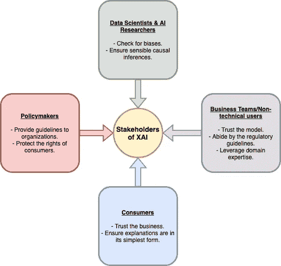
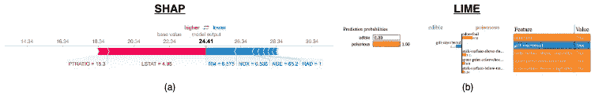
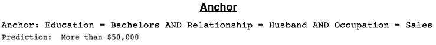
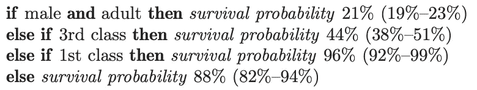

# 可解释的人工智能(XAI)研究必须超越实验室的四面墙

> 原文：<https://towardsdatascience.com/explainable-artificial-intelligence-xai-research-must-go-beyond-the-four-walls-of-research-labs-16faacbf9dff?source=collection_archive---------20----------------------->

## *XAI 的四个主要利益相关者。*

65 岁的埃莉诺想给她唯一的外孙蒂姆买辆车，再过几个月他就 21 岁了。她想送他一辆车，这样他可以相对舒适地去参加工作面试，而不是坐公交车。

埃莉诺去 XYZ 银行申请一万美元的贷款。她在和一个叫柯比的同事通话。Kirby 邀请 Eleanor 填写贷款申请。填完表格后，Eleanor 提交了申请新信用额度的请求。Kirby 将她的详细信息输入软件，然后信息被发送到一个黑盒模型。这个模型发挥了它的魔力，立即把它的决定反馈给 Kirby。他惊愕地看着埃莉诺，顿时，她的心直落地面。她马上就知道了；她的贷款请求没有通过。她问 Kirby 拒绝的原因。不幸的是科比不知道。他告诉她，“数学模型做决定，我们听它的。”

Kirby 被他所目睹的一切伤透了心，他冲向数据科学团队。他请他们给他一些关于黑箱模型如何决策的见解。数据科学团队看着他说，“嗯……这有点难以解释……”。Kirby 进一步催促他们，他们同意分析模型的决定，在这个过程中，他们了解到一些令人震惊的消息——黑箱模型对 65 岁以上的人有偏见！他们回到绘图板，重新构建、重新训练、重新测试和重新部署一个新的没有年龄偏见的黑盒模型。

Kirby 决定重新输入 Eleanor 的贷款申请信息，看看她的贷款请求是否会得到新的和改进的无偏见模型的批准。这个模型产生了同样的结果——被拒绝。

但是这一次，他也得到一个影响模型的关键因素的排序列表。排名列表是数据科学团队解决模型可解释性的一次尝试。列出的前两个因素是—“信用评分(65%)”和“现有信用额度数量(22%)”。百分比数字是因子对模型结果的相对重要性。Kirby 打电话给 Eleanor，告诉她为什么她的申请被拒绝了。Eleanor 对 Kirby 的电话表示感谢，并决定采取积极措施帮助她给 Tim 弄辆车。埃莉诺了解到，她的信用评分是决定她贷款申请被接受还是被拒绝的一个重要因素。她把下个月的财务管理得很好。一个月后，埃莉诺查看了她的新信用评分，发现它奇迹般地上升了 27 分。她前往 XYZ 银行再次尝试。柯比敲击着键盘，敲击着，敲击着，敲击着，他的脸沉了下来。

被拒。

又来了。

科比和埃莉诺都感到震惊。尽管她的信用评分奇迹般地提高了，但对她贷款请求的决定仍然没有改变。埃莉诺苦恼地问科比，“我需要增加多少信用评分才能被录取？”。柯比困惑地说，“我很抱歉，埃莉诺。我不知道……”

上面的故事说明了几点:

*   对于数据科学和业务团队来说，不理解模型的决策过程是不可接受的。
*   提供一份影响因素的排名表是不够的。
*   数据科学家和人工智能研究人员 ***绝不能*** 孤立工作。

科学家和商业团队之间必须有强有力的合作。

在这个故事中，XAI 的三个利益相关者被清晰地定义了。让我们来理解为什么这些利益相关方对 XAI 至关重要:

*   **数据科学家/人工智能研究人员:**他们需要对模型的工作有一个坚实的理解。他们需要以下问题的答案—模型输出有意义吗？这些解释有意义吗？**模型是否有偏差？**
*   **业务团队/非技术用户:**银行职员、经理、高管、医生、律师、法官、警察等等都属于这个群体。这些人需要知道如何将模型解释用于商业目的。更重要的是，他们需要相信模型遵守监管准则。最后，**如果解释不合理，那么他们可以利用他们领域的专业知识来改进它。**
*   **消费者:**消费者是产品和服务的接受者。让消费者看到全貌是至关重要的。这让他们有能力采取下一个最好的行动。只有在模型解释清晰透明的情况下，他们才会信任企业。消费者的参与确保了以最简单的形式交付解释。解释需要简单明了，即使是祖父母也必须能够在没有帮助的情况下消化这些信息。

到目前为止，我们已经讨论了 XAI 对三个关键利益相关者的重要性。然而，还有一个至关重要的第四利益相关者，他有能力促成必要的合作。第四个重要的利益相关者是**决策者**。他们在推动 XAI 朝着正确的方向发展方面发挥着关键作用:

*   就 XAI 的构成要素向业务部门提供指导—类似于货币监理署(OCC)为金融机构反洗钱计划中使用的模型编制的风险管理文件范本[ [19](https://www.occ.treas.gov/news-issuances/bulletins/2011/bulletin-2011-12a.pdf) ]。
*   确保对消费者的保护——消费者有权获得模型决策过程背后的清晰和全面的推理。GDPR 是一个很好的例子——特别是它强调来自组织的“易于理解和访问”的隐私声明[20]。

Figure 1: XAI stakeholders and their attributes.

目前 XAI 的大部分研究都是在实验室里进行的。[本地可解释的模型不可知解释(LIME)](https://github.com/marcotcr/lime) [ [1](https://doi.org/10.1145/2939672.2939778) ]， [SHAP(沙普利附加解释)](https://github.com/slundberg/shap) [ [2](http://papers.nips.cc/paper/7062-a-unified-approach-to-interpreting-model-predictions.pdf) ]和[模型不可知监督本地解释(MAPLE)](https://github.com/GDPlumb/MAPLE) [ [3](https://papers.nips.cc/paper/7518-model-agnostic-supervised-local-explanations.pdf) 】是帮助模型可解释性的开源库的例子。我相信这些库是为技术观众服务的。图 2 显示了一个例子。这些模型提供的解释可能是 XAI 之谜的一部分。如果一个真实世界的应用程序位于 XAI 研究的中心，那么我坚信这项研究将更接近于帮助真实世界的场景。这种研究将促进 XAI 主要利益攸关方之间的合作。

Figure 2 (a): Visual created by the SHAP library. It shows the influence of the factors resulting in the model output 24.41\. Model is trained to predict the median value ($1,000s) of a home in Boston [[14](https://github.com/slundberg/shap#tree-ensemble-example-with-treeexplainer-xgboostlightgbmcatboostscikit-learn-models)]. (b): Visual created by the LIME library. It shows the influence of the factors resulting in the model output Poisonous with a probability value of 1.0\. Model is trained to predict the likelihood of a mushroom to be poisonous or edible [15].

Figure 3: Anchor is another open-source library for model interpretability. It’s developed by the same author of LIME [8]. It generates rule sets to explain the model output. A model was trained to predict if a person will earn more or less than $50,000 [16]. Anchor definitely does a better job in explaining the model output.

2018 年，FICO 共同赞助了可解释的机器学习(xML)挑战赛[【4】](https://community.fico.com/s/explainable-machine-learning-challenge)。这对 XAI 社区来说是一个巨大的挑战。它允许研究实验室在现实世界中应用来测试他们的理论。IBM Research 赢得了比赛[【5】](https://www.fico.com/en/newsroom/fico-announces-winners-of-inaugural-xml-challenge)。他们明白迎合不同利益相关者的重要性(试试他们的演示吧！).XAI 必须是面向不同受众的工具。

Figure 4: Screenshot of IBM AIX 360 Demo [17]. Model is trained to predict whether to accept or reject a credit application. I selected the Bank Customer to be the entity of interest. The explanation is quite informative. After reading this report, the Bank Customer, in this case, Julia has all the information she needs to get accepted the next time she applied for credit approval.

此外，我很欣赏杜克大学辛西娅·鲁丁实验室的研究人员提交的作品[【6，](http://dukedatasciencefico.cs.duke.edu/)[10](http://dx.doi.org/10.2139/ssrn.3395422)(t[展示他们的演示](http://dukedatasciencefico.cs.duke.edu/models/)！).他们获得了 FICO 认可奖，以表彰他们凭借完全透明的全球模型和用户友好的仪表板超越预期，让用户能够探索全球模型及其解释[ [5](https://www.fico.com/en/newsroom/fico-announces-winners-of-inaugural-xml-challenge) ]。我关注辛西娅·鲁丁关于模型可解释性的工作已经有一段时间了。她对模型的可解释性有独特的方法。她的实验室建立了简单而有效且可解释的模型(在准确性上可与黑盒模型相媲美！).她认为你不需要为了准确性而牺牲模型的可解释性。然而，随着世界朝着快速采用深度学习的方向发展，看到她的研究在未来将她带向何处将是一件有趣的事情。我推荐在这里看一看她的作品[并观看她在 KDD 2019](https://users.cs.duke.edu/~cynthia/home.html) 的[主题演讲。](https://www.youtube.com/watch?v=wL4X4lG20sM&t=4866s)

Figure 5: Decision list generated by an interpretable model [13]. The model is trained to predict the likelihood of survival on the Titanic.

**随着深度学习在多个行业的采用，对 XAI 的需求与日俱增。为了让 XAI 的研究朝着正确的方向前进，数据科学家和人工智能研究人员走出实验室，与商业团队(包括法官、律师和医生)和消费者合作，并为政策制定者提供建议至关重要。**

## 参考

1.  马尔科·图利奥·里贝罗、萨米尔·辛格和卡洛斯·盖斯特林，“我为什么要相信你？”:解释任何分类器的预测(2016)，载于第 22 届 ACM SIGKDD 知识发现和数据挖掘国际会议(KDD '16)。美国纽约州纽约市美国计算机学会，1135–1144。https://doi.org/10.1145/2939672.2939778
2.  Scott M. Lundberg，Su-In Lee，解释模型预测的统一方法(2017)，第 31 届神经信息处理系统会议，美国加州长滩。[http://papers . nips . cc/paper/7062-a-unified-approach-to-interpretation-model-predictions . pdf](http://papers.nips.cc/paper/7062-a-unified-approach-to-interpreting-model-predictions.pdf)
3.  Gregory Plumb，Denali Molitor，Ameet Talwalkar，模型不可知论者监督的局部解释(2018)，第 32 届神经信息处理系统会议，加拿大蒙特利尔。[https://papers . nips . cc/paper/7518-model-agnostic-supervised-local-explaints . pdf](https://papers.nips.cc/paper/7518-model-agnostic-supervised-local-explanations.pdf)
4.  [https://community . Fico . com/s/explaible-machine-learning-challenge](https://community.fico.com/s/explainable-machine-learning-challenge)
5.  [https://www . Fico . com/en/news room/Fico-announces-winners-of-就职演说-xml-challenge](https://www.fico.com/en/newsroom/fico-announces-winners-of-inaugural-xml-challenge)
6.  [http://dukedatasciencefico.cs.duke.edu/](http://dukedatasciencefico.cs.duke.edu/)
7.  [https://community . Fico . com/s/blog-post/a5q2e 0000001 czy uaa/Fico 1670](https://community.fico.com/s/blog-post/a5Q2E0000001czyUAA/fico1670)
8.  Ribeiro，m .，Singh，s .，& Guestrin，c .，Anchors:高精度模型不可知解释(2018)，第 32 届 AAAI 人工智能会议，美国路易斯安那州新奥尔良。[https://www . aaai . org/OCS/index . PHP/AAAI/aaai 18/paper/view/16982](https://www.aaai.org/ocs/index.php/AAAI/AAAI18/paper/view/16982)
9.  Shrikumar，a .，Greenside，p .，Kundaje，a .，通过传播激活差异学习重要特征(2017)，arXiv:1704.02685。
10.  Rudin，Cynthia 和 Shaposhnik，Yaron，全球一致的基于规则的摘要-机器学习模型的解释:应用于信用风险评估(2019)，可在 https://ssrn.com/abstract=3395422[或 http://dx.doi.org/10.2139/ssrn.3395422](https://ssrn.com/abstract=3395422)[SSRN](https://dx.doi.org/10.2139/ssrn.3395422)获得
11.  Rudin，c .，*停止解释高风险决策的黑盒机器学习模型，转而使用可解释的模型* (2019)，【在线】可在:【https://www.nature.com/articles/s42256-019-0048-x.epdf? 获得 author _ access _ token = SU _ TpOb-h 5d 3 uy 5 KF-dedtrgn 0 jaj wel 9 jnr 3 zotv 0m 3t 8 udwhdckrosbuooygdb 5 knhqmo _ ji2d 1 _ sddjvr 6 hjgxjxc-7 JT 5 fqzuptqkiakzboti 4 uqjwnzbltd 01 z 8 qwhwksbvwh-z 1 XL 8 bacg % 3D % 3D【2019 年 8 月 31 日访问】。
12.  王童和辛西娅·鲁丁以及终曲·多希-维勒兹和刘一民以及埃里卡·克兰弗尔和佩里·麦克尼尔，《用于可解释分类的学习规则集的贝叶斯框架》(2017 年)，《机器学习研究杂志》18(2017)1–37。【http://www.jmlr.org/papers/volume18/16-003/16-003.pdf 
13.  本杰明·勒撒姆；辛西娅·鲁丁；泰勒·麦考密克；Madigan，David，使用规则和贝叶斯分析的可解释分类器:建立更好的中风预测模型(2015)，Ann。应用统计。9 (2015)第 3 号，1350–1371。doi:10.1214/15-AOAS848。[https://projecteuclid.org/euclid.aoas/1446488742](https://projecteuclid.org/euclid.aoas/1446488742)
14.  [https://github . com/slund Berg/shap # tree-ensemble-example-with-tree explainer-xgboostlightgbmcatbootscikit-learn-models](https://github.com/slundberg/shap#tree-ensemble-example-with-treeexplainer-xgboostlightgbmcatboostscikit-learn-models)
15.  [https://marcotcr . github . io/lime/tutorials/tutorials % 20-% 20 continuous % 20 and % 20 category % 20 features . html](https://marcotcr.github.io/lime/tutorials/Tutorial%20-%20continuous%20and%20categorical%20features.html)
16.  [https://github . com/marcotcr/Anchor/blob/master/notebooks/Anchor % 20 on % 20 tabular % 20 data . ipynb](https://github.com/marcotcr/anchor/blob/master/notebooks/Anchor%20on%20tabular%20data.ipynb)
17.  [http://aix360.mybluemix.net/data](http://aix360.mybluemix.net/data)
18.  李普顿，Z. C .，模型可解释性的神话(2016)，arXiv:1606.03490。
19.  [https://www . OCC . treas . gov/news-issues/bulletins/2011/bulletin-2011-12a . pdf](https://www.occ.treas.gov/news-issuances/bulletins/2011/bulletin-2011-12a.pdf)
20.  [https://gdpr.eu/privacy-notice/](https://gdpr.eu/privacy-notice/)