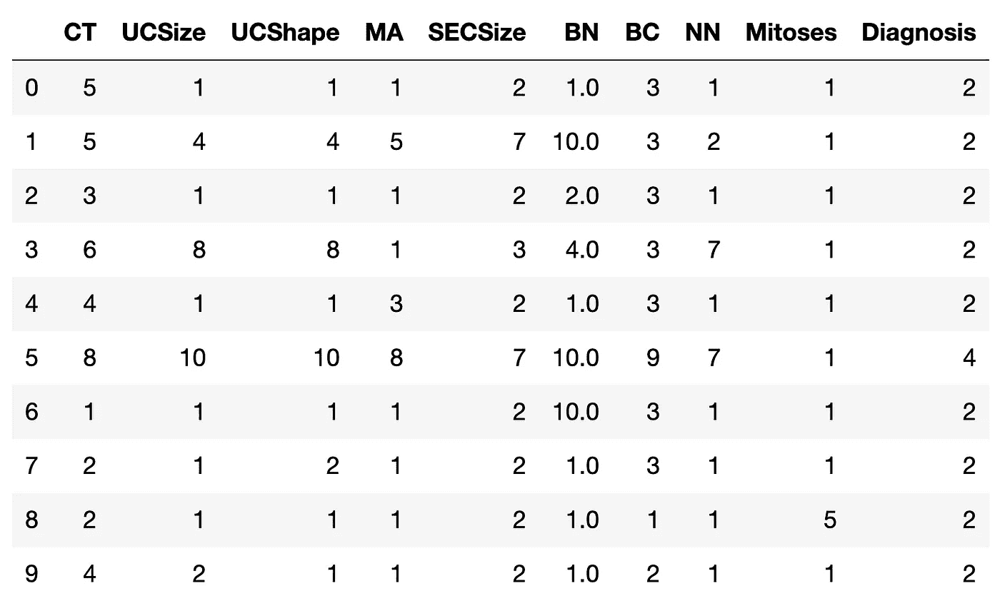
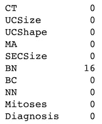
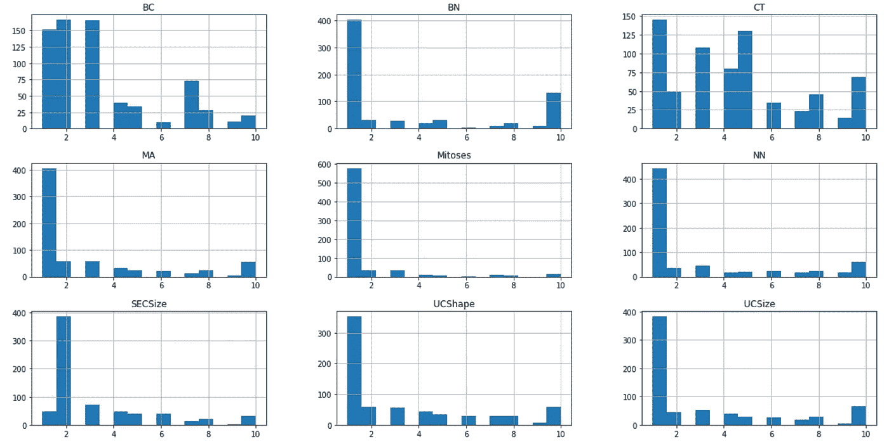
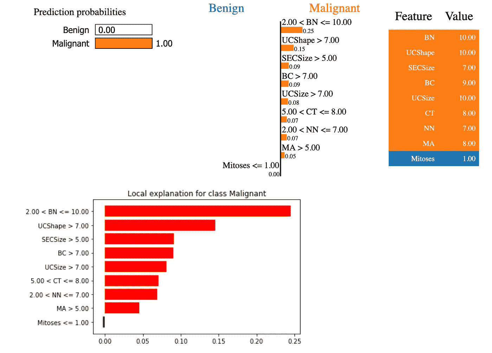
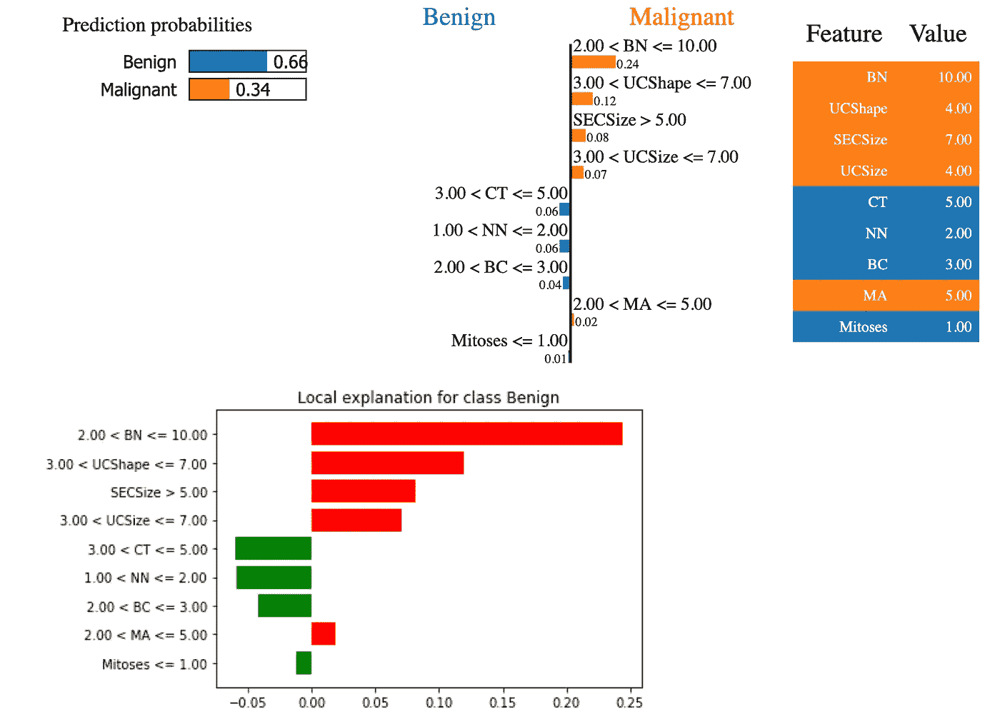

# 面向医疗保健的可解释机器学习

> 原文：<https://towardsdatascience.com/explainable-machine-learning-for-healthcare-7e408f8e5130?source=collection_archive---------19----------------------->

## 理解医疗保健中的机器学习


机器学习在医疗诊断等医疗保健领域有着广泛的应用[1]。癌症研究中经常使用的数据集之一是威斯康星州乳腺癌诊断(WBCD)数据集[2]。与其他领域一样，医疗保健中使用的机器学习模型在很大程度上仍然是黑箱。如[3]中所述，如果医生计划根据诊断预测采取癌症治疗措施，了解机器学习模型预测背后的原因对于确定信任非常重要。这种理解也可以帮助具有领域专业知识的医生发现机器学习模型预测的错误。这可以通过不同的方法实现。其中一种方法叫做“可解释的机器学习”[4]。

在本文中，我使用 WBCD 数据集[2]来演示如何实现可解释的机器学习，以使不可信的预测变得可信。

# 1.可解释的机器学习

如[4]中所述，本文中可解释的机器学习指的是用于理解预训练模型预测的[事后](https://en.wikipedia.org/wiki/Post_hoc_analysis)分析和方法。有不同的事后方法，如原因代码生成、模型预测的局部和全局可视化等。[4].在本文中，我使用原因代码生成作为事后方法。特别地，局部可解释模型不可知解释(LIME) [3]用于解释机器学习模型使用哪些特征来做出预测决策。

# 2.数据集准备

如前所述，本文中使用的数据集是公共 WBCD 数据集[2]。在该数据集中，为每个样本提供了以下 9 个特征，并将用作机器学习模型的输入:

*   团块厚度
*   细胞大小的均匀性
*   细胞形状的均匀性
*   边缘粘连
*   单一上皮细胞大小
*   裸核
*   平淡的染色质
*   正常核仁
*   有丝分裂

## 2.1 加载数据

假设 WBCD 数据集已经作为 *csv* 文件*乳腺癌-威斯康星. csv* 下载到本地计算机上，那么数据集文件可以加载到熊猫数据帧中，如下所示:

```
feature_names = ["CT","UCSize","UCShape","MA","SECSize","BN","BC","NN","Mitoses"]
columns = ["ID"]
columns.extend(feature_names)
columns.extend(["Diagnosis"])
raw_data = pd.read_csv('breast-cancer-wisconsin.csv', na_values='?', header=None, index_col=['ID'], names = columns)
raw_data = raw_data.reset_index(drop=True)
raw_data.head(10)
```



## 2.2 数据预处理

WBCD 数据集有许多共同的问题，因此需要预处理来解决这些问题，然后才能被机器学习模型使用。

*   **缺失数据**

以下命令用于检查哪些要素缺少数据:

```
data = raw_data.copy()
data.isnull().sum()
```



如上表所示，有 16 个裸核缺失数据条目。在本文中，这些缺失的数据条目简单地用 0 替换，因为缺失条目的总数相对较小。

*   **小规模数据集**

WBCD 数据集[2]只包括 699 个样本，这对机器学习来说太小了。这种小数据量问题可以通过数据扩充来缓解(有关详细信息，请参阅不平衡数据集)。

*   **不同尺度的特征值**

不同特性的取值范围不同。下面的类*尺度*是将特征值变换到相同的范围【0，1】内。这个类被设计成可以和其他类一起使用，在以后形成一个管道。

```
from sklearn.preprocessing import MinMaxScaler
from sklearn.base import BaseEstimator, TransformerMixinminMaxScaler = MinMaxScaler()
minMaxScaler.fit(features[feature_names])class Scale(BaseEstimator, TransformerMixin):
    def __init__(self):
        pass def fit(self, X, y=None):
        return self

    def transform(self, X, y=None):  
        if type(X) == pd.Series or type(X) == pd.DataFrame:
            X1 = X.values 
            X1 = X1.reshape(1, -1)
        else:
            X1 = X.copy()

        X1 = minMaxScaler.transform(X1) 

        return X1
```

*   **不平衡数据集**

以下代码用于检查数据集在标记的诊断值方面是否平衡:

```
data['Diagnosis'].value_counts()
```

不同标签的数据样本数量不平衡。有 458 个数据样本被标记为 2(即 B(良性))，但是只有 241 个数据样本被标记为 4(即 M(恶性))。

为了平衡数据集，为简单起见，将标记为 M 的 241 个数据样本的副本添加到原始数据集中。

*   **倾斜数据集**

以下代码可用于可视化特征值的分布:

```
data[numerical].hist(bins=20, figsize=(15, 10))
```



可以看出，大多数特征的值明显向右倾斜。下面的类 *Sqrt* 通过对特征值求平方根来缓解数据偏斜问题。像 *Scale* 类一样，这个类被设计成一个管道组件。

```
class Sqrt(BaseEstimator, TransformerMixin):
    def __init__(self):
        pass def fit(self, X, y=None):
        return self

    def transform(self, X, y=None):  
        if type(X) == pd.Series or type(X) == pd.DataFrame:
            X1 = X.copy()

            if X1.isnull().values.any():
                X1 = X1.fillna(0)

            X1 = X1.abs() # avoid negative values
        else:
            X1 = X.copy()
            X1 = np.absolute(X1) # avoid negative values

        X1 = np.sqrt(X1) 

        return X1
```

## 2.3 将标签与特征分离

标签(即诊断)与特征分离，因为标签和特征是模型训练和测试所需要的。

```
labels   = data['Diagnosis']
features = data.drop(['Diagnosis'], axis = 1)
```

## 2.4 将数据集分为训练数据集和测试数据集

特征和标签被随机分成两部分，75%用于模型训练，25%用于模型测试:

```
from sklearn.model_selection import train_test_splitX_train, X_test, y_train, y_test = train_test_split(features, labels, test_size=0.25, random_state=42)
```

# 3.机器学习模型

具有默认设置的随机森林分类器用于演示目的。模型训练和测试可以如下执行:

```
from sklearn.ensemble import RandomForestClassifierrfc = RandomForestClassifier(n_estimators=100)
rfc.fit(X_train, y_train)
score = rfc.score(X_test, y_test)
```

训练后的模型准确率达到 98.23%。

# 4.解释预测的石灰法

如[3]中所述，在通过机器学习模型进行决策时，确定个体预测的可信度非常重要。例如，当机器学习用于医疗诊断时，如威斯康星州乳腺癌诊断[1]，预测不能简单地用于行动，因为后果可能是灾难性的。本节展示了如何使用 LIME [3]为个人预测提供解释，作为确定信任的解决方案。

## 4.1 创建管道

LIME 中原因代码生成背后的关键点是将模型预测结果与原始的未转换特征值相关联。为此，LIME 方法在解释模型预测结果时，将机器学习管道(包括位于管道开头的数据预处理管道和位于管道末尾的机器学习模型)作为输入。以下管道将用于此目的:

```
from sklearn.pipeline import make_pipelinescale = Scale()
sqrt  = Sqrt()
# rfc is a pre-trained Random Forest modelmachine_learning_pipeline = make_pipeline(scale, sqrt, rfc)
```

## 4.2 选择石灰解释器

LIME 方法支持不同类型的机器学习模型解释器，用于不同类型的数据集，如图像、文本、表格数据等。本文选择表格解释器，因为 WBCD 数据集的格式是表格:

```
from lime.lime_tabular import LimeTabularExplainerclass_names = ['Benign', 'Malignant']
explainer = LimeTabularExplainer(feature_names=feature_names, 
                                 class_names=class_names, 
                                 training_data=X_train.values)
```

## 4.3 解释模型预测

一旦机器学习模型已经被训练，给定原始特征值的任何向量(即，特征向量)，下面的*解释*函数可以用于解释模型预测:

```
def explain(feature_vector, label=1): # feature_vector - a Pandas Series of features
    exp = explainer.explain_instance(feature_vector, machine_learning_pipeline.predict_proba, num_features=9)

    fig = plot(exp, label)
    exp.show_in_notebook(show_table=True, show_all=False)
```

LIME explainer 的 *show_in_notebook* ()方法以笔记本的形式展示了预测和对应的原始特征值之间的关联。

下面的*图*功能是创建一个条形图来显示石灰模型解释结果:

```
def plot(exp, label=1):
        exp_list = exp.as_list()
        fig = plt.figure()
        vals = [x[1] for x in exp_list]
        names = [x[0] for x in exp_list]
        vals.reverse()
        names.reverse()
        colors = ['green' if x <= 0 else 'red' for x in vals]
        pos = np.arange(len(exp_list)) + .5
        plt.barh(pos, vals, align='center', color=colors)
        plt.yticks(pos, names)
        if exp.mode == "classification":
            title = 'Local explanation for class {}'.format(exp.class_names[label])
        else:
            title = 'Local explanation'
        plt.title(title)

        return fig
```

**例 1:解释恶性肿瘤的预测**

以下是 M(恶性)的一个样本(特征向量):

```
sample_M = raw_data.loc[5, feature_names]
```

该特征向量的预测结果可以使用 LIME 解释如下:

```
explain(m_feature_vector, machine_learning_pipeline, label=1)
```



恶性的预测结果如上图左上角所示。右上角和底部显示哪些特征与恶性的预测正相关，哪些特征与恶性的预测负相关。特别地，橙色/红色的特征表示正相关，而蓝色/绿色的特征表示负相关。

**例 2:解释良性预测**

以下是 B(良性)特征向量的示例:

```
sample_B = raw_data.loc[1, feature_names]
```

该特征向量的预测结果可以由 LIME 解释如下:

```
explain(sample_B, machine_learning_pipeline, label=0)
```



良性的预测结果如上图左上角所示。右上角和底部显示哪些特征与恶性的预测正相关，哪些特征与恶性的预测负相关。特别地，橙色/红色的特征表示正相关，而蓝色/绿色的特征表示负相关。

# 5.结论

在本文中，我使用了 LIME 方法[3]和 WBCD 数据集[2]来演示如何解释机器学习模型在乳腺癌诊断中的预测结果。

正如本文开头所述，如果医生计划根据诊断预测采取癌症治疗措施，那么理解机器学习模型预测背后的原因对于评估信任非常重要。这种理解还可以帮助具有领域专业知识的医生检测机器学习模型预测的错误，以便可以进一步改进正在使用的机器学习模型。

Github [6]中有一个 Jupyter 笔记本，上面有本文中的所有源代码。

# 参考

[1] [威斯康星州乳腺癌诊断数据集](https://archive.ics.uci.edu/ml/datasets/Breast+Cancer+Wisconsin+(Diagnostic))

[2] [WBCD 数据集和描述](https://archive.ics.uci.edu/ml/machine-learning-databases/breast-cancer-wisconsin/)

[3] M. T. Ribeiro，S. Singh，C. Guestrin，[“我为什么要相信你？”
解释任何分类器的预测](https://arxiv.org/pdf/1602.04938.pdf)

[4] P. Hall 和 N. Gill,《机器学习可解释性导论》,《从应用角度看公平、问责、透明和可解释的人工智能》,第二版，奥赖利媒体公司，2019 年

[5] M. T. Ribeiro，S. Singh 和 C. Guestrin，[局部可解释模型不可知解释(LIME):介绍](https://www.oreilly.com/learning/introduction-to-local-interpretable-model-agnostic-explanations-lime)

[6]黄宇，Jupyter 笔记本在 [Github](https://github.com/yuhuang3/machine-learning/tree/master/lime/tabular_explainer)

披露声明:2020 年。本文中表达的观点仅代表作者的观点，不代表阿贡国家实验室的观点。