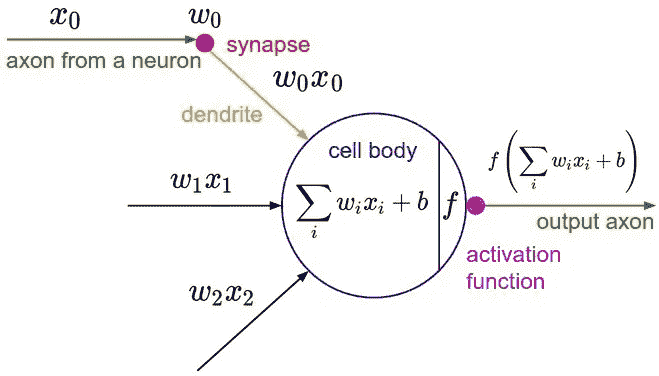
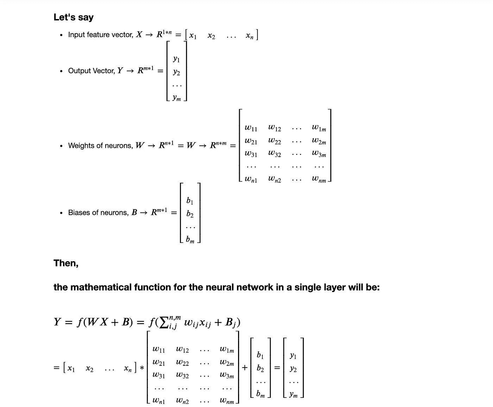
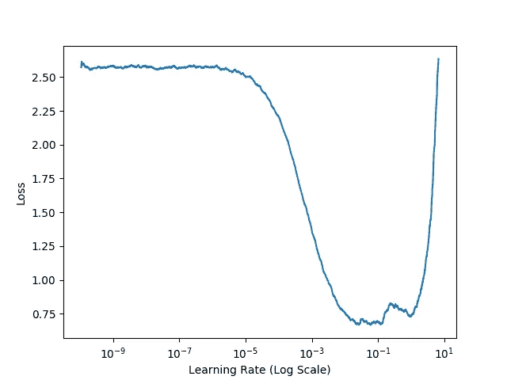
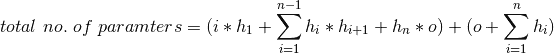
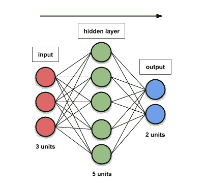
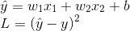
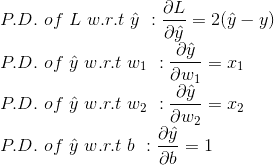
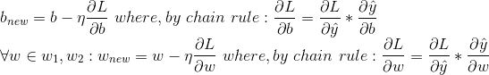
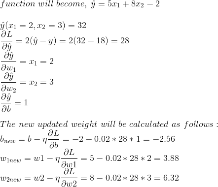
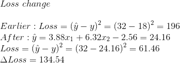

# 解释:Tensorflow 中的深度学习—第 0 章

> 原文：<https://towardsdatascience.com/explained-deep-learning-in-tensorflow-chapter-0-acae8112a98?source=collection_archive---------13----------------------->

## [关于深度学习的一切](https://towardsdatascience.com/tagged/all-about-deep-learning)

## 介绍


> 我想人们喜欢阅读那些他们最想要而经历最少的东西。伯纳德·洛(西部世界)

你猜怎么着？开始这个系列。该系列说明了深度学习。 **ML / DL** ！*嗯*。实际上， *DL* 与 *ML* 并无不同，但 *DL* ( **深度学习**)是 *ML* ( **机器学习**)的一个子领域，关注的是被称为人工神经网络( *ANN* )的大脑结构和功能所启发的算法。由于**神经元**是大脑的基本工作单位，它也是神经网络中的基本计算单位。

## 神经网络体系结构

我们将在这里直接讨论神经元。



Neuron — the basic unit of the neural network

不讨论神经元的生物学类比，直接来理解人工神经元。顺便说一下，在人类神经系统中可以找到大约 600-1000 亿个神经元，它们与大约 10 个⁴ -10 个⁵突触相连。:)作为人工神经网络的基本构件的神经元接收该特征作为输入，并在进行如下计算后产生输出:



Neural Network Computation: Explained

## 重要术语

1.  **输入特征向量(X):** 输入数据集的特征有助于得出关于某一行为的结论。它可以是热编码、嵌入等。
2.  **权重和偏差(W & B)** :一般来说*权重*，w1，w2，…都是实数，表示各自输入对输出的重要性。偏差是添加到输出中的额外阈值。
3.  **Loss (L)** : Loss 是一个目标函数，表示预测与原始结果有多接近。它也被称为成本函数。作为训练机制的目标总是最小化这个成本函数的值。换句话说，我们希望找到一组权重和偏差，使成本尽可能小。有几个[损失函数](https://www.tensorflow.org/api_docs/python/tf/keras/losses)作为回归问题中流行的均方误差(MSE ),分类问题中流行的分类或二元交叉熵。
4.  优化器:这些用于通过更新权重和偏差来最小化损失函数。随机梯度下降法是一种流行的方法。[这里的](/10-gradient-descent-optimisation-algorithms-86989510b5e9)是对[优化者](/10-gradient-descent-optimisation-algorithms-86989510b5e9)的一个很好的解释。
5.  **激活函数:**激活函数通过计算加权和并进一步加上偏差来决定是否激活一个神经元。但是，我们为什么需要激活功能呢？答案是:如果我们把几个线性变换串联起来，得到的只是一个线性变换。例如，如果来自相邻层两个神经元中的 f(x) = 2x+3 且 g(x) = 5x-1。然后，链接这两个将给出线性函数，即 f(g(x)) = 2(5x-1)+3。所以，如果我们没有层间的非线性，那么即使是很深的一叠层也相当于一个单层。激活功能的目的是**将非线性**引入神经元的输出。ReLU(校正线性单元)是使用最广泛的激活函数。
6.  **学习率(** η **)** :是每次更新时权重和偏差应该变化的速率。



通过调度找到最优 LR 有几种方法:功率、Icycle 和指数调度。其中一种方法是对模型进行数百次迭代训练，将 LR 从非常小的值指数增加到非常大的值，然后查看学习曲线，选择略低于学习曲线开始回升时的学习速率。如左侧的 LR 与损耗曲线所示，1/10 左右是最佳 LR。

# 前馈神经网络

> "本质上，所有的模型都是错误的，但有些是有用的."乔治·博克斯；诺曼·r·德雷珀(1987)。

当一个以上的神经元相互堆叠时，其中单元之间的连接不*也不*形成循环，则它形成单层密集神经网络。当一个或一个以上的层彼此平行布置时(可以具有不同数量的神经元单元)，其中一个层分别是在开始和结束处的输入和输出层，而另一个层是这两个层之间的隐藏层，使得信息(从每个神经元输出)仅在一个方向上移动，从输入节点向前，通过隐藏节点(如果有的话)到达输出节点，这被称为前馈神经网络。如果只有输出层出现在一个人工神经网络中，那么它被称为单层 FFNN，如果它包含隐藏以及输入和输出层，它被称为多层 FFNN。


Multi-layer ANN

# 人工神经网络中的参数数量

参数的数量意味着在整个神经网络中使用的权重和偏差的总数。因为在每一层，权重矩阵被生成和更新，其维数是 Rm*n，如上所述，并且偏差也随着每个输入而增加。因此，参数的总数将是每一层的权重和偏差的总和。公式结果是:

如果 I 是输入的数量，H = {h1，h2，h3..hn}是隐藏单元的数量，o 是输出的数量。然后，



[Source](/counting-no-of-parameters-in-deep-learning-models-by-hand-8f1716241889): FFNN with 1 hidden layer

对于左侧的例子，

```
#model in Keras
model = Sequential()
model.add(Input(3))
model.add(Dense(5))
model.add(Dense(2))
```

i=3，o=2，H = {5}

因此，参数总数= (3*5 + 5*2) + (5+2) = 32

# 反向传播

反向传播是指在每次向前传递信息后更新网络中的权重和偏差。在进行预测(正向传递)后，它测量误差，并使用链式法则反向遍历每一层以测量来自每个连接(反向传递)的误差贡献，最后，调整连接权重以减少误差。反向传播的目标是计算成本函数 l 相对于网络中任何权重 w 或偏差 b 的偏导数∂L/∂w 和∂L/∂b。由于 FFNN 是一个由大量神经元组成的非常复杂的体系结构，其中线性回归类问题的解决忽略了具有等式 **WX + B** 的激活函数，因此我们将使用特征的线性函数作为目标函数来理解反向传播。

设估计的函数为***【ŷ】***，原始函数为 **y** 其中二次成本函数( **L** ):



Target function and Loss function

让我们计算一下**l**w . r . t .***ŷ***， **w1** ， **w2** ， **b** 的梯度



Partial derivatives

现在，我们将知道如何使用 SGD 作为优化器来更新权重和偏差:



Finding updated weights and bias: SGD

让我们拿一个数据集，试着理解它的一个迭代，然后我们将遍历代码:

```
**x1** | 2  |  1   |  3  | -1   | -3
**x2** | 3  |  1   | -1  |  1   | -2
**y**  |18  |  10  |  8  |  6   | -7
```

对于初始化，假设 w1= 5，w2=8，b=-2，η = 0.02



Calculation in the first iteration

更新参数后，让我们看看损耗的变化:



Cost function change

随着我们继续深入并在所有迭代中执行计算，我们将能够找到最接近目标函数的最佳拟合。

# 在张量流 2.0 中

正如我们所知，Tensorflow 是一个强大的数值计算库，特别是谷歌大脑团队开发的大规模机器学习。让我们了解一下它的基本原理。Tensorflow 的 API 围绕*张量、*展开，从一个操作流向另一个操作，因此得名 Tensorflow。张量基本上是一个多维数组，就像 Numpy 一样。我们可以定义一个常数张量如下:

```
tf.constant(2)#<tf.Tensor: id=14998, shape=(), dtype=int32, numpy=2>
tf.constant([[1.,2.],[3.,4.]]) 
# <tf.Tensor: id=14999, shape=(2, 2), dtype=float32, numpy=
array([[1., 2.],
       [3., 4.]], dtype=float32)>
```

我们可以对张量执行[几种运算](https://www.tensorflow.org/tutorials/customization/basics)，如平方、求和、转置等。但是，这里 tf.constant 定义的张量是不可变的，我们不能修改它。所以，我们需要 tf。这种情况下的变量:

```
#<tf.Variable 'Variable:0' shape=() dtype=float32, numpy=2.0>
a=tf.Variable(2.0)# a values changes to 3.0
a.assign(3.0)#add and subtract the tensor by given value
a.assign_add(2.0) # a => 5.0
a.assign_sub(1.0) # a=> 4.0
```


让我们看看如何使用 [Autodiff](https://www.tensorflow.org/tutorials/customization/autodiff) 自动计算梯度，以解决上面讨论的问题。我们需要创造一个 tf 的环境。GradientTape 会自动记录每一个操作，最后，它可以告诉梯度。

```
with tf.GradientTape(persistent=True) as tape:
      #initializing the loss function with next set of training set      
      loss = loss_function(y,x1,x2)

      # finding the gradient of loss function w.r.t. w1,w2 and b
      gradients = tape.gradient(loss, [w1,w2,b])
```

这里， *gradients* 给出了偏导数∂L/∂w 和∂L/∂b，我们需要用它们来更新权重和偏差，方法是将它乘以因子 L.R。让我们来看看如何做到这一点:

Visualizing through tf Code how backpropagation works

我们已经定义了 *loss_function* ，它将训练集作为输入，随后查找损失函数 w.r.t 权重和偏差的梯度。 *update_weight* 方法在每次迭代后更新新的权重。正如我们所看到的，新的权重和偏差与我们在上面的反向传播部分手动计算的是一样的。我们运行了 7 次迭代，权重和偏差的值越来越接近实际值[w1=2，w2=3，b=5]。

## tf .函数

T F2.0 带来了 *tf.function* decorator，它将 Python 语法的子集转换成可移植的高性能张量流图。如果它是通过方法注释的，Python 控制流语句和签名会将它们转换成适当的张量流操作。例如，`if`语句如果依赖于一个`Tensor`，就会被转换成`[tf.cond()](https://www.tensorflow.org/api_docs/python/tf/cond)`。注释后，该函数将像 python 中的任何其他方法一样，但它将有助于获得急切执行的好处。例如:

```
[@tf](http://twitter.com/tf).function
def simple_nn_layer(x, y):
    return tf.nn.relu(tf.matmul(x, y))x = tf.constant([[-2,-1],[3,4]])
y = tf.constant([[3,4],[1,2]])simple_nn_layer(x, y)<tf.Tensor: id=15133, shape=(2, 2), dtype=int32, numpy=
array([[ 0,  0],
       [13, 20]], dtype=int32)>
```

结合使用 *gradientTape* 和 *tf.function、*也可以在调试方面有所帮助。我们可以看到参数是如何变化的，精度在每次迭代中都受到影响。为此，Keras 模型也可以用在 AutoGraph 代码中。

接下来，do visit 解释:[tensor flow 中的深度学习——第一章:关于训练人工神经网络和数据预处理。](https://medium.com/@sonusharma.mnnit/explained-deep-learning-in-tensorflow-chapter-1-9ab389fe90a1)继续关注空间更多更新。

## 参考资料:

[](http://neuralnetworksanddeeplearning.com/) [## 神经网络和深度学习

### 神经网络和深度学习是一本免费的在线书籍。这本书将教你:神经网络，一个美丽的…

neuralnetworksanddeeplearning.com](http://neuralnetworksanddeeplearning.com/) [](/step-by-step-tutorial-on-linear-regression-with-stochastic-gradient-descent-1d35b088a843) [## 随机梯度下降线性回归分步教程

### 这是反向传播演示的补充材料，详细说明了它的计算步骤…

towardsdatascience.com](/step-by-step-tutorial-on-linear-regression-with-stochastic-gradient-descent-1d35b088a843) 

[https://towards data science . com/counting-no-of-parameters-in-deep-learning-models-hand-8f 1716241889](/counting-no-of-parameters-in-deep-learning-models-by-hand-8f1716241889?source=user_profile---------4-----------------------)

书籍:奥雷连·杰龙的《机器学习实践》

[](https://tensorflow.org) [## 张量流

### 一个端到端的开源机器学习平台

tensorflow.org](https://tensorflow.org)