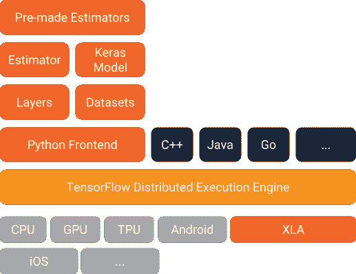
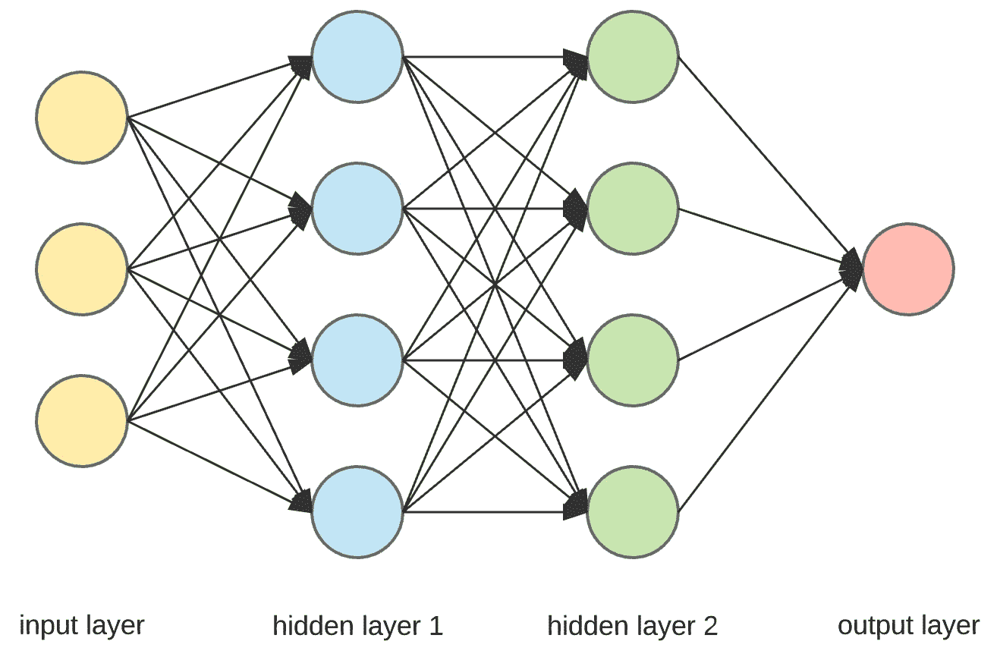
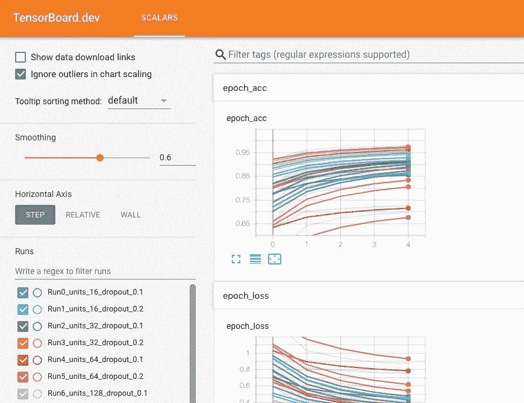

# 解释:Tensorflow 中的深度学习—第 1 章

> 原文：<https://towardsdatascience.com/explained-deep-learning-in-tensorflow-chapter-1-9ab389fe90a1?source=collection_archive---------21----------------------->

## [关于深度学习的一切](https://towardsdatascience.com/tagged/all-about-deep-learning)

## 训练神经网络和数据预处理

我们在上一章已经谈了很多关于前馈神经网络的内容。现在，我们将讨论一点张量流，然后，在张量流中实现 FFNN。


TF for DL



Tensorflow 2.0 Architecture

Tensorflow 提供高级 API:Keras 和 Estimator，用于创建深度学习模型。然后，tf.data 等 API 进行数据预处理。在最底层，每个 Tensorflow 操作都是使用高效的 C++代码实现的。大多数时候，我们只使用高级 API，但当我们需要更多的灵活性，如直接处理张量时，我们可以使用较低级别的 API，如 tf.nn，tf。GradientTape()等。Tensorflow 提供了广泛的库，如用于可视化的 [TensorBoard](http://tensorboard.dev/) ，用于下载和重用预训练模型的 [Tensorflow Hub](https://tfhub.dev/) 。它还提供了 [Tensorflow 服务](https://www.tensorflow.org/tfx/serving/serving_basic)，在这里我们可以轻松地将我们的模型公开为 REST API 用于生产。[关于 TF 上菜的更多细节](https://medium.com/analytics-vidhya/understanding-the-search-query-part-ii-44d18892283f)。

# tf.keras (Keras)

我们先说说在 [tf.keras](https://www.tensorflow.org/api_docs/python/tf/keras/) 中实现 FFNN。在 Keras 中，我们可以通过三种方式创建模型:

## [1。顺序 API](https://www.tensorflow.org/api_docs/python/tf/keras/Sequential)

它很容易使用，也很常用于创建线性层堆栈。它提供了 [*输入层*](https://www.tensorflow.org/api_docs/python/tf/keras/layers/InputLayer) 用于取输入， [*密集层*](https://www.tensorflow.org/api_docs/python/tf/keras/layers/Dense) 用于创建单层神经网络，内置 *tf.losses* 用于选择一系列损失函数使用，内置*TF . optimizer*，内置 *tf.activation、*等。我们可以创建自定义层、损失函数等。我们很快就会看到。让我们以下面的 FFNN 为例进行说明:



Sample FFNN

上述使用顺序 API 的代码:

```
#Assuming you can import the module needed from tf.keras
#Creating model object
model = Sequential()#Input layer of shape (3,)
model.add(Input(shape=(3,)))
#Adding dense layers
model.add(Dense(units=4))
model.add(Dense(units=4)) #default activation=linear-> x=max(0,x)
model.add(Dense(units=1, activation = 'softmax'))#defining loss and optimizer
model.compile(loss="mean_square_error", optimizer="sgd")#start training
model.fit(X_train, y_train, epochs=10)
```

## [2。函数 API](https://keras.io/models/model/\)

有时，我们需要建立一个具有更复杂拓扑结构或多个输入或输出的神经网络，为此，Keras 提供了函数 API。上面的网络代码在函数 API 中可以看到没有太大的区别:

```
#Again Assuming you can import the module needed from tf.keras
#Input layer of shape (3,)
input = Input(shape=(3,))
#Adding dense layers
x = Dense(units=4) (input)
x = Dense(units=4)(x) #default activation=ReLU
output = Dense(units=1, activation = 'softmax')(x)
#Keras model specifying input and output
model = Keras.model(inputs=[input], outputs=[output])
#Again follows the same compile, fit, evaluate, predict etc.
```

## [3。子类化 API /定制模型](https://www.tensorflow.org/guide/keras/custom_layers_and_models)

除非您需要涉及循环、条件分支和其他动态行为的模型，否则它不会被广泛使用。简单地子类化*模型类，*在构造函数中创建你需要的层，并使用它们在被覆盖的 *call()* 方法中执行你想要的计算。子类化 API 中相同网络的代码:

```
class FFNN(keras.Model):
   def __init__(self, activation="softmax", **kwargs):
       super().__init__(**kwargs)
       self.input = Input(shape=(3,))
       self.hidden1 = Dense(units=4)
       self.hidden2 = Dense(units=4)
       self.output = Dense(units=1, activation = activation) #override call method
   def call(self, inputs):
       input = self.input(inputs)
       x = self.hidden1(input)
       x = self.hidden2(x)
       output = self.ouput(x)
       return output
#create model instance
model = FFNN()
```

# 使模型完美的成分！

## **1。使用回调**

它用于获得模型的最佳可能权重或避免过度拟合。tf.keras 中的 *fit 方法*将*回调*作为一个参数，它接受各种范围的回调，甚至我们也可以通过编写一个扩展*TF . keras . callbacks . callback .*[*model check point*](https://www.tensorflow.org/api_docs/python/tf/keras/callbacks/ModelCheckpoint)的方法来传递自定义回调，在训练期间以固定的间隔保存模型的检查点。它可以如下使用:

```
checkpoint_cb = **tf.keras.callbacks.ModelCheckpoint**("model.h5", save_best_only=True)#fit the model with callback
model.fit(X_train,y_train,..., callbacks=[checkpoint_cb])
#load the best model after training
tf.keras.models.load_model("model.h5")
```

另一个回调称为 [*提前停止*](https://www.tensorflow.org/api_docs/python/tf/keras/callbacks/EarlyStopping) 当一个定义的指标在一定数量的时期(*耐心*)后停止改进时使用，这将可选地回滚到最佳模型。样本如下:

```
early_stop_cb = **tf.keras.callbacks.EarlyStopping**(patience=5, restore_best_weight=True)
#train the model with these callbacks
model.fit(..., callbacks=[checkpoint_cb, early_stop_cb])
```

两个检查点一起使用将保存检查点，并在没有更多进展时提前中断训练。

## **2。使用张量板进行可视化**



Tensorboard

Tensorboard 是一个很棒的可视化工具，在这里我们可以看到训练过程中每一次跑步的标量、图表等。它读取名为*事件文件*的二进制日志文件来投射数据。事件文件可以通过写回调来生成，即[*tensor board*](https://www.tensorflow.org/api_docs/python/tf/keras/callbacks/TensorBoard)*。*它就像编写回调一样简单:

```
tensorboard_cb = **keras.callbacks.TensorBoard(**logdir, ) #provide a logdir where the event files will be stored
#train the model
model.fit(..., callbacks=[tensorboard_cb])
```

为了可视化它，您需要通过以下命令启动 TensorBoard 服务器:

```
tensorboard --logdir = logdir
# this will create a server at 6006 port
```

或者，您可以将您的活动文件上传到 [tensorboard.dev](http://tensorboard.dev) 并从[谷歌合作实验室](https://colab.research.google.com/)在线观看:

```
!tensorboard dev upload --logdir ./logs
```

## **3。使用** [**批量规格化**](https://www.tensorflow.org/api_docs/python/tf/keras/layers/BatchNormalization) **和渐变裁剪**

在训练期间，始终存在消失/爆炸梯度问题的风险，**批量标准化**解决了这些问题。这种技术包括在模型中每个隐藏层的激活函数之前或之后添加操作。它只是通过估计输入的平均值和标准偏差来对输入进行零中心化和标准化。在实现中，Keras 在训练期间通过使用层的输入均值和标准偏差的移动平均值来学习每层的每个输入的四个参数。在 ImageNet 分类任务中使用它时，已经观察到了巨大的改进。在 tf.keras 中，我们需要在每个隐藏层的激活函数之前或之后添加一个 BatchNormalization 层。以上面的例子为例:

```
model.add(Input(shape=(3,)))
#Adding batch normalization layer
model.add(**tf.keras.layers.BatchNormalization**())
model.add(Dense(units=4)) model.add(**tf.keras.layers.BatchNormalization**())
x = Dense(units=4)(x) #default activation=ReLU
```

**渐变裁剪**另一种缓解爆炸式渐变问题的流行技术。这种方法主要在 RNN 使用。它有助于将梯度向量的每个分量剪切到所提供的范围之间的值。例如

```
model.compile(loss="mean_squared_error", optimizer = keras.optimizers.SGD(**clipvalue=1.0**))
```

上面的代码将在-1 和 1 之间裁剪损失的偏导数。

## 4.使用正则化来避免过度拟合

我们已经在上面讨论了一些避免过度拟合的技术，让我们看看其他流行的正则化技术。 [**L1 和 L2 正则化**](https://www.tensorflow.org/api_docs/python/tf/keras/regularizers/) 涉及向成本函数添加一些数量级的权重。下面是我们如何实现:

```
Dense(units=4, kernel_regularizer=**keras.regularizers.l2**(0.01))
```

**退出**是另一种技术，尤其适用于深度神经网络，其中每个神经元都有可能在特定步骤的训练过程中被暂时退出或完全忽略，但在下一步骤中可能是活跃的，这由称为退出率的参数 *p 决定。这种脱落在测试过程中是无效的。它可以在致密层之后立即使用。实现如下:*

```
model.add(Dense(units=4))
**tf.keras.layers.Dropout**(rate=0.3)
```

## 5.寻找超参数的最佳拟合

由于神经网络有太多的超参数需要调整，因此为网络找到超参数的最佳组合总是一个挑战。我们可以通过尝试尽可能多的组合来手动执行这个选择任务，看看哪一个效果最好。另一种方法是使用 [*GridSearchCV*](https://scikit-learn.org/stable/modules/generated/sklearn.model_selection.GridSearchCV.html) 或[*RandomizedSearchCV*](https://scikit-learn.org/stable/modules/generated/sklearn.model_selection.RandomizedSearchCV.html)*。*由于这些是 sklearn 方法，我们需要通过分别使用[*keras regressor*](https://www.tensorflow.org/api_docs/python/tf/keras/wrappers/scikit_learn/KerasRegressor)或[*keras classifier*](https://www.tensorflow.org/api_docs/python/tf/keras/wrappers/scikit_learn/KerasClassifier)*进行回归和分类任务，将 tf.keras 模型包装在模拟常规 sklearn 回归器的对象中。它采用使用 tf.keras API 描述模型的方法，然后我们可以使用它的 *fit()* 方法来训练模型。但是，我们的目标是找到 tf.keras 模型的最佳超参数，因此我们提到超参数的名称及其范围，并将其传递给 RandomizedSearchCV 方法，如下所示:*

```
*#tf.keras model
def build_fn():
     # the model which we built above using sequential API by making
     the no. of hidden units and layers as variable model = Sequential()
     ..............
     return model#KerasRegressor
keras_reg = tf.keras.wrappers.scikit_learn.KerasRegressor(build_fn)
#defining the parameters distribution
param_distrib = {
     "n_hidden": [3,4,5],
     "n_neurons": [40,50,60,70]
     }
search_cv = RandomizedSearchCV(keras_reg, param_distrib, n_iter=4)
search_cv.fit(...)*
```

*根据模型和资源的复杂程度，上述探索任务可能需要几个小时。*

# *tf.keras 中的自定义图层*

*有时，我们需要创建一个 tf.keras 没有提供默认实现的层。该层可以有两种类型:无状态和有状态。*

*无状态自定义层与展平层一样，没有要学习的权重。为此，我们使用 tf.keras.layers.Lambda 层如下:*

```
*log_layer = tf.keras.layers.Lambda(lambda x: tf.log(x))*
```

*我已经在这里定义的生产用例中使用了这个自定义 lambda 层[来生成特定句子的 ELMo 嵌入。](https://medium.com/analytics-vidhya/elmo-embedding-the-entire-intent-of-a-query-530b268c4cd)*

*有状态的自定义层具有要训练的权重，并且可以通过扩展/创建 *tf.keras.layers.Layer 类*的子类并覆盖 *call()方法*来实现。例子可以在[这里](https://www.tensorflow.org/guide/keras/custom_layers_and_models)找到。*

# *tf。估计量*

*[tf。Estimator](http://tensorflow.org/api_docs/python/tf/estimator/Estimator) 是另一个高级 API，它在创建深度学习模型的同时提供了灵活性。它与 tf.data API 非常兼容，我们可以在不改变模型的情况下运行分布式多服务器环境。*

> *`[tf.estimator](https://www.tensorflow.org/api_docs/python/tf/estimator)`为`[tf.keras](https://www.tensorflow.org/api_docs/python/tf/keras).`提供了一些目前仍在开发中的功能*

*可以将 tf.keras 模型转换为 tf.Estimator。有几个预先制作的估计器，我们不需要创建计算图或会话，估计器已经处理了它。前馈神经网络的预制估计器为*[*TF . estimator . dnn classifier*](https://www.tensorflow.org/api_docs/python/tf/estimator/DNNClassifier)。**

## **使用预制评估工具**

**首先，我们需要根据特征字典对输入数据集进行预处理，该字典将键作为特征名，将值作为张量，将相应的张量列表作为标签。[***TF . data***](https://www.tensorflow.org/guide/data)用于加载并预处理输入数据。然后，一个[*TF . feature _ column*](https://www.tensorflow.org/api_docs/python/tf/feature_column)*标识一个特征名、其类型和任何输入预处理。实例化模型，将特征列作为参数传递，并调用传递输入特征的 train 方法。下面是创建 FFNN 的代码:***

```
***estimator = tf.estimator.DNNClassifier(feature_columns=[feature1, feature2, feature3], hidden_units=[40, 40, 10]) #instantiate
estimator.train(..)  #train***
```

## ***使用自定义估算器***

***这是我们根据自己的需求从头开始创建模型的地方，而不是由其他人创建的。这里，应该用相同的 *tf.data* API 对输入进行预处理，但是我们需要实例化[*TF . estimator . estimator*](https://www.tensorflow.org/api_docs/python/tf/estimator/Estimator)，其中我们需要传递一个由`model_fn`指定的模型，该模型返回执行训练、评估或预测所需的操作。该 ops 需要传递给[TF . estimator . train _ and _ evaluate](https://www.tensorflow.org/api_docs/python/tf/estimator/train_and_evaluate)以及 [tf.estimator.TrainSpec](https://www.tensorflow.org/api_docs/python/tf/estimator/TrainSpec) 和 [tf.estimator.EvalSpec](https://www.tensorflow.org/api_docs/python/tf/estimator/EvalSpec) 。下面是一个示例代码:***

```
**#model_fn method
**def** model_fn(features, labels, mode, params):
   .......
   **if** mode == tf.estimator.ModeKeys.PREDICT:
       **return** tf.estimator.EstimatorSpec(mode,predictions=pred)
   **else**:
       #define loss, optimizer and another other metric, then
       **return** tf.estimator.EstimatorSpec(
               mode, loss=loss, train_op=train_op)estimator = tf.estimator.Estimator(model_fn, feature, labels, mode,      params) #instantiate estimator 
train_spec = tf.estimator.TrainSpec(input_fn=train_inp)
eval_spec = tf.estimator.EvalSpec(input_fn=eval_inp)#finally train and evaluate
tf.estimator.train_and_evaluate(estimator, train_spec, eval_spec)**
```

# **数据预处理**

**As *tf.data* 对于评估者来说更受欢迎，因为它是分布式模型训练的一个很好的 API，在非常大的训练数据集的情况下，整个数据无法加载到 RAM 中。它可以从 tensor_slices、多个 CSV 文件中读取数据，如 tf.data.dataset，我们可以在其中使用映射、预取、批处理、混洗、填充批处理、重复等执行许多操作。对于相对较小的数据集， [*熊猫*](https://pandas.pydata.org/) *、numpy 和*[*sk learn . preprocessing*](https://www.google.com/search?q=sklearn.preprocessing&oq=sklearn.p&aqs=chrome.1.69i57j0l7.3087j0j7&sourceid=chrome&ie=UTF-8)在使用 tf.keras 的同时效果很好。tf.keras 还提供了预处理数据的实用程序，为训练和评估做好准备，就像对图像数据集一样。**

**这就是前向神经网络的两章内容。请关注下一章 RNN(循环神经网络和注意力)。**

## **参考资料:**

**书籍:奥雷连·杰龙的《机器学习实践》**

**[](https://tensorflow.org) [## 张量流

### 一个端到端的开源机器学习平台

tensorflow.org](https://tensorflow.org)**