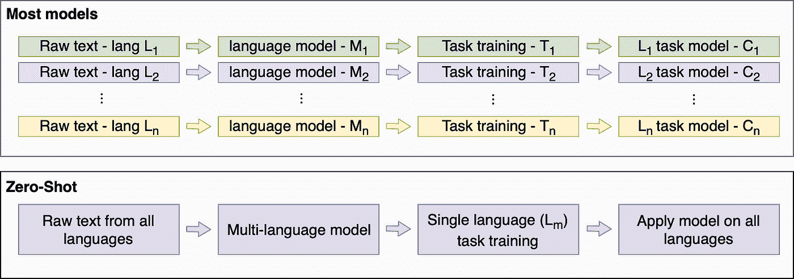
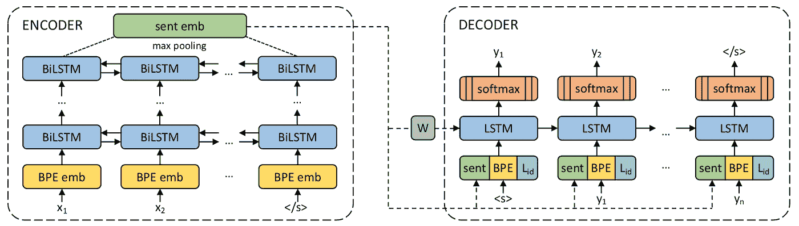
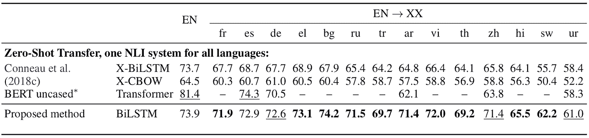

# 解释:多语言句子嵌入零镜头传输

> 原文：<https://towardsdatascience.com/explained-multilingual-sentence-embeddings-for-zero-shot-transfer-5f2cdf7d4fab?source=collection_archive---------16----------------------->

## 对 93 种语言应用单一模型

近年来，语言模型和迁移学习已经成为自然语言处理的基石之一。通过首先建立一个单词甚至字符的模型，然后使用该模型解决其他任务，如情感分析、问题回答等，可以获得惊人的结果。

虽然大多数模型都是为单一语言或几种语言分别构建的，但一篇新的[论文](https://arxiv.org/abs/1812.10464)——零枪击跨语言迁移及其他的大规模多语言句子嵌入——提出了一种不同的方法。这篇文章使用了一个支持 90 多种语言的单句编码器。它的语言模型是在包含所有这些语言的句子的数据集上训练的。然而，它可以通过仅在单一语言上训练目标模型(例如分类器)来用于给定的任务，这是一种称为零射击的技术。

这种通用语言模型在诸如自然语言推理(对两个句子之间的关系进行分类)的任务中，在大多数语言中取得了很好的结果，这是零镜头模型的最新技术。这种技术训练起来更快，并且有可能用有限的训练资源支持数百种语言。

# **背景**

自然语言处理(NLP)中的大多数预测算法不能直接处理原始文本，因为它是非数字和非结构化的。克服这一点的一种流行方法是通过创建一种语言模型，其中字符、单词或句子被翻译成有意义的向量，即嵌入向量。嵌入可以作为常量输入或通过组合两个模型(语言和预测)并针对任务对它们进行微调来提供给预测模型。

在大多数模型中，每种受支持的语言都需要一个额外的语言模型以及针对每项任务的额外培训。这些模型往往数据饥渴，需要庞大的数据集，有时有数十亿字。一种不同的方法是首先为所有语言一起训练单个语言模型。随后，对于任何给定的任务，在单一语言的数据集上进行训练就足以接收所有语言的良好结果，因为该模型能够概括许多语言，并对它们应用所学的知识。这种被称为零射击的技术的优点是简单(一种模式适用于所有人)和高效，特别是由于训练更快。

Zero-Shot approach vs other models

# 资料组

为了训练语言模型，作者创建了一个全面的数据集，其中包含句子及其在其他语言中的翻译。该数据集基于多个来源:

*   专业翻译——21 种语言的欧盟数据集(Europarl)、6 种语言的联合国数据集和 42 种语言的古兰经翻译
*   用户生成的翻译——open subtitle 提供 57 种语言的电影字幕，Tatoeba 是一个基于社区的数据集，将英语句子翻译成数百种语言。

最终数据集包括来自 34 个语系(例如日耳曼语和闪米特语)的 93 种语言的 2.23 亿个平行句子和 28 种文字(拉丁语到希伯来语)。

# **工作原理**

该模型包括两个部分——语言模型训练及其在几个自然语言处理任务中的零镜头应用。

## 语言模型训练

语言模型使用用于机器翻译的标准架构，该架构具有编码器和解码器，编码器为一种语言的句子生成向量表示，解码器试图将句子向量翻译成目标语言。该模式的一个主要特点是对所有语言使用单一网络。

编码器包括两部分:

1.  字节对编码(BPE) —一种预处理整个数据集并生成其中最常用字符序列的字典的算法。编码器中的 BPE 模块将句子输入转换成来自预建字典的子词。当使用多种语言时，BPE 显著减少了词汇量，增加了语言之间的共享区域(子词)。有关更多详细信息，请参见附录 A。
2.  LSTM 层——标准的递归神经网络，具有五层 [LSTM](http://colah.github.io/posts/2015-08-Understanding-LSTMs/) 模块(大小为 512)，在最后一层通过最大池生成句子嵌入。每个句子也以相反的顺序处理，即双向 LSTM，并且最终的句子嵌入是两个方向的串联。

然后，解码器尝试基于句子嵌入、LSTM 模块(嵌入有 BPE)的先前输出和目标语言 ID 来迭代预测下一个单词。解码器只有一个 LSTM 层(大小为 2048)和一个 softmax 层来预测最可能的字。解码器的唯一目的是训练编码器，而不是事后使用。

Model architecture (source: [Artetxe et al.](https://arxiv.org/abs/1812.10464))

为了避免随着学习语言数量的增加而产生的二次成本，该模型仅使用两种目标语言(英语和西班牙语)进行训练，而不是全部对全部。

## 每项任务培训

经过训练的编码器可以用于解决其他 NLP 任务:

1.  自然语言推理(NLI)——决定两个句子，一个前提(p)和一个假设(h)之间的关系是蕴涵、矛盾还是中性的。通过以下面的方式(p，h，p h，| p h |)组合句子，并将其作为输入来训练具有两层的小型神经网络，该模型学习预测关系。
2.  主题分类—将短文本(如新闻文章)分类到给定的主题列表中，方法是用编码器嵌入文本并训练单层网络(10 个单元，之后是 softmax 单元)。
3.  相似句子识别——更简单的用法是从另一种语言的句子数据集中找到给定句子的翻译。这项任务只需要对所有句子进行编码，并使用余弦相似度或更复杂的度量标准(如论文中所建议的)计算它们之间的距离。

该模型仅在英语句子上训练，然后在所有语言上测试(零射击)。此外，编码器是恒定的，不会针对每个任务进行微调。

# **结果**

该论文给出了在 [XNLI](http://www.nyu.edu/projects/bowman/xnli/) 数据集上的模型结果，该数据集包括用于 NLI 任务的 14 种语言的句子。当与同样被训练为零射击的其他模型相比时，该模型实现了最先进的结果。例如，与零镜头 BERT 相比，所提出的模型在大多数语言中都达到了更好的结果。

Comparison of XNLI accuracy between the proposed model and three other Zero-Shot models, [BERT](https://github.com/google-research/bert/blob/master/multilingual.md) among them. All models were trained only on English sentences and tested on up 14 languages. Source: [Artetxe et al.](https://arxiv.org/abs/1812.10464)

另一方面，当分别为每种语言训练 BERT(通过将训练数据翻译成目标语言)时，其结果优于具有零触发配置的所提出的模型。

此外，该模型还在 MLDoc 数据集(路透社新闻文章)上的分类任务和 BUCC 数据集上的相似文本识别中呈现了最先进的结果。跨多种语言的模型结果显示了其语言模型的一致性以及使用单一多语言模型的低资源语言的优势。

[可选:当编码器在长且正式的句子上被训练时，一些任务(BUCC，MLDoc)往往表现得更好，而其他任务(XNLI，Tatoeba)受益于在更短且更非正式的句子上的训练？]

[可选:消融研究:减少编码器的层数会降低精确度]

# **计算&实现**

该模型在 Pytorch 中实现，编码器和解码器使用 [fairseq](https://fairseq.readthedocs.io/en/latest/tutorial_simple_lstm.html) 。语言模型用 16 个 NVIDIA V100 GPUs 训练了 5 天左右。它将是开源的。

# **结论**

多语言句子嵌入为创建语言模型提供了一种新的技术，它更快、更简单且可扩展。它可以很容易地适应新的语言和新的任务，同时在许多语言中实现强大的结果。它甚至可以处理不属于语言模型的“未知”语言。

然而，当效率和可伸缩性不如准确性重要时，这种模型以及一般的零炮模型似乎不如 BERT 等微调模型。有趣的是，作者计划借用 BERT 架构的概念，例如使用其转换器而不是 BiLSTM 模块来改进他们的模型。另一种不同的方法是针对特定语言对模型进行微调，并比较结果。

*要了解最新的深度学习研究，请订阅我在* [*LyrnAI*](https://www.lyrn.ai) 上的简讯

## **附录 A — BPE**

字节对编码(BPE)是一种数据压缩技术，它用单个未使用的符号迭代替换给定数据集中最频繁的符号对(最初是字节)。在每次迭代中，该算法找到最频繁(相邻)的符号对，每个符号可以由单个字符或一系列字符构成，并将它们合并以创建新的符号。然后，在下一次迭代之前，所有出现的选定符号对都将被替换为新符号。最终，频繁的字符序列，直到一个完整的单词，被替换为单个符号，直到算法达到定义的迭代次数(本文中为 50k)。在推理过程中，如果一个单词不在 BPE 的预建词典中，它将被分割成子词。
BPE 的示例代码可以在这里找到[。](https://gist.github.com/ranihorev/6ba9a88c9e7401b603cd483dd767e783)