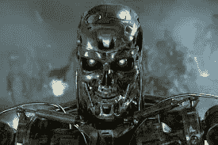

# 向管理层解释数据科学、人工智能、ML 和深度学习—演示文稿和脚本—第 2 部分，共 3 部分

> 原文：<https://towardsdatascience.com/explaining-data-science-ai-ml-and-deep-learning-to-management-a-presentation-and-a-script-2f32083ed0a4?source=collection_archive---------23----------------------->

这一系列的三篇文章旨在作为 Prezi 演讲“数据科学、人工智能、ML、DL 和所有这些东西”的附加脚本。[在本系列的第一部分](/explaining-data-science-ai-ml-and-deep-learning-to-management-a-presentation-and-a-script-4968491eb1e5)，我们深入探讨了数据科学的概念。这一部分集中在演讲的第二章，旨在给出什么是人工智能以及它与 ML 有何不同的非技术性解释，给出大量例子，并解释什么是人工智能(还不是)。正如你肯定已经注意到的，人工智能现在是几乎每一家出售数据分析和人工智能相关服务的公司的热门词汇，例如[宇熙环球](http://www.yuxiglobal.com):)。

该演示可在此处找到:

# **什么是 AI？**

本章分为五节:

1.  **三大热门 AI 应用。其中，在大胆给出正式定义之前，我们举例说明了人工智能在当今世界的应用。**
2.  **定义 AI。**针对痴迷于形式主义的**，**本节评述了给“人工智能”下一个令人满意的定义的困难，然后试图给出一个实用的定义。
3.  **AI 子问题目录。**凭借通过查看应用程序开发的直觉和定义中引入的概念，我们继续将 AI 分解为几个子领域，根据每个子领域试图解决的问题类型。
4.  **AI 的局限性。**在这一小段中，我们指出 AI，至少在我们迄今为止设法开发的狭义形式中，并不是全能的，并且具有严重的局限性。
5.  **AI 不是什么。**在最后一部分，我们针对那些看了太多关于机器人接管世界和奴役人类的科幻电影的决策者进行了一些期望管理。

# 三个流行的人工智能应用

我们不想马上以抽象、学术和枯燥的方式给人工智能下定义，而是想先回顾一下人工智能的三个流行应用。其中一些也可以被认为是简单的机器学习(ML)，而不是真正的“智能”。然而，作为人工智能的一个*子集*，任何人工智能应用也是一个人工智能应用，就像烹饪甜点是更广泛的“烹饪”类别的一个例子一样。这些应用将有助于介绍人工智能定义中的一些基本概念。

## 应用 1。自动驾驶汽车。

自动驾驶汽车可能是当今人工智能的巅峰。如果你仔细想想，自动驾驶汽车实际上是一个**机器人**，尽管它可能看起来不像。它通过一组丰富的*传感器*(相机、雷达、激光雷达、全球定位系统)感知(收集数据)其环境，它还被赋予了*致动器*，允许它执行动作(转向、加速)以改变其自身在环境中的状况——或以其他方式影响环境。自动驾驶汽车构成了“**自主智能体”、**总体概念的主要例子，这将是稍后正确定义人工智能的关键。

除了大致对应于输入和输出层的传感器和执行器之外，还有一个*中间处理层*，它解释来自传感器的原始数据，并将其转化为信息/知识，最终用于解决安全驾驶和从 A 地到 b 地的问题。这一层当然是赋予自动驾驶汽车智慧的，并结合了相当多的关键人工智能技术。仅举三个例子，我们有:

*   **计算机视觉:**这是一套相对低级的技术，用于将光学或红外摄像机捕获的原始像素转化为车道线、障碍物、行人、鹿、交通标志等的实际检测。这确实是一个纯粹的 ML 问题，目前用深度学习技术和专门的硬件(GPU)解决。
*   **搜索和规划:**除了其他事情之外，这些被用来寻找从 A 到 B 的最方便的路线，受到障碍、交通、道路封闭、速度限制、天气等的限制……顺便提一下，*这是人工智能解决的问题之一，不能通过纯人工智能技术解决，*证明人工智能不仅仅是人工智能。
*   **不确定情况下的决策:**由于传感器测量值不是绝对精确的，并且关于周围环境的可用信息必然是不完整的，任何自主发动机几乎总是被迫在不确定情况下做出决策。这不是计算机系统 pre-AI 的共同特征，甚至不是大多数人会认为计算机可以做的事情。幸运的是，在 20 世纪后半叶，计算贝叶斯统计领域取得了很大的进展，使固有的确定性计算机能够处理不确定性。

## 应用 2。个性化内容推荐

虽然有时看不见，但推荐系统几乎无处不在，从电子商务网站——想想亚马逊——一直到数字内容分发平台，如网飞和 Spotify，以及社交网络。每当你看到基于你最近的观看/购买历史的信息，我们认为你也会喜欢你可以确定有一个推荐系统在起作用。

这种系统的使用已经渗透到甚至传统的内容提供商，最近转向数字。大多数人没有意识到这一点，但纽约时报网络版的头版对每个读者来说都是不同的。推荐算法以个性化的方式确定每个用户看到的内容。

Because you watched Russian Doll.

推荐系统的目标是从浩瀚的信息或内容项目中筛选出最有可能与特定用户或用户子集(即居住在某个位置或属于特定年龄段的用户)相关的内容项目。这改善了用户体验和平台内容的整体参与度。

从技术上讲，推荐系统可以被看作是以下通用人工智能技术之一的应用:

*   **搜索**:该系统的任务是根据一些用户特定的约束条件找到最相关的内容，这些约束条件通常来自用户交互的历史记录。
*   **预测机器学习**:给定过去用户交互的记录(例子)，我们调整一个特定于用户的模型，然后允许我们预测用户 X 喜欢(以前看不见的)物品 y 的可能性

**应用 3:计算机视觉**

Image segmentation is able to identify distinct objects in a scene without necessarily saying what they are.

我们在讨论无人驾驶汽车时，曾简单提到过这种应用。然而，这是一个更广泛的领域，已经开始给制造业和安全行业等带来革命性的变化。人工智能最近人气飙升，很大程度上是因为在这一领域取得了成功。为了丰富您的计算机视觉词汇，我们希望区分管理人员有时会互换使用的几个术语:

*   **目标检测**:这是指在给定的图像中，围绕特定类别的目标(例如行人)的所有实例进行定位，即绘制边界框。例如，这种方法的变体可以用来在制成品的图像中发现缺陷。
*   **物体分类:**给定单个孤立物体的图像，识别物体的类别。换句话说，这是一张水果、一个人、一张桌子、另一辆车的照片吗？
*   **人脸识别:**给定一张人脸图片，告诉我是谁。
*   **图像分割:**给定一张复杂场景的图片，分离出其中每个单独对象对应的不同组件(像素组)，即使你不能告诉我它们是什么。
*   **流检测:**给定一个视频，在每一帧中识别正在移动的对象，以及移动的速度…

# 定义人工智能

定义人工智能的尝试充满了文化、概念甚至哲学上的困难，其中我们可以数一数:

1.  科幻电影中对人工智能的描述必然**有缺陷**以及它们在流行文化中产生的相应**误解**。我们将在稍后关于人工智能不是什么的部分对此进行更多的评论。
2.  最近人工智能的复兴带来了这个术语的缺乏精确性，如果不是被营销人员和高管们彻底滥用的话。事实上，这是创建本演示文稿的主要原因之一。在商业环境中，术语“AI”通常用于指代**许多过去被称为其他名称的东西**至少在它们被开发的更狭窄的学术圈子中是如此。这些例子有:
    **机器学习:**正如我们已经指出的，这只是人工智能的一个严格子集。
    **商业智能/分析:**不是真正的人工智能，尽管它可以指导人类做出*更明智的决策*。专家系统:这些系统是基于从特定领域的人类专家那里辛苦收集的许多如果-那么规则，并让计算机根据需要应用它们。虽然它们属于人工智能的开端，但自其早期发展以来已经发生了很多事情
    **一些统计工具:**为了营销的利益，甚至经典的统计工具，如线性或逻辑回归，有时也被称为人工智能！
3.  雪上加霜的是，甚至连人工智能的研究人员都没有对他们的研究领域进行精确的定义，这使得情况变得更加糟糕。如果我们认为他们瞄准的是一个移动的目标，我们就不能责怪他们。许多曾经被认为是人工智能主要例子的产品，如 OCR 系统(从扫描文件中提取数字文本或从信封中提取手写邮政编码)或拼写检查器，现在被许多人认为是“常规软件”，不配拥有“人工智能”的标签。正如一个老笑话所说**“人工智能是所有计算机*还不能*做的很酷的事情”。**和所有的笑话一样，这个笑话植根于一种普遍持有的观点，即一旦设计出一种合理有效的算法方法或计算机架构来解决一个问题，该问题就会自动脱离人工智能的领域，进入“经典”软件工程领域。
4.  最后但并非最不重要的是，我们应该提到，仅仅是“人工智能”中智能这个词的出现就打开了一个语义和哲学上的难题，困扰着任何令人满意地定义这个短语的尝试。关于意识、思想、头脑和灵魂的“真正本质”的几千年未解决的问题立刻出现了。当然，我们甚至不会试图在这里攻击这些。我只想说，任何一致且被接受的人工智能定义，就像我们将在下一节介绍的那样，都必然会避免触及“生物智能”或“有机智能”实际上意味着什么的危险话题。

## 不完善的定义

这是人工智能的一个实用定义。由于刚才提到的哲学上的困难，它必然是不完善的。它是可操作的，因为它关注的是智能主体必须表现出的可观察属性，而不是智能意味着什么。

**定义:AI** 是计算机科学的*分支，负责**智能代理的设计和构建。***

反过来，智能代理是任何(大部分)具有以下特征的代理:

*   **自主**(即能够在复杂环境中执行任务，无需用户的*持续*指导)和
*   **适应性强**(能够通过从经验中学习来提高绩效)
*   **能够感知**并有效地抽象其环境特征(感知)
*   **能够“理智地”行动**。在这种情况下,*理性行为*是指任何旨在最大化定量和客观效用函数或性能测量的行为。

这个定义的两个推论是，智能代理必须包括(并且几乎可以简化为):

*   做出明智决策的程序——这里的“聪明”只是理性的一个更简单的词，在上面已经做了精确的解释。
*   能够模仿人类认知(某些方面)的系统。

# 人工智能子领域列表

有了前面的定义，不管它有多不完善，我们都可以更好地回顾和理解人工智能的一些子领域。这里有一个简短的目录:

*   **搜索和信息检索:**这不仅仅指互联网搜索，如谷歌或 Shazam，而是指一系列更广泛的问题，其中我们的智能代理(在本文中称为“搜索引擎”)必须在一个由大量数据项组成的环境中导航，以最大化效用函数，这是每个项与查询相关性的定量测量。
*   **规划**:这是设计一个计划或一系列行动的问题，这些行动将一个复杂的系统从初始状态 A 引导到期望的状态 B，服从一组约束。这方面的一个重要例子是，在拥挤时段，在繁忙的机场为一组飞机创建公平和最优的着陆时间表。
*   **自然语言处理(NLP)和语音识别**:这些是任何聊天机器人或对话式数字助理的关键要素。这里的关键能力是“理解”人类输入的话语或书面短语，以检测他们的意图(提出问题、下订单等)。)在这种情况下，一方面，智能代理是机器人，环境是聊天室，另一方面，是用于回答问题或执行人的请求的一组信息服务、数据库或 API。
*   自动推理:这些系统试图进行逻辑思考或从一组前提推导出一个结论。几年前，IBM Watson 因击败之前的人类冠军赢得了 Jeopardy 而出名。可以肯定的是，这个游戏不仅仅是关于推理，还包含了大量的信息检索成分。最近，一个所谓的“法律人工智能”能够发现 NDA 协议中的问题，比一群经验丰富的律师更准确。当然，这个例子也处于自然语言处理和自动推理之间的灰色地带。
*   **计算机视觉:**我们在这篇文章的第一部分详细讨论了这个子领域，作为三个原型应用的最后一个。
*   任何机器学习(ML)问题:最后但并非最不重要的是，我们应该提到有一大类问题不直接属于上述任何子领域，但可以通过 ML 技术解决。为了能够应用 ML，关键要素是以示例的形式拥有大量数据，通用算法可以从中发现模式，然后做出预测。在本系列的第三篇文章中，我们将会有更多关于 ML 的内容。所以，敬请期待！

# **AI 的局限性**

正如我们在前面一节所暗示的，**“聪明”这个词是有问题的，甚至是误导的。能够从皮肤照片中检测黑色素瘤的计算机视觉系统可以被称为智能的，但它不能执行智能人会做的任何其他任务。**

这就是为什么我们当中比较迂腐的人会把*狭义的*和*广义的*人工智能区分开来。如果一个人工智能系统解决一个问题的能力没有告诉我们解决另一个问题的能力，即使从人类的角度来看，这两个问题密切相关，那么这个人工智能系统就被称为狭义的。关键的观察是**狭隘的人工智能系统不能将一般原理**从一个问题转移到另一个问题。

到目前为止，我们只能开发狭义的人工智能。**人工** **通用** i **智能**，通常缩写为 **AGI** ，指的是能够处理任何智力任务并能将知识或技能从一项任务转移到另一项任务的机器。不幸(还是幸运？)AGI 仍处于科幻小说的领域。对于 AGI 是否能在可预见的未来实现，几乎没有共识。尽管在深度学习领域取得了令人印象深刻的进步，这些进步在不久前还被认为是不可能的，(即 [AlphaGo](https://en.wikipedia.org/wiki/AlphaGo) )，但这位研究人员认为，AGI 至少还需要 50 年，如果不是更久的话..

总之，人工智能的主要限制是人工智能代理通常只能优化他们的决策和行动来实现一个单一的目标。**人的因素仍然在理解这个目标的背景、**对不同目标的工作进行优先排序以及有效地交流人工智能模型的结果方面发挥着关键的**作用。**

# 什么人工智能不是(还不是…)

Terminator

作为这篇文章的结尾，这里列出了人工智能还没有做到的事情——至少现在还没有:

*   **用金属般的声音说话的机器人(**并且能够设计对抗人类的机器人)。例如终结者/天网。
*   意识/感觉机器:不管在不久的将来，一些机器在模仿感觉方面会变得多么好，我们都不应该忘记，我们离在数字计算机中复制意识还很远。首先，我们不确定意识需要什么。
*   **能够代替任何人做任何工作**。尽管越来越多的工作正在被有效地自动化，但仍有大量更具创造性或战略性的工作在中长期内不会被机器取代，甚至可能永远不会。
*   **一般智力**:能够主动从一个领域中提取知识和技能，并将其转化。参见上一节。
*   **能够主动/自由地(显著地)更新自己**。尽管适应性是人工智能代理的定义特征之一，但允许它们处理与最初设计的问题有质的不同的问题的重大更新仍然是他们力所不及的。
*   **可数名词**。奉劝:不要谈“安艾”。人工智能是一门科学学科，就像数学或生物学一样。

# 结论

在这篇文章中，我们从“商业”的角度，对人工智能领域，它的可能性和局限性做了一个高层次但详细的概述。为了让我们的想法更有条理，我们还尝试了一个精确而实用的人工智能定义，它专注于可观察和客观量化的目标，而不是关于大脑和智能真正含义的难题。

敬请关注本系列的第三篇也是最后一篇文章，在这篇文章中，我们将缩小对机器学习和深度学习领域的关注，通过这些领域，人工智能近年来重新获得了优势。

# 参考

 [## 面向非专家的免费人工智能在线介绍

### 了解更多关于瑞典的人工智能创新，赫尔辛基大学和 Reaktor 的学生和商业人工智能课程…

www.elementsofai.com](https://www.elementsofai.com/)  [## 人工智能| Udacity

### 向彼得·诺维格和巴斯蒂安·特龙这样的人工智能专家学习基本的人工智能概念，包括…

www.udacity.com](https://www.udacity.com/course/ai-artificial-intelligence-nanodegree--nd898)  [## 人工智能与律师:终极对决

### 在准确发现日常商业合同中的风险方面，人工智能首次超过了顶级律师。

www.lawgeex.com](https://www.lawgeex.com/resources/AIvsLawyer/)  [## 20 个顶级律师被法律 AI 打。以下是他们令人惊讶的回应

### 在一项里程碑式的研究中，20 名在公司法和合同审查方面有数十年经验的美国顶级公司律师…

hackernoon.com](https://hackernoon.com/20-top-lawyers-were-beaten-by-legal-ai-here-are-their-surprising-responses-5dafdf25554d)  [## 杰弗里·辛顿和戴密斯·哈萨比斯:AGI 离现实还差得很远

### 预测音乐品味。检测转移肿瘤。生成脑癌的合成扫描。正在创建虚拟…

venturebeat.com](https://venturebeat.com/2018/12/17/geoffrey-hinton-and-demis-hassabis-agi-is-nowhere-close-to-being-a-reality/)