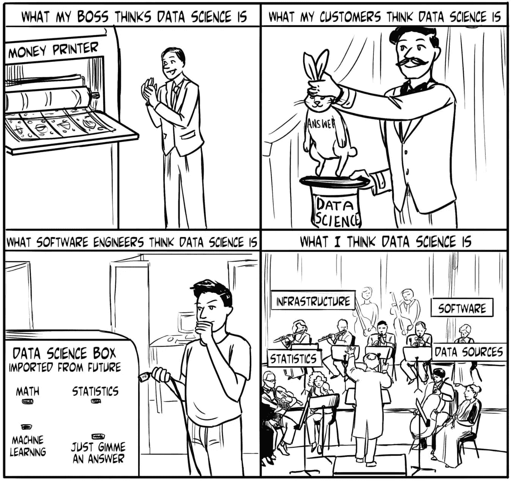
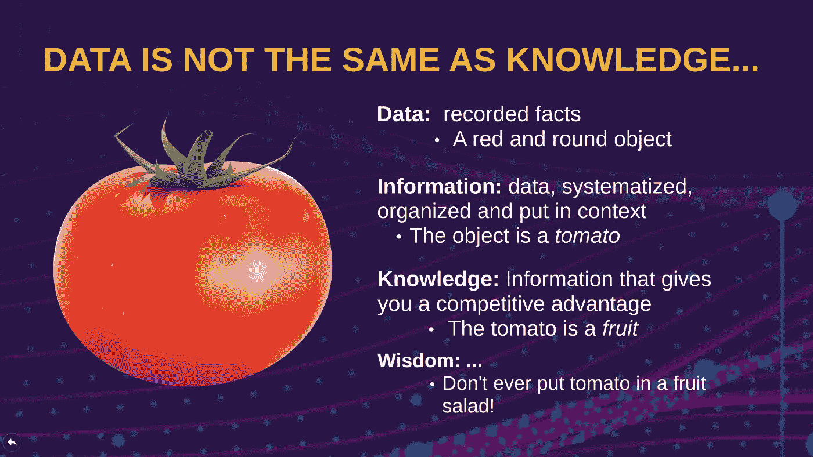
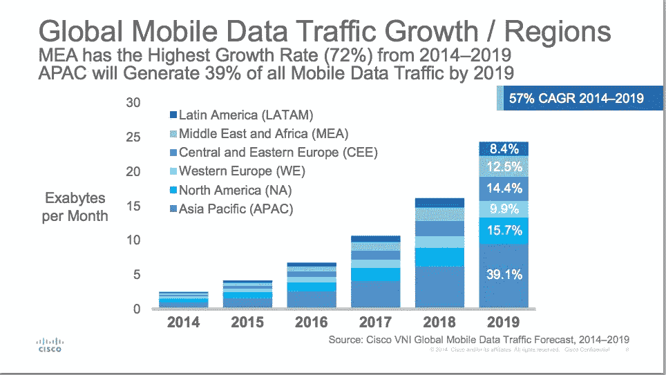

# 向管理层解释数据科学、人工智能、ML 和深度学习—演示文稿和脚本—第 1 部分，共 3 部分

> 原文：<https://towardsdatascience.com/explaining-data-science-ai-ml-and-deep-learning-to-management-a-presentation-and-a-script-4968491eb1e5?source=collection_archive---------9----------------------->

Image from the book “Think like a Data Scientist” by Brian Godsey (link in the references below)

# 介绍

如果你是一名数据科学家、一名机器学习工程师、一名人工智能专家，或者无论你想称呼自己什么，在你职业生涯的某个阶段，你很可能至少遇到过一个经理，他不理解标题中列出的一些概念之间的区别。毕竟，他为什么要这么做？！你可能很难在不使用专业术语的情况下解释这些差异，而且你这样做已经疏远了你已经困惑的经理。

不再害怕！我们[羽西环球](https://yuxiglobal.com/home)针对这种情况制定了近乎完美的解决方案。作为 Yuxi Global 的数据分析主管，我的任务是构建 Prezi 演示文稿，以帮助解释“数据科学”、“人工智能”、“机器学习”(ML)和“深度学习”(DL)对中高层管理人员的意义。最终目标是帮助他们指导他们的战略和商业决策，即我们希望为这些领域的客户开发什么样的服务和解决方案。在这样做之后，我们认为与世界分享我们的工作是有价值的，可以节省每个数据科学家使用演示软件的大量时间。

演示链接就在这一段下面。下面，我们还分享了一个以完全线性的方式呈现材料的脚本。当然，你可以选择一些零碎的东西作为演讲的重点，并在它们之间切换。这也是我们选择 Prezi 作为演示解决方案的原因之一。

Presentation by Jhonatan Mora, commissioned by the author.

# “分析/数据科学/ AI / ML / DL 和所有这些东西”的演示文稿脚本，第 1 部分，共 3 部分

## 第 1 部分:**什么是数据科学/数据分析？**

这一部分由两章组成。第一个重点是试图通过给出不止一个而是三个相关的定义来定义“数据科学”这个有点鬼鬼祟祟的概念。这个想法是，演示者可以选择与他自己的背景和对主题的理解最有共鸣的定义，或者最容易被他的观众吸收的定义。第二章试图解释为什么数据科学现在是一种趋势，而以前不是，这很奇怪，因为根据定义，数据科学的概念是多么自然或基本。

## 第一章:**三个定义**

**定义 1:** 也许理解“数据科学”的最佳方式之一就是将**视为一个过程，**即使用*数据* *来理解*事物的过程。在我们希望做得更好的“事情”中，我们可以列出:

*   你的顾客
*   您的业务流程
*   顾客如何消费/感知/喜欢你的产品。

这里的关键词是“数据”和“理解”。数据是主要输入，理解是最终目的。因此，数据科学远远超出了商业智能，商业智能往往停留在测量和呈现已经发生的事情，而没有深入研究*为什么*会发生，或者*如何*控制或影响未来将发生的事情。另一种简单的说法是让“*数据讲述一个故事”*。毕竟，所有人类总是试图通过创造叙事来理解他们周围的世界，这些叙事以逻辑连贯的方式(有时甚至是荒诞的方式)将纯粹的事实联系起来，例如神话和传说。

另一种将这一定义转化为文字的方式是，数据科学等同于**揭示隐藏在数据**背后的*洞察力、*模式*和趋势*。有些人喜欢这个定义，因为它很短，并且提到了两个很好的流行语:“趋势”和“见解”。前者的含义对我来说相当清楚。大多数人对什么是趋势都有非常清晰的概念。然而，*洞察力*是一个更加抽象的概念，含义相当模糊。这个词在西班牙语中没有明显的翻译。从给出的翻译来看，你可能会认为它在某些情况下意味着“理解”,而在其他情况下意味着“知识”……我喜欢这种措辞的原因是，它引入了一个关键概念，即数据本身只是一个开始，在数据的背后隐藏着重要的拼图*,人们想要揭开它。*

这给我们带来了同一概念的进一步措辞，我特别喜欢:数据科学意味着**将数据转化为知识，而*可以指导决策。*** 一个绝妙的形象地说明了数据和知识之间的区别(对一些人来说是意想不到的),这就是“番茄类比”。这是这样的:

Image by the Author

这里的关键见解是，在做决策时，*数据本身几乎没有任何价值。数据不过是一些实体的记录事实的集合，有时是巨大的集合，比如你的客户、你的销售交易或你的网络互动。尽管你和你的公司可能会花费大量的金钱、时间和精力来管理这个事实库，但是所说的成本不会自动转化为价值。*

在数据之上增加一层价值之后，可以在下一个层次找到信息，在丰富的背景下以系统化或结构化的形式。您的数据中与业务相关的方面只是第一次出现在这里。只有当数据在您的业务环境中具有相关意义时，它才会成为信息。

现在谈谈知识。知识的定义特征是它给你一种竞争优势，或者像古老的格言所说的“知识就是力量”。获得这种优势的方法是做出比竞争对手更好的决策。换句话说，一个人不具备关于某件事的(有价值的)知识，除非所述知识能够为你的决策提供信息，并为你的业务带来更理想的结果。

如果不清楚的话，关于智慧的那一点真的是一个笑话。正如有人曾经说过的那样，通过幽默学到的任何东西都不会被忘记。

**定义 2:数据科学就是*科学*。**

这个定义强调了科学已经存在了几个世纪的事实。在那段时间里，应用的配方——也就是科学方法——都是一样的:

1.  通过*观察*一些现象并记录这些观察开始，即产生*数据*。
2.  根据手头的数据，提出假设和问题，并尝试确认和回答它们。严格地说，除非一个假设被表述为另一个假设的否定，否则一个假设永远不会被证实。一个人最大的希望就是拒绝或者拒绝不了它。然而，我建议你永远不要在管理层面前讨论这种微妙之处，因为这很可能导致混乱，让他们错误地认为你是一个廉价的哲学家。
3.  给定足够的数据和确认的假设，人们有时可以冒险建立一个模型。模型是一个更加精细的概念/数学工件，它进一步编码或总结了您对所讨论的过程或系统的理解。一个足够强大的模型甚至可以用来产生前瞻性的预测。
4.  对于某些研究主题，可以设计实验(例如 A/B 测试)来以可重复的方式真正测试某些条件对您的系统的影响。这确实是建立因果关系的唯一明智的方法。

简而言之，在这个定义下，*数据科学只不过是几个世纪前的应用(而且已经被证明！)解决商业问题的科学方法。*顺便说一句，这个定义帮助我们看到“数据科学”中的“数据”是多余的，因为从来没有不处理数据的科学！

**定义三:** **数据科学作为一个总称。**

这可能是最不深刻但也是最直接的定义。它将数据科学简化为一些战术组件的直接总和。根据这一定义，数据科学将是一个*近期* **的总称**，它将以下几种工艺组合在一起:

*   **人工智能:**一些人声称，好的数据科学至少需要雇用少量人工智能。我们不一定同意这种说法。在本系列的第 2 部分中，我们将对此进行更多的讨论。
*   机器学习:这将是第 3 部分的主题
*   统计学确实是任何科学努力的工具，也是将“软”科学转变为“硬”科学的唯一途径。
*   **ETL，数据清理:** ETL 是指提取、转换、加载或数据探索、假设制定、模型构建之前的阶段。这些无疑是数据科学最不迷人但无疑是必要的方面。然而，将这些归入“数据工程”领域已经成为一种时尚。
*   **数据可视化:**对于第一个定义中提到的数据科学的“讲述故事”方面，以及对于从模型或输入数据的简单初始探索中得出的结果的成功交流，都是必不可少的。
*   **算法和基础设施:**旨在有效操作和处理数据。这是几乎所有数据科学项目的第二阶段(ETLs 和清理之后)所涉及的“数字处理”。算法和基础设施实际上是一种工具和手段，但不是数据科学工作的目的*本身*。他们的发展和理论研究确实属于计算机科学系。
*   **高效的数据存储和检索架构:**与上一个非常相似。这一方面涉及有效获取、存储和检索数据的技术(硬件和软件)。数据科学必然会在这个领域找到支持。
*   **业务知识/对应用领域的理解:**这是数据科学中经常被忽视的一个方面。我个人经历过许多数据科学项目失败的例子，要么是由于“业务方面”的人想当然地认为数据科学家完全获得了业务动态及其所有隐含的假设和约束，要么是数据科学家自己完全无视这些，只关注数据分析方法。

**第二章:为什么如今数据科学是“一个东西”？**

考虑到上一章提到的数据科学只不过是将一种旧方法自然应用于商业领域，以使其更好并获得优势，那么显而易见的自然问题是:为什么它没有更早发生？

我们认为，答案可以归结为两个密切相关且相对较新的发展:

*   **互联网经济的到来和移动应用的爆炸式增长**产生了大量等待转化为价值的数据。因此，有许多公司或所谓的平台，它们的业务包括移动比特。因此，数据是这些公司的主要资产。这同样适用于许多已经过渡到数字世界的传统行业，比如报纸、电视、酒店、食品配送、保险等等

1 exabyte =1.000.000.000 gigabytes, Source: Cisco VNI Global Mobile Data Traffic Forecast (link below)

*   **与数据存储和处理相关的成本急剧下降。**根据[的消息来源](http://www.mkomo.com/cost-per-gigabyte)和[的消息来源](https://www.backblaze.com/blog/hard-drive-cost-per-gigabyte/)，每 GB 硬盘的成本从 1997 年的大约 100 美元下降到 2005 年的 1 美元，然后在 2017 年再次下降到大约 0.03 美元。这只会助长“大数据”和“分布式计算”等趋势。

在更小的程度上，以下因素，我们认为是我们刚才提到的两个因素的结果，促成了数据科学的流行和 ML，AI 和深度学习(ML)的复兴:

*   **大量的开源工具。通过公共存储库共享源代码的便利性使开源软件成为数据科学之王，几乎完全取代了传统的昂贵的闭源解决方案，如 SAS 或 IBM SPSS。**
*   **大量创新的 ML 和 DL 算法的开发**能够处理每年增长的数据集以及能够从非表格数据(例如图像或声音文件)中提取价值的需求推动了这一发展。
*   在硬件方面，用于运行深度学习算法所需的繁重计算的 GPU 的**可用性。这几乎是游戏流行的一个偶然但幸运的副作用。感谢游戏玩家！**

## 第一部分的结论

在第一部分中，我们从三个不同的角度介绍了数据科学的一般背景。我们还评论了直接促成数据科学应用于以信息为中心的行业的环境变化。

请继续关注第二部分，我们将解释什么是人工智能，以及它如何真的不仅仅是人工智能。

## 参考

 [## 像数据科学家一样思考:一步一步地处理数据科学流程

### 像数据科学家一样思考:在 Amazon.com 一步一步地处理数据科学过程。*免费*…

www.amazon.com](https://www.amazon.com/Think-Like-Scientist-step-step/dp/1633430278)  [## 存储成本的历史-马特·科莫罗夫斯基

### 存储成本的历史

-马特·科莫罗夫斯基 costwww.mkomo.com 仓储史](http://www.mkomo.com/cost-per-gigabyte)  [## 思科视觉网络指数:2017-2022 年全球移动数据流量预测

### 2019 . 2 . 19 关于思科视觉联网指数 q .思科为什么要开发思科视觉联网指数…

www.cisco.com](https://www.cisco.com/c/en/us/solutions/collateral/service-provider/visual-networking-index-vni/vni-forecast-qa.html)