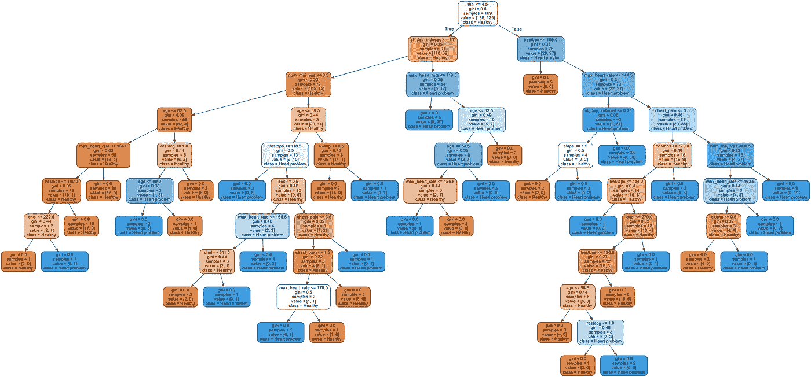

# 解释数据科学/人工智能

> 原文：<https://towardsdatascience.com/explaining-data-science-artificial-intelligence-fd5232a9b26b?source=collection_archive---------14----------------------->

## 一位数据科学家对“您是做什么的？”


Photo by [Scott Graham](https://unsplash.com/@homajob?utm_source=medium&utm_medium=referral) on [Unsplash](https://unsplash.com?utm_source=medium&utm_medium=referral)

# 你是做什么的？

对于数据科学家来说，这是一个很难回答的问题，尽管他们经常被问到这个问题，这也是我们写这篇文章的原因。我们将在涵盖人工智能基础知识的同时，尝试解释他们的谋生之道。因此，我们将把这篇文章的重点放在什么是 ***数据科学家*** 上，同时也围绕关于 ***人工智能*** 的普遍误解。

这是**而不是**一个关于如何成为一名数据科学家，或者如何开始学习人工智能的教程。这篇文章旨在尽可能简单易懂，你不需要多少数学或编程知识就能理解。

最后，你将有望很好地理解数据科学家是如何谋生的，以及他们如何利用人工智能来解决现实世界的问题。

# AI 呢？

嗯，未来似乎会围绕人工智能来塑造自己，作为一个社会，我们需要规范我们对数据能做什么，不能做什么。是的，**都是关于数据**，我们将在下一节看到。

当然，我们可以花很多时间来谈论人工智能不好的一面，不是说它不重要，而是它在网络上被广泛报道。事实上，你可能会认为人工智能机器人将接管世界。

所以，相反，我们会深入探讨艾的*好的一面，通常会被忽略，因为它可能会改变世界。它将帮助我们治愈疾病，发现新的药物，教育更多的人，无论是在富国还是穷国，找到新的娱乐方式，甚至是着陆火箭！*

## *你说的“一切都与数据有关”是什么意思？*

*好问题！要回答这个问题，我们需要开始谈论严重依赖数据的 ***机器学习*** ，而是 AI 的主要组成部分之一。*

*要理解到底什么是机器学习，我们先来解释一下什么是算法。通常，我们定义一个**算法**，就像我们定义一个**烹饪食谱**一样:一个遵循的步骤列表，它将**引导你到一个确定的目标**。例如，如果你有心脏问题，你可能会去看医生，做一些检查。当得到你的检查结果时，医生会根据一个**算法**来决定你是否患有心脏病。这意味着如果你的心率高于某个阈值，你的家族也有心脏问题史，在上面锻炼时有一些问题，那么医生可能会决定你应该进行更多的测试，以验证你的**心脏是否有风险**，或者你的**身体健康**。*

*嗯， ***机器学习*** 算法(或*模型*)是一种不同类型的算法。这个想法主要是利用菜谱的结果，也就是这道菜，来回溯我们的工作方式，实际上**自动学习整个菜谱。在我们的案例中，我们希望*从大量患者数据中自动学习*最佳算法。所以，对于一个特定的病人，我们会知道他们的*心率、*血压、和以及其他一些事情；还能判断他们是否有心脏问题。利用这些信息，我们想训练一台机器学习如何识别心脏问题。我们希望**复制人类如何学习**，这就是机器学习模型表现良好的原因。算法通常会直接从数据中学习哪些是重要的因素(心率等……)，这就是“机器 ***学习*** ”这个术语的由来。有许多算法属于这一类，但是每次的过程都大致相同:***

*   *选择要使用的算法*
*   *训练它使用一些数据，当它答对时奖励它，当它答错时惩罚它*
*   *通过测量它得到正确/错误答案的频率，在新数据上测试它*

*如果这一切听起来有点模糊，不要担心，我们已经为您准备了一个例子！*

# *但是他们做什么呢？*

*数据科学家的工作很难确定，因为它是*而不是*新的。它围绕着**数据、统计、编程和交流。**通常，他们会被分配一项特定的任务，例如:“根据这些患者的记录，找到诊断心脏病的最佳方法”。但有时，他们也可以在没有特定指令的情况下获得一些数据，例如:“利用数据来创造价值/赚钱”；是的，*就是* ***它*** 。
工作描述非常宽泛**，它还包括一些任务，例如:“构建一个能够为我们的客户安排完整行程的对话式人工智能，包括机票或火车票，以及酒店预订”。***

***然而，今天我们将专注于一个特定的任务:如果我们必须从一个新病人身上**诊断出一种心脏病**给定大量关于过去病人的**数据**，数据科学家将如何着手？
好吧，首先，人们会从尝试获得对数据的*感觉*开始，因为算法只会和提供的数据**一样好。我们的意思是，如果你有一个主要由健康患者组成的数据集，你通常会很难建立一个能够找到患病患者的算法。*****

***一旦完成，数据**足够干净可以利用**，工作最好的部分就来了: ***建立模型*** 。数据科学家将训练一个模型来识别一个生病的病人和一个健康的人，这很有趣。我们将在下一节中更深入地讨论这个问题。
最后但同样重要的是，当一个好的模型已经*建立起来*时，另一个至关重要的部分是向负责人解释结果或预测，作为一名医生或管理人员，通常*不是一个精通统计的*人。沟通是工作的一个重要部分，因为你必须为你的解决方案辩护，这可能会影响数百万人的生活。***

***关于定义的闲聊已经够多了。让我们**向**你展示数据科学家是做什么的。***

# ***检测心脏病***

***大学和其他组织可以在网上获得大量的数据集。一个数据集由**两个**组成，第一个是**样本**，第二个是**特征**。这并不像听起来那么复杂，例如在我们的例子中，样本是**患者**，特征是**提供的关于他们每个人的信息**。你可以在这里找到由 UCI 提供的数据。所有后续工作都由源代码支持，您可以在这里找到。***

***好吧，让我们深入研究一下。在这种特殊情况下，我们看到的是由医生和研究人员收集的大量信息组成的**患者数据**。我们将大致了解数据科学家是如何做的，这样你就可以理解他们是如何利用数据得出结论和预测事情的。***

***所以我们要做的第一件事是理解这些数据是关于什么的。以下是我们现有资料的摘录:***

```
***+-------+------+-------------+--------+----------+---------+
| age   | sex  | chest_pain  | chol   | restecg  | num_bin |
+-------+------+-------------+--------+----------+---------+
| 63.0  | 1.0  |        1.0  | 233.0  |   150.0  |       0 |
| 67.0  | 1.0  |        4.0  | 286.0  |   108.0  |       1 |
| 67.0  | 1.0  |        4.0  | 229.0  |   129.0  |       1 |
+-------+------+-------------+--------+----------+---------+***
```

***因此，对于每个患者，我们知道很多事情，**年龄，性别**(男性 1，女性 0)，他们经历的**胸痛**(从 1 到 4)， **胆固醇**的**水平，他们的静息**心电图**结果，以及其他一些指标:**他们总共有 13 人**。最后一栏称为**“num _ bin”**是代表他们是否有心脏问题的一栏，1 表示有，0 表示没有。*****

***医生通常会询问所有这些信息，并利用这些信息来决定患者是否有风险。数据科学家的工作可能是建立一个能够预测这些心脏问题的数学模型。因此，与医生相反，模型不是知道一些赠品和一般的健康规则，而是试图通过处理数据来学习它们**，**(嗯，这比那要复杂一点，但这是它的要点)。别忘了我们在这里谈论的是数学，而不是魔法。这个想法实际上很简单，第一步我们希望**训练**模型能够从数据中识别疾病，然后**在新的、从未见过的数据上测试**，并评估其性能。***

## ***我们所说的培训是什么意思？***

***训练是一个特定的过程，它包括提高模型的性能。我们首先向算法随机展示一个病人**，而**不告诉它病人是否有心脏病，并要求算法**预测**是否有心脏病。在每次猜测之后，我们通过调整一些参数来计算算法中的误差或好的预测，这些参数将有助于算法在每个例子之后变得越来越好**。*****

## ***我们所说的测试是什么意思？***

***正如您所期望的，测试仅仅是测量模型性能的行为。我们一直在用测验或测试来测试人类，这仅仅是一种测试一个人在某个科目上的能力的方式。从设计上来说，这与我们人类的行为非常接近。在我们的具体案例中，我们希望能够看到算法得到正确或错误答案的频率。更重要的是，我们要确保模型不会错过生病的病人，因为很明显，错过生病的病人比向健康的人宣布他们生病更糟糕。***

## ***预言***

***使用前面提到的数据集，我们训练了两个模型，这两个模型都来自不同的算法，每个模型都有自己的优点和缺点。***

***第一个是 ***随机森林*** ，这是一个高度可解释的模型，这意味着当我们使用它进行预测时，我们将能够**理解模型是如何做出决定的。**这对医生来说实际上是一个巨大的帮助**，因为他们将能够从模型中提取信息，例如哪组特征对做出最佳决策最重要。
随机森林模型是基于决策树的**模型，并基于特征做出连续的决策，直到能够得出关于患者是否患病的结论。训练完成后，您可以检索其中一个**决策树**，亲自查看模型如何决定对样本进行分类。我们自己训练了这个模型，这是结果树之一:*******

******

***One decision tree from the Random Forest***

***正如我们所看到的，在每一步，树都根据一些因素做出决定，最后，在下面的树叶上，我们将看到预测。想象一下，对于一个医生来说，在他们的诊断中包含这种模型会有多棒。当我们测试它的时候，随机森林**是正确的**的概率大约是**的 80%，**这意味着它在 10 个病人中有 8 个在**没有犯错误的情况下发现了病人是健康的还是生病的。**但更重要的是我们发现的所有患病患者的**百分比，即 **61.5%** :换句话说，我们 10 次中有 4 次会漏掉一个患病患者**。**正如我们所看到的，它具有高度的可解释性，但在预测方面却表现不佳，事实上，在所有患病患者中，我们的**遗漏率超过了** **38%** ！*****

***好的，让我们来看看第二个模型，它是一个 ***多层感知器*** ，一个最简单的 ***神经网络*。**神经网络是基于**人脑**的数学模型，更具体地说是基于**它们的突触**。事实上，它们被设计成以与人类相似的方式做决定。与之前的模型相比，这个模型**不像**那样可解释，但是理论上**应该做出更好的预测**。事实上，当我们测试它时，该模型的正确率**为 86.7%** 比以前高，但真正的变化是它发现的病人，关于他们，它的正确率**为 84.6%**比以前高得多。我们现在“只”错过了他们中的 15%多一点。***

***正如我们所看到的，两个模型之间有一个明显的**权衡**，**一个更准确，但另一个是可解释的，**根据应用程序，我们可能希望使用一个而不是另一个。例如，如果我们想帮助医生做出更好的预测，可解释的模型会更好。然而，如果我们希望做出准确的选择，我们会选择另一个。***

# ***成果交流***

***现在我们有了要展示的结果，我们需要把它们清楚地传达给负责人，不管那个人是医生、经理、科学家还是其他任何角色。因此，数据科学家将需要**调整他们的解释**，以符合他们听众的技术深度。但有时机器学习对所提供的那种数据不起作用，人们需要解释它为什么不起作用，以及**如何修复它。*****

***这就是为什么通常他们倾向于制造两种不同的解释，一种高层次的，一种低层次的。第一个面向**业务相关人员**，另一个面向更多的**技术受众。*****

***瞧啊。无论如何，数据科学家的工作*相当神秘*，所以，很有可能，在角色再次转变之前，这种快速描述可能不会保持准确那么久。人工智能不是黑魔法，也不能解决所有问题，但它可以帮助改变我们的生活。***

***本文由 **Pierre Fouché、Matthias Leroy、**和 **Romain Choukroun** 共同撰写。再次，你可以在这里 找到分析结果 [**背后的代码和科学。通过纠正我们在科学或写作方面的错误，帮助我们把这篇文章写得更好！如有疑问，请随时联系我们，我们将很乐意回答:**](https://github.com/LoomisLoud/explain-ml/) **[pierre . fouche @ epfl . ch](mailto:pierre.fouche@epfl.ch)
[Matthias . Leroy @ epfl . ch](mailto:matthias.leroy@epfl.ch)
[romain.choukroun@gmail.com](mailto:romain.choukroun@gmail.com)*****