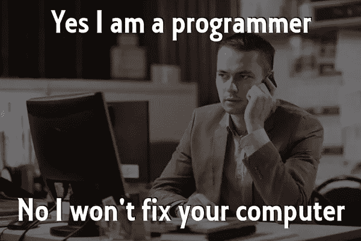
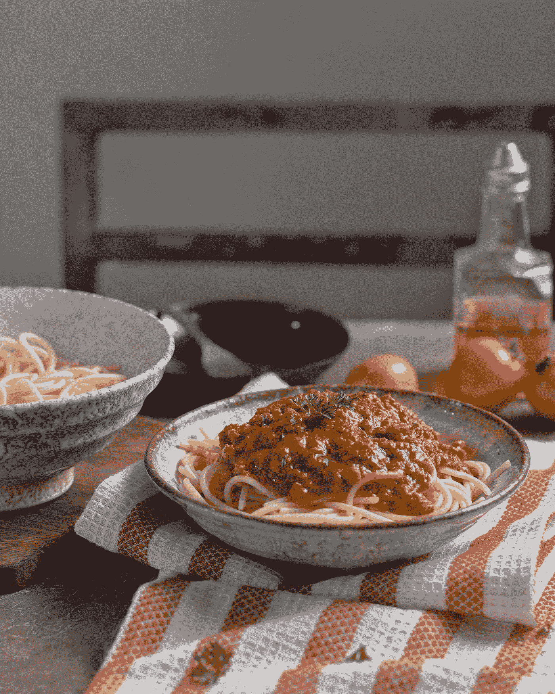
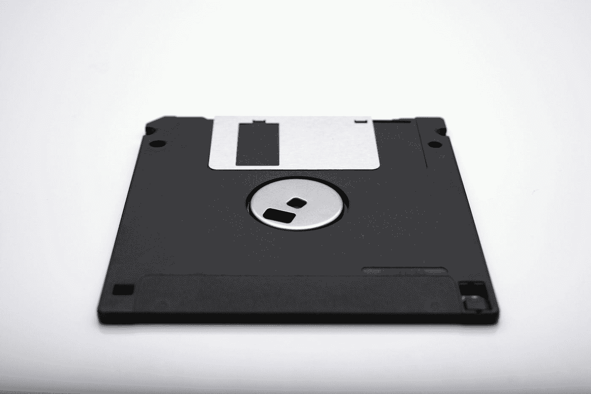

# 向你的祖母解释数据科学

> 原文：<https://towardsdatascience.com/explaining-data-science-to-your-grandma-f8345621483d?source=collection_archive---------15----------------------->

## 或者如何向你的家人或任何与技术世界脱节的人解释数据科学。

Photo by [Alex Harvey 🤙🏻](https://unsplash.com/@alexharvey?utm_source=medium&utm_medium=referral) on [Unsplash](https://unsplash.com?utm_source=medium&utm_medium=referral)

我无法用确切的语言来表达我的沮丧。我做数据科学家已经 3 年了，在这 3 年的大部分时间里，我一直在努力向家人解释我工作的目的和日常活动。首先，我的家人只会说法语，Data Scientist 不会完全翻译成法语。官方的说法是，法国政府提出了一个翻译:“专家在地中海”。剧透警报，对谁都没啥意义。

机器学习的世界是由英语主宰的，向任何一个 60 岁以上的法国人解释英语是一种极其痛苦的经历，这些人从未与计算机或数据世界有过任何联系。此外，我的家人不仅仅是法国人，他们是 T2 南部的法国人，这意味着除了不会说英语之外，他们还有脾气，对他们不理解的事情没有耐心。最终，他们的结论是“*她用电脑做了点什么*”。公平地说，我有。但是现在，大多数人“用电脑做一些事情”，即使仅限于在该死的电脑上回复电子邮件。

虽然这让我很抓狂，但我也需要理解这对他们来说有多沮丧。老年人已经脱离了科技。它长得如此之快，如此之大，如此之强。它在我们的生活中无处不在，但这并不意味着每一代人都在理解它及其后果。我不能只是沮丧，我也需要一点同情心。尽管我尊重所有的工作，但我厌倦了我的家人相信我能够修理电脑，而数据是没有人能够控制的邪恶事物。

[Picture from cupheadmemes.com](https://cupheadmemes.com/20-best-programmer-humor-memes/)

# **什么是数据？**

我相信，作为一名数据科学家，我的部分职责是帮助人们了解如何处理他们的数据，并且每个人都可以用这些邪恶的垃圾来攻击他们。我们在主流媒体上看到的都是脸书如何利用我们的数据进行操纵，或者一个在线约会网站的数据如何泄露并破坏(可能已经非常不幸福的)婚姻。

我想帮助我的家人理解数据不一定是关于他们的，我想让他们知道，是的，可怕的人可以使用数据来影响选举，但大多数数据科学家希望使用数据来提高效率和改进。在某些情况下，分享他们的数据是一个伟大的决定。例如，如果他们的医院要求他们允许在他们的系统内共享数据，我希望他们知道这个决定背后的价值。

# 找一个他们能与之相关的话题

如果你想让你的家人理解你作为数据科学家的工作，你需要从他们的日常生活中找到一些他们能真正理解的东西。从头开始，从简单开始，从逻辑开始。

Image from [giphy.com](https://giphy.com/gifs/editingandlayout-the-office-michael-scott-5wWf7H89PisM6An8UAU)

以下是你祖母可能会联想到的一些常见事物:

*   食品
*   电视节目
*   天气预测
*   她收到账单的电力公司

杂货是我选择最多的话题。每个人都明白这一点，几乎每个人一生中都买过一次意大利面和番茄酱(除非他们不耐麸质或者没有味蕾)。).

# 预测你奶奶会在商店买什么

比方说你的曾祖母在*家乐福*购物(没错，是法国超市)。她每周去那里三次。每个人都知道你的祖母对意大利肉酱面有特殊的配方，她每周至少吃一次。然而，你的祖母并不是唯一的一个，许多人喜欢意大利肉酱面，或者更具体地说，意大利肉酱面。

Photo by [Nerfee Mirandilla](https://unsplash.com/@nerfee?utm_source=medium&utm_medium=referral) on [Unsplash](https://unsplash.com?utm_source=medium&utm_medium=referral)

当每个人通过收银台时，他们的物品都会被扫描。购物几周后，商店里的**数据科学家**可以看出意大利面是一种经常和番茄酱一起买的东西。他们还可以看到，我们甚至可以说，在 50%的时间里，在家乐福购买番茄酱*意大利面的人通常还会购买另一种商品:**碎牛肉**。*

数据科学家的工作是获得统计数据(让我们保持简单)，根据人们的购物习惯模式做出预测并帮助其他人做出决定。营销团队可能会决定给只买意大利面和番茄酱的人一些碎牛肉的个性化折扣，因为这可能会鼓励他们改变习惯，更经常地做一些意大利面，并在商店里多花一点钱。由于数据科学家的发现，他们还可以决定改变物品的位置，让你的祖母更容易购买杂货，方法是将装满碎牛肉的冷藏箱放在离意大利面位置更近的地方。他们的决定可能与利润有关，但也可能与客户或用户满意度有关。

# 关于机器学习和深度学习，我能跟奶奶说什么？

简而言之，机器学习为系统提供了自主学习和改进的能力，这意味着无需被告知具体要做什么。这个系统从经验中学习，就像人类一样。换句话说，在试图重现结果之前，系统可以通过看到不同结果的不同情况，并一遍又一遍地看到它们来学习。

让我们再举一个天气的例子，因为你奶奶可能会在电视上看天气预报。不看天气预报，人们确实知道如果天气非常潮湿，在接下来的几个小时内很有可能会下雨。人们已经知道了这一点，因为在看到下雨之前，他们已经多次感觉到潮湿。湿度是可以测量的，因此我们可以向系统显示大量关于下雨前湿度水平的数据，以及不下雨时的湿度水平。在看到数据中的许多情况后，系统可以了解到当湿度高时，有 90%的机会在接下来的 2 小时内下雨。在现实中，计算要复杂得多，我真诚地向任何有经验的气象学家道歉，但我们只是试图教奶奶一个简单的机器学习应用。

如果有人对数据和 IT 一无所知，直到现在还在听我的故事，我会让他们摆脱困境，给他们一块饼干作为对他们时间的补偿。我不会尝试进入深度学习，除非他们似乎真的感兴趣，或者开始询问自动驾驶汽车(我不会真的指望奶奶会这样，但我可能错了)。然而，即使神经网络很难详细解释，你也可以简单地提到它们是连接类似大脑连接的系统，这允许它们学习情况和结果之间更复杂的关系。

# 提统计没问题

数据科学是一个年轻的领域，但统计学不是。对数据科学一无所知的人很可能听说过统计学，即使他们不看电视，他们也会读报纸。**不要进入 p 值和 ANOVAs。**没有人在教授数据科学，我们只是想让一位老奶奶明白，我们不是航空航天工程师、统治世界的主谋或坏掉的 Windows 98 PC 工作站的服务台。

Your grandma might have never ever used these while the newest generation has never used them either. That’s the strange remarkable evolution of technology. Photo by [Vincent Botta](https://unsplash.com/@0asa?utm_source=medium&utm_medium=referral) on [Unsplash](https://unsplash.com?utm_source=medium&utm_medium=referral)

最后，帮助他们理解你离航空航天工程很远的一个方法是解释你基本上是在用计算机做高级统计。你可以提到有些人就像外科医生。他们在计算机内部工作**，他们可以修理计算机的物理和内部部分。然而，对你来说，电脑仅仅是你工作的工具。**它应该已经开始工作了。****

# 不要取笑他们或忽视他们的问题

你的头可能会痛，你的工作可能会减少到一瓶番茄酱和一包意大利面。它的性感可能已经离你远去，他们会问你一些你会觉得愚蠢和恼人的问题，但你会坚持下去。当我试图解释我论文的主题，即推荐系统时，我阿姨指责我试图操纵人们(公平地说，这是有争议的)，只帮助公司赚更多的钱。我感到有点不安和恼怒。首先，如果它没有以某种方式帮助公司赚钱，大多数工作可能就不会存在。其次，我试图解释通过准确的推荐来改善用户体验的想法。我做得不好，**用户体验对那些在智能手机上苦苦寻找图片库的人来说毫无意义**。

> 如果我用简单的方式回答问题，不使用行话，结果往往会更好。

有时，也值得一提的是，**对某项技术的行为在几代人之间有不同的发展**，他们不完全理解工具或特性背后的必要性也没关系。一代人离不开电视，另一代人离不开智能手机。

> 技术只是不同地适应不同的世代，反之亦然，世代不同地适应不同类型的技术。

# 为你的下一次家庭会议干杯！

我决定不强迫我的家人理解我的工作，而是公开回答他们的问题，用适合他们日常生活的简单答案。它可能不是对每个人都有效，也可能不是最终的解决方案，但它会有所帮助。希望你的奶奶会感兴趣，没有人会在下一次家庭会议上让你帮他们修电脑。谁知道呢，如果我们给你奶奶一个机会，她甚至可能会喜欢数据科学的概念，并对技术产生浓厚的兴趣！

*作为一名数据科学家，我喜欢写这个话题，但也喜欢写交流问题&讲故事需要围绕这个话题。更多故事关注我上* [*中*](https://medium.com/@julia.d.russo) *或* [*推特*](https://twitter.com/DIRUSSOJulia) *。*