# 以随机森林为例解释特征的重要性

> 原文：<https://towardsdatascience.com/explaining-feature-importance-by-example-of-a-random-forest-d9166011959e?source=collection_archive---------3----------------------->


Source: [https://unsplash.com/photos/BPbIWva9Bgo](https://unsplash.com/photos/BPbIWva9Bgo)

## 了解 Python 中最流行的确定要素重要性的方法

在许多(商业)案例中，不仅有一个准确的，而且有一个可解释的模型是同样重要的。通常，除了想知道我们的模型的房价预测是什么，我们还想知道为什么会这么高/低，以及在确定预测时哪些特征是最重要的。另一个例子可能是预测客户流失——拥有一个成功预测哪些客户容易流失的模型是非常好的，但是确定哪些变量是重要的可以帮助我们及早发现，甚至改进产品/服务！

了解由机器学习模型指示的特征重要性可以在多个方面使您受益，例如:

*   通过更好地理解模型的逻辑，你不仅可以验证它是正确的，还可以通过只关注重要的变量来改进模型
*   以上内容可用于变量选择——您可以删除不太重要的 *x* 变量，这些变量在更短的训练时间内具有相似或更好的性能
*   在一些商业案例中，为了可解释性而牺牲一些准确性是有意义的。例如，当一家银行拒绝一项贷款申请时，它也必须有一个决策背后的理由，这个理由也可以呈现给客户

这就是为什么在这篇文章中，我想通过一个随机森林模型的例子来探索解释特性重要性的不同方法。它们中的大部分也适用于不同的模型，从线性回归开始，到黑盒(如 XGBoost)结束。

需要注意的一点是，我们的模型越精确，我们就越能相信特征重要性度量和其他解释。我假设我们构建的模型相当准确(因为每个数据科学家都会努力拥有这样的模型)，在本文中，我将重点关注重要性度量。

# 数据

对于这个例子，我将使用波士顿房价数据集(因此是一个回归问题)。但是本文描述的方法同样适用于分类问题，唯一的区别是用于评估的度量标准。

准备数据时唯一不标准的事情是向数据集添加一个随机列。从逻辑上讲，它对因变量(以 1000 美元为单位的自有住房的中值)没有预测能力，因此它不应该是模型中的一个重要特征。让我们看看结果如何。

下面我考察随机特征和目标变量之间的关系。可以观察到，散点图上没有模式，相关性几乎为 0。

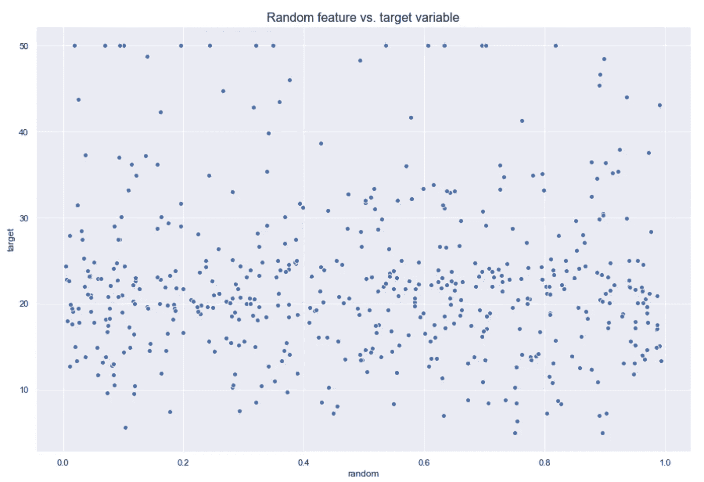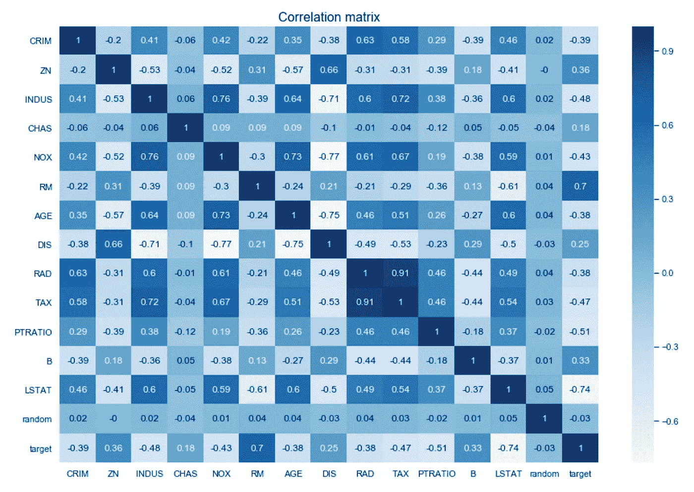

这里需要注意的一点是，解释`CHAS`的相关性没有多大意义，因为它是一个二元变量，应该对它使用不同的方法。

# 基准模型

我训练了一个简单的随机森林模型来建立一个基准。我设置了一个`random_state`来确保结果的可比性。我还使用了 bootstrap 并设置了`oob_score = True`,这样我以后就可以使用 out-of-bag 错误。

简而言之，关于出袋误差的主题，随机森林中的每棵树都在不同的数据集上训练，用原始数据的替换进行采样。这导致每个训练集中大约 2/3 的不同观察。在所有的观察值上计算出袋外误差，但是为了计算每行的误差，模型只考虑在训练期间没有看到该行的树。这类似于在验证集上评估模型。你可以在这里阅读更多。

```
R^2 Training Score: 0.93 
OOB Score: 0.58 
R^2 Validation Score: 0.76
```

嗯，模型中有一些过度拟合，因为它在 OOB 样本和验证集上表现得更差。但是，让我们说它足够好，并前进到特征重要性(根据训练集性能来衡量)。一些方法也可以用于验证/OOB 集，以获得对未知数据的进一步解释能力。

# 1.总体功能重要性

我所说的总体特征重要性是指在模型层次上得到的特征，*即*，也就是说在一个给定的模型中，这些特征在解释目标变量时是最重要的。

# 1.1.默认 Scikit-learn 的功能重要性

让我们从决策树开始，建立一些直觉。在决策树中，每个节点都是如何在单个特征中分割值的条件，以便因变量的相似值在分割后最终出现在同一集合中。该条件基于杂质，在分类问题的情况下是基尼杂质/信息增益(熵)，而对于回归树是其方差。因此，当训练一棵树时，我们可以计算每个特征对减少加权杂质的贡献。`feature_importances_`在 Scikit 中——Learn 是基于这种逻辑，但是在随机森林的情况下，我们讨论的是对树中杂质的减少进行平均。

优点:

*   快速计算
*   易于检索—一个命令

缺点:

*   有偏见的方法，因为它倾向于夸大连续特征或高基数分类变量的重要性

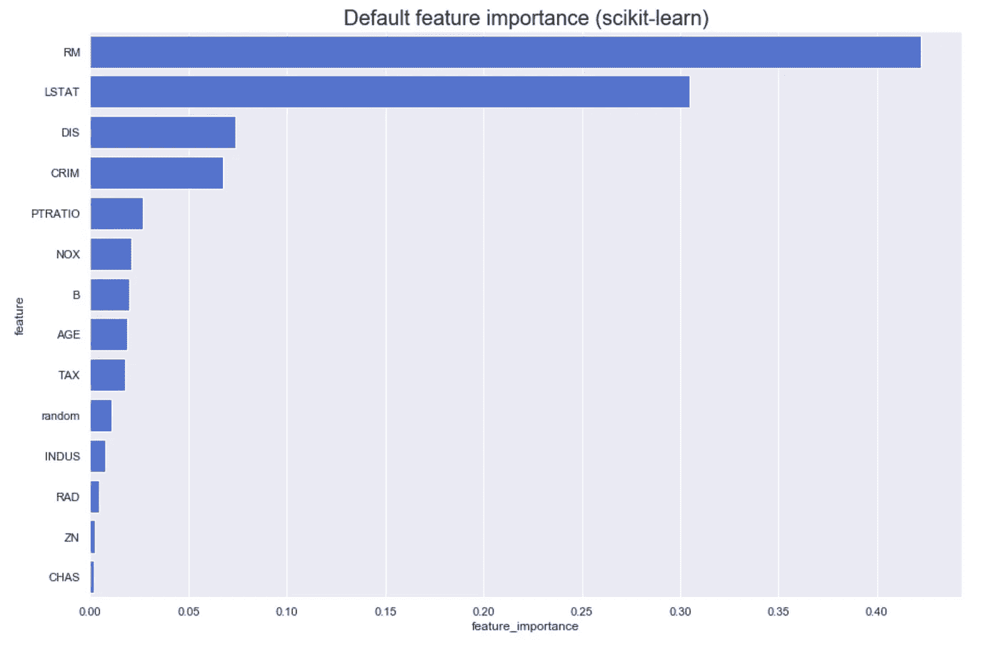

似乎前 3 个最重要的特性是:

*   房间的平均数量
*   %较低的人口地位
*   到五个波士顿就业中心的加权距离

然而令人惊讶的是，一列随机值竟然比:

*   每个城镇非零售商业用地的比例
*   放射状公路可达性指数
*   面积超过 25，000 平方英尺的住宅用地比例
*   查尔斯河虚拟变量(= 1，如果区域边界为河流；否则为 0)

直觉上，这个特征对目标变量的重要性应该为零。让我们看看不同的方法是如何评价它的。

# 1.2.置换特征重要性

这种方法通过观察每个预测器的随机重排(从而保持变量的分布)如何影响模型性能来直接测量特征重要性。

该方法可以用以下步骤来描述:

1.  训练基线模型，并通过验证集(或随机森林情况下的 OOB 集)记录分数(准确性/R/任何重要性度量)。这也可以在训练集上完成，代价是牺牲关于泛化的信息。
2.  重新排列所选数据集中一个要素的值，将数据集再次传递给模型以获得预测，并计算此修改后的数据集的度量。特征重要性是基准分数和来自修改(置换)数据集的分数之间的差异。
3.  重复 2。对于数据集中的所有要素。

优点:

*   适用于任何型号
*   相当有效
*   可靠的技术
*   不需要在每次修改数据集时重新训练模型

缺点:

*   比默认的`feature_importances`计算量更大
*   排列重要性高估了相关预测值的重要性——施特罗布尔*等* (2008)

至于这个方法的第二个问题，我已经在上面画出了相关矩阵。然而，我将使用我使用的库中的一个函数来可视化 Spearman 的相关性。标准皮尔逊相关的区别在于，它首先将变量转换为等级，然后才对等级进行皮尔逊相关。

斯皮尔曼关联:

*   是非参数的
*   不假设变量之间的线性关系
*   它寻找单调的关系。

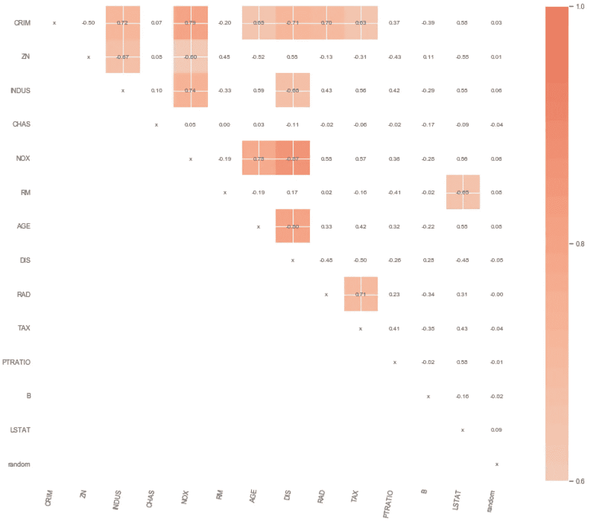

我找到了两个具有这种功能的库，并不是说它很难编码。让我们来看一下这两种，因为它们有一些独特的特点。

`rfpimp`

关于这个库需要注意的一点是，我们必须提供一个度量作为表单`metric(model, X, y)`的函数。这样，我们可以使用更高级的方法，如使用随机森林的 OOB 分数。该库已经包含该功能(`oob_regression_r2_score)`)。但是为了保持方法的一致性，我将在训练集上计算度量(丢失关于泛化的信息)。

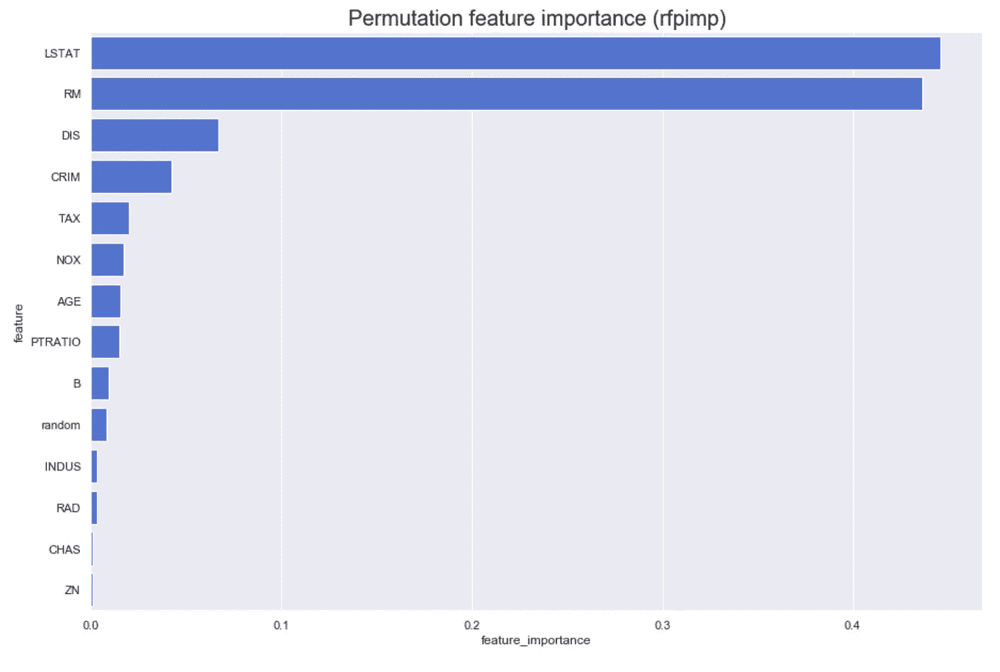

这个图证实了我们在上面看到的，4 个变量没有一个随机变量重要！令人惊讶的是…前四名仍然保持不变。关于`rfpimp`的一个更好的特性是它包含了处理共线特性问题的功能(这是展示 Spearman 相关矩阵背后的想法)。为了简洁，我不会在这里展示这个案例，但是你可以在这个库的作者写的这篇伟大的文章中读到更多。

`eli5`

与`rfpimp`的基本方法和`eli5`中使用的方法有一些不同。其中一些是:

*   有与使用交叉验证相关的参数`cv`和`refit`。在本例中，我将它们设置为`None`，因为我并不使用它，但在某些情况下它可能会派上用场。
*   有一个`metric`参数，它像在`rfpimp`中一样接受一个`metric(model, X, y)`形式的函数。如果未指定该参数，该函数将使用估计器的默认`score`方法。
*   `n_iter` -随机洗牌迭代次数，最终得分为平均值

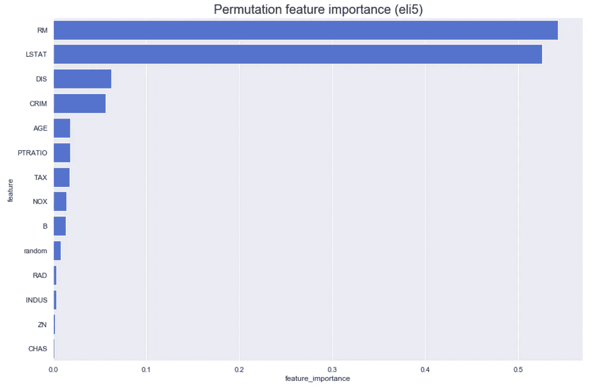

结果与前面的非常相似，尽管这些结果来自每列的多次重新排列。关于`eli5`的一个额外的好处是，通过使用 Scikit-learn 的`SelectFromModel`或`RFE`，使用置换方法的结果来执行特征选择真的很容易。

# 1.3.删除列功能重要性

这种方法非常直观，因为我们通过比较具有所有特性的模型和不具有该特性的模型来研究特性的重要性。

我为下面的方法创建了一个函数(基于`rfpimp`的实现),展示了底层逻辑。

优点:

*   最准确的特征重要性

缺点:

*   由于为数据集的每个变量重新训练模型(删除单个要素列后),潜在的高计算成本

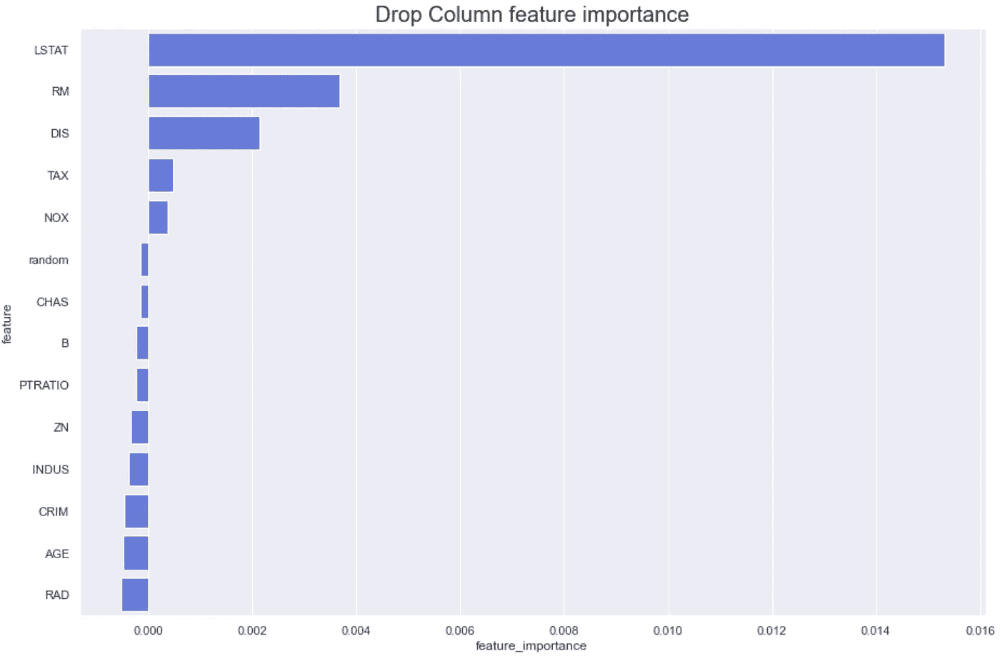

这里变得有趣了。首先，负重要性，在这种情况下，意味着从模型中删除给定的特性实际上提高了性能。这在我们的随机变量中是很好的例子。

或者，代替拟合模型的默认`score`方法，我们可以使用出袋误差来评估特征重要性。为此，我们需要将上述要点中的`score`方法替换为`model.oob_score_`(记住对循环中的基准和模型都要这样做)。

# 2.观察级别特征重要性

我所说的观察水平特征重要性是指对解释输入到模型中的特定观察有最大影响的特征。例如，在信用评分的情况下，我们可以说这些特征对确定客户的信用评分影响最大。

# 2.1.树解释器

`treeinterpreter`的主要思想是，它使用随机森林中的底层树来解释每个特征如何对最终值做出贡献。我们可以观察预测值(定义为每个特征贡献的总和+由基于整个训练集的初始节点给出的平均值)如何沿着决策树内的预测路径变化(在每次分割之后)，以及哪些特征导致了分割的信息(预测的变化也是如此)。

预测函数(f(x))的公式可以写为:

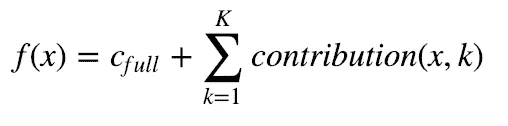

其中 c_full 是整个数据集(初始结点)的平均值，K 是要素的总数。

这听起来可能很复杂，但是请看库的作者提供的一个例子:

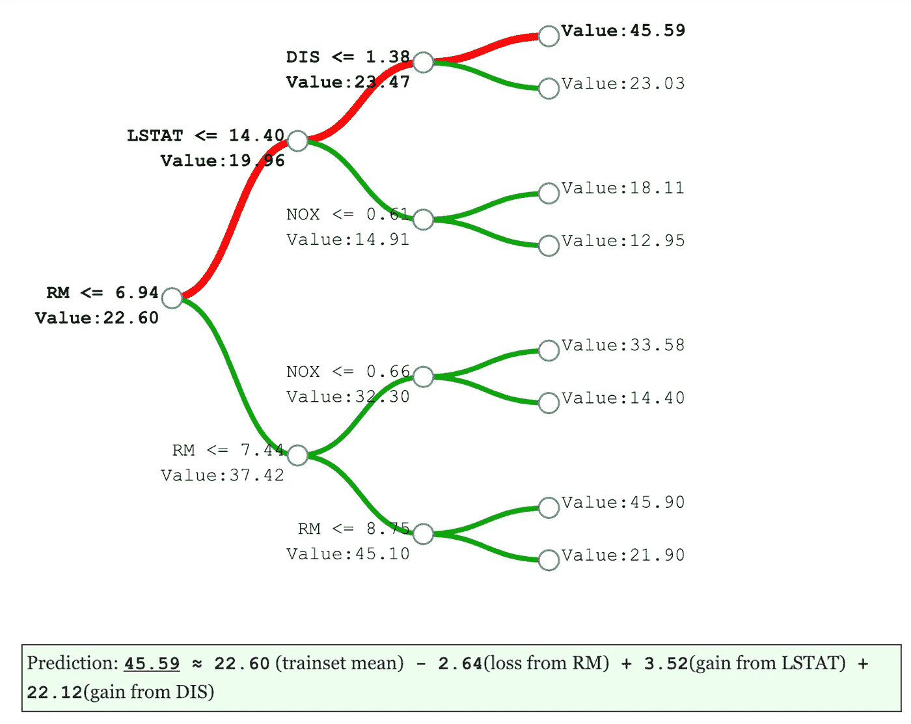

source: [http://blog.datadive.net/interpreting-random-forests/](http://blog.datadive.net/interpreting-random-forests/)

由于随机森林的预测是这些树的平均值，因此平均值预测的公式如下:

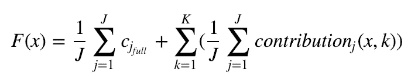

其中 J 是森林中树木的数量。

我从识别具有最低和最高绝对预测误差的行开始，并试图找出造成差异的原因。

```
Index with smallest error: 31
Index with largest error: 85
```

使用`treeintrerpreter`,我获得了 3 个对象:预测、偏差(数据集的平均值)和贡献。

对于误差最小的观察结果，主要贡献者是`LSTAT`和`RM`(在以前的案例中，它们被证明是最重要的变量)。在最高误差的情况下，最高贡献来自`DIS`变量，克服了在第一种情况下起最重要作用的两个变量。

```
 Row 31
Prediction: 21.996 Actual Value: 22.0
Bias (trainset mean) 22.544297029702978
Feature contributions:
LSTAT 3.02
RM -3.01
PTRATIO 0.36
AGE -0.29
DIS -0.21
random 0.18
RAD -0.17
NOX -0.16
TAX -0.11
CRIM -0.07
B -0.05
INDUS -0.02
ZN -0.01
CHAS -0.01
--------------------
Row 85
Prediction: 36.816 Actual Value: 50.0
Bias (trainset mean) 22.544297029702978
Feature contributions:
DIS 7.7
LSTAT 3.33
RM -1.88
CRIM 1.87
TAX 1.32
NOX 1.02
B 0.54
CHAS 0.36
PTRATIO -0.25
RAD 0.17
AGE 0.13
INDUS -0.03
random -0.01
ZN 0.0
---------------------
```

为了更深入，我们可能还对许多变量的联合贡献感兴趣(如 XOR [和这里的](http://blog.datadive.net/random-forest-interpretation-conditional-feature-contributions/)的例子中所解释的)。我将直接看示例，更多信息可以在链接下找到。

最佳和最差预测案例之间的大部分差异来自房间数量(`RM`)特征，以及到五个波士顿就业中心的加权距离(`DIS`)。

# 2.2.石灰

LIME(局部可解释模型不可知解释)是一种以可解释和忠实的方式解释任何分类器/回归器预测的技术。为此，通过用一个可解释的模型(如带有正则化的线性模型或决策树)局部逼近所选模型来获得解释。可解释的模型是在原始观测值(表格数据情况下的 row)的小扰动(添加噪声)上训练的，因此它们仅提供良好的局部近似。

需要注意的一些缺点:

*   只有线性模型用于近似局部行为
*   为了获得正确的解释，需要对数据进行的扰动类型通常是特定于用例的
*   简单的(默认)扰动通常是不够的。在理想情况下，修改将由数据集中观察到的变化驱动

下面你可以看到 LIME 解释的输出。

输出有 3 部分:
1。预测值
2。特征重要性-在回归的情况下，它显示它对预测有负面影响还是正面影响，按绝对影响降序排序。
3。所解释行的这些特性的实际值。

请注意，LIME 在解释中离散化了特征。这是因为在上面的构造函数中设置了`discretize_continuous=True`。之所以离散化，是因为它给了连续的特征更直观的解释。

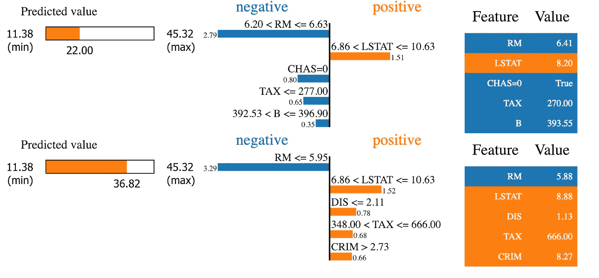

LIME 解释同意，对于这两种观测，最重要的特征是`RM`和`LSTAT`，这也是之前的方法所指出的。

我收到了一个有趣的问题:我们应该相信哪种观察水平的方法，因为结果可能会有所不同？这是一个没有明确答案的难题，因为这两种方法在概念上是不同的，因此很难直接比较。我建议你参考[这个答案](https://stackoverflow.com/questions/48909418/lime-vs-treeinterpreter-for-interpreting-decision-tree/48975492)，其中有一个类似的问题得到了解决并得到了很好的解释。

# 结论

在本文中，我展示了几种从机器学习模型(不限于随机森林)中获得特征重要性的方法。我认为理解结果通常与获得好的结果一样重要，因此每个数据科学家都应该尽最大努力理解哪些变量对模型最重要，以及为什么。这不仅有助于获得更好的业务理解，还可以导致模型的进一步改进。

您可以在我的 [GitHub](https://github.com/erykml/medium_articles/blob/master/Machine%20Learning/feature_importance.ipynb) 上找到本文使用的代码。一如既往，我们欢迎任何建设性的反馈。你可以在[推特](https://twitter.com/erykml1?source=post_page---------------------------)或评论中联系我。

喜欢这篇文章吗？成为一个媒介成员，通过无限制的阅读继续学习。如果你使用[这个链接](https://eryk-lewinson.medium.com/membership)成为会员，你将支持我，而不需要额外的费用。提前感谢，再见！

# 参考

*   [小心默认随机森林重要性](https://explained.ai/rf-importance/index.html)
*   [随机森林的条件变量重要性](https://bmcbioinformatics.biomedcentral.com/articles/10.1186/1471-2105-9-307)
*   [解读随机森林](http://blog.datadive.net/interpreting-random-forests/)
*   [随机森林解释—条件特征贡献](http://blog.datadive.net/random-forest-interpretation-conditional-feature-contributions/)

我最近出版了一本关于使用 Python 解决金融领域实际任务的书。如果你有兴趣，我贴了一篇文章[介绍这本书的内容。你可以在亚马逊或者 Packt 的网站上买到这本书。](/introducing-my-book-python-for-finance-cookbook-de219ca0d612)