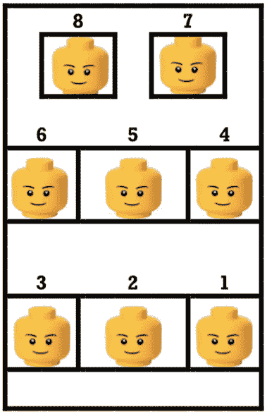

# 向我的侄子解释排列

> 原文：<https://towardsdatascience.com/explaining-permutations-to-my-nephew-2da4a8d9fa31?source=collection_archive---------22----------------------->

用乐高

Unsplash

有一天，当我和我的侄子玩他的乐高玩具时，我想出了一个想法，试图向他解释什么是排列。基本上，一组对象的排列是对它们进行排序的一种方式。例如，对于一组 3 个物体(我们将其命名为 A、B 和 C ),我们有以下 6 种排列:

ABC | BAC | CAB
ACB | BCA | CBA

现在我们知道了什么是排列，让我们以我和我侄子的例子为例。

## 这个例子

这是我侄子的乐高大众汽车的代表，有 8 个座位来容纳乐高。
**如果我们有 8 块乐高积木，有多少种排列方式(例如，在大众汽车内排列乐高积木的不同方式)？**

*   乐高玩具有 8 种可能被分配到第一个座位。
*   对于这 8 种可能性中的每一种，都有 7 种可能将另一个乐高分配到驾驶座的右侧(因为我们已经给驾驶座分配了 1 个乐高，所以只剩下 7 个乐高)。**因此，前两个座位的乐高玩具有 8 * 7= 56 种选择。**
*   对于这 56 种可能性中的每一种，都有 6 种可能性将另一个乐高分配给司机后面的座位。**因此，前三个座位的乐高玩具有 8 * 7 * 6 = 336 种选择方式。**
*   对于这 336 个座位中的每一个，都有 5 种可能将另一个乐高积木分配到下一个座位(中间的那个)。
    **因此有 8 * 7 * 6 * 5 = 1680 种可能性**
*   如果我们继续这样下去…我们最后只剩下一个可能的乐高玩具，被分配到最后一个座位(右下角的座位)。因此有:
    **8 * 7 * 6 * 5 * 4 * 3 * 2 * 1 = 40320 种可能性**

**40320 种排列！如果我和我的侄子尝试了每一种不同的可能性，我们将永远不会成功！**

## 阶乘——有效的方法

上述策略工作良好，但我猜你同意这是相当乏味的。使用阶乘更有效。阶乘表示为**N！** 并计算如下:

1!= 1 = 1
2！= 1 * 2 = 2
3！= 1 * 2 * 3 = 6
…

**N 个物体的排列数因此为 *N！*** 按照我们的例子，我们有 **N = 8** (例如 8 个乐高)等于 **8！= 1 * 2 * 3 * 4 * 5 * 6 * 7 * 8 = 40，320 种排列。**

那天，在玩完乐高玩具后，我开车送我的侄子回家，我问他:“你知道在这辆车里给 4 个不同的人分配一个座位有多少种排列吗？”经过一段时间的思考，他得出了正确的答案！成功！他明白了！

PD:你也会知道吗？

如果你想联系，这是我的 [LinkedIn](https://www.linkedin.com/in/pabloalvarezbaeza/) 。