# 解释概率图

> 原文：<https://towardsdatascience.com/explaining-probability-plots-9e5c5d304703?source=collection_archive---------4----------------------->

[Source](https://images.unsplash.com/photo-1503681355143-d5485eea7f14?ixlib=rb-1.2.1&ixid=eyJhcHBfaWQiOjEyMDd9&auto=format&fit=crop&w=2250&q=80)

## 它们是什么，如何用 Python 实现它们，以及如何解释结果

# 1.介绍

在使用线性回归时，您可能已经遇到过一种类型的概率图—Q-Q 图。拟合模型后，我们应该检查的回归假设之一是残差是否遵循正态(高斯)分布。这通常可以通过使用 Q-Q 图来直观地验证，如下图所示。

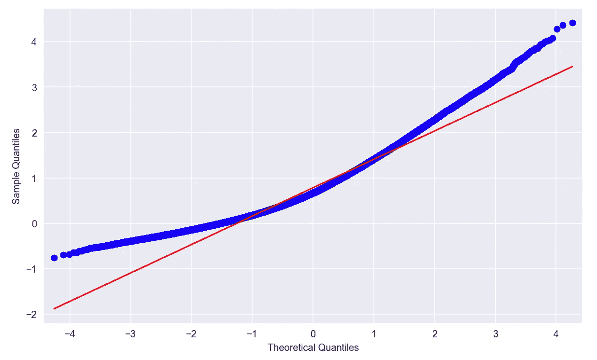

Example of Q-Q plot

为了充分理解概率图的概念，让我们快速回顾一下概率论/统计学中的一些定义:

*   [概率密度函数](https://en.wikipedia.org/wiki/Probability_density_function)(PDF)——允许我们计算在属于样本空间的任何区间内找到随机变量的概率的函数。重要的是要记住，连续随机变量取精确值的概率等于 0。

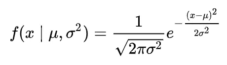

PDF of Gaussian Distribution

*   [累积分布函数](https://en.wikipedia.org/wiki/Cumulative_distribution_function)(CDF)——提供随机变量取值等于或小于给定值 *x* 的概率的函数。当我们处理连续变量时，CDF 是在负无穷大到 *x* 范围内 PDF 下的面积。

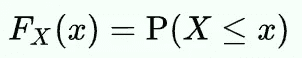

General formula for CDF, X — random variable, x — point of evaluation

*   [分位数](https://en.wikipedia.org/wiki/Quantile)——引用维基百科:“将概率分布范围划分为具有相等概率的连续区间的切割点”

下图显示了从标准正态分布以及 PDF 和 CDF 中抽取的随机变量的分布。

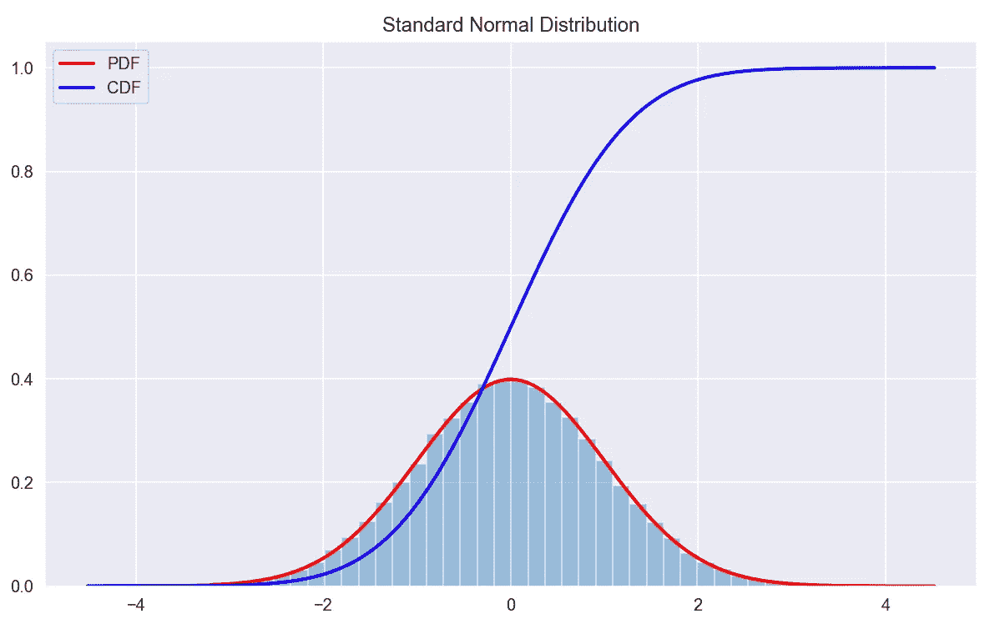

在本文中，我将使用另外两个发行版进行比较:

*   平均值为 1、标准差为 2.5 的正态分布— N(1，2.5)
*   [α= 5 的偏斜正态分布](https://en.wikipedia.org/wiki/Skew_normal_distribution)

我使用偏斜正态分布，因为通过调整 alpha 参数(同时将比例和位置保留为默认值)我可以控制分布的偏斜度。随着α的绝对值增加，偏斜度的绝对值也增加。下面我们可以通过观察随机变量的直方图来考察分布的差异。

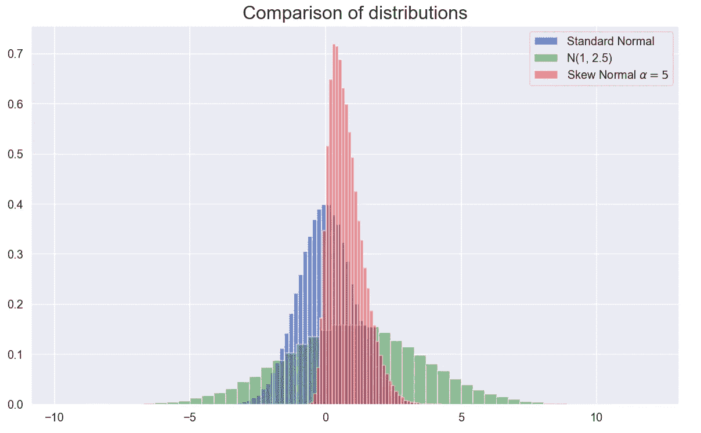

# 2.概率图

我们使用概率图来直观地比较来自不同数据集(分布)的数据。可能的情况包括比较:

*   两个经验集
*   一组经验数据和一组理论数据
*   两个理论集

概率图最常见的用途是中间图，当我们将观察到的(经验)数据与来自特定理论分布(如高斯分布)的数据进行比较时。我用这个变体来解释下面的特殊类型的情节，但是，它也可以应用于其他两种情况。

# 2.1 峰峰值**图**

简而言之，P-P(概率-概率)图是绘制两种分布(经验的和理论的)的 CDF 的可视化图。

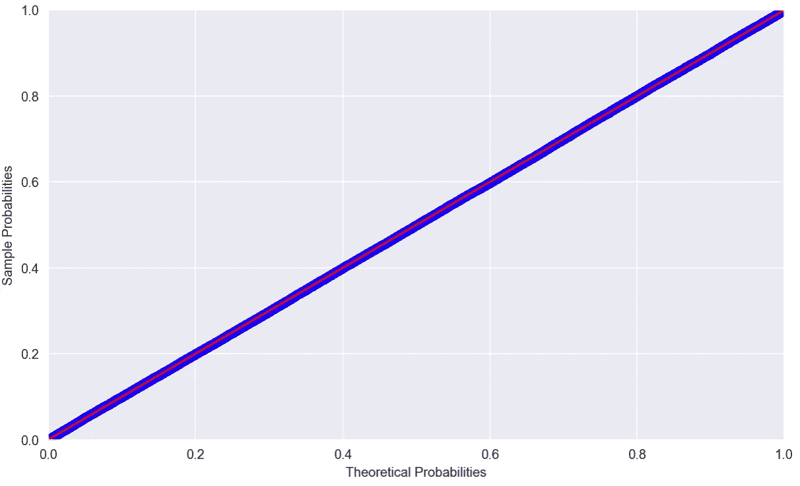

Example of a P-P plot comparing random numbers drawn from N(0, 1) to Standard Normal — perfect match

峰峰值图的一些关键信息:

*   图上的点的解释:假设我们有两个分布( *f* 和 *g* )和一个评估点 *z* (任何值)，图上的点指示在 *f* 和 *g* (根据 CDF 的定义)*中位于或低于 *z* 的数据百分比。*
*   为了比较这些分布，我们检查这些点是否位于一条 45 度线上( *x=y* )。如果它们出现偏差，分布就会不同。
*   P-P 图非常适合于比较高概率密度区域(分布中心),因为在这些区域，经验和理论 CDF 比低概率密度区域变化更快。
*   P-P 图需要完全指定的分布，因此如果我们使用高斯作为理论分布，我们应该指定位置和比例参数。
*   改变位置或比例参数不一定能保持峰峰值图的线性。
*   P-P 图可以用来直观地评估分布的偏斜度。
*   当分布不重叠时，绘图可能会导致奇怪的模式(例如，沿着图表的轴)。所以 P-P 图在比较位置相近或相等的概率分布时最有用。下面我给出一个 P-P 图，比较从 *N(1，2.5)* 抽取的随机变量和从 *N(5，1)* 抽取的随机变量。

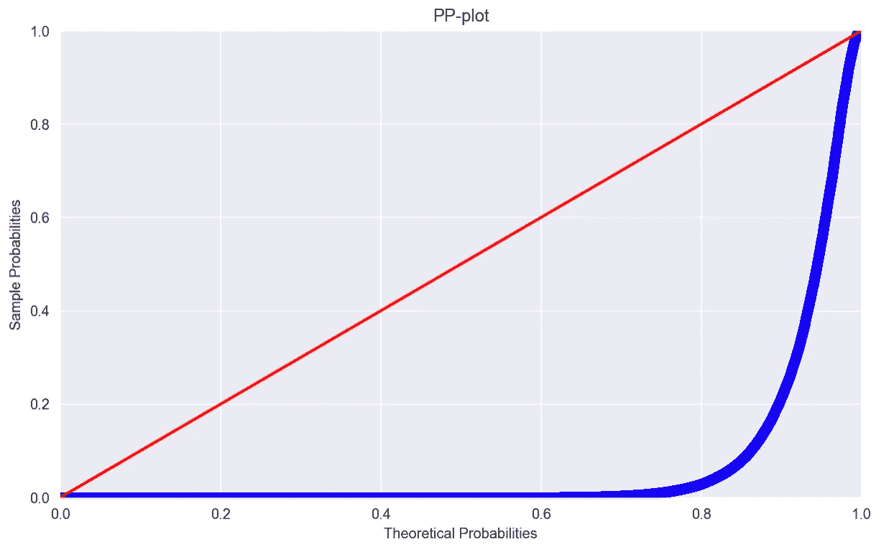

Random Variables drawn from N(1, 2.5) vs. N(5, 1)

# 2.2.Q-Q 图

与 P-P 图类似，Q-Q(分位数-分位数)图允许我们通过绘制它们的分位数来比较分布。

Q-Q 图的一些关键信息:

*   图上的点的解释:图上的一个点对应于来自两种分布的某个分位数(同样在大多数情况下是经验的和理论的)。
*   在 Q-Q 图上，参考线取决于理论分布的位置和比例参数。截距和斜率分别等于位置和比例参数。
*   点中的线性模式表明给定的分布族合理地描述了经验数据分布。
*   Q-Q 图在分布的尾部获得了非常好的分辨率，但在中心(概率密度高)分辨率较差
*   Q-Q 图不需要指定理论分布的位置和比例参数，因为理论分位数是根据指定族中的标准分布计算的。
*   点模式的线性不受改变位置或比例参数的影响。
*   Q-Q 图可用于直观评估两种分布的位置、规模和偏斜度的相似性。

# 3.Python 中的示例

我使用`statsmodels`库和`[*ProbPlot*](https://www.statsmodels.org/dev/generated/statsmodels.graphics.gofplots.ProbPlot.html)`类创建概率图。

## 数据

首先，我生成了来自三种分布的随机观察值:标准正态、正态和斜正态。您可以在下面的代码片段中看到分布的确切参数。

## 峰峰值图

当我开始使用`statsmodels` 创建一些 P-P 图时，我注意到一个问题——当我比较从 N(1，2.5)到标准常态的随机抽取时，该图是完美的拟合，而它不应该是。我试图调查这个问题，并在 [StackOverflow](https://stackoverflow.com/questions/55564688/interpretation-of-pp-plot) 上找到了一个帖子，解释了当前的实现总是试图估计理论分布的位置和比例参数，即使提供了一些值。所以在上面的例子中，我们正在检查我们的经验数据是否来自正态分布，而不是我们指定的那个。

这就是为什么我写了一个函数，用提供的参数直接比较经验数据和理论分布。

让我们首先尝试使用`statsmodels`和`pp_plot`来比较从 N(1，2.5)到 N(0，1)的随机抽取。我们看到，在`statsmodels` 的情况下，这是一个完美的拟合，因为该函数估计了正态分布的位置和比例参数。当检查`pp_plot`的结果时，我们看到分布明显不同，这也可以在直方图上观察到。

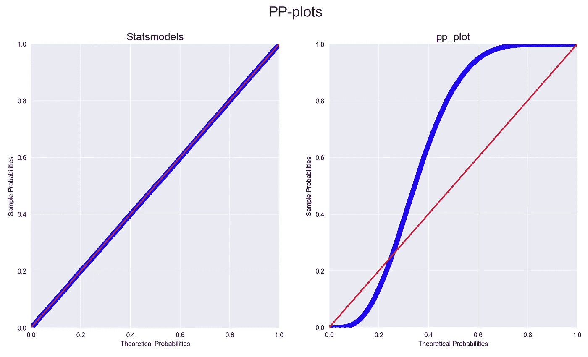

P-P plots of N(1, 2.5) vs. Standard Normal

我们也试着从`pp_plot`解读一下 P-P 图的形态。为此，我将再次展示图表以及直方图。沿着 x 轴的水平移动是由分布不完全重叠的事实引起的。当该点高于参考线时，意味着理论分布的 CDF 值高于经验分布的 CDF 值。

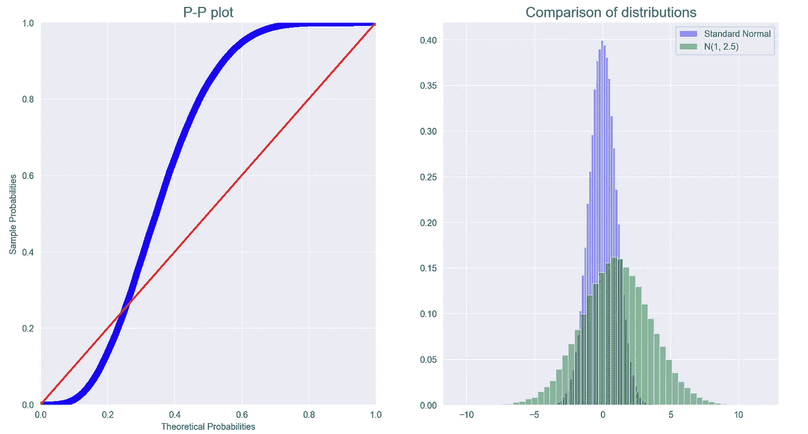

下一个例子是比较从倾斜法线到标准法线的随机绘制。我们看到`statsmodels`的图暗示它不是一个完美的匹配，因为它很难找到正态分布的位置和比例参数，这些参数说明了所提供数据的偏斜度。该图还显示，标准正态分布的 CDF 值总是高于所考虑的偏态分布的 CDF 值。

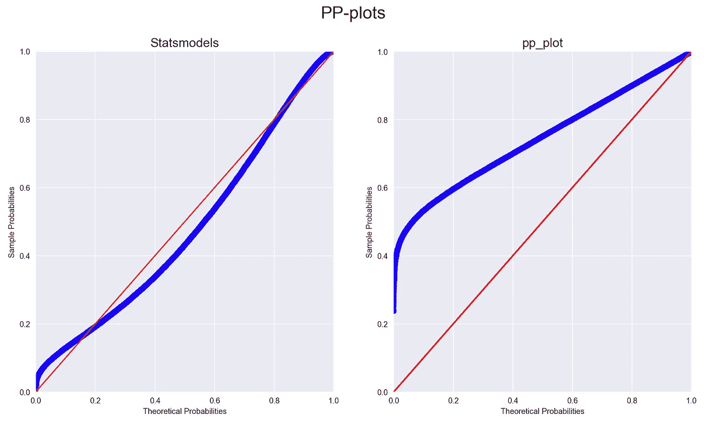

P-P plots of Skew Normal (alpha=5) vs Standard Normal

注意:我们也可以使用`statsmodels` *获得完美的拟合。*为此，我们需要将*proplot*中的理论分布指定为`skewnorm`，并传递一个额外的参数`distargs=(5,)` 来指示α的值。

## Q-Q 图

*应用和解释*

让我们从比较偏斜正态分布和标准正态分布(使用`ProbPlot’s`默认设置)开始。

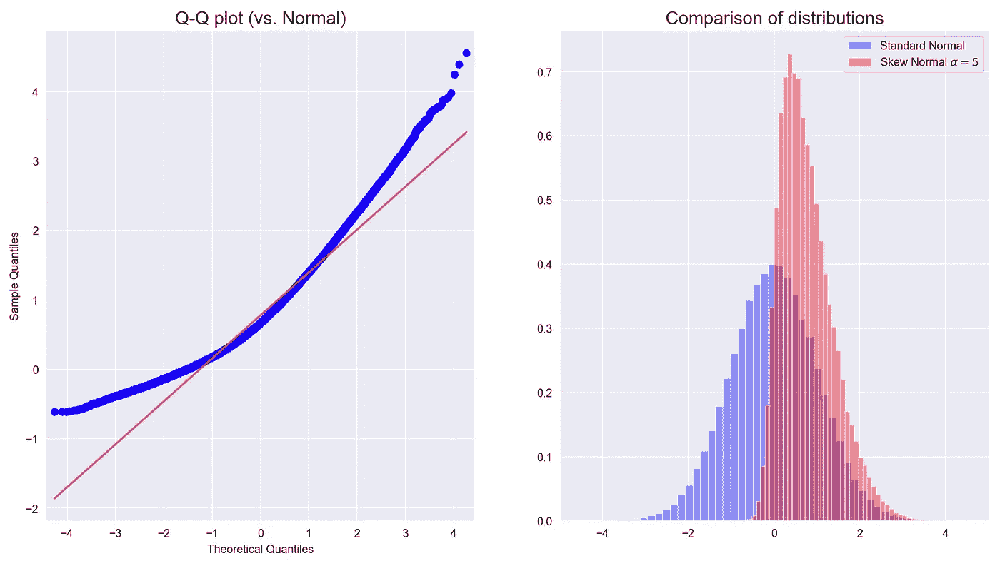

Q-Q plots of Skew Normal (alpha=5) vs Standard Normal

可以观察到的第一件事是，点形成曲线而不是直线，这通常是样本数据偏斜的指示。另一种解释图表的方法是看分布的尾部。在这种情况下，与标准正态分布相比，所考虑的偏斜正态分布具有较轻的左尾(质量较小，点位于 Q-Q 图的左侧，线上方)和较重的右尾(质量较大，点位于 Q-Q 图的右侧，线上方)。我们需要记住，偏态分布是移动的(可以在直方图上观察到)，所以这些结果符合我们的预期。

我还想快速回顾一下同一个练习的另外两个变化。在第一个示例中，我将理论分布指定为偏斜正态分布，并在`distargs`中传递`alpha=5`。这导致了下面的图，在图中我们看到了一个线性(虽然与标准参考线相比有所偏移)的图形。然而，线型基本上是一条 45 度线，表明拟合良好(在这种情况下，标准化参考线不是一个好的选择)。

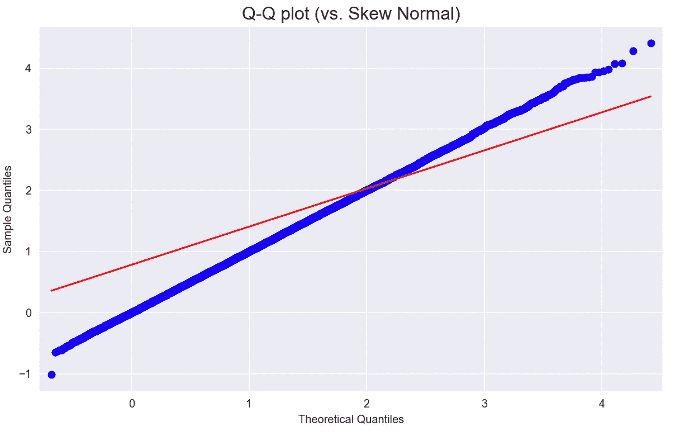

Q-Q plots of Skew Normal (alpha=5) vs Skew Normal (alpha=5)

第二种方法是比较两个经验样本——一个来自偏斜正态(`alpha=5`)，另一个来自标准正态。我设置`fit=False` 是为了关闭位置、比例和`distargs`的自动拟合。

结果似乎符合最初的方法(这是一个好迹象:)。

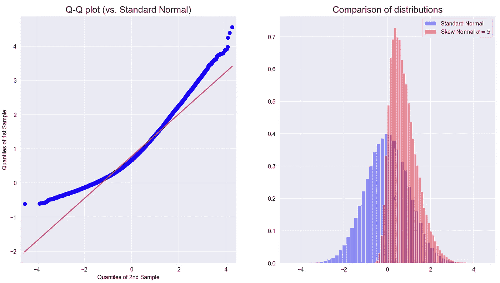

*利用股票收益的例子*

我还想展示一个使用 Q-Q 图评估微软股票价格产生的回报是否遵循正态分布的实际例子(更多细节请参考本文[中的](/introduction-to-quantitative-finance-part-i-stylised-facts-of-asset-returns-5190581e40ea))。结论是尾部的质量肯定比正常情况下假设的要大(表明更多的负和正回报)。

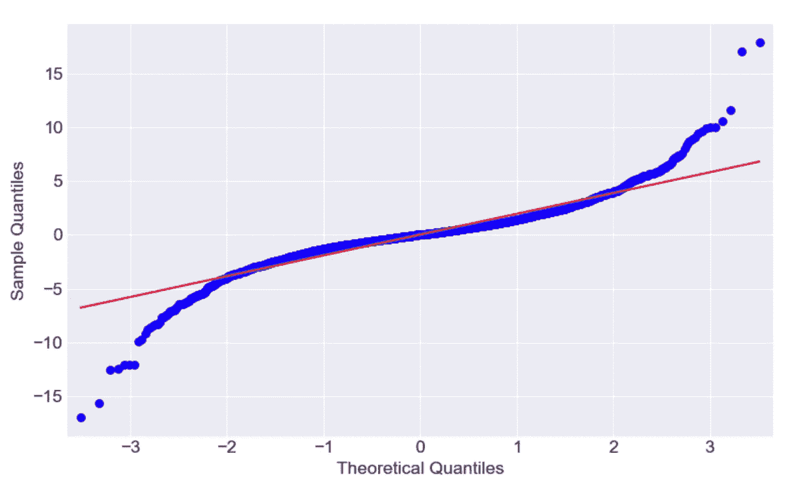

Returns on MSFT vs Norma Distribution

*进一步实施细节*

在`ProbPlot`的`qqplot`方法中，我们可以指定想要绘制哪种参考线。选项(除了`None`没有线)有:

*   s -标准化线(预期订单统计数据按给定样本的标准偏差缩放，并加上平均值)
*   通过四分位数的 q 线拟合
*   r 回归线
*   45 - y=x 线(P-P 图中使用的线)

下面我展示了三种方法的比较，正如我们所见，它们非常相似。

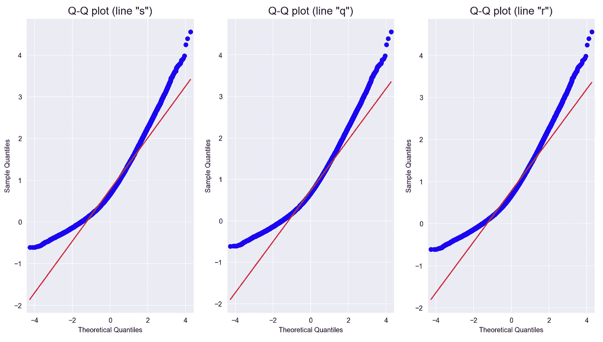

当使用 Q-Q 图时，我们还可以使用`statsmodels`的另一个特性，它采用不超过概率代替理论分位数(`*probplot*`方法代替`*qqplot*`)。

你可以在这里阅读更多关于这种方法的信息[。](https://en.wikipedia.org/wiki/Cumulative_frequency_analysis)

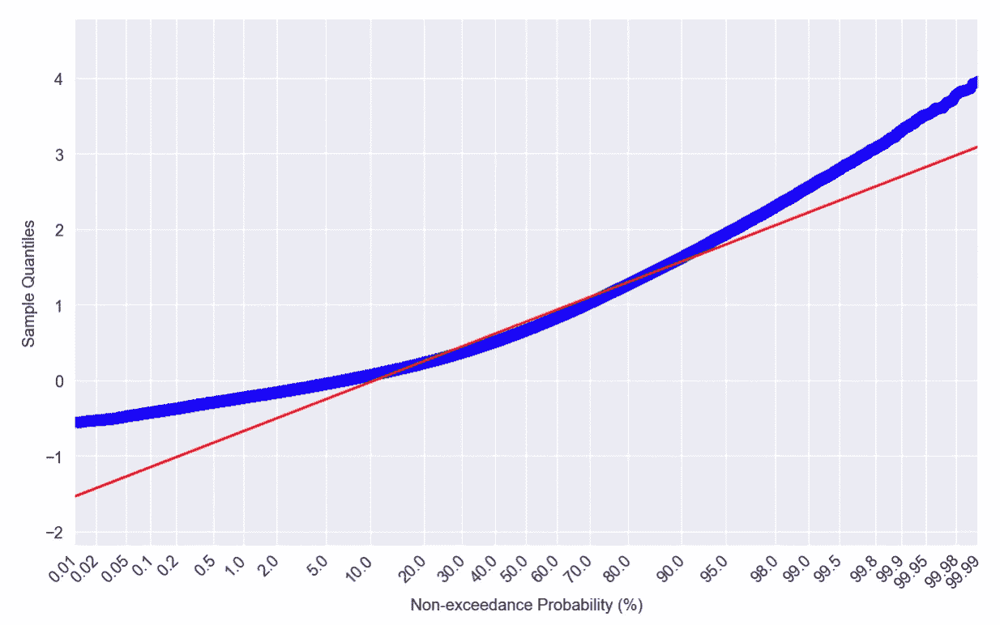

# 4.总结

在本文中，我试图以 P-P 和 Q-Q 图为例解释概率图的关键概念。你可以在我的 [GitHub](https://github.com/erykml/medium_articles/blob/master/Statistics/probability_plots.ipynb) 上找到用于生成文章中提到的情节的代码的笔记本。如果你有问题或建议，请在评论中告诉我，或者在 [Twitter](https://twitter.com/erykml1) 上联系我。

喜欢这篇文章吗？成为一个媒介成员，通过无限制的阅读继续学习。如果你使用[这个链接](https://eryk-lewinson.medium.com/membership)成为会员，你将支持我，不需要你额外付费。提前感谢，再见！

您可能还会对以下内容感兴趣:

 [## 菲克(𝜙k)——熟悉最新的相关系数

### 这在分类变量、序数变量和区间变量之间也是一致的！

towardsdatascience.com](/phik-k-get-familiar-with-the-latest-correlation-coefficient-9ba0032b37e7)  [## 预测强度—一种简单但相对未知的评估聚类的方法

### 了解该标准如何工作，以及如何从头开始用 Python 实现它！

towardsdatascience.com](/prediction-strength-a-simple-yet-relatively-unknown-way-to-evaluate-clustering-2e5eaf56643)  [## Python 统计块中的新成员:pingouin

### 图书馆的快速参观，以及它是如何从老守卫中脱颖而出的

towardsdatascience.com](/the-new-kid-on-the-statistics-in-python-block-pingouin-6b353a1db57c) 

# 参考

*   [https://www . quora . com/In-laymans-terms-a-P-P-plot-and-a-Q-Q-plot-and-when-we-use-one-or-other](https://www.quora.com/In-laymans-terms-what-is-the-difference-between-a-P-P-plot-and-a-Q-Q-plot-and-when-would-we-use-one-or-the-other)
*   【http://v8doc.sas.com/sashtml/qc/chap8/sect9.htm 号
*   [https://www . stats models . org/stable/generated/stats models . graphics . gofplots . prob plot . QQ plot . html](https://www.statsmodels.org/stable/generated/statsmodels.graphics.gofplots.ProbPlot.qqplot.html)