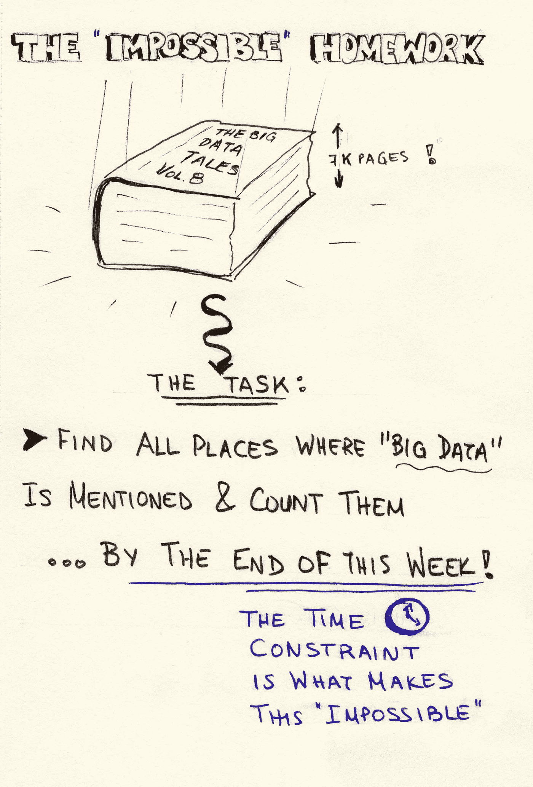
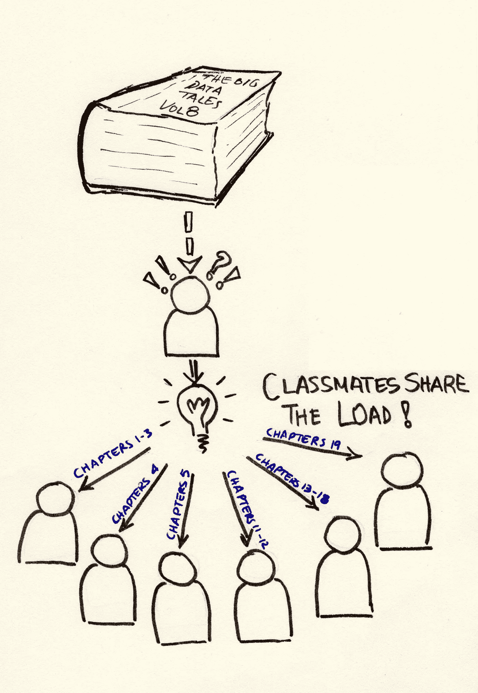
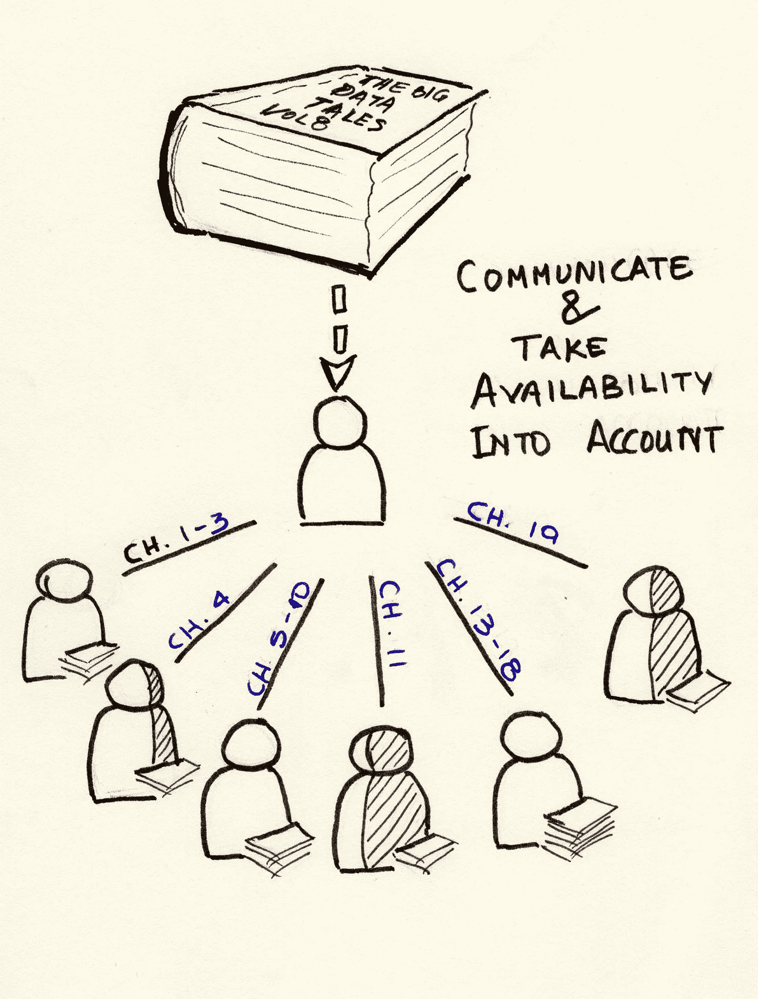
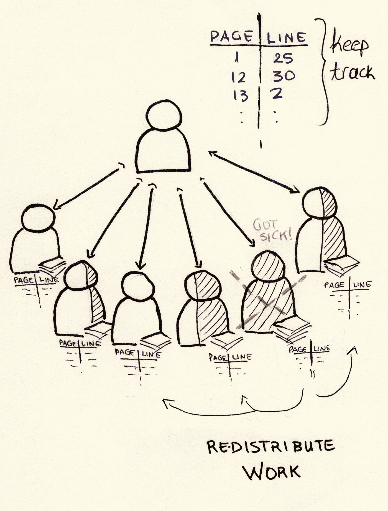
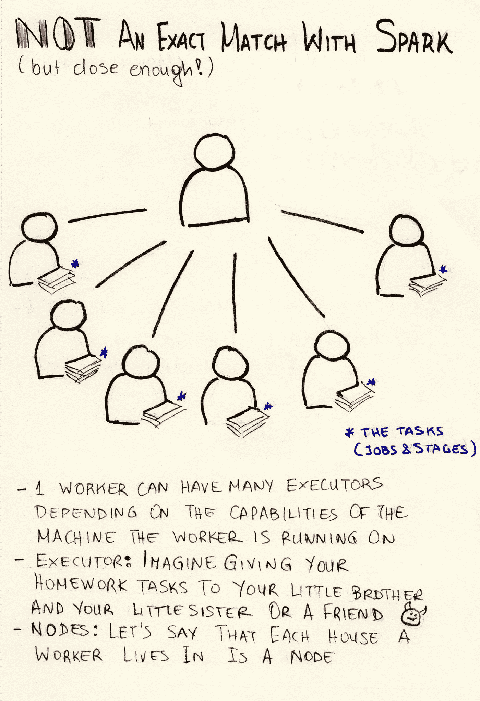
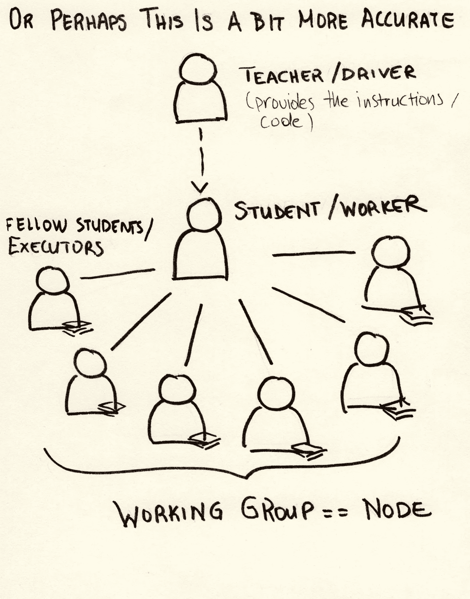

# 用非技术性的方式解释技术性的东西——(Py)Spark

> 原文：<https://towardsdatascience.com/explaining-technical-stuff-in-a-non-techincal-way-apache-spark-274d6c9f70e9?source=collection_archive---------17----------------------->

## 什么是 Spark 和 PySpark，我可以用它做什么？

Photo by [Markus Spiske](https://unsplash.com/@markusspiske?utm_source=medium&utm_medium=referral) on [Unsplash](https://unsplash.com?utm_source=medium&utm_medium=referral)

在一次巴斯克维尔分析系统的展示中，我被要求向一个完全不懂技术的人解释 T2 阿帕奇火花。这让我有些困惑，因为我非常习惯于用代码思考和交流，我的头脑只是不停地回到技术术语上，所以我相信我在非常有限的时间里没有做好工作。让我们再试一次，为了那个问我的人，因为我相信尽可能简单地解释事情是一项需要培养的伟大技能。

## ***旁注:sketch nothing***

我一直在读 Christina R Wodtke 的《铅笔我》(Pencil Me In)一书，该书谈到了素描笔记，即保持视觉笔记以帮助理解和记忆的过程。我一直是一个视觉型的人，童年时经常涂鸦——这确实帮助我更好地记忆事物，有时也给我带来麻烦。因为我在媒体上写作的整个过程是为了让我更好地理解我认为我知道的东西，也为了学习新的东西，我想我应该再试一次。自从我上次这样做已经有很长时间了，我现在非常习惯于打字而不是写作(翻译:可怕的草图来了！)，所以请手下留情。

# **不可能的作业**

我想首先要做的是提供一个任何人，或者几乎任何人都能理解的例子。因此，假设你有一周内到期的作业，你必须做的是阅读一本 7K 页的巨著，并统计作者使用“大数据”一词的次数，最好还能保留包含它的短语(这是一项愚蠢的任务，但请耐心等待:)。

The “impossible” homework

考虑到时间限制，这是一项不可能完成的任务，即使你没日没夜地阅读，你也不可能在一周内完成。但是，你并不孤单，所以你决定和你的同学和朋友谈谈，想出一个解决办法。

似乎合乎逻辑的是，你们将页面分开，每个人至少负责几页。同样有意义的是，你们每个人带回家阅读的页面，都有相关的内容，所以你们将要阅读的内容是有意义的，所以你们试着按章节分开。

看起来也需要一个协调员。假设你接受了那个任务，因为它是你的主意。(理想情况下，你自己会花上一两章，但假设管理和沟通会占用你大部分时间)

Help each other!

另一件要考虑的事情是根据谁有最多的可用时间，谁是快速阅读者或慢速阅读者来划分页面，以便这个过程尽可能高效，对吗？此外，你们中的一些人可能在一周内有其他作业要做，所以这也必须被考虑在内。

Communicate with each other, know the availability and distribute work accordingly

在这一周里，和你的同学聊聊天，看看他们做得怎么样，这是很好的。当然，由于阅读这些章节不会一蹴而就，使用书签来记录你的进度，并跟踪你的任务进度

Bookmark, keep track and redistribute work in case of failure

如果你不得不计算一个以上的术语呢？页面的分割可能应该根据章节的标题和章节包含术语的可能性来完成。如果发生了一些事情，你们中的一个不能完成任务怎么办？相应的页面应该重新分配给你们其余的人，理想情况下取决于你们每个人还剩多少页。

最后，你们将所有人聚集在一起，把你们的计数加起来，得到你们的结果。

因此，总而言之，要完成这项任务，有必要:

*   在同学之间分配章节
*   既然是你的主意，而且你知道事情应该如何发展，你有组织事情吗
*   根据每个学生的能力划分章节——考虑阅读速度和可用性
*   如果有事发生，一个人不能完成他们的部分，重新分配工作
*   记录事情的进展——使用书签，和你的同学交谈来记录他们的进展，等等。
*   结束时聚在一起分享和组合结果

# 这与 Spark 和 PySpark 有什么关系——更专业一点

家庭作业示例说明了*(我的理解是*)[Apache Spark](https://spark.apache.org)(以及许多类似的框架和系统，例如水平或垂直数据“分片”)背后的过于简化的基本思想，将数据分成合理的组(在 Spark 的情况下称为“分区”)，假设您知道您必须对数据执行什么样的任务，以便您是高效的，并将这些分区分配给理想情况下相等数量的工作人员(或者您的系统可以提供的尽可能多的工作人员)。这些工作者可以在同一台机器上，也可以在不同的机器上，例如，每个工作者在一台机器(节点)上。必须有一个协调者来协调所有这些工作，收集执行任务所需的所有必要信息，并在失败时重新分配负载。在协调员和工人之间也需要有一个(网络)连接，以便沟通和交换数据和信息。或者甚至在失败的情况下或者在计算需要时重新划分数据(例如，我们需要独立地对每一行数据进行计算，但是我们需要通过一个键对这些行进行分组)。还有一个概念是以一种“懒惰”的方式做事，使用缓存来跟踪中间结果，而不必总是从头开始计算一切。

PySpark 是 [Apache Spark](https://spark.apache.org) 的 python 实现，是“大规模数据处理的统一分析引擎”。

请注意，这不是与 Spark 组件的精确和一对一的比较，但在概念上很接近。为了简单起见，我还省略了许多 Spark 内部和结构。如果你想更深入地了解这一点，从官方的 Apache Spark 站点开始，这里有大量的资源。

Comparison with Spark

我前面提到的图片中的比较并不准确。让我们再试一次，让老师也参与进来。教师提供作业和指导(驱动程序)，学生被分成工作组，每个工作组负责一部分任务。为了简洁起见——也为了让我的画不那么复杂，让我的生活简单一点，下图展示了一个工作组与 Spark 的对比。我觉得这更接近于 Spark 应用程序运行时的实际情况。

Perhaps a better comparison with Spark

简单地说，用更专业的术语来说，假设您的计算机上有一个巨大的文本文件(好吧，不是大数据文件，而是一个 15GB 的文件),您非常想知道其中有多少个单词，或者像上面的作业一样，术语“大数据”在其中出现了多少次，以及相关的短语，您将面临以下问题:

*   你真的不能用记事本打开这个文件，因为即使你有 32GB 的内存，用来打开和编辑文本文件的应用程序对于 15GB 的文件来说实际上是不可用的。
*   你可以编写一些代码来计算这个文件中的单词或特定的单词或短语，或者通过逐行阅读，或者使用类似“wc”的东西，这取决于你的系统，但它会*慢*，*非常*慢。如果你需要做更复杂的事情呢？

因此，我们立即发现没有快速简单的方法来做简单的事情，更不用说用大文件做复杂的事情了。

人们可以想到几种变通办法，比如将大文件分成许多小文件，处理这些小文件，然后将结果相加，利用多重处理技术。这就是 Spark 提供简单解决方案的地方。让我们看一个非常基本的 PySpark 例子，使用 python 库为 [pyspark](https://pypi.org/project/pyspark/) 编程。

Doing the homework — Reading a file with PySpark

看起来很简单，不是吗？只有几行 Python 代码。现在让我们解释一下它的功能:

Doing the homework — Reading a file with PySpark explained

没有明显的把文件分割成“章节”，没有协调，没有跟踪，什么都没有。这是因为 Spark 将在幕后处理所有的复杂性，我们不必担心告诉工作人员和执行者读取文件的一部分或如何分割它，或者如果执行者突然删除它的一部分会发生什么等等。所以，在这里，我们只用了几行代码就完成了我们的功课。

不要误会我的意思，Spark 看起来很简单，但它背后有很多复杂性，对它进行故障排除根本不是一件容易的事情，但是，让我们现在只欣赏好的部分，我们可以稍后再讨论困难。

此外，这里的例子是最简单的例子之一，但是我相信，一旦你理解了这种框架背后的机制和逻辑，就更容易理解你能用它们做什么，更重要的是，不能用它们做什么，如何构建利用这些框架的系统，以及如何善于估计以某种方式做事是否快速有效。同样，为了简单起见，我现在不会深入讨论这个问题。

我希望这有所帮助。任何想法，问题，更正和建议都非常欢迎:)