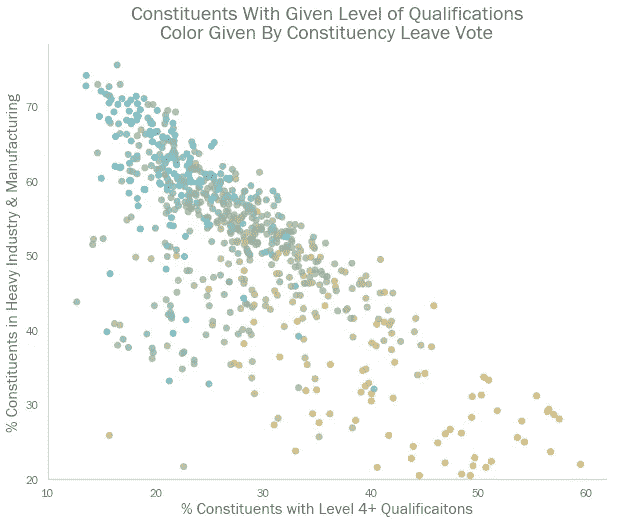

# 用数据科学解释 2019 年英国大选结果

> 原文：<https://towardsdatascience.com/explaining-the-2019-uk-election-result-with-data-science-86aa6f4e8094?source=collection_archive---------19----------------------->

## 使用排列重要性揭开黑盒模型的盖子

9 月 2 日，英国首相鲍里斯·约翰逊站在唐宁街 10 号的台阶上宣布他不想举行大选。任何有一点政治常识的人都知道接下来会发生什么。

12 月 13 日星期五(自然日)早上，英国醒来后发现鲍里斯·约翰逊赢得了自玛格丽特·撒切尔时代以来最大的保守党选举胜利。


Image: The Independent

保守党的胜利既是任何特定的保守党力量的产物，也是拙劣的反对的产物。选民哀叹他们面临的可怕选择——在整个竞选过程中，每一位政党领袖都有[的负面支持率](https://en.wikipedia.org/wiki/Leadership_approval_opinion_polling_for_the_2019_United_Kingdom_general_election),而约翰逊则像躲避瘟疫一样躲避媒体的审查(甚至[在竞选的最后一天躲进工业冰箱](https://www.youtube.com/watch?v=Lp9XoiFbZcI)以躲避电视直播采访)。

尽管保守党耍了花招，反对党工党还是取得了自 20 世纪 30 年代以来最糟糕的结果。他们在他们的护身符“[红墙](https://www.bbc.co.uk/news/election-2019-50771014)”中输得很惨——这是一系列后工业时代的英国选区(类似于美国的铁锈地带)，其中许多人有史以来第一次投票支持保守党。

如此令人震惊的结果能被预测到吗？如果是这样的话，有人对此做过什么吗？即使没有，工党能从如此惨痛的失败中吸取什么教训吗？这些都是政治学家能够很好回答的问题。领导素质、竞选策略和媒体的作用都是值得探讨的定性因素。

然而，这是一个数据科学博客。因此，我们将试图从模糊的个性和政策问题中解脱出来，并着手处理一些冷酷的数字。在我们这样做之前，最好准确理解英国的政治体系是如何运作的，因为这将为我们如何进行分析提供信息。

# 英国政治速成班

英国的政治权力在下议院(或议会)。它由 650 名议员组成，英国 650 个“选区”各一名。


Results of the 2019 General Election, with each constituency represented by a single hex of equal size.

在大选中，每个选区从候选人中选出一名议员。在那个选区得票最多的候选人当选为议员。拥有最多当选议员的政党赢得选举，并通常组建政府。

这种制度被称为“得票最多者当选”(FPTP)。这可能会导致一个政党的总体普选份额和它在下议院赢得的席位份额之间出现显著差异。

例如，2015 年，保守党仅以 37%的普选票数赢得了超过一半的席位。另一方面，英国独立党(UKIP)仅赢得一个席位(占全部席位的 0.015%)，占全国选票的 13%。


The UK parties on a (very) rough 2D political compass. Note — the SNP only contest seats in Scotland, and Plaid Cymru only contest seats in Wales

这是一个明确有助于英国两大政党——自 1922 年以来赢得每一次大选的保守党和工党——的投票系统。

FPTP 出现的另一个现象是“安全席位”——几乎肯定会以某种方式投票的选区。在 2019 年大选之前，自第二次世界大战以来，有 170 个选区投票给了同一个政党(北什罗普郡的选区可能是最安全的席位——自 1834 年以来一直由保守党控制)。

# 数据科学派上了用场

尽管总有支配性的国家因素影响人们如何投票，但大选本质上是 650 个地方迷你选举。因此，我们应该尽可能多地了解这些独立选区的人口统计数据。

令人高兴的是，通过政府网站可以在选区一级获得很多官方数据，特别是 https://commonslibrary.parliament.uk/local-data/

我们可以将各种 CSV 整合在一起，创建一个跨一系列指标的选区 KPI 大表；从房价、周薪和人口密度，到教育程度、种族，甚至宽带质量。


A full list of KPIs used. The dataset has 110 features in total.

这样做的最终目的是创建一个模型，利用这些人口统计数据来预测哪个政党可能在每个选区获胜。一旦我们开发了一个准确的模型，我们就可以分析它，看看最重要的驱动因素是什么，从而推断出最大的选举因素。

但是，在我们这样做之前，调查一下这些 KPI 的地理分布以及它们所显示的地区差异可能会让我们大开眼界。

例如，我们看到伦敦和东南部选区的工资较高，这对任何英国居民来说都不应感到意外。然而，与英国其他地方相比，这些地方的房价增长如此之快，以至于平均房价高达年薪的 30 倍(其他地方是 5-10 倍)。


你住在哪里也与你可能从事的行业类型密切相关。


蓝领工作(例如，重工业和酒店业)在英格兰中部和北部更为普遍——白领行业(金融服务、IT 和科学)聚集在城市，尤其是伦敦。也许不出所料，白领工人多的选区工资高，失业率低。


Amber markers suggest lower wages, purple suggest higher wages

这种“伦敦对其他地方”的叙述贯穿了大部分数据；伦敦人往往比该国其他地方的人素质更高，种族更多样化，也更国际化。


当我们想到当前英国政治的大恶魔:英国退出欧盟时，这些因素都会发挥作用。这里不是讨论离开欧盟的任何好处(或坏处)的地方，但忽视它对 2019 年大选的影响显然是一个错误。

首先要注意的是英国退出欧盟产生的意见的多样性。尽管全国范围内的胜利差距非常小，只有 52%对 48%，但这一选票在各选区的分布并不均匀。一些地区的脱欧投票率低至 20%，但其他地区高达 75%。


不出所料，这种价差似乎取决于地理位置。我们注意到伦敦以外的强烈脱欧投票——主要是在英格兰中部。


英国退出欧盟的驱动因素复杂多样，然而，有一些个人特征与选区的脱欧投票密切相关——资格水平和行业。



一个选区的休假投票比例与拥有第 4 级+第 1 级资格(学位或同等学历)的人数比例之间的相关系数非常低，为-0.72，而休假投票比例与重工业工作人员比例之间的相关系数非常高，为+0.72。

虽然必须处理要素共线性(该数据集显然存在)，但我认为您可以轻松创建一个模型来完美预测选区的脱欧投票。

# YouGov 的 MRP 建模

虽然分析欧盟公投是一个我们可以愉快地花时间下降的兔子洞，但上述数据收集的目的是为每个选区如何在*大选*中投票创建一些预测模型。

因此，这将成为一个分类问题，该模型将决定该选区是给定政党的安全席位，还是两个给定政党之间的边缘席位(如果第一名和第二名之间的差距小于 15 个百分点，我们将该席位定义为“边缘”)。

我们还应该记住，这个练习的一部分是关于在竞选期间是否可以做些什么来改变最终结果。为此，我们将使用 11 月 27 日(投票日前两周多)公布的 [YouGov 的 MRP 民调](https://yougov.co.uk/uk-general-election-2019/)结果，而不是使用 2019 年最终选举结果作为我们的目标。

MRP ( [后分层多水平回归](https://en.wikipedia.org/wiki/Multilevel_regression_with_poststratification))是一种先进的民意调查方法，而 YouGov 民意调查的样本量非常大，在七天的时间里有超过 10 万人做出了回应。因此，它能够给出每个选区中每个政党的预计投票份额。结果，它略微低估了保守党在席位方面的成功，尽管它对总体投票份额的预测是[与主要政党最终结果](https://yougov.co.uk/topics/resources/articles-reports/2019/12/13/initial-analysis-yougovs-election-polling)相差 1-2%。


A Sankey Diagram showing how the seat types were going to change from the 2017 election compared to the 2019 election, based on YouGov’s MRP poll projections

YouGov 的 MRP 民意调查显示了工党的悲惨处境。三分之一以前是保守党/工党边缘的席位现在看起来像他们是安全的保守党，2017 年高达 30%的安全工党席位现在看起来好像他们将成为保守党边缘。

相比之下，保守党将失去很少的安全席位，而且他们在以前处于边缘地位的大多数席位上仍然具有竞争力。

# 为 2019 年大选建模

现在我们已经有了每个选区的特性和目标值，我们可以进行最后两步了:

*   在给定特征集的情况下，为每个选区建立一个尽可能准确地预测目标的模型。
*   使用排列重要性调查模型，查看哪些要素对模型的准确性影响最大。

作为第一步，我们需要解决数据集的[类不平衡问题](https://machinelearningmastery.com/tactics-to-combat-imbalanced-classes-in-your-machine-learning-dataset/)。该数据集目前有超过 250 个保守党安全席位，但只有四个自由民主党安全席位(和四个其他类型的席位各一个)。


这不是训练模型的合适数据集-我们可能会使模型过度适应大多数类。为了解决这个问题，我们将使用 [SMOTE 算法](https://en.wikipedia.org/wiki/Oversampling_and_undersampling_in_data_analysis#SMOTE)为少数类生成合成数据点。这在 Python 中实现起来相对简单。

```
*#import the library* **from** imblearn.over_sampling **import** SMOTE*#create a SMOTE object*
smote = SMOTE(k_neighbors=3)*#use the .fit_sample() method to create a new feature and target set that has an equal number of datapoints from each class*
X_smote, y_smote = smote.fit_sample(X, y)
```

注意，由于 SMOTE 使用“最近邻”算法，我们不能对只有一个数据点的类进行合成。因此，我们将从今后的分析中去掉这些阶层(这些阶层只代表议会中 0.5%的席位，所以这不会过度影响分析)。

鉴于我们的分析将取决于我们训练高度精确模型的能力，我们应该:

1.  尝试不同类型的算法
2.  为每种算法尝试不同的[超参数](https://en.wikipedia.org/wiki/Hyperparameter_optimization)

最简单的方法是通过一个“[网格搜索](/grid-search-for-model-tuning-3319b259367e)方法，我们为每个想要测试的超参数指定所有不同的值，然后让代码依次迭代它们，看看哪个组合产生最好的结果。

这很容易在代码中实现，如果我们使用 Scikit Learn，它还带有额外的内置[交叉验证](/cross-validation-70289113a072)，这意味着我们不需要为训练/测试分割而烦恼。

```
*#Here, we will perform a gridsearch using the XGBoost algorithm**#Bring in the required libraries* **from** sklearn.model_selection **import** GridSearchCV
**import** xgboost **as** xgb*#Create an XGBoost object*
XGB = xgb.XGBClassifier()*#Define a 'grid' of parameters that we want to test
#This is done using a dictionary* param_grid = {
     "eta": [0.01, 0.05, 0.2],
     "min_child_weight": [0, 1, 5],
     "max_depth": [3, 6, 10],
     "gamma": [0, 1, 5],
     "subsample": [0.6, 0.8, 1],
     "colsample_bytree ": [0.6, 0.8, 1]
 }*#Define a GridSearchCV object
#This links the model object and the parameter grid* gs_xgb = GridSearchCV(XGB, param_grid, cv=4, n_jobs=-1)*#Fit the data. This will iterate through the grid
#and find the model with the highest accuracy*
gs_xgb.fit(X_smote, y_smote)*#Extract the best model as an XGB object*
model = gs_xgb.best_estimator_
```

虽然在概念上很简单，但是网格搜索可能计算量很大并且很耗时。如果我们有六个想要调整的超参数，每个都有三个可能的值，那么就有 729 个潜在的模型。如果我们接着做 4 重交叉验证，那么我们实际上是在拟合大约 3000 个不同的模型。

您可以通过将 GridSearchCV 中的“n_jobs”参数设置为-1 来提高性能(这迫使它并行使用所有计算机处理器)，但这仍然是那种需要花费数小时来运行的代码。

令人高兴的是，在这种情况下，等待是值得的——我们创建了一个模型，可以 100%准确地预测座位类型。


# 打开黑匣子

这一切都很好，但我们现在需要研究哪些特性在驱动模型做出决策。也许有一种方法可以解开，比如说，一个简单的决策树或逻辑回归模型。但是 XGBoost 尽管精确，却是出了名的不透明。

机器学习的可解释性是一个变得越来越重要的话题，尤其是当模型变得更加复杂，并且更加公开接受公众监督的时候(例如，你如何证明你的银行的信用评分算法不是种族主义的呢？)

我高度、高度推荐 Kaggle 上的这个[免费课程(大约四个小时的材料)，它涵盖了你可以解开任何机器学习模型的三种技术。在这篇博客中，我将使用其中最简单的——排列重要性。](https://www.kaggle.com/learn/machine-learning-explainability)

排列重要性的概念非常直观:

*   假设我们有一个模型，有一个给定的损失函数(例如，精确度)为 *x*
*   现在，在特性集中取一个单独的列，并对每个数据点的值进行洗牌
*   使用这个带有混洗列的新数据集重新计算准确度
*   请注意这种混乱对模型的准确性造成了多大的影响。这种准确性的损失就是该特征的“排列重要性”
*   将列返回到其未混合的状态，并移动到下一个特征——混合其值，并计算模型的准确性下降了多少

这个过程打破了每个特征和目标之间的关系，因此精度的下降表明了模型对该特征的依赖程度。

> 值得注意的是，对于给定的数据点，这些值不会告诉你特性以何种方式影响了模型的决策。为此，可以使用 SHAP 值(见 [Kaggle 课程](https://www.kaggle.com/learn/machine-learning-explainability)对这些的介绍)。

使用 [eli5 包](https://eli5.readthedocs.io/en/latest/blackbox/permutation_importance.html)可以在 Python 中计算排列重要性(尽管最近在 [Scikit Learn](https://scikit-learn.org/stable/modules/generated/sklearn.inspection.permutation_importance.html#sklearn.inspection.permutation_importance) 中添加了一个等价函数)。

```
*#Import the required libraries* **import** eli5
**from** eli5.sklearn **import** PermutationImportance*#Create a Permutation Importance object
#using our exisitng xbg model
#then fit it to our data*
perm = PermutationImportance(xgb).fit(X, y)*#Call the show_weights method*
eli5.show_weights(perm,
                  feature_names = X.columns.tolist(),
                  top=15)
```


This outputs an ordered table, showing the features and their associated expected loss in accuracy. Note — the function performs many random shuffles of each feature, hence the ranges in the ‘Weight’ column.

最有影响力的特征是选区是否在苏格兰。考虑到苏格兰民族党(Scottish National Party)在 59 个苏格兰席位中的 58 个席位中颇具竞争力，这应该不足为奇。

其次最重要的是投票脱离欧盟的人数比例。让我们看看这是如何根据座椅类型进行分解的。


我们可以看到，离开投票份额是决定席位类型的一个重要因素——不同类别之间存在明显差异。从工党的角度来看，有两个关键问题凸显出来:

*   工党在其中具有竞争力的席位(即工党安全席位，加上其差额)涵盖了非常广泛的数值，从 20%到近 70%。因此，单一的欧盟成员国立场无法同时安抚所有潜在选民。
*   工党/保守党的边缘席位看起来更像安全的保守党席位，而不是拯救工党席位。因此，保守党能够有一个更集中的英国退出欧盟政策，而没有疏远其核心基础或工党边缘的潜在选民的风险。

这两个发现在许多其他具有高排列重要性的 KPI 中表现出来。考虑与房屋所有权相关的两个最重要的特征:


在这两种情况下，潜在的工党席位分布在非常广泛的数值范围内，正如英国退出欧盟的投票一样，保守党/工党的边缘看起来更像是安全的保守党席位，而不是安全的工党席位。

当我们考虑席位的地理类型时，这甚至是真实的——保守党/工党的边缘大多在城镇(而不是城市)。同样，边缘席位的轮廓更好地反映了现有的保守党安全席位。


所有这些都意味着保守党处于更有利的位置来开展一场有针对性的竞选活动，这仍将吸引广泛的选民。然而，工党被迫吸引非常广泛的选民，这在他们的竞选中给人的印象是混乱和过于广泛。

这些人口统计数据不太可能很快改变，如果工党想要赢得选举，就必须收回这些边缘席位。这是否意味着注定失败？

团结各种可能支持工党的选民看起来是一项艰巨的任务，尤其是当保守党能够更有针对性的时候。如果没有其他因素，这将需要非常有才华的领导，有重要证据表明，工党在 2019 年大选中非常缺乏这一点。

有大量的[轶事证据表明，他们的领导人杰里米·科尔宾在竞选期间非常不受欢迎。自选举以来，更多的科学调查似乎证实了这一点。](https://www.theguardian.com/politics/2019/dec/15/blair-old-seat-sedgefield-rejected-corbyn-perceived-unpatriotic)


Source: [https://twitter.com/OpiniumResearch/status/1205510937995812864](https://twitter.com/OpiniumResearch/status/1205510937995812864)

为了赢回权力，工党的下一任领导人将不得不引人注目。那么，对于[来说，没有压力，候选人已经在排队等候取代科尔宾先生](https://www.theguardian.com/politics/2019/dec/15/labour-leadership-contest-who-are-the-runners-and-riders)，而党员们将最终试图从中选出一个胜利者。

> 感谢你一直读到博客的结尾！我很乐意听到任何关于上述分析的评论，或者这篇文章涉及的任何概念。欢迎在下面留言，或者通过 [LinkedIn](https://www.linkedin.com/in/callum-ballard/) 联系我。