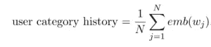
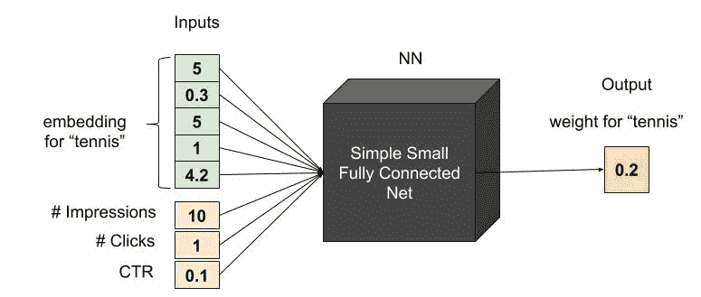
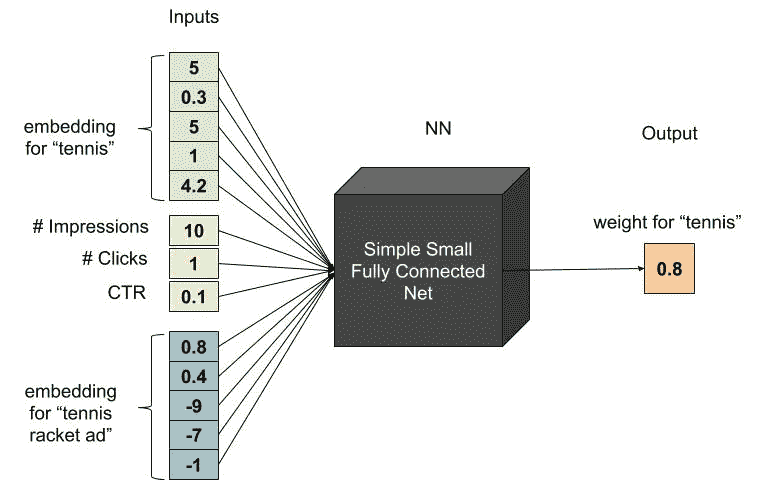

# 推荐系统:利用“深度兴趣”挖掘多分类特征

> 原文：<https://towardsdatascience.com/exploiting-multi-categorical-features-using-deep-interest-f7058ea6ed00?source=collection_archive---------26----------------------->

## 你的深度学习模型如何最大限度地利用长度变化的数组特征？

Photo by [Irina Nalbandian](https://unsplash.com/@civilizen?utm_source=medium&utm_medium=referral) on [Unsplash](https://unsplash.com?utm_source=medium&utm_medium=referral)

***原载于 2019 年 9 月 4 日*** [***Taboola 工程博客***](https://engineering.taboola.com/exploiting-multi-categorical-features-using-deep-interest/) ***。***

在 Taboola，我们的目标是预测用户是否会点击我们展示给他们的广告。我们的模型使用各种各样的特征，然而最重要的特征往往与用户的历史有关。了解如何很好地使用这些特性可以对模型的个性化功能产生巨大的影响，因为它们拥有用户特定的知识。

不同用户之间的用户历史特征差异很大；例如，一个流行的特性是*用户类别*——用户以前读过的主题。这种列表的一个例子可能是这样的— {“体育”、“商业”、“新闻”}。这些列表中的每个值都是分类的，它们有多个条目，因此我们将其命名为*多分类特征。多分类*列表可以为每个用户提供任意数量的值——这意味着我们的模型必须处理非常长的列表和完全空的列表(对于新用户)。

向机器学习模型提供未知长度的输入是一个需要明智解决的问题。这篇文章将带你了解如何在你的神经网络中整合这些不同长度的特征，从最基本的方法一直到“深度兴趣”，即当前的艺术状态。

# 平庸

让我们继续讨论*用户类别*。我们如何将未知长度的列表转换成我们可以使用的固定长度的特征？最天真，但非常流行的方法是简单地平均。让我们假设每个类别都有一个长度为 *d* 的独立嵌入——这样列表中的每个值都被映射到一个向量。我们可以使用*平均池*——平均所有用户的类别，并每次接收一个长度为 *d* 的向量。更正式地说，如果是全部 *N* 个字中的第 *j* 个字的嵌入，那么一个用户的平均池可以写成:

但这远非完美。平均可能工作得很好，但是当列表很长时, *1/N* 因子会产生一个很小的最终结果；对不同的指向向量求和可能会导致它们相互抵消，除以 *N* 会使情况变得更糟(如果你来自物理学/EE 背景，这应该会敲响警钟，因为这很像非相干积分中发生的情况)。这是不好的，因为它伤害了具有更长历史向量的用户，而这些向量是我们拥有最多信息并能给出更好预测的向量。正因为如此，我们(以及来自[阿里巴巴研究院](https://sigir-ecom.github.io/ecom18Papers/paper14.pdf)的人)去除了 *1/N* 因素，并对用户历史使用总和池，以确保可预测的客户不会对网络产生可忽略的影响。

# 举重，天真地

平均会自动为所有元素分配相同的权重。这是我们想要的吗？让我们用这个列表来考虑一个用户:{ '足球'，'网球'，'篮球'，'时尚' }。天真地将它们平均化会强调运动类别，而忽略“时尚”。对一些人来说，这是准确的——那些对运动比对时尚更感兴趣的人；对其他人来说，可能不会。我们可以做些什么来给不同的类别不同的权重，以更好地描述用户？

一个更好的解决方案是使用一些其他信息，例如:用户对每个类别的过去浏览(印象)次数。由于用户阅读一篇文章的次数与他的个人品味相关，我们可以使用这些计数作为权重，进行加权平均合并。例如，这将有助于我们区分以下两种截然不同的用户:

用户 1 = { '足球':2，'网球':2，'篮球':2，'时尚':200}

用户 2 = { '足球':2，'网球':2，'篮球':2，'时尚':2}

# 你注意到了吗？

我们能堆叠更多的信息吗？比方说，我们不仅有每个用户在每个类别的浏览次数，还有用户上次阅读该类别文章的时间，或者每个用户的该类别点击率(意思是，在该类别出现的所有时间中，用户阅读该类别文章的次数)。在不进行无休止的算法 A/B 测试的情况下，结合这些特性的最佳方式是什么？当然，答案是利用机器学习的力量，并应用一个额外的层，其工作是输出每个值的权重。这有时被称为“注意层”。这一层将所有相关数据作为输入，并学习理想的权重来平均这些值。让我们看一个单一类别值“网球”的注意力子网示例。假设“网球”的嵌入是{5，0.3，5，1，4.2}，并且用户被推荐了 10 篇网球文章，但是只点击了一次，则流程可以被图示为:

注意力层计算每个类别嵌入的权重。在上面的例子中，计算的权重是 0.2。假设该用户也对“时尚”感兴趣，并且关注层输出该类别的 0.5，则该用户的历史嵌入的最终计算将是 0.2* *emb(网球)+* 0.5* *emb(时尚)*。这些关注层学习如何利用我们拥有的关于该用户历史的所有信息来计算每个类别的权重。

太好了！但是我们能做得更好吗？

# 简介:深趣建筑

请记住，我们试图预测某个用户是否会点击某个广告，那么为什么不插入一些关于当前建议广告的信息呢？假设我们有一个用户，他的历史记录是{“网球设备”、“儿童服装”}，我们当前的广告是一个网球拍。当然，我们会希望网球装备更重，而忽略这个特殊案例中的儿童部分。我们之前的关注层仅仅是为用户兴趣建模而设计的，并没有考虑用户的个人品味与在汇集阶段向他推荐的广告之间的相互作用。我们希望在池化发生之前将这种用户-广告交互交织在一起，以便计算更具体地针对呈现给用户的当前广告的权重。

为此，我们可以使用 [Deep Interest](https://arxiv.org/abs/1706.06978) 架构，这是由阿里巴巴研究院的一个小组在 KDD2018 大会上展示的作品。如果我们回到前面的例子，我们现在可以为向用户建议的特定广告添加一个嵌入:

出于浓厚的兴趣，广告特征被用作神经网络的输入两次:一次作为模型本身的输入(贡献关于向用户呈现该广告是否会导致点击的信息)，第二次作为用户历史嵌入层的输入(将用户的历史注意力调整到与该特定广告相关的部分)。

我们还可以有不同的方式来为广告特征创建嵌入:一种是对上述两种情况使用相同的嵌入向量，另一种选择是为这两种情况生成两种不同的嵌入。第一个选项在训练时给予嵌入两倍的梯度，并且可能更好地收敛。在后一种情况下，我们可以有两种不同的嵌入方式(比如，对于整个网络，嵌入大小为 12；对于用户历史权重层，嵌入大小为 3)。较短的嵌入可以节省运行时间服务，但是向学习过程添加了更多的参数，并且可能延长训练时间。当然，在这两个选项之间进行选择取决于具体的用例。

# 摘要

多分类特征对于各种常见问题的预测至关重要，尤其是当试图从过去的交互中预测未来的用户行为(如点击、转化)时。有一些简单的方法可以做到这一点，但是为了更好地预测，我们推荐 Deep Interest 架构，因为它允许根据相关上下文对特征向量进行动态加权。这种体系结构实现起来非常简单，并且为许多推荐系统提供了很好的结果。去试试吧！

