# 印度尼西亚每位总统候选人支持者的推特探索与可视化

> 原文：<https://towardsdatascience.com/exploration-and-visualization-on-each-presidential-candidate-supporters-tweets-in-indonesia-a2b26c180f7e?source=collection_archive---------15----------------------->

## 按照数据科学流程，通过使用 Plotly 将数据上的发现可视化来进行实践。


# 介绍

你好！欢迎阅读本文。这一次，我想写一些与我迄今为止所写的不同的东西。我已经发表的文章是关于实现人工智能的，尤其是关于深度学习的。在这篇文章中，我想写一些不同的话题。我觉得如果要开发一个模型，这个话题也很重要。这一步应该在建模之前完成。也就是**探索性数据分析(EDA)** 。

对不起，我一直在忙着准备我的新工作😫。即使我很忙，我仍然想写媒介和大家分享我的知识😘。每当我有空闲时间，我就一点一点地写这篇文章。


Photo by [freestocks.org](https://unsplash.com/@freestocks?utm_source=medium&utm_medium=referral) on [Unsplash](https://unsplash.com?utm_source=medium&utm_medium=referral)

在这篇文章中，我不仅想讲述如何编写代码，还想将它实现到一个真实的研究案例中。我使用的数据来自我从图书馆搜集的 twitter。案例是关于“**2018**印尼各总统候选人支持者分析”。即使文本是印度尼西亚语，我也会努力让你明白文本和单词的意思。

本文中使用的数据是基于我抓取的推文的**。可能有一些爬虫跳过了的推文。尽管如此，你可以说人口的数据样本应该是有代表性的。我抓取的数据大约有 70 万条推文。**

如果你是来享受阅读统计数据的乐趣的，那就继续吧，不要在意这篇文章中的技术细节。哦，我也不会包括任何关于我们在数据中发现的洞察力的结论。我将只写可视化的分析和解释。你可以在头脑中创造你的结论，如果你想要更多，你为什么不也做 EDA 呢？当然还要写出来😃。

# 概述

1.  EDA 为什么？
2.  步伐
3.  技术
4.  第一步:研究问题
5.  第二步:收集数据
6.  第三步:数据预处理
7.  第四步:探索性数据分析
8.  结论
9.  编后记
10.  贮藏室ˌ仓库

# EDA 为什么？

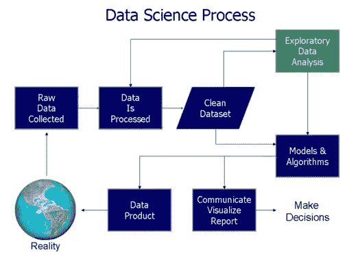

摘自 KDNuggets，在创建模型之前进行数据科学的步骤是收集数据、处理数据、清理数据，最后是 EDA。实际上，做 EDA 可以帮助我们更好地提高模型的质量。通过了解数据，我们可以感受到我们的学习算法是如何学习我们的数据的。好吧，如果你觉得你认为有些情况是不可能预测的，我们的学习者也不会。

在数据科学和机器学习的每项任务中，EDA 过程都应该在建模之前完成(没有任何数据要训练的纯强化学习除外)。比如在自然语言处理(NLP)中，做情感分析的时候，也许我们可以把一些做 EDA 时能找到的词去掉，做一个更好的模型。另一个例子，在计算机视觉(CV)中，我们可能会发现模型无法学习，因为我们的模型无法预测一些情况，因为我们的数据有独特的噪声或一些异常，这些噪声或异常在之前的数据清理步骤中没有被清理。

在建模之前做 EDA 还有很多其他好处。也许你可以得到一种直觉，可以让你的模型变得更好。这就是为什么我们应该做这一步。如果你看过我之前关于生成[深度学习歌词](/generating-indonesian-lyric-using-deep-learning-first-part-2c7634237475)的文章，我跳过了这一部分。有时在生成歌词时，有一些我不想让它出现的文本(例如“REFF”)。嗯，我没有注意到，如果我先做 EDA 的话，我应该会注意到的。

在做之前，我们需要知道有哪些步骤。开始了。

# 步伐

**首先是**，我们必须定义什么是**研究的问题？这意味着定义我们想要搜索的内容。这些问题将成为我们下一步行动的指南。这些问题也需要在下一步中回答。**

有一些研究问题的例子:

*   有多少包含“x”和“y”标签的推文？
*   哪个国家的推特频率最高？

以问题的形式列出你需要搜索的任何内容。通常，你可以开始锁定 5W 1H(什么，什么时候，哪里，为什么，谁，如何)。在我看来，因为我们可以在以后获得新的见解，我们可以根据我们的发现增加问题的数量，同时专注于我们的主要研究问题。

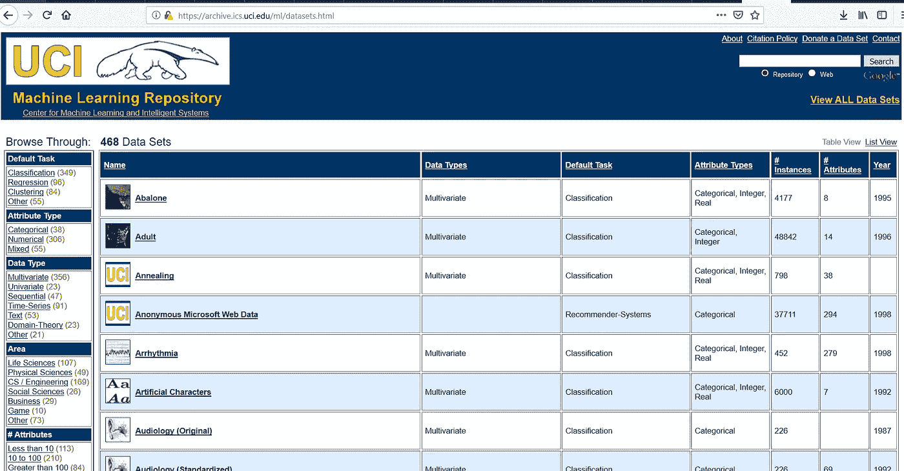

UCL Repository

**第二**，我们需要收集数据。确保我们根据已经定义的研究问题搜索数据集。有几种方法可以完成这些步骤。我们可以在数据集存储库中搜索任何结构化数据集，例如 Kaggle 和 UCL 存储库。或者，如果可能的话，我们也可以通过废弃一些社交媒体，如脸书和 Twitter，使用它们的 API 来搜索任何非结构化数据。这取决于你的研究问题。通常，您不会在那里找到您需要的结构化格式的数据。


[https://pixabay.com/en/baby-crying-cry-crying-baby-cute-2387661/](https://pixabay.com/en/baby-crying-cry-crying-baby-cute-2387661/)

**第三**，预处理，清洗数据，数据扯皮！这将是痛苦和恼人的步骤。做这一步时不要让你的头爆炸。为什么这一步是痛苦的？你需要了解你的数据。找出是否有任何“害虫”需要清理。NLP 中的“害虫”的例子有打字错误、非正式的单词、表情符号、拉长的单词、任何隐藏的炸弹，如果我们移除它们，通常会使我们的可视化和建模更好！

在做任何事情之前，如果数据不是结构化格式，我们需要将其转换为结构化格式，以便更容易地清理数据。让我告诉你，我们经常会多次回到这个步骤，因为我们经常在下一步中发现“害虫”。


Photo by [Chris Liverani](https://unsplash.com/@chrisliverani?utm_source=medium&utm_medium=referral) on [Unsplash](https://unsplash.com?utm_source=medium&utm_medium=referral)

**最后，**我们做 EDA(探索性数据分析)**。**在这里，我们将回答第一步中定义的一些研究问题。通常我们会在这里做一些可视化来传达我们的结果。当我们可以通过打印结果来查看数据时，为什么还要可视化或绘制数据？记住，分析的结果不会只为你一个人看到。结果会被别人看到。为了 UX(用户体验)，我们需要通过可视化来呈现数据，以确保读者在看到结果时感到舒适。我不认为我的文章会被很多人看到，如果我在这里通过裁剪 CLI(命令行界面)中打印结果的截图来呈现结果。在本文中，我们将在 Jupyter 笔记本电脑中进行 EDA，因为它有美丽的 UX，也可以用来展示我们的数据。

# 技术

我们将使用:

1.  [Python 3.6](https://www.python.org/)
2.  Numpy:一个用于科学计算的 Python 包
3.  [Pandas](https://pandas.pydata.org/) :用于处理表格数据的 Python 包
4.  Twint :一个 Python 包，用于抓取 Twitter 中的帖子(tweet)
5.  [Plotly](https://plot.ly/) :一个用于交互式可视化数据的 Python 包。这个软件包在可视化数据方面有漂亮的 UX。我们甚至可以操纵绘图的结果(例如:在绘图中隐藏几个标签)
6.  Jupyter Notebook :很棒的 Python IDE，也可以用来做演示或者教育代码。

# 第一步:研究问题

好了，在我们制定问题之前，让我告诉你，2019 年，印度尼西亚将举行总统选举。有两个候选人。他们是佐科·维多多(佐科维)——马鲁夫·阿明(第 01 号)和普拉博沃·苏比安托——桑迪亚加·乌诺(桑迪)(第 02 号)。

在这篇文章中，我们将关注的是每个候选人在社交媒体中的支持者是怎样的。在本文中，我们将关注 **Twitter** 社交媒体。

通过研究和谷歌搜索，我发现了一些佐科维和普拉博沃的支持者用来表达他们支持的标签。为了简单起见，我缩小了他们的标签范围:

1.  jokowi-Maaruf:# jokowi periode 或#JokowiLagi 或#01IndonesiaMaju 或#2019JokowiLagi 或#2019TetapJokowi 或#TetapJokowi
2.  普拉博沃—桑迪:#2019GantiPresiden 或# 2019 普拉博沃桑迪或# 2019 普拉博沃普雷西登

我们将把推文的年份限制在 2018 年。

就这样，我们来创建研究问题。以下是我的研究问题:

1.  每个支持者的推文在数据集中出现的频率如何？
2.  每个月每个支持者的推文频率如何？
3.  通过查看每个月最大频率的推文，该词在每个支持者的推文中当月的频率如何？
4.  通过查看每月最大频率的推文，该词在佐科威支持者的推文中当月的频率如何？
5.  这个词在普拉博沃支持者的推特上当月的前 30 频率如何？
6.  当月佐科威支持者的推文中，Token 伴随‘prabowo’一词出现频率前 30 是怎样的？
7.  当月普拉博沃支持者的推文中，Token 伴随‘佐科威’一词出现频率前 30 是怎样的？
8.  当月普拉博沃支持者的推文中，Token 伴随'普拉博沃'一词出现频率前 30 是怎样的？
9.  佐科威支持者当月推文中 Token 伴随‘佐科威’一词出现频率前 30 是怎样的？
10.  普拉博沃和佐科维支持者的推文中 Hashtags 的前 30 频率如何？
11.  佐科维和普拉博沃支持者推文中的 length char 均值如何？
12.  佐科维和普拉博沃支持者的推文中长度词的均值如何？

我们完了！事实上，我们可以问的问题太多了。为了不使这篇文章变成 1 小时的阅读时间，我们将把我们想问的问题减少到 12 个。

# 第二步:收集数据

对于这些步骤，我们将使用 Twint 作为我们的库。

对于本文，我们将按如下方式确定数据范围:

*   只有包含上述标签的推文才会被删除
*   我们将采用 2018 年发布的推文

这一步我刮了 706.208 条推文

# 第三步:数据预处理

好的，因为本文将关注 EDA，所以我们将尽可能缩短这一步。

首先，我们将使用`pandas`读取 csv

> `tweet = pd.read_csv(‘tweet.csv’, encoding=’utf-8')`

为了简单起见，我们将只形式化 word 并删除停用词

我们将以两种方式形式化，首先是用正则表达式，然后用已知的俚语词替换正式词。后者将需要一本俚语词及其正式词的词典。

我是这样将这个词形式化的:

应该有更好的方法来清理`formalize_rule`函数，比如使用`nltk TweetTokenizer`。嗯，我想试试 regex，就这样。

我也实现了在`formalize_word`上移除停用词。

我们将它应用到数据框架中:

注意，在这一步，实际上我们在做了几次 EDA 之后，还会回到这一步。有时候，我们会发现 EDA 步骤中的“害虫”。

我们完成了，进入最后一步！

# 第四步:探索性数据分析

因为我们想要回答的所有研究问题都可以在这里找到答案，所以我们将在这一步结束数据科学流程。事不宜迟，让我们回答所有的问题吧！

等等，在这之前。我们应该定义一些将被多次使用的函数。

我们已经定义了将在以后经常使用的数据帧过滤器。我们还创建了一些在数据帧中输出统计数据的函数。统计数据将被绘制成图表。

## 0.数据中有多少实例？

```
tweet.shape[0]  # 705013
```

## 1.每个支持者的推文在数据集中出现的频率如何？

**怎么做？**

我们取每个支持者推文的属性形状。

```
freq_hashtag = []
for filter_tweet in array_filter:
    freq_hashtag.append(tweet[filter_tweet].shape[0])
```

我们需要这样做来展示 Jupyter 中的情节:

```
init_notebook_mode(connected=True)
```

让我们设定情节

```
label = ['Jokowi Supporter', 'Prabowo Supporter']   
data = [
    go.Pie(labels=label,
            values=freq_hashtag, textinfo='value')
]
layout = go.Layout(
    title='Tweet Frequency of Each Supporters'
)
fig = go.Figure(data=data, layout=layout)
```

有许多方法可以将这些数据可视化。由于它们每个都是可比较的，我们可以使用饼图来可视化数据。

> plotly 需要两个最少的组件。
> 
> 首先是“数据”。“数据”是我们想要可视化的图表类型的一组数据。我们可以在这里组合多种类型的图表。例如，您可以在可视化中用饼图来可视化条形图。
> 
> 其次是布局。布局是可视化的容器。在这里我们可以定制标题、图例、轴等等。
> 
> 然后，我们将容器和图表放入`go.Figure`(一个图)中进行组合。这个图形已经可以绘制了。

```
iplot(fig,'test')
```

**剧情吧！**

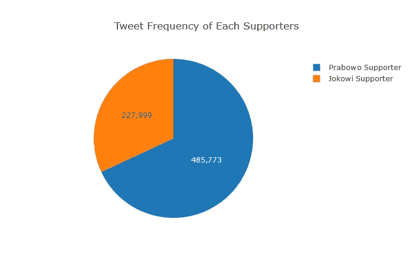

**分析**

普拉博沃的支持者推文频率高于佐科维的支持者推文频率

## 2.每个月每个支持者的 tweets 的前 30 个频率如何？

**怎么做？**

因为我们要绘制的数据是连续的。我们可以用折线图来绘制。

首先，我们对每个月进行过滤和循环

```
freq_hashtag = []
for filter_tweet in array_filter_month:
    for filter_tweet_prez in array_filter:
        freq_hashtag.append(tweet[filter_tweet][filter_tweet_prez].shape[0])
```

颠倒列表(从 12 月—1 月到 1 月—12 月)

```
j_freq = freq_hashtag[::2][::-1]
p_freq = freq_hashtag[1::2][::-1]
```

那就画出来

```
label = ['Jokowi Supporter', 'Prabowo Supporter']   
data = [
    go.Scatter(x=month_unique,
            y=j_freq, name=label[0]),
    go.Scatter(x=month_unique,
            y=p_freq, name=label[1])
]
layout = go.Layout(
    title='Tweet Frequency of Each Supporters / Month'
)
fig = go.Figure(data=data, layout=layout)
iplot(fig)
```

**剧情吧！**

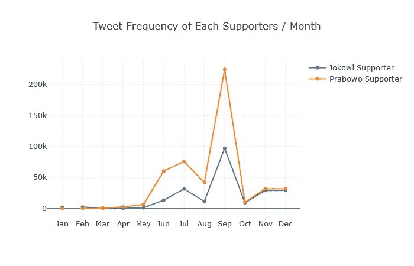

**分析**

普拉博沃的支持者推特通常比佐科维的支持者推特更频繁。他们的推文在九月达到顶峰。

## 3.通过查看每月最大频率的推文，该词在每个支持者的推文中当月的前 30 个频率是怎样的？

**怎么做？**

首先，我们将设置最大频率的推文在 9 月。

`i = Sep`

然后，我们通过使用上述函数找到最高频词。

```
stat_word = get_stat_with_func(tweet, lambda x: get_tweet_common_word(x, text_column="tweet3", most_common=30),'month')
```

我们将只选取 9 月份发布的推文，并对其进行绘图。我们将把它限制在最高频率的前 30 位。

> 由于数据不是连续的，所以条形图是正确的选择。如果我们不想知道每个单词的频率，单词云也有助于我们可视化词频。

```
plotting = stat_word.loc[i]
freq = plotting.apply(lambda x: x[1]).values
word = plotting.apply(lambda x: x[0]).values
data = [
go.Bar(x=word,
        y=freq),
]
layout = go.Layout(
    title='Word Freq in {}'.format(i)
)
fig = go.Figure(data=data, layout=layout)
iplot(fig)
```

**剧情！**

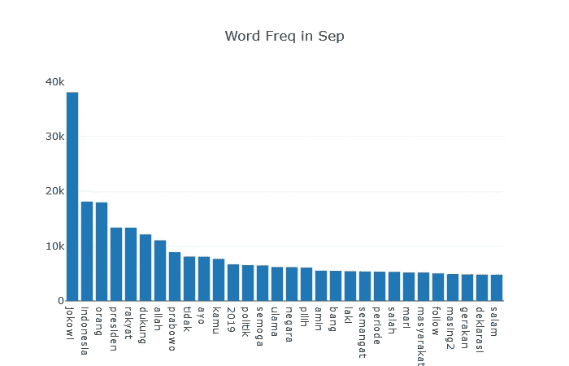

**分析**

“佐科维”在 9 月出现的频率最高。它的频率大约在 35k — 40k 之间。接下来是印尼、Orang(人)、Presiden(总统)、Rakyat(公民)、Dukung(支持)、Allah(神)、Prabowo 等。

## 4.通过查看每月最大频率的推文，佐科威支持者的推文中当月前 30 个词的频率如何？

**怎么做？**

这与我们在 RQ(研究问题)3 上的做法类似。不同的是，我们需要过滤佐科维的支持者推文。

```
tweet_2019_jokowi = tweet[filter_jokowi]
stat_word = get_stat_with_func(tweet_2019_jokowi, lambda x: get_tweet_common_word(x, text_column="tweet3", most_common=30),'month')
i='Sep'    
plotting = stat_word.loc[i]
#     print(plotting)
freq = plotting.apply(lambda x: x[1]).values
word = plotting.apply(lambda x: x[0]).values
data = [
go.Bar(x=word,
        y=freq),
]
layout = go.Layout(
    title='Word Freq in {} for Jokowi Hashtag'.format(i)
)
fig = go.Figure(data=data, layout=layout)
iplot(fig)
```

**剧情吧！**

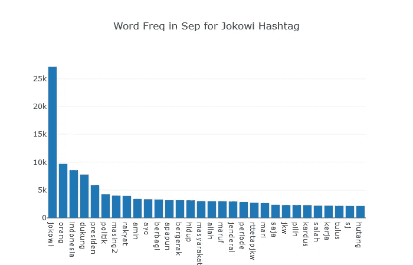

**分析**

“佐科威”这个词在这里也是最高的，与其他词的区别很大。它有积极的词汇，如“伯巴基”(分享)、“图卢斯”(真诚)和“伯杰拉克”(移动)。它也有“安拉”这个词。

## 5.普拉博沃支持者的推特上当月前 30 个词的出现频率如何

**怎么做？**

同样，在做 RQ 4 时也是类似的。我们将过滤到普拉博沃支持者的推文。

```
tweet_2019_prabowo = tweet[filter_prabowo]
stat_word = get_stat_with_func(tweet_2019_prabowo, lambda x: get_tweet_common_word(x, text_column="tweet3", most_common=30),'month')
i = 'Sep'
plotting = stat_word.loc[i]
#     print(plotting)
freq = plotting.apply(lambda x: x[1]).values
word = plotting.apply(lambda x: x[0]).values
data = [
go.Bar(x=word,
        y=freq),
]
layout = go.Layout(
    title='Word Freq in {} for Prabowo Hashtag'.format(i)
)
fig = go.Figure(data=data, layout=layout)
iplot(fig)
```

**剧情吧！**

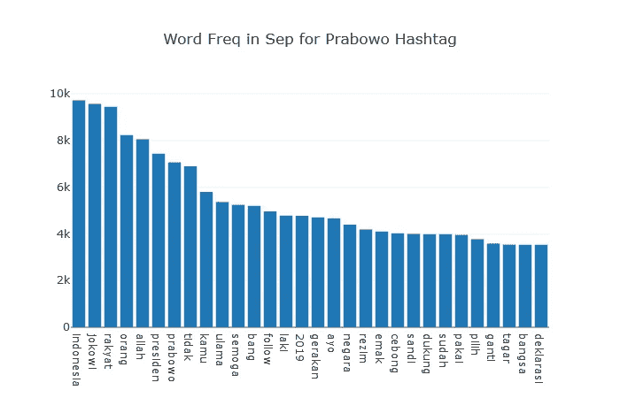

**分析**

没想到‘佐科威’频率比‘普拉博沃’高。最高的是‘印度尼西亚’。每个词的出现频率相差不太大。我们应该注意的词是' ulama '(穆斯林的学者或神职人员)、' rezim '(政权)、' cebong '(蝌蚪，普拉博沃的支持者对佐科维的支持者的' bad '别名)、' emak '(母亲群体)和' bangsa '(民族)。它也有“安拉”这个词。

## 6.当月佐科威支持者的推文中，Token 伴随‘prabowo’一词出现频率前 30 是怎样的？

在我们这样做之前，因为我们经常通过多次编写代码来绘图，所以我们应该创建一个可重用的函数。

```
def plot_freq_word(x,y,title='Title'):
    data = [
    go.Bar(x=x,
            y=y),
    ]
    layout = go.Layout(
        title=title,
        xaxis=dict(
            title='Kata',
            titlefont=dict(
                family='Latto',
                size=8,
                color='#7f7f7f'
            ),
                    tickangle=45,
            tickfont=dict(
            size=8,
            color='black'
            ),
        )
    )
    fig = go.Figure(data=data, layout=layout)
    iplot(fig)
```

之后，我们将根据需要过滤数据帧。

```
tweet_prabowo_in_jokowi = tweet[(filter_jokowi) & (tweet.tweet3.str.contains('prabowo', False))]stat_word = get_stat_with_func(tweet_prabowo_in_jokowi, lambda x: get_tweet_common_word(x, text_column="tweet3", most_common=30),'month')
i='Sep'
plotting = stat_word.loc[i][1:].dropna()
freq = plotting.apply(lambda x: x[1]).values
word = plotting.apply(lambda x: x[0]).values
plot_freq_word(word,freq,"Frequency of Token accompany 'prabowo' Token in Jokowi Supporter's Tweet on {}".format(i))
```

**剧情吧！**

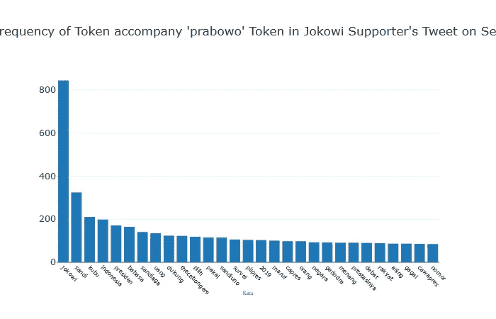

**分析**

佐科维是这里频率最高的。我们会注意到一些有趣的词，它们是“uang”(钱)、“thecebongers”(蝌蚪)、“prestasinya”(成就)、“survei”(调查)和“asing”(外国)

## 7.那个月普拉博沃支持者的推文中伴随着“佐科威”一词的前 30 位频率是多少

我们将根据需要过滤数据帧。

```
tweet_jokowi_in_prabowo = tweet[(filter_prabowo) & (tweet.tweet3.str.contains('jokowi', False))]stat_word = get_stat_with_func(tweet_jokowi_in_prabowo, lambda x: get_tweet_common_word(x, text_column="tweet3", most_common=30),'month')
i = 'Sep'
plotting = stat_word.loc[i][1:].dropna()
freq = plotting.apply(lambda x: x[1]).values
word = plotting.apply(lambda x: x[0]).values
plot_freq_word(word,freq,"Frequency of Token accompany 'Jokowi' Token in Prabowo Supporter's Tweet on {}".format(i))
```

**剧情吧！**

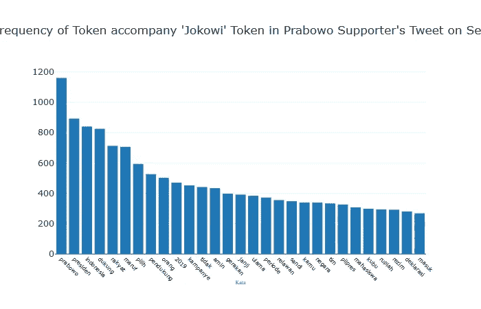

**分析**

普拉博沃是这里频率最高的。我们会注意到一些很有意思的词，分别是' gerakan '(运动)、' ulama '、' mahasiswa '(大学生)、' rupiah '(印尼货币)、' rezim '(政权)。

## 8.当月普拉博沃支持者的推文中，Token 伴随'普拉博沃'一词出现频率前 30 是怎样的？

我们将根据需要过滤数据帧。

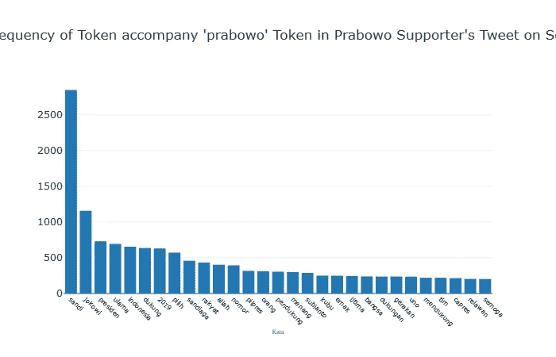

**分析**

“桑迪”在这里出现的频率最高。它与其他词有很大的差距。引起我注意的词是“ulama”、“allah”、“emak”、“gerakan”和“ijtima”(ulama/穆斯林学校的决定)。“佐科维”也是这里第二高的频率。

## 9.佐科威支持者当月推文中 Token 伴随‘佐科威’一词出现频率前 30 是怎样的？

**我们是如何做到的？**

我们将根据需要过滤数据帧:

```
tweet_jokowi_in_jokowi = tweet[(filter_jokowi) & (tweet.tweet3.str.contains('jokowi', False))]stat_word = get_stat_with_func(tweet_jokowi_in_jokowi, 
                               lambda x: get_tweet_common_word(x, text_column="tweet3", most_common=30),'month')
i = 'Sep'
plotting = stat_word.loc[i]
plotting = plotting.dropna()
freq = plotting.apply(lambda x: x[1]).values[1:]
word = plotting.apply(lambda x: x[0]).values[1:]
plot_freq_word(word,freq,"Frequency of Token accompany 'jokowi' Token in Jokowi Supporter's Tweet on {}".format(i))
```

**剧情吧！**

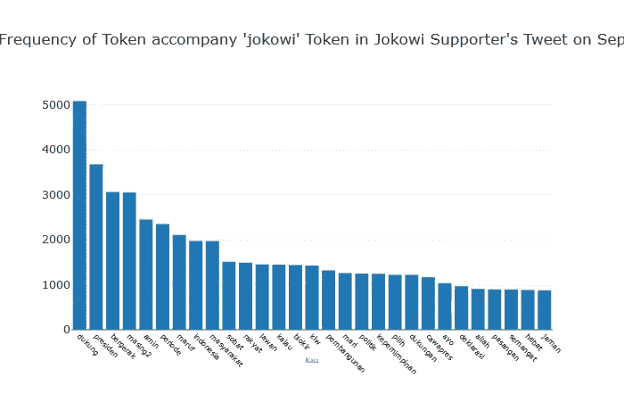

**分析**

“普拉博沃”不在这里最高的 20 个频率中。和上面的不一样。总之，引起我注意词是“blokir”(封锁)、“pembangunan”(建设)、“kepemimpinan”(领导)、“allah”、“hebat”(伟大)和“bergerak”(移动)

## 10.普拉博沃支持者的推文中话题标签的前 30 频率如何？

**怎么做？**

由于 hashtag 的列是字符串格式，我们需要使用`eval`将该类型转换为“list”。之后，我们通过' '连接列表的内容，并调用我们之前的函数。我们将在 9 月份看到不限数据的统计。

```
hashtag_di_prabowo = tweet[(filter_prabowo)]
hashtag_di_prabowo['hashtags'] = hashtag_di_prabowo['hashtags'].apply(eval)
hashtag_joined = hashtag_di_prabowo['hashtags'].apply(lambda x: ' '.join(x))
hashtag_di_prabowo['hashtag_joined'] = hashtag_joinedstat_word = get_stat_with_func(hashtag_di_prabowo, lambda x: get_tweet_common_word(x, text_column="hashtag_joined", most_common=20),'month')
i = 'all'
plotting = stat_word.loc[i]
plotting = plotting.dropna()
freq = plotting.apply(lambda x: x[1]).values
word = plotting.apply(lambda x: x[0]).values
plot_freq_word(word,freq,"Frequency of Hashtags in Prabowo Supporter's Tweet")
```

**剧情吧！**

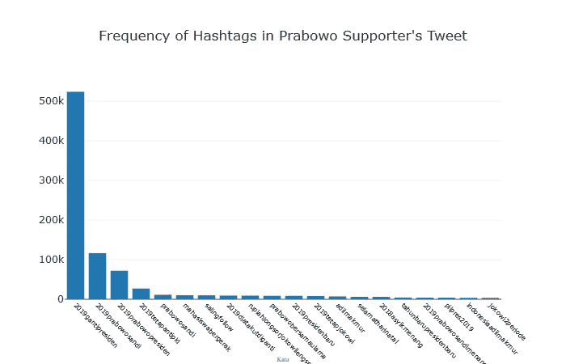

**分析**

我关注的标签是‘2019 tetapantipki’(2019 将继续反共)、“mahasiswabergerak”(大学生运动)、“rupiahlongsor jokoweilengser”(Rupiah Fall Jokowi 下台)和“Jokowi 2 periode”(Jokowi 两期)。最后一个标签应该是佐科威支持者的标签。标签大多是关于更换总统和佐科威的负面消息。

## 11.佐科威支持者的推文中，话题标签的前 30 频率如何？

**怎么做？**

真的和 RQ 10 差不多。

```
hashtag_di_jokowi = tweet[(filter_jokowi)]
hashtag_di_jokowi['hashtags'] = hashtag_di_jokowi['hashtags'].apply(eval)
hashtag_joined = hashtag_di_jokowi['hashtags'].apply(lambda x: ' '.join(x))hashtag_di_jokowi['hashtag_joined'] = hashtag_joinedstat_word = get_stat_with_func(hashtag_di_jokowi, lambda x: get_tweet_common_word(x, text_column="hashtag_joined", most_common=20),'month')
i='all'
plotting = stat_word.loc[i]
plotting = plotting.dropna()
freq = plotting.apply(lambda x: x[1]).values[1:]
word = plotting.apply(lambda x: x[0]).values[1:]
plot_freq_word(word,freq,"Frequency of Hashtags in Jokowi Supporter's Tweet")
```

**剧情吧！**

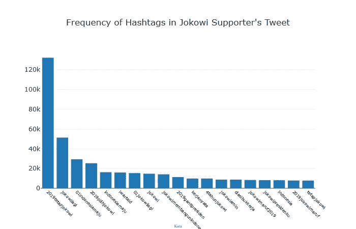

**分析**

我关注的标签有“indonesiamaju”(先进的印度尼西亚)、“jokowimambungunindonesia”(Jokowi 建设印度尼西亚)、“kerjanyata”(看得见的工作)、“diasibukkerja”(他在忙着工作)。大多数标签都是关于让佐科威继续当总统以及关于佐科威的积极的事情。同样，有一个“2019gantipresiden”应该是 Prabowo 支持者的标签。

## 12.佐科维和普拉博沃支持者推文中的 length char 均值如何？

**我们是如何做到的？**

我们会用折线图来做。由于这些数据是可比较的，我们将把它们形象化为一张图。我们将制作我们的默认折线图

```
def show_plotly_linechart(x_data, y_data, color_function=place_default_color,
                          title="This is title", dash=[], mode=[],
                          x_axis_dict_lyt=None, name=None,
                           y_axis_dict_lyt=None, custom_layout=None, x_title=None, y_title=None):
    assert len(x_data) == len(y_data)
    line_chart = []

    for idx, (x, y) in enumerate(zip(x_data,y_data)):
        color = color_function(x, idx)
        current_dash = 'dash'
        current_mode = 'lines+markers'
        if len(dash) > 0:
            current_dash = dash[idx]
        if len(mode) > 0:
            current_mode = mode[idx]

        if name == None:
            name = ["Trace"] * len(x_data)
        line_chart.append(go.Scatter(x=x,y=y, 
                                         mode = current_mode,name=name[idx]))

    layout = custom_layout
    if layout is None:
        layout = default_define_layout(x_axis_dict_lyt, y_axis_dict_lyt, title, x_title, y_title)
    fig = go.Figure(data=line_chart, layout=layout)
    iplot(fig)
```

而且我们还需要一个新的功能:

```
def get_length_char(df, text_column="tweet3"):
    if df.shape[0] > 0:
        return df[text_column].apply(len).mean()def get_word_length(df, text_column="tweet3"):
    if df.shape[0]>0:
        return df[text_column].apply(lambda x : len(x.split())).mean()
```

我们完成了，让我们绘制它们:

```
title_label = ["Length Char Jokowi", "Length Char Prabowo"]
counter = 0
x_l = []
y_l = []
for char_len in [jokowi_char_length, prabowo_char_length]:
    x = char_len[0].index[:12]
    y = char_len[0][:12].values
    x_l.append(x[::-1])
    y_l.append(y[::-1])
show_plotly_linechart(x_l,y_l,title="Length Char", name=title_label)
```

我们将制作一个包含两个折线图的列表，并用一张图显示出来。[::-1]表示我们将反转月份。默认从 12 月开始到 1 月。

**剧情吧！**

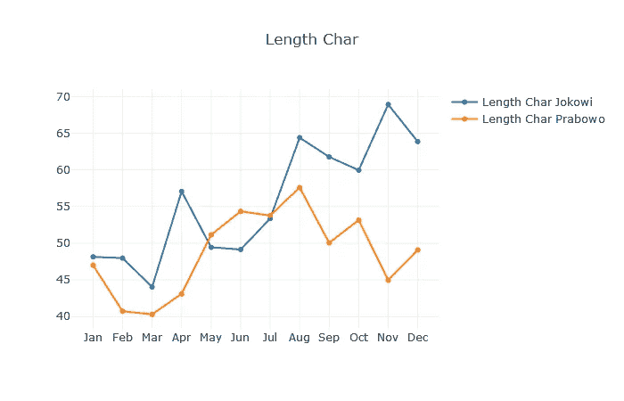

**分析**
佐科威的 char 长度均值呈上升趋势，在 11 月达到峰值。wheras Prabowo char 长度的平均值在 8 月之前趋于上升，在 8 月之后趋于下降

## 13.佐科维和普拉博沃支持者的推文中长度词的均值如何？

**怎么做？**

我们最后的 RQ。和上面的一样，但是我们需要新的功能:

```
jokowi_word_length = get_stat_with_func(tweet[filter_jokowi], get_word_length, label='month')
prabowo_word_length = get_stat_with_func(tweet[filter_prabowo], get_word_length, label='month')
```

就这些了，让我们画出来:

```
title_label = ["Jokowi", "Prabowo"]
counter = 0
x_l = []
y_l = []
for word_len in [jokowi_word_length, prabowo_word_length]:
    x = word_len[0].index[:12]
    y = word_len[0][:12].values
    x_l.append(x[::-1])
    y_l.append(y[::-1])
show_plotly_linechart(x_l,y_l,title="Word Length", name=title_label)
```

**剧情吧！**


**分析**

不出所料，和 RQ 12 的答案差不多得到了类似的结果。

# 结论

我们已经回答了我们定义的所有研究问题。答案里有很多有趣的地方。例如，每位总统的支持者的推文中出现频率最高的 30 个词的种类，以及每位支持者如何谈论他们的总统候选人或他们的总统候选人的对手。我不会在这里深究统计数据，因为这会让这篇文章更长。

在我们做 EDA 之后，我们应该注意到有一些东西应该被清理以使数据更好。例如，有一些推文在一条推文中包含了 Jokowi 的支持者和 Prabowo 的支持者的标签。这些推文应该从数据集中删除。我们应该回到清洁步骤，重新做 EDA。

# 编后记


[https://pixabay.com/en/cat-tired-yawn-stretch-814952/](https://pixabay.com/en/cat-tired-yawn-stretch-814952/)

这就是我的文章，主要是关于 EDA 的。其实我答过的 rq 还多。但为了缩短这篇文章，我选择了其中的几个。你一定想知道我们发现的一些结果。为此，您需要更深入地探索数据。如果有很多读者想要，我会分享数据集。

可以为该数据集完成许多任务，如主题建模、情感分析、检测异常(如检测蜂鸣器)和许多有趣的任务。如果有人想让我写，我会考虑写的。

我欢迎任何可以提高我自己和这篇文章的反馈。我正在学习写作。我真的需要一个反馈来变得更好。请确保以适当的方式给出反馈😄。

在我接下来的几篇文章中，我将回到 NLP 或计算机视觉(可能)主题。


[https://pixabay.com/en/calligraphy-pen-thanks-thank-you-2658504/](https://pixabay.com/en/calligraphy-pen-thanks-thank-you-2658504/)

# 贮藏室ˌ仓库

TBD

# 来源

[](https://www.kdnuggets.com/2016/03/data-science-process.html) [## 数据科学过程

### 在 Springboard，我们的数据学生经常问我们一些问题，比如“数据科学家是做什么的？”。或者“一天做什么……

www.kdnuggets.com](https://www.kdnuggets.com/2016/03/data-science-process.html)