# 强化学习的探索

> 原文：<https://towardsdatascience.com/exploration-in-reinforcement-learning-e59ec7eeaa75?source=collection_archive---------2----------------------->

## 应该在勘探和开发上花费多少努力

Photo by [Dariusz Sankowski](https://unsplash.com/@dariuszsankowski?utm_source=medium&utm_medium=referral) on [Unsplash](https://unsplash.com?utm_source=medium&utm_medium=referral)

**更新**:学习和练习强化学习的最好方式是去 http://rl-lab.com

每个人每天都面临着同样的困境:我应该继续做我正在做的事情，还是应该尝试其他事情。例如，我应该去我喜欢的餐馆还是应该尝试一个新的，我应该保持目前的工作还是应该找到一个新的，等等…

在强化学习中，当你坚持做你正在做的事情时，这种类型的决定被称为 ***开发*** ，当你尝试新事物时，这种类型的决定被称为 ***探索*** 。

很自然，这就提出了一个问题:开发多少，勘探多少。

然而，在探索中有一个问题，那就是我们并不真正知道结果会是什么，它可能比目前的情况更好，也可能更糟。

人类在采取行动之前，试图获得尽可能多的信息，例如，在我们尝试一家新餐馆之前，我们会阅读评论或询问已经尝试过的朋友。另一方面，在强化学习中，这是不可能的，但是有一些技术可以帮助找出最佳策略。

# **后悔的概念**

从逻辑上讲，当我们尝试新事物，结果不令人满意时，我们会后悔我们的决定。如果新餐馆很差，我们会后悔去那里，我们认为无论我们付多少钱都是完全的损失。所以我们很遗憾这个金额。

当我们不断为错误的决定买单时，损失的数量和后悔的程度都会增加。因此，将损失金额和后悔程度保持在最低水平应该是个好主意。

我们能做到吗？答案是，是的，这是可能的，至少在 RL 中是这样。

# 强化学习中的遗憾

首先我们需要定义 RL 中的后悔。为此，我们首先将最佳行动 a*定义为给予最高回报的行动。

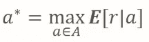

Optimal action

因此，我们将 T 次尝试过程中的后悔 L 定义为最佳行动产生的奖励 a*乘以 T 与任意行动的每次奖励从 1 到 T 的总和之差。

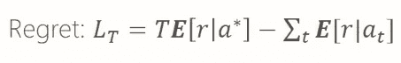

可以证明，当 T 趋于无穷大时，后悔趋于 C . log T 的一个下界。

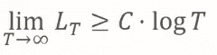

# 贪婪&ε贪婪

Greedy 和 Epsilon Greedy 探索方法相当容易理解和实现，但是它们遭受重大挫折，即它们具有次优遗憾。事实上，贪婪者和贪婪者的后悔都是随着时间线性增长的。

这很容易直观地理解，因为贪婪者会锁定一个在某个时间点碰巧有好结果的行动，但它实际上并不是最佳行动。所以贪婪者会继续利用这个行为，而忽略其他可能更好的行为。它利用得太多了。

另一方面，贪婪的 Epsilon 探索太多，因为即使当一个行为看起来是最佳的，方法仍然分配固定百分比的时间用于探索，因此错过了机会，增加了总的遗憾。

相反，随着时间的推移，衰减的ε贪婪方法试图减少专用于探索的百分比。如下图所示，这可以产生最佳的遗憾。

然而，挑战在于能够执行正确的衰减过程。

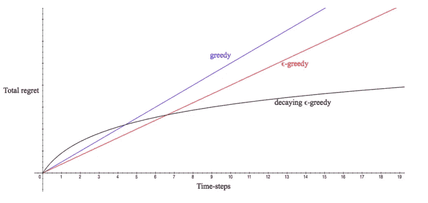

# 面对不确定性保持乐观

面对不确定性的乐观是一种加强探索和减少总遗憾的方法。

假设我们有三个概率分布不同的老虎机，我们并不确切知道，但经过几次试验后，我们认为我们有以下分布形状。请记住，这些都是根据经验得出的，并不一定反映事实。

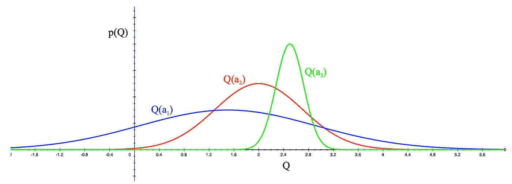

绿色 Q(a3)分布具有相当窄的基数，因为间隔很小[1.8，3.2]，红色 Q(a2)具有较大的间隔[0，4]，最后蓝色 Q(a1)具有最大的间隔[-1.8，5.2]。所以问题是我们下一步应该采取什么行动。

根据面对不确定性的乐观主义原则，即使不确定性较高，我们也会选择回报较高的行动。查看图表，我们很容易发现 Q(a1)可能比其他人有更高的回报(5.2)，所以我们选择了它，即使它有更高的不确定性(它可能是 5.2，因为它可能是-1.8)。

假设采取了行动 a1，分布如下:

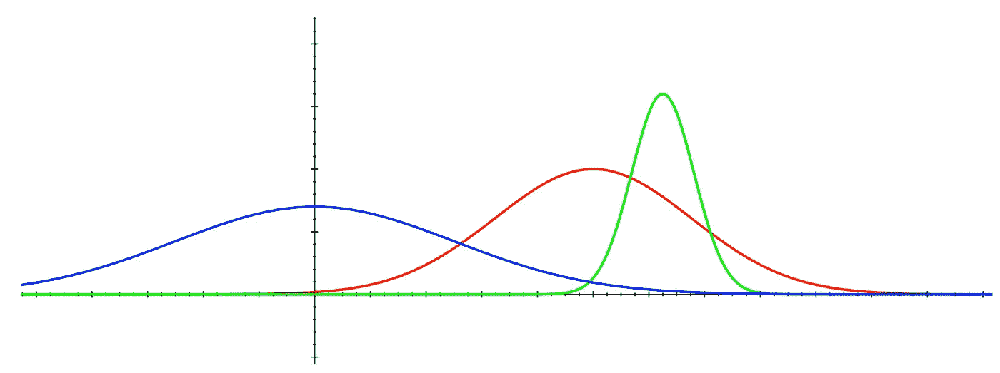

我们现在知道蓝色分布的最大值比另外两个小。所以我们对它不太确定，下一个动作将从另一个分布中选择，例如红色的。

这是原则，但如何在现实中实施呢？
这就是 UCB1 的意义所在。

# UCB1

在上一段中，我们谈到了采取行动，这可能会带来最大的回报，即使这是不确定的。
然而，问题仍然是如何找到这个最大值？

一种方法是对每个动作的 Q *𝑡* (a)加上一个称为置信上限 U *𝑡* (a)的项，然后选择具有最大 Q *𝑡* (a) + U *𝑡* (a)的动作。

不言而喻，U *𝑡* (a)不是常数，而是应该随时间和经验而变化。
我们的意思是，随着时间的推移，我们频繁地选择行动(a)，我们越来越确定 Q(a)是什么，它本身是一个平均值，所以 U *𝑡* (a)应该随着我们对 Q(a)越来越有信心而缩小。

U *𝑡* (a)的公式如下

其中 ***t*** 为试验总次数，N *𝑡* (a)为动作(a)被选择的次数。
该公式清楚地表明，随着 ***t*** 的增加，分子也以对数方式增加(例如缓慢增加)，而当选择动作(a)时，N *𝑡* (a)增加 1，然而 U *𝑡* (a)急剧减少。

这里有一个例子:

我们可以看到，对于 t 从 100 到 1000，N *𝑡* (a)为 1，那么 U *𝑡* (a)从 2 到 2.45 增长非常缓慢，但是当 N *𝑡* (a)增加 1 时，U *𝑡* (a)急剧下降到 1.73。

所以 U *𝑡* (a)是一种调节选择动作(a)的方式，基于过去我们已经多次选择了这个动作。换句话说，它为我们提供了更多回报的确定性。

最终算法规定，对于每次迭代，我们计算所有动作的 Q *𝑡* (a) + U *𝑡* (a)，并且我们选择具有最高 Q *𝑡* (a) + U *𝑡* (a)值的动作:

这种探索 vs 利用的方法保证了有一个对数遗憾。

**重要提示** : UCB1 没有对分布的类型做任何假设，尽管在上面的图表中它们看起来像高斯分布，但是它们可以是任何分布。

## 正态分布

假设我们知道报酬分布是高斯分布:
ℛ(r) = **𝒩** (r，μ，σ)

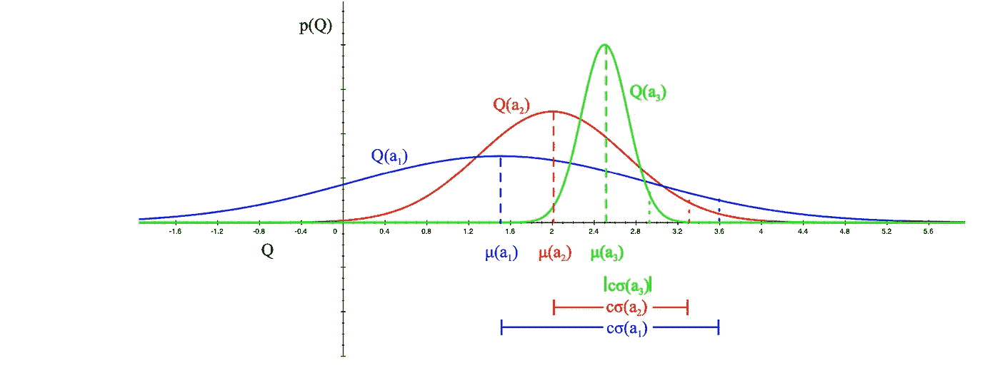

算法变成选择最大化 Q(a)的标准偏差的动作

# 汤普森取样

也称为后验抽样，这是一种从每个分布中抽取样本，然后从样本中选择具有最大值的动作的方法。
采取行动并收集奖励后，我们更新采取行动的分配，以反映我们得到的结果。

当然，这需要更多的解释。

考虑一个骰子，我们不知道它是否有偏差，实际上我们没有任何关于它的信息。所以我们假设，作为开始，这是一个公平的骰子，得到任何数字的概率都等于 1/6。
所以最初的信念是概率分布是均匀的，等于 1/6。这称为先验分布，它构成了我们对骰子潜在概率分布的一种信念或假设(可能是错误的)。
现在我们开始掷骰子并收集结果，随着每个结果我们更新先验分布，使其反映实验的现实。新的分布现在被称为后验分布。我们不断重复这个过程大量的迭代，其中迭代(I)处的后验分布变成迭代(i+1)处的先验分布，直到我们到达最终后验分布非常接近真实的基础分布的阶段。
例如，如果我们注意到，在大量投掷后，我们有一个数字比其他数字占优势，这意味着分布不可能是均匀的，最有可能的是骰子有偏差。

现在出现的问题是，我们如何更新先验分布来获得后验分布？

要回答这个问题，让我们从定义贝塔分布开始:
贝塔分布是定义在区间[0，1]上的一族连续概率分布，区间由两个正参数α和β参数化，它们决定了分布的形状。

Formula of the Beta distribution, where C is a constant and 𝝰, β are parameters, and x is between 0 and 1

您可以将β分布视为一个分布族，其中每个成员根据参数𝝰，β的值而各不相同。

以下是β分布在𝝰，β值之后的一些形状示例。

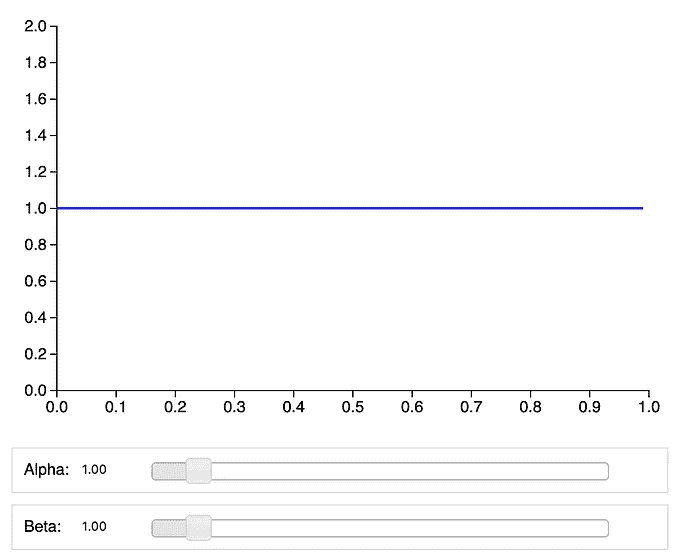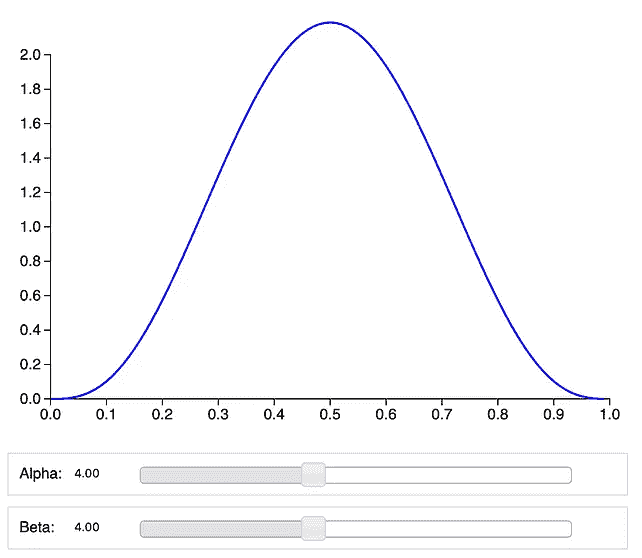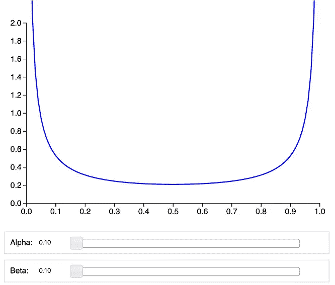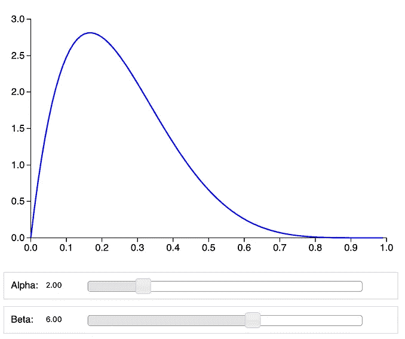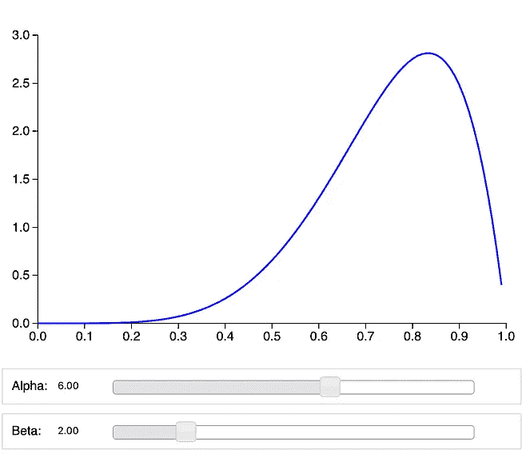

Shapes of **Beta** distribution relative to the values of 𝝰, β parameters

如何采样？

采样包括从分布中随机获取值，但是由于分布可能不均匀，因此采样返回的值很可能来自分布达到峰值的区域。

例如，以上面这组图表中第二行的第三个图表为例。这种分布在大约 0.84 处达到峰值。因此，当从该分布中采样时，它更可能具有大约 0.84 的值，而不是例如具有小于 0.4 的值。

现在假设你有多个行动，每个行动都有未知的回报分布。我们使用汤普森抽样来发现哪种行为是最好的(它使平均回报最大化)。我们首先假设某个分布，如 Beta(1，1)，它是每个动作的均匀分布，然后我们对这些分布进行采样，并选择具有最高采样值的动作。
一旦选择的动作被执行并且奖励被收集，选择的动作的分布被更新。

下面举一个多臂土匪(老虎机)的例子。
例子由三个多臂土匪组成:蓝、红、紫。由于我们对这些匪徒的潜在分布一无所知，我们假设他们是统一的。我们从这些分布中采样，得到如下结果:蓝色= 0.4，红色= 0.5，紫色= 0.7
结果是紫色的采样值最高，所以我们拉紫色机器的手臂。假设我们没有赢，那么我们需要通过将β参数增加 1 来更新我们对紫色分布的信念，使之成为β(1，2)，这将给出下面的第一个图。

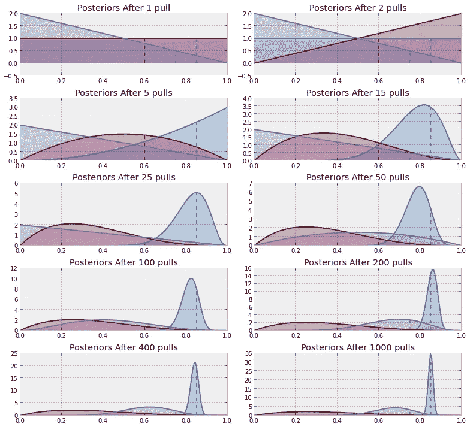

[https://dataorigami.net/blogs/napkin-folding/79031811-multi-armed-bandits](https://dataorigami.net/blogs/napkin-folding/79031811-multi-armed-bandits)

我们再次采样，这一次红色分布得到了最高的采样值，所以我们拉动红色机器的手臂，我们就赢了。我们通过将𝝰增加 1 来更新红色分布，并且我们得到第二个图(第 2 列，第 1 行)。
当我们继续从所有分布中取样时，我们注意到蓝色的分布比其他分布获得更多的胜利，因此更新使它比其他分布更有优势，并且分布开始呈现向高值(> 0.8)的可能性峰值。这意味着我们更多地利用蓝色机器，而不是其他两个。换句话说，我们越来越相信我们已经找到了最佳行动。

# 结论

本文展示了强化学习中最常用的一些探索技术。从中学到的主要知识是，探索那些优先级低的行为是浪费时间和资源。因此，重要的是使用一种探索的方法来减少遗憾，这样学习阶段会变得更快更有效。