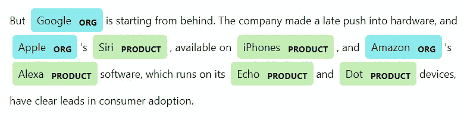
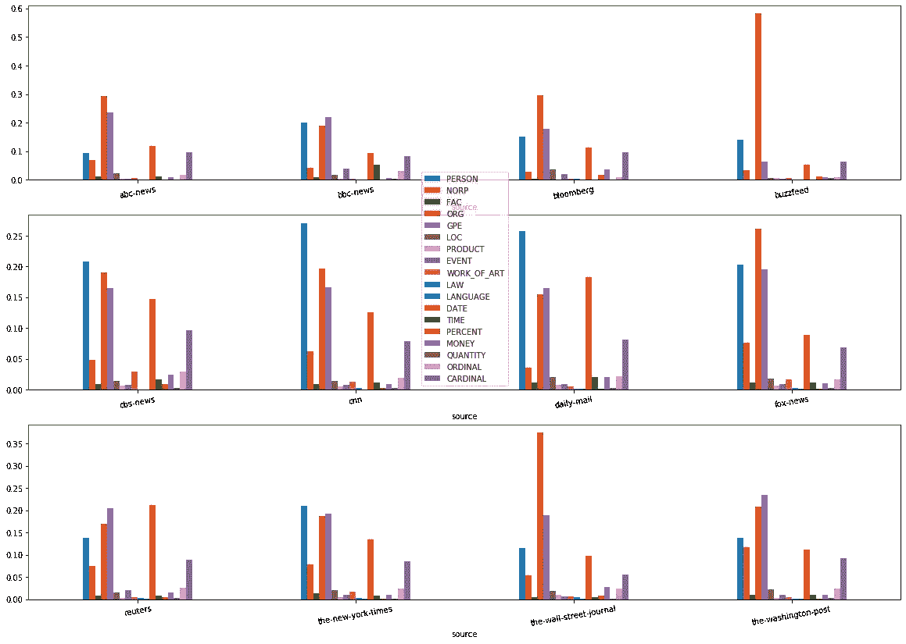
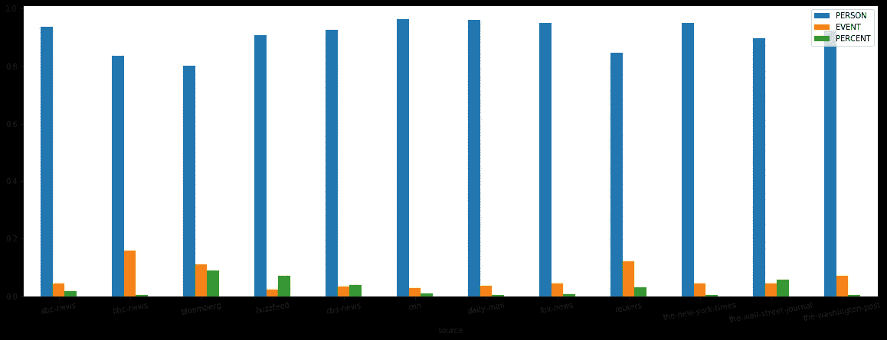
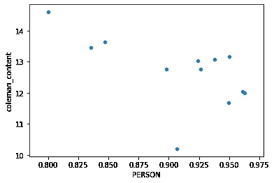
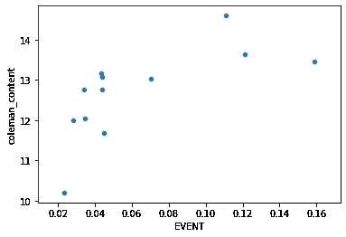
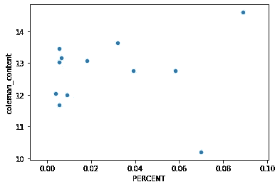
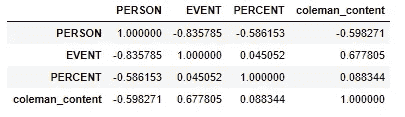
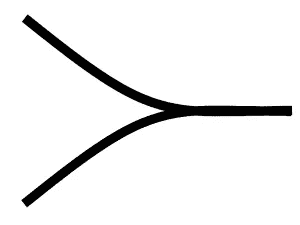
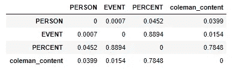
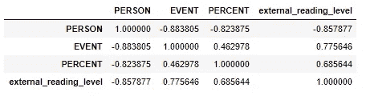

# 探索命名实体识别，埃莉诺·罗斯福是对的吗？

> 原文：<https://towardsdatascience.com/explorations-in-named-entity-recognition-and-was-eleanor-roosevelt-right-671271117218?source=collection_archive---------14----------------------->

## 使用 spaCy 自然语言处理库从新闻文章中获取洞察力


Image credit: unsplash

据说埃莉诺·罗斯福说过:

> 伟大的头脑讨论想法；普通人讨论事件；心胸狭窄的人讨论人。

虽然这可能是[的误解，](https://quoteinvestigator.com/2014/11/18/great-minds/)这种说法似乎引起了许多人的直觉共鸣，但它有多真实呢？经得起推敲吗？

有许多方法可以对此进行调查，一个有趣的方法可能是在一堆报纸中寻找**思想**、**事件**和**人物**，看看它们出现的比例是否与读者的“思想大小”(伟大、普通、渺小)相关。

为了从报纸文章中挖掘信息，我决定使用一种称为命名实体识别(NER)的自然语言处理技术，这种技术用于识别句子中称为“命名实体”的东西。命名实体是诸如产品、国家、公司、数字之类的东西。为此，我将使用自然语言处理库。下面是他们的文档中的一个例子，展示了 NER 标签的外观:



spaCy 识别以下实体:

```
PERSON:      People, including fictional.
NORP:        Nationalities or religious or political groups.
FAC:         Buildings, airports, highways, bridges, etc.
ORG:         Companies, agencies, institutions, etc.
GPE:         Countries, cities, states.
LOC:         Non-GPE locations, mountain ranges, bodies of water.
PRODUCT:     Objects, vehicles, foods, etc. (Not services.)
EVENT:       Named hurricanes, battles, wars, sports events, etc.
WORK_OF_ART: Titles of books, songs, etc.
LAW:         Named documents made into laws.
LANGUAGE:    Any named language.
DATE:        Absolute or relative dates or periods.
TIME:        Times smaller than a day.
PERCENT:     Percentage, including ”%“.
MONEY:       Monetary values, including unit.
QUANTITY:    Measurements, as of weight or distance.
ORDINAL:     “first”, “second”, etc.
CARDINAL:    Numerals that do not fall under another type.
```

可以看出，我们有人物和事件，但非常缺乏想法。为了纠正这一点，我们需要从其他人中选择一个来扮演思想的代理人。为此，我选择了百分比。这样做的原因是百分比通常是一种描述抽象概念的方式，人们在谈论例如作为一个整体的人类时使用它，而不是这个或那个人。从想法上来说，这不是一张完美的地图，但我们必须利用现有的资料。

至于读者的“思维规模”，我会选择科尔曼-廖可读性指数。这是一种量化读者必须达到何种教育水平才能理解文本的方法，使用以下公式计算:

```
Coleman_Liau = 0.0588*L–0.296*S-15.8L = Average number of letters per 100 characters
S = Average number of sentences per 100 characters
```

同样，这个类比并不完美，但希望足够好。

看起来我们已经建立了所有的方法，让我们开始处理数据吧！

# 获取和清理数据

我们将使用免费订阅的《newsapi.org》杂志提供的新闻提要。这意味着我们将获得一个**标题**，一个**描述**(文章的摘要)和文章的**内容**的前 260 个字符。我决定挑选一些主要来自美国和英国的流行英文报纸:

```
sources = ['abc-news', 'cnn', 'fox-news', 'cbs-news', 'the-new-york-times', 'reuters', 'the-wall-street-journal', 'the-washington-post', 'bloomberg', 'buzzfeed', 'bbc-news', 'daily-mail']
```

在获得数据(2019 年 6 月的 13，368 篇文章)后，我检查了这些数据，发现有几篇中文和阿拉伯文的文章会给 spaCy 带来问题。我用在 [StackOverflow](https://stackoverflow.com/questions/3094498/how-can-i-check-if-a-python-unicode-string-contains-non-western-letters) 上找到的一个函数清理了它:

```
latin_letters= {}def is_latin(uchr):
    try: 
        return latin_letters[uchr]
    except KeyError:
        try:
             return latin_letters.setdefault(
             uchr, 'LATIN' in ud.name(uchr))
        except:
            print(uchr)
            raise Exception()def only_roman_chars(unistr):
    return all(is_latin(uchr) for uchr in unistr if uchr.isalpha())
```

清理之后，我们剩下 11458 个帖子，分布在不同的来源:

```
df.groupby('source').count()['title']abc-news                   1563
bbc-news                   1076
bloomberg                    56
buzzfeed                    295
cbs-news                    780
cnn                         809
daily-mail                 1306
fox-news                   1366
reuters                     916
the-new-york-times         1467
the-wall-street-journal     590
the-washington-post        1234
```

我决定使用**描述**作为 NER 标签的基础，因为我们希望根据文章的内容来标记文章，而描述似乎是最适合的。

对于 Coleman-Liau，我们将使用**内容**，因为这样可以更好地反映文章的整体写作风格。

完成后，我们可以开始提取我们的实体:

```
ners = ['PERSON','NORP','FAC','ORG','GPE','LOC','PRODUCT','EVENT','WORK_OF_ART','LAW','LANGUAGE','DATE','TIME','PERCENT','MONEY','QUANTITY','ORDINAL','CARDINAL']# The ners we are most interested in
ners_small = ['PERSON', 'EVENT', 'PERCENT']nlp = spacy.load("en_core_web_sm")df['ner'] = df['Description'].apply(lambda desc: dict(Counter([ent.label_ for ent in nlp(desc).ents])))for ner in ners:
    df[ner] = df['ner'].apply(lambda n: n[ner] if ner in n else 0)
```

我们按来源对它们进行分组，并对它们进行标准化:

```
df_grouped_mean = df.groupby('source').mean()# Normalize 
df_grouped = df_grouped_mean[ners].div(
    df_grouped_mean[ners].sum(axis=1), axis=0)
df_grouped['coleman_content'] = df_grouped_mean['coleman_content']# Do the same for the smaller ners-set
df_grouped_small = df_grouped_mean[ners_small].div(
   df_grouped_mean[ners_small].sum(axis=1), axis=0)
df_grouped_small['coleman_content'] = 
   df_grouped_mean['coleman_content']
```

# 看着结果

```
fig, axes = plt.subplots(nrows=3, ncols=1)df_grouped[ners].iloc[:4].plot(kind='bar', figsize=(20,14), rot=10, ax=axes[0], legend=False);
df_grouped[ners].iloc[4:8].plot(kind='bar', figsize=(20,14), rot=10, ax=axes[1]);
df_grouped[ners].iloc[8:].plot(kind='bar', figsize=(20,14), rot=10, ax=axes[2], legend=False);
```



这个条形图可能有点难以解释，所以让我们来看看不同的新闻来源重点领域，或者他们拥有最多的实体:

```
focus = []for source in df_grouped[ners].values:
    focus.append(sorted([(ners[i],x) for i,x in enumerate(source)], key=lambda x: x[1], reverse=True)[:3])

df_grouped['focus'] = [' '.join([y[0] for y in x]) for x in focus]
df_grouped['focus']abc-news                          ORG GPE DATE
bbc-news                        GPE PERSON ORG
bloomberg                       ORG GPE PERSON
buzzfeed                   ORG PERSON CARDINAL
cbs-news                        PERSON ORG GPE
cnn                             PERSON ORG GPE
daily-mail                     PERSON DATE GPE
fox-news                        ORG PERSON GPE
reuters                           DATE GPE ORG
the-new-york-times              PERSON GPE ORG
the-wall-street-journal         ORG GPE PERSON
the-washington-post             GPE ORG PERSON
```

此外，让我们列出在某个主题中所占比例最大的新闻来源:

```
largest_in_topic = {}for n in ners:
    largest_in_topic[n] = list(df_grouped.sort_values(n,ascending=False).index[:3])largest_in_topic{'PERSON': ['cnn', 'daily-mail', 'the-new-york-times'],
 'NORP': ['the-washington-post', 'the-new-york-times', 'fox-news'],
 'FAC': ['the-new-york-times', 'abc-news', 'fox-news'],
 'ORG': ['buzzfeed', 'the-wall-street-journal', 'bloomberg'],
 'GPE': ['abc-news', 'the-washington-post', 'bbc-news'],
 'LOC': ['bloomberg', 'abc-news', 'the-washington-post'],
 'PRODUCT': ['the-wall-street-journal', 'daily-mail', 'buzzfeed'],
 'EVENT': ['bbc-news', 'bloomberg', 'reuters'],
 'WORK_OF_ART': ['cbs-news', 'fox-news', 'the-new-york-times'],
 'LAW': ['bloomberg', 'the-wall-street-journal', 'cnn'],
 'LANGUAGE': ['bbc-news', 'fox-news', 'the-new-york-times'],
 'DATE': ['reuters', 'daily-mail', 'cbs-news'],
 'TIME': ['bbc-news', 'daily-mail', 'cbs-news'],
 'PERCENT': ['bloomberg', 'buzzfeed', 'cbs-news'],
 'MONEY': ['bloomberg', 'the-wall-street-journal', 'cbs-news'],
 'QUANTITY': ['buzzfeed', 'bbc-news', 'cnn'],
 'ORDINAL': ['bbc-news', 'cbs-news', 'reuters'],
 'CARDINAL': ['bloomberg', 'cbs-news', 'abc-news']}
```

这里有一些有趣的事情需要注意:

*   几乎每个人都喜欢谈论国家、公司和人物。
*   正如所料，华尔街日报和彭博喜欢金钱和组织。
*   路透社喜欢精确日期。

如果我们只看较小的 NER 集，我们得到:



好的，看起来不错。是时候计算一下科尔曼-廖指数了。为此，我们需要能够分解成句子，这比我们想象的要困难得多。我将使用来自 [StackOverflow](https://stackoverflow.com/questions/4576077/python-split-text-on-sentences) 的函数:

```
import re
alphabets= "([A-Za-z])"
prefixes = "(Mr|St|Mrs|Ms|Dr)[.]"
suffixes = "(Inc|Ltd|Jr|Sr|Co)"
starters = "(Mr|Mrs|Ms|Dr|He\s|She\s|It\s|They\s|Their\s|Our\s|We\s|But\s|However\s|That\s|This\s|Wherever)"
acronyms = "([A-Z][.][A-Z][.](?:[A-Z][.])?)"
websites = "[.](com|net|org|io|gov)"

def split_into_sentences(text):
    text = " " + text + "  "
    text = text.replace("\n"," ")
    text = re.sub(prefixes,"\\1<prd>",text)
    text = re.sub(websites,"<prd>\\1",text)
    if "Ph.D" in text: text = text.replace("Ph.D.","Ph<prd>D<prd>")
    text = re.sub("\s" + alphabets + "[.] "," \\1<prd> ",text)
    text = re.sub(acronyms+" "+starters,"\\1<stop> \\2",text)
    text = re.sub(alphabets + "[.]" + alphabets + "[.]" + alphabets + "[.]","\\1<prd>\\2<prd>\\3<prd>",text)
    text = re.sub(alphabets + "[.]" + alphabets + "[.]","\\1<prd>\\2<prd>",text)
    text = re.sub(" "+suffixes+"[.] "+starters," \\1<stop> \\2",text)
    text = re.sub(" "+suffixes+"[.]"," \\1<prd>",text)
    text = re.sub(" " + alphabets + "[.]"," \\1<prd>",text)
    if "”" in text: text = text.replace(".”","”.")
    if "\"" in text: text = text.replace(".\"","\".")
    if "!" in text: text = text.replace("!\"","\"!")
    if "?" in text: text = text.replace("?\"","\"?")
    text = text.replace(".",".<stop>")
    text = text.replace("?","?<stop>")
    text = text.replace("!","!<stop>")
    text = text.replace("<prd>",".")
    sentences = text.split("<stop>")
    sentences = sentences[:-1]
    sentences = [s.strip() for s in sentences]
    return sentences
```

进行计算:

```
def calculate_coleman(letter_count, word_count, sentence_count):
    return 0.0588 * letter_count*100/word_count - 0.296 *   
           sentence_count*100/word_count - 15.8df['coleman'] = df['split_content'].apply(lambda x: calculate_coleman(
    len(' '.join(x).replace(' ', '').replace('.', '')),
    len([y for y in ' '.join(x).replace('’', '').split() if not y.isnumeric()]),
    len(x)))df_grouped['coleman'].sort_values(ascending=False)bloomberg                  14.606977
reuters                    13.641115
bbc-news                   13.453002
fox-news                   13.167492
abc-news                   13.076667
the-washington-post        13.025180
the-wall-street-journal    12.762103
cbs-news                   12.753429
daily-mail                 12.030524
cnn                        11.988568
the-new-york-times         11.682979
buzzfeed                   10.184662
```

这有点令人惊讶；举例来说，我本以为《纽约时报》会更高一点，但从另一方面来看，这可能是对的。如果我有超过 260 个字符的内容，这可能会更准确，但下一层的 newsapi 是 449 美元/月。只是为了确保稍后我会对照[外部源](http://www.adamsherk.com/publishing/news-sites-google-reading-level/)再次检查可读性分数。

# 寻找相关性

让我们根据人员、事件和百分比绘制可读性图:



有趣的是，实际上似乎有一点关联，至少在人和事件上。让我们计算相关分数:

```
df_grouped_small.corr()
```



看看 coleman_content 专栏，埃莉诺·罗斯福(Eleanor Roosevelt)的话可能真的有些道理！至少在科尔曼-廖和人之间存在负相关，而在科尔曼-廖和事件之间存在正相关。

由于事件是为“普通”人设计的，我们预计散点图会移动到高事件值的中间，如下所示:



虽然这不是我们真正看到的，但人/事的负/正相关性仍然为引用提供了一些可信度。

当然，这要用一桶盐来吃。除了到目前为止我们所做的所有让步，我们没有足够的样本来达到统计学意义。实际上，我们来看看 p 值(来自 [StackOverflow](https://stackoverflow.com/questions/25571882/pandas-columns-correlation-with-statistical-significance) 的函数):

```
from scipy.stats import pearsonrdef calculate_pvalues(df):
    df = df.dropna()._get_numeric_data()
    dfcols = pd.DataFrame(columns=df.columns)
    pvalues = dfcols.transpose().join(dfcols, how='outer')
    for r in df.columns:
        for c in df.columns:
            pvalues[r][c] = round(pearsonr(df[r], df[c])[1], 4)
    return pvaluescalculate_pvalues(df_grouped_small)
```



正如所料，p 值很低，除了百分比。

由于计算出的 Coleman-Liau 等级似乎有点偏差，我决定用以下可读性等级进行测试，这些等级摘自[http://www . adamsherk . com/publishing/news-sites-Google-reading-level/](http://www.adamsherk.com/publishing/news-sites-google-reading-level/)

```
reading_level = {'abc-news': (41,57,1),'cnn': (27,69,2),
   'fox-news': (23,73,2),'cbs-news': (28,70,0),
   'the-new-york-times': (7,85,7),'reuters': (6,85,7),
   'the-wall-street-journal': (9,88,2),
   'the-washington-post': (24,72,2),'bloomberg': (6,81,11)}
```

他们给出了 3 个值(初级、中级、高级)，我用不同的权重(-1，0，1)来计算一个值。

```
df_grouped_small['external_reading_level'] = df_grouped_small.index.map(
    lambda x: reading_level[x][2]-reading_level[x][0] if x in reading_level else 0)
```

看看这种相关性

```
df_grouped_small[df_grouped_small['external_reading_level'] != 0][ners_small + ['external_reading_level']].corr()
```



我们发现相关性和我们之前得到的相似，除了我们实际上和百分比有更高的正相关性。

# 结论

我们的结果表明，引用的话实际上可能有一定的真实性，但统计意义如此之低，以至于需要进一步的研究。此外，事实证明，无论思想的大小，人们都喜欢谈论别人，非常喜欢。即使是最聪明的新闻(彭博，高得 14.6 分)谈论人的次数也是谈论事件或百分比的 7 倍。

观察柱状图，另一件突出的事情是报纸在内容选择上是多么的相似。因此，尽管人们的利益有所不同，但最终我们的相似之处要多于不同之处。