# 自杀数据的探索性分析

> 原文：<https://towardsdatascience.com/exploratory-analysis-on-suicide-data-bc772a5ca69a?source=collection_archive---------12----------------------->


Foto de [Ben Hershey](https://unsplash.com/photos/8-fHqPCNy4c?utm_source=unsplash&utm_medium=referral&utm_content=creditCopyText) em [Unsplash](https://unsplash.com/search/photos/suicide?utm_source=unsplash&utm_medium=referral&utm_content=creditCopyText)

# 介绍

年复一年，自杀似乎变得越来越普遍。我自己，才 25 岁，我有一个熟人在大学期间自杀了。这一周，我在 Kaggle 附近闲逛，发现了一组关于自杀的数据。当时我想做一些分析，试图更好地理解这个主题。所以现在，在这篇文章中，我提出这个简短的评论。

如果有人也想“玩”这个数据集，只需通过[链接](https://www.kaggle.com/russellyates88/suicide-rates-overview-1985-to-2016)获得 kaggle。

我不会把我用来做可视化的所有代码(它在 [GitHub](https://github.com/lmeazzini/Suicidal-analysis) 中)放在这里，并提出数据集可能回答的问题。但在试图理解这些数据之前，我先简单解释一下这些数据里有什么。

# 数据描述

数据集中的每个数据代表一个年份、一个国家、一个特定的年龄范围和一个性别。例如，在巴西，1985 年，75 岁以上的人中，有 129 人自杀。

数据集有 10 个属性。这些是:

*   国家:记录数据的国家；
*   年份:记录数据的年份；
*   性别:性别(男或女)；
*   年龄:自杀年龄范围，年龄分为六类；
*   自杀 _ 否:自杀人数；
*   人口:这一性别、这一年龄范围、这一国家和这一年的人口；
*   自杀人数/ 100k pop:自杀人数与人口/ 100k 之间的原因；
*   GDP_for_year:世界卫生组织发布的当年国内生产总值；
*   人均国内生产总值:该国国内生产总值与其人口之间的比率；
*   世代:问题中的自杀世代，可能有 6 个不同的类别。

可能的年龄类别和世代是:

```
df['age'].unique()array(['15-24 years', '35-54 years', '75+ years', '25-34 years',
       '55-74 years', '5-14 years'], dtype=object)
```

可能的代是:

```
df['generation'].unique()array(['Generation X', 'Silent', 'G.I. Generation', 'Boomers',
       'Millenials', 'Generation Z'], dtype=object)
```

最初，数据集显示了各国的人类发展指数，但绝大多数数值都是空的。由于我想分析一个国家的发展对自杀人数的影响，所以我在数据中增加了一栏。我去了[网站](http://worldpopulationreview.com)，我取了所有被认为是第一和第二世界的国家的名字，我用这些信息将我们的数据集的数据分为三类。第一、第二和第三世界。

```
Frist_world = ['United States', 'Germany', 'Japan', 'Turkey', 'United Kingdom', 'France', 'Italy', 'South Korea',
              'Spain', 'Canada', 'Australia', 'Netherlands', 'Belgium', 'Greece', 'Portugal', 
              'Sweden', 'Austria', 'Switzerland', 'Israel', 'Singapore', 'Denmark', 'Finland', 'Norway', 'Ireland',
              'New Zeland', 'Slovenia', 'Estonia', 'Cyprus', 'Luxembourg', 'Iceland']Second_world = ['Russian Federation', 'Ukraine', 'Poland', 'Uzbekistan', 'Romania', 'Kazakhstan', 'Azerbaijan', 'Czech Republic',
               'Hungary', 'Belarus', 'Tajikistan', 'Serbia', 'Bulgaria', 'Slovakia', 'Croatia', 'Maldova', 'Georgia',
               'Bosnia And Herzegovina', 'Albania', 'Armenia', 'Lithuania', 'Latvia', 'Brazil', 'Chile', 'Argentina',
               'China', 'India', 'Bolivia', 'Romenia']country_world = []
for i in range(len(df)):

    if df['country'][i] in Frist_world:
        country_world.append(1)
    elif df['country'][i] in Second_world:
        country_world.append(2)
    else:
        country_world.append(3)df['country_world'] = country_world
```

现在，最后，让我们来探索一下。

# 探索数据

我会试着提出问题，并通过图表定量回答。这一部分所做的每一个分析都是指整个世界。

> 这些年来，自杀人数增加了吗？

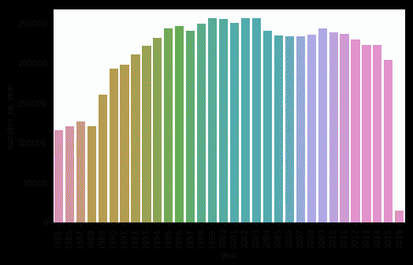

由于数据一直持续到 2016 年，这张图表表明，当数据被收集时，2016 年才刚刚开始。此外，我们可以看到，从 1988 年到 1990 年，自杀人数大大增加。此外，这一数字在最近几年似乎以预期的方式增长并略有下降，这可能是由于最多样化的自杀预防运动。

> 谁更倾向于自杀？青少年？成年人？长辈？

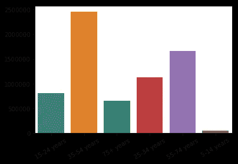

嗯，看起来成年人肯定会更多地自杀，但这有什么意义呢？从数据来看，我们没有信息可以回答。但是我想这是一个患抑郁症和类似疾病的常见年龄。

> 性呢？男人和女人谁自杀更多？

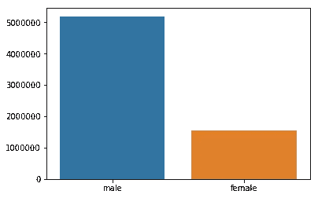

> 当然，男人。这种模式会在所有年龄段重复吗？

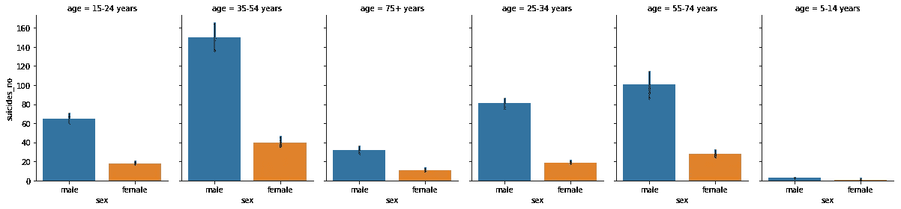

是的，男性自杀率远远高于女性，甚至在 14 岁之前。

> 有自杀率更高的国家吗？

人口越多的国家自杀率越高，这是一种自然趋势，我使用了根据该国人口标准化的自杀数量字段。这样，每 10 万居民中的自杀人数就被计算出来了。

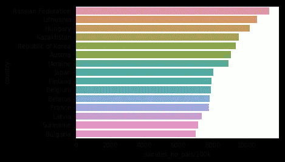

尽管自杀人数的差异不是很大，但还是有一些国家表现突出，比如俄罗斯和立陶宛。

> 而这一代人，他们在某些方面也有影响吗？


婴儿潮一代、沉默一代和 X 一代是由 1976 年以前出生的人组成的。这些人处于大多数自杀发生的年龄范围。只需查看处理年龄段的图表。

> 然而，一个国家的发展呢，它改变了什么吗？

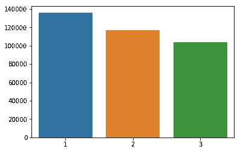

越发达的国家自杀率越高。这可以用各种各样的理论来证明，比如过度工作、宗教问题、精神病发病率等等。

> 至于人均 GDP，有影响吗？

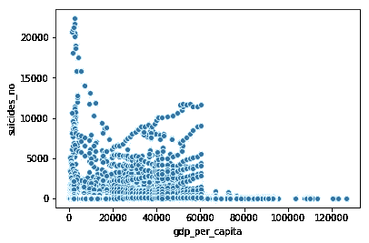

显然，在贫困地区，自杀率很高。收入增加，自杀一起减少。但是，从一个点(~ 20k)开始，自杀倾向再次增加。显然，数据显示在 60k 范围内有一些缺陷。

> 数据集属性之间有关联吗？

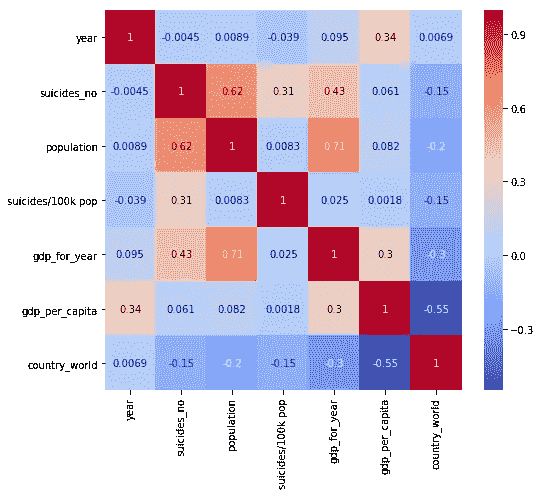

人口和 GDP 之间的相关性最高，因为一般来说，富裕国家的人口更多。同样，在自杀人数和人口之间，如果人口越多，自杀人数就越多。人均国内生产总值与世界各国之间呈负相关，因为第一世界国家收入较高，而第三世界国家收入较低。

> 当我们改变国家时，自杀的分布会有变化吗？

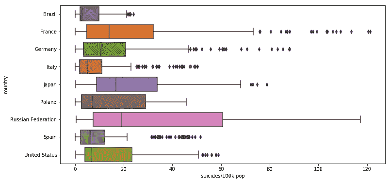

我选择了一些国家，它们的指数可能会揭示一些有趣的东西。请注意，我使用的是每 10 万居民的自杀人数。在这种情况下，巴西自杀人数的分布比其他国家更好，异常值较少，与其他国家相比，分布集中在低值。而像俄罗斯这样的国家，它的分布要分散得多，有几个自杀率很高的点。

# 巴西数据

因为巴西在这些数据中，而且因为我是巴西人，我对巴西的自杀数据特别感兴趣。所以我试着分析一下这个国家的具体费率。

> 自杀人数如何随时间变化？

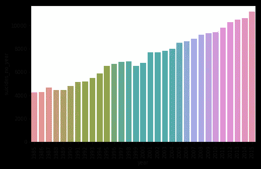

显然，和世界上其他地方很不一样。由于巴西是一个发展中国家，看起来更像贫穷国家的自杀率正在上升到更发达国家的水平。

> 在巴西，成年人的自杀率也比较高吗？

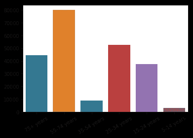

显然，35-54 岁年龄段的世界自杀记录保持者并不在巴西。这一代人是婴儿潮一代。

# 结论

在这篇文章中，想法是对自杀数量的数据进行定量的探索性分析。总的来说，我们可以看到，这些数据显示了我们在报纸、电视等媒体上看到的东西，在我看来，我得出的大多数结论都是可以预测的；只是想象了更多的青少年自杀，这在数据中看不到。

我尽量不从人口统计学、社会和经济的角度来解释这些图表，保持文章的中立。然而，对于可用的数字可能有几种解释。

其中一个以流行的现成而似是而非的短语形式出现的反映是:

> 自杀越多，自杀越少

我认为，从上面可以定量地确定这一说法的真实性。

GitHub 上提供了用于生成图表、数据集和其他一些东西的所有代码。

[](https://github.com/lmeazzini/Suicidal-analysis) [## lmeazzini/自杀分析

### 1985-2016 年自杀数据分析。通过创建一个…

github.com](https://github.com/lmeazzini/Suicidal-analysis)