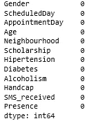
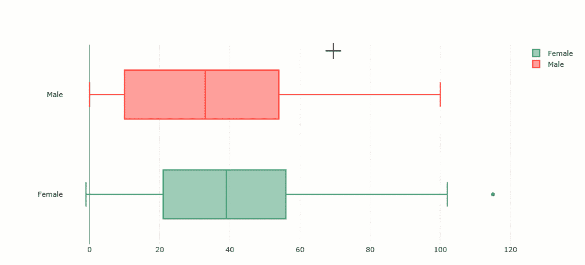
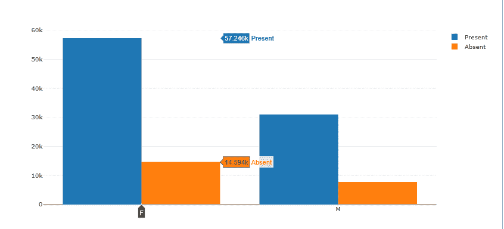

# 用 Python 进行探索性数据分析:医疗预约数据

> 原文：<https://towardsdatascience.com/exploratory-analysis-python-kaggle-data-b0afb6ec1788?source=collection_archive---------4----------------------->

> “探索性数据分析”是一种态度，一种灵活的状态，一种寻找我们认为不存在的东西以及我们认为存在的东西的意愿。"

## 介绍

这些文字被认为属于一位杰出的美国数学家——约翰·图基。由于他贡献了几十个关于**收集**和**分析**数据的方法的绝妙想法，他在统计学的发展中发挥了关键作用。除此之外，他首先引入了'**探索性数据分析** ' (EDA)术语。

让我们来看看这个术语背后隐藏的含义。

# 什么是 EDA

**探索性数据分析** (EDA)是一套方法，包括单变量、双变量和多变量可视化技术、降维、聚类分析。

EDA 的*主要目标*是获得对数据的**全面理解**并引起对其最重要特征的注意，以便为应用更高级的分析技术和输入到**机器学习**算法中做准备。此外，它有助于生成关于数据的假设，检测其异常并揭示其结构。

***你永远不应该忽视数据探索***——跳过任何数据科学或机器学习项目的这个重要阶段，都可能导致生成不准确的模型或错误的数据分析结果。

在探索过程中，你应该从尽可能多的角度来看你的数据，因为魔鬼总是在细节中。

## 使用了哪些 EDA 技术

绘图技术对人类思维来说是最自然的，因此，绘图不应该被低估。这些技术通常包括使用*盒须图、直方图、滞后图、标准差图、帕累托图、散点图、条形图和饼图、小提琴图、相关矩阵*等来描述数据。

## 动机

本教程的**目标**是分享我在开始预测分析项目之前探索和可视化数据的经验。我希望能激发你对数据的洞察力，也希望图基鼓励统计学家更多地关注这种方法。

## 第一步。定义你的目标

在开始一个新的数据可视化项目之前，了解你的长期目标至关重要。

今天我们将使用包含患者预约信息的[医疗预约号显示](https://www.kaggle.com/joniarroba/noshowappointments)数据集。

每个患者的记录具有以下特征:

*   患者 id——患者的唯一标识符
*   约会 ID —约会的唯一标识符
*   性别
*   ScheduledDay —计划进行约会的一天。
*   约会日——约会的真实日期
*   年龄——患者的年龄。
*   邻居——每个患者的邻居
*   奖学金——患者获得奖学金了吗？
*   高血压——患者有高血压吗？
*   糖尿病
*   酗酒
*   障碍
*   SMS_received —患者收到短信提醒了吗？
*   No_show —患者决定不露面了吗？

我们的目的是了解**为什么**接受治疗指导的人没有在下一个预约时间出现。换句话说，错过约会的促成因素是什么？

但这是长远目标。在深入挖掘之前，我们应该尝试回答以下问题:

*   错过约会的人和没错过约会的人的比例是多少？
*   谁不经常出现——男人还是女人？
*   不露面最流行的月份/日子/小时是什么？
*   患者年龄分布是怎样的？

这个列表并不完整——你可以*在分析过程中想到的其他问题*来扩展它。

## 准备您的工作空间

在本教程中，我们将尝试用 Python 可视化数据。我假设您知道如何使用基本的 Python 库。让我们导入处理数据所需的文件:

我们将使用 [**Plotly**](https://plot.ly/) 作为主要图表库。这是一个开源的 Python 包，它扩展了 d3.js 和 stack.gl 的功能，并提供了可以满足任何项目要求的复杂图表。由于是高级的，Plotly 使用起来更方便，因此我更喜欢它而不是 matplotlib。

我非常欣赏的另一件事是它用图表探索数据的交互性。

我们将离线使用它，这样就不会创建一个帐户，并且在尝试构建图表时受到限制。

## 读取数据

从 Kaggle 下载数据后，下一步是基于 CSV 数据构建熊猫数据框架。这里有一个[教程](https://realpython.com/python-csv/)，它会让你对和熊猫一起工作感到舒服。

让我们删除一些不需要的列，以便加快数据处理速度:

## 分析数据

在清理数据之前，让我们检查一下数据的质量和每一列的数据类型。

Information about the dataframe

在这里，您还可以检查数据帧使用的内存数量。

使用`head()`方法显示数据帧的前五行:

使用`.shape`属性检查样本和特征的总数:

我们有 110527 个记录和 12 个特征。

## 清理和准备数据

*清理数据是一门艺术*，在开始任何数据科学或机器学习项目之前，都应该首先掌握它。它使数据更容易研究和构建可视化。

在您检查了功能的**数据类型**之后，您可能已经注意到“日程安排日”和“约会日”功能有一个“对象”数据类型。

为了便于处理日期特征，让我们将“日程安排日”和“约会日”的类型*转换为*日期时间 64[ns]* 。您需要它来访问有用的方法和属性。*

另一种方法是在读取数据时转换列的类型。

为此，将应被视为日期列的列名列表传递给“read_csv”方法的“parse _ dates”参数。这样，它们将以可读的方式格式化:

此外，将字符串数据类型转换为分类数据类型也是一个好主意，因为这种数据类型可以通过缩小数据框架来帮助您节省一些内存。分类变量的内存使用与分类数量+数据长度成比例。

此外，大多数统计 Python 库将分类列视为分类变量。

有时数据可能不一致。例如，如果预约日期早于预定日期，那么就有问题了，我们需要交换他们的值。

## 美化列名

您可能已经注意到我们的功能包含键入错误。

*我们来重命名拼错的列名:*

或者，您可以将“未显示”列重命名为“存在”，将其值重命名为“存在”和“不存在”，以避免任何误解。

现在，我们的数据集既整洁又准确，让我们继续用新的功能扩展数据集。

## 特征工程

我们可以向数据集中添加一个新功能-“等待时间天数”，以检查患者需要等待预约日期的时间。

另一个新功能可能是“WeekDay”——约会的工作日。有了这个功能，我们可以分析人们不常出现的日子。

同样，添加“月”、“小时”功能:

## 处理缺失的值

让我们以这种优雅的方式检查每一列中是否有空值:

或者，如果您想检查单个列是否存在空值，您可以这样做:

我们很幸运——我们的数据集中没有空值。

> **但是，解决缺失值的策略是什么呢？**

通过分析现有的技术和方法，我得出结论:处理缺失数据的最流行策略是:

*   让他们保持原样。
*   用`dropna()`将其移除。
*   用`fillna()`填充 NA/NaN 值。
*   用期望值(平均值)或零替换缺失值。
*   如果缺失值的数量超过某个阈值(例如>值的 50%)，则删除列。

## **探索数据集**

一旦你清理了数据，是时候更深入地检查它了。

执行以下步骤:

*   检查所有列中的唯一值

*   看一看数字特征的基本统计数据:

## **标图数据**

*   按性别检查患者分布。

用于*可视化比例*的最佳图表是饼图、圆环图、树形图、堆积面积图和条形图。让我们使用一个饼图:

*   检查有多少人没有在约会日期出现:

很明显，只有 20.2%的患者没有出现，而 79.8%的患者在预约日出现。

*   测量“年龄”数据的可变性。

一个**盒&须状图**最好地处理这个任务:

通过这个交互图，可以看到数据的中间四分位数(**中位数**)是 **37** 。

这意味着 50%的患者年龄小于 37 岁，另外 50%的患者年龄大于 37 岁。

**上四分位数**表示 75%的年龄值低于 **55** 。**下四分位数**表示 25%的年龄值低于 **18** 。

从下到上四分位数的年龄值范围被称为**四分位数间距**。从图中可以得出结论，50%的患者年龄在 18 岁到 55 岁之间。

如果你看一下**胡须**，你会找到最大值(不包括异常值)也就是 **102** 。

我们的数据只包含一个异常值——一个年龄为 **115** 的患者。最低值为 0，这是很有可能的，因为患者可能是小孩。

该图允许获得的另一个洞见是，由于箱形图不对称，数据明显**正向偏斜**。四分位数 3 —四分位数 2 >四分位数 2 —四分位数 1。

*   检查那些出现和没有出现的人的年龄的四分位数范围。

为此，我们可以使用相同的盒状图，但它是按“存在”列分组的。

*   分析男性和女性的年龄范围:

*   按性别检查出现和不出现的频率

*   人们在哪些工作日最不经常出现:

你可以看到人们通常不会在周二和周三出现。

## 下一步是什么

稍后可应用于该数据的可能技术:

*   *无监督 ML 技术*，即 KMeans 聚类或层次聚类(但别忘了缩放特征！).聚类可能有助于了解哪些患者群体具有共同的特征。
*   分析哪些变量对“不露面”一栏有解释力。

## **把所有的东西放在一起**

暂时就这样吧！您已经完成了对数据集的探索，但您可以继续揭示见解。

希望这个简单的项目有助于理解 EDA 的基本概念。我鼓励你*尝试用数据*和不同类型的可视化来找出获取最大数据的最佳方式。

## **反馈**

反馈的重要性不能被高估。我想掌握我分析数据的技能，所以我很高兴听到你的反馈、想法和建议。