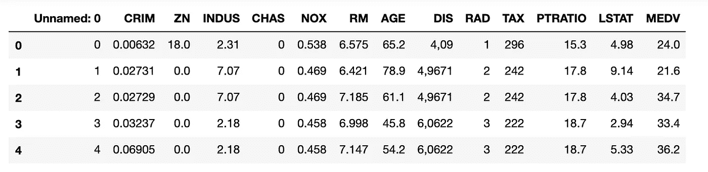
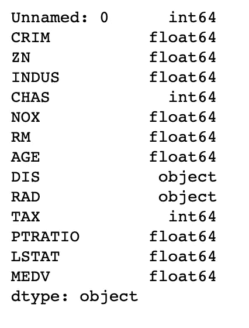
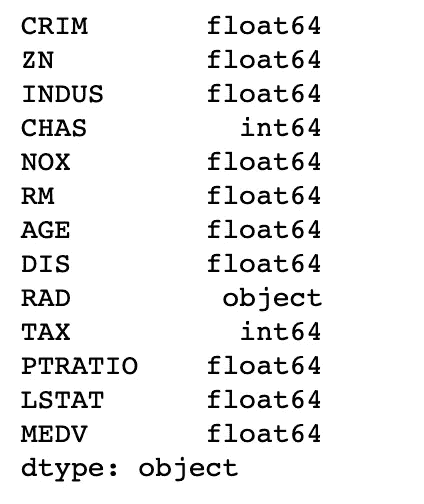
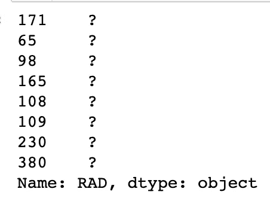
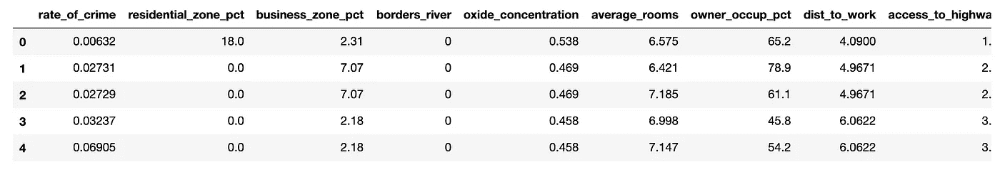
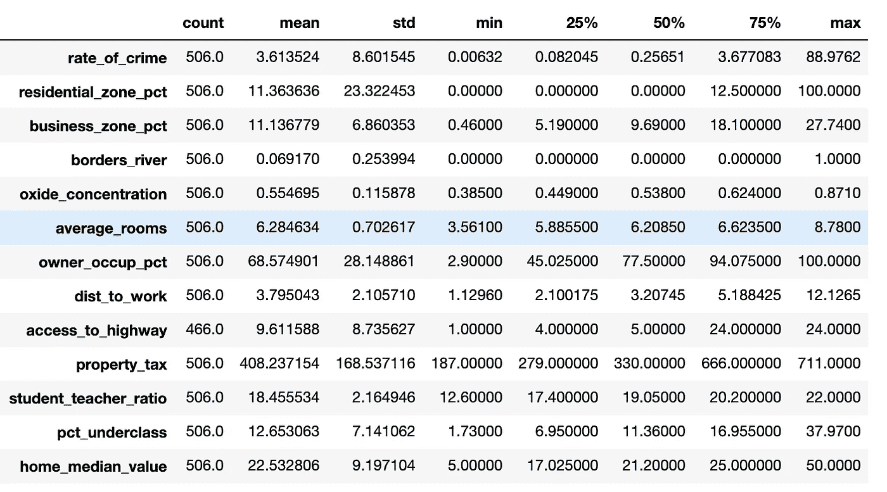
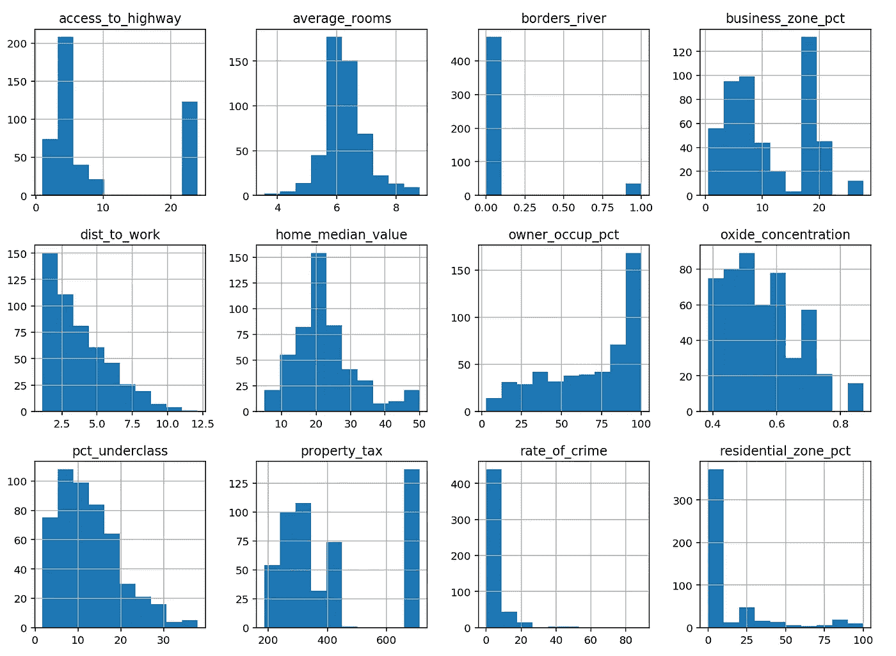
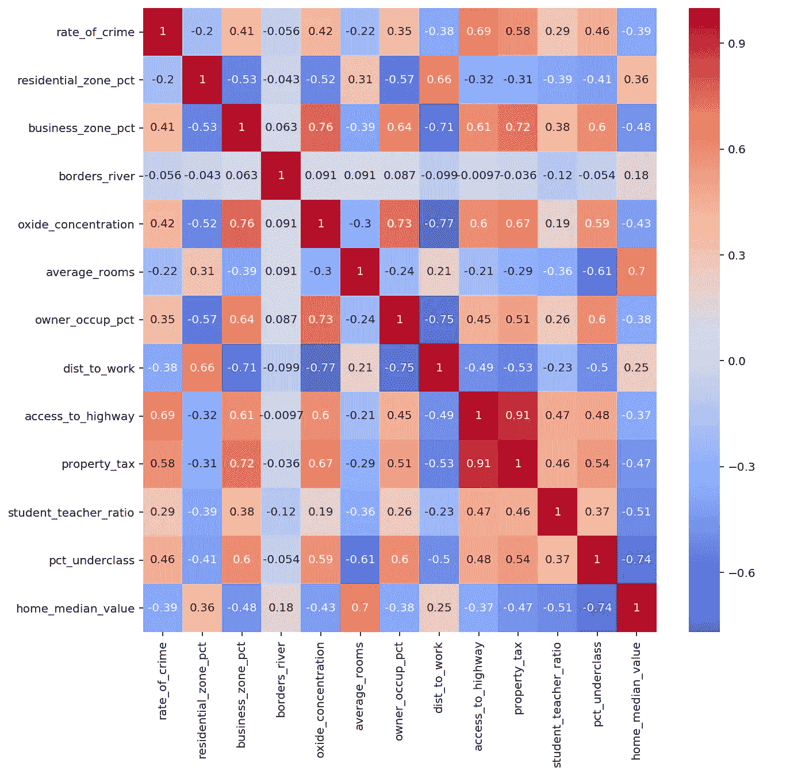

# 探索性数据分析:

> 原文：<https://towardsdatascience.com/exploratory-data-analysis-an-illustration-in-python-9926816d2556?source=collection_archive---------6----------------------->

## Python 中的插图


Photo by [James Harrison](https://unsplash.com/@jstrippa?utm_source=medium&utm_medium=referral) on [Unsplash](https://unsplash.com?utm_source=medium&utm_medium=referral)

数据科学家的工作流程可以分为六个部分:

*   定义问题
*   收集数据
*   探索数据
*   用数据建模
*   评估模型
*   回答问题

这个工作流程不是一个线性过程。在许多情况下，它涉及到整个过程不同部分之间的多次往返。

我曾经听一位数据科学家说过，数据探索应该是数据分析师或其他底层人员的角色；数据科学家的角色应该是建立和评估模型。真的是这样吗？数据科学家应该擅长调整模型，却不擅长管理和清理数据吗？建立和使用复杂的机器学习模型的能力非常强大。但是必须指出，该过程的某些部分可以(并且已经)自动化。我无法证明流程的哪个部分应该获得最大的权重(想想常见的 0.8 比 0.2 规则)。然而，我将提出一个问题，并提供基本的演练，以解决您在旅途中可能遇到的类似问题。

几年前，我在一家公司工作，该公司维护着 200 多个数据库，并向许多客户提供时间序列数据。我亲眼看到了数据收集和输入的过程，我很快意识到这比我最初想象的要复杂得多。*这个过程，即使是由机器或者非常细致的人来完成，* *也是容易出错的*。因此，这些数据集的消费者(即使在他们经历了质量控制过程之后)拥有的数据可能传达不准确或错误的信息。这可能会给决策者和利益相关者带来破坏性后果。因此，数据科学家必须*“审查数据”*然后才能为其拟合任何模型。

在这里，我提出了一个基本的探索性数据分析(EDA ),它可以在处理“有趣”的东西之前执行。

# 导入工具包

我们从导入一些 Python 包开始。这些将作为有效 EDA 的工具箱:

```
import numpy as np
import seaborn as sns
import matplotlib.pyplot as plt
import pandas as pd %config InlineBackend.figure_format = 'retina'
%matplotlib inline
```

在这个例子中，我们将使用[波士顿住房数据集](https://www.kaggle.com/c/boston-housing/data)(之后用它练习并说服自己)。让我们将数据加载到我们的工作区，并查看前五行(记住 Python 索引是从 0 开始的)。

# 加载并检查数据

```
df = pd.read_csv(boston_file)df.head()
```



First five rows of the Boston housing data

接下来，您想要检查数据的结构和格式:

```
df.isnull().sum() # returns the sum of missing values across columnsdf.shape # returns a matrix of *i* rows and *j* columns.df.dtypes
```



# 解决异常情况

我们立即从这次检查中注意到一些事情。首先，第一列似乎是索引的重复。在没有数据字典的情况下，我们可以有把握地假设这是事实。让我们放弃这个专栏:

```
df.drop(columns = ['Unnamed: 0'])
```

包含作为方法`inplace=True`的参数的一部分，以将更改永久应用于数据。

其次，`DIS`和`RAD`变量的格式不正确。我们从上面显示的表格中了解到这一点。让我们从解决最明显的问题开始:`DIS`特性。该列中的值包含一个字符串字符`','`。这将导致 Python 将数字数据读取为 pandas 对象数据类型。我们可以使用[地图功能](https://pandas.pydata.org/pandas-docs/stable/reference/api/pandas.Series.map.html)来处理这个问题:

```
df['DIS'] = df['DIS'].map(lambda dis_cell: dis_cell.replace(',', '.'))df['DIS'] = df['DIS'].astype(float)
df.dtypes
```



瞧，问题解决了！

另一方面,`RAD`变量需要更多一点的探测。目前还不清楚是什么导致这些值以这种方式被读取。

```
df['RAD'].sort_values(ascending= False).head(8)
```



好了，我们找到罪犯了。我们可以使用与处理`DIS`案例相似的流程来处理这个问题。请注意，在我们替换这个字符串字符后，我们现在会有一些丢失的数据。这些可以是[丢弃的](https://pandas.pydata.org/pandas-docs/stable/reference/api/pandas.DataFrame.dropna.html)或[估算的](https://pandas.pydata.org/pandas-docs/stable/reference/api/pandas.DataFrame.fillna.html)。这是数据科学家需要根据其领域知识、寻求解决的问题或直觉做出判断的许多次中的一次。

# 更改列名

现在，假设您正在一个团队中工作，该团队的成员的任务是向非技术观众或不知道每列代表什么的成员展示数据的发现。您可能希望使列名更具描述性。方法如下:

```
new_columns_names = {
        'CRIM':'rate_of_crime',
        'ZN':'residential_zone_pct',
        'INDUS':'business_zone_pct',
        'CHAS':'borders_river',
        'NOX':'oxide_concentration',
        'RM':'average_rooms',
        'AGE':'owner_occup_pct',
        'DIS':'dist_to_work',
        'RAD':'access_to_highway',
        'TAX':'property_tax',
        'PTRATIO':'student_teacher_ratio',
        'LSTAT':'pct_underclass',
        'MEDV':'home_median_value'
    }df.rename(columns = new_columns_names, inplace=True)df.head()
```



8 out of 13 columns displayed here.

坚持住，我们即将结束这次基本演练！！

现在，我们想更深入一点，看一看对数据更简洁的描述:

```
df.describe().T        #returns a description in transposed matrix
```



这个简单的方法返回了一个很好的数据摘要。我们现在可以访问每个数字列的有用统计数据，例如平均值、中值(50%)、最小值和最大值(用于观察异常值)、计数(用于发现缺失值)等等。

# 绘制数据

在数字挣扎的地方，图表更胜一筹。面对现实吧，数字可能很无聊。听一个 ***只有*** 用数字讲故事的主持人很难，即使是对于我们这些量化的朋友。

不要用统计学术语说话，给他们看！一个很好的起点是使用直方图查看数据的分布:

```
df.hist(figsize = (14,14)) 
```



最后，根据您寻求解决的问题，您可能希望检查变量之间的相关性。这在执行线性回归时尤其重要。

```
plt.figure(figsize=(12, 12))
sns.heatmap(df.corr(), annot = True, cmap = 'coolwarm')
```



我们有一个(皮尔逊)相关矩阵，用直观的热图呈现。还是那句话，不要只用数字！

另外，你可能想要绘制其他类型的图来检查关系，找出异常值，并确定目标变量和预测变量的基本分布。

# 结束语

如前所述，与数据科学家的其他工作流程一样，EDA 组件也不是线性的。它涉及多次迭代；我的经验告诉我，这是一个循环过程。

这个演示是一个简单的 EDA，可以在大多数数据集上实现；它当然不是详尽无遗的，但是，它是有用的。用数据弄脏你的手！假设没有一个数据集是干净的，直到你梳理过它。如果你的目标是生产高性能的模型，这部分过程是必不可少的。正如乔治·富克斯尔所说，“垃圾进来，垃圾出去”。