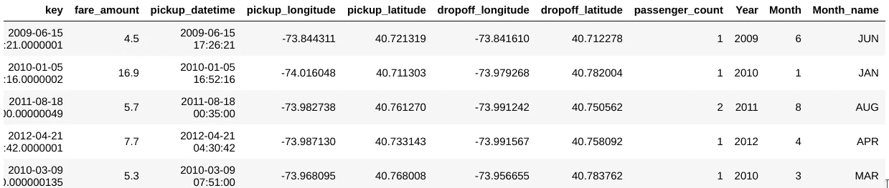

# 探索性数据分析，分类数据—第二部分

> 原文：<https://towardsdatascience.com/exploratory-data-analysis-categorical-data-part-ii-5de835850f0f?source=collection_archive---------13----------------------->


*“想出新功能很困难，很耗时，需要专业知识。‘应用机器学习’基本上是特征工程。”*

*—吴恩达教授。*

数据科学家花费将近 75%的时间来分析数据和工程特性，这确实是一个困难且耗时的过程。他们需要领域知识和数学计算。

探索性数据分析和特征工程是选择、描绘和转换数据为特征的过程，这些特征可以作为机器学习模型的输入来进行预测。我们应该记住，好的质量特性总是有助于提高整体模型性能。很多时候，即使机器学习任务在不同的场景中可以是相同的，但是在分析每个场景中的数据之后提取的特征将会彼此不同。


上述数据集具有特征*“预测 _ 类别”*，该特征基于在特征*“清洁 _hm”中呈现的人的陈述来检测该人的情绪。"* **原始特征"**直接从数据集中获得，无需额外的数据操作或工程，而"**衍生特征"**从特征工程中获得，其中我们从现有数据属性中提取特征。

```
nycdata = pd.read_csv(“train.csv”)
nycdata.head(5)
```


Raw features

```
nycdata.shape(50000, 8)
```

现在，在完成某些功能工程后，让我们检查:

```
nycdata.head(5)
```



```
nycdata.shape(50000, 12)
```

因此，我们通过特征工程从原始数据集中又提取了 4 个特征。

在本文中，我将处理数据分析和**分类数据的一点特性工程。**

让我们考虑一个简单的例子，人们的陈述决定了他们的情绪。现在，如果我认为在这个数据集中所有人都是幸福的，幸福被分为几类——爱、成就、休闲、亲密。例如，某人在工作中获得了提升，他很高兴，这意味着*【成就】*，而另一个人很高兴，因为他在很长一段时间后与朋友进行了热烈的交谈，这清楚地表明了*【感情】*，一位母亲很高兴，因为她孩子的生日再次表明了*【感情】。*我们可以清楚地看到这里没有办法对“*幸福*属性的这些值进行排序。

但是有一些有序的分类数据，如鞋码、t 恤尺寸或教育水平等。它们遵循特定的顺序。

我更喜欢总是从加载所有必需的依赖项开始。

```
import numpy as np #linear algebra
import pandas as pd #data processing
import os #operating system dependent modules of python
import matplotlib.pyplot as plt #visualization
import seaborn as sns #visualization
%matplotlib inline
from nltk.corpus import stopwords
from nltk.stem import PorterStemmer
from sklearn.preprocessing import LabelEncoder
import re
from wordcloud import WordCloud, ImageColorGenerator
from sklearn.feature_extraction.text import CountVectorizer, TfidfVectorizer
```

正在加载。csv 文件

`at.head(5)`


让我们获取数据集的信息。

```
at.info()Output--<class 'pandas.core.frame.DataFrame'>
RangeIndex: 60321 entries, 0 to 60320
Data columns (total 5 columns):
hmid                  60321 non-null int64
reflection_period     60321 non-null object
cleaned_hm            60321 non-null object
num_sentence          60321 non-null int64
predicted_category    60321 non-null object
dtypes: int64(2), object(3)
memory usage: 2.3+ MB
```

如果一个大数据集有几个特性，我可以通过以下命令获得所有特性的名称:

```
dataset.columns
```

数据集的详细信息通过以下方式获得:

```
at.describe()
```


我可以得到那些有数字数据的特征的描述。如果我需要所有功能的描述，我会使用:

```
at.describe(include='all')
```

这是一种描述性统计，用于总结数据集分布的集中趋势、分散和形状。

**编码分类变量:**

我需要根据句子预测*【幸福】*。最初，我为*“幸福”的不同标签绘制了一个索引:*

```
from sklearn.preprocessing import LabelEncoder
cols = [‘predicted_category’]
lbl = LabelEncoder()
pred_lbl = lbl.fit_transform(at[cols])mappings = {index: label for index, label in enumerate(lbl.classes_)}
mappings{0: 'achievement',
 1: 'affection',
 2: 'bonding',
 3: 'enjoy_the_moment',
 4: 'exercise',
 5: 'leisure',
 6: 'nature'}
```

通过函数*“标签编码器”*，一个对象*“LBL”*将一个数字映射到*“预测 _ 类别”*特征的每一个值。

现在，我需要对我们的分类变量应用一个特定的编码方案。原因很简单。如果我直接将`pred_lbl`属性作为机器学习模型中的一个特征，它会认为它是一个连续的数字特征，认为值 6(*Nature’*)大于 2(‘Bonding’)，但这是没有意义的，因为*‘Nature’*肯定不会大于或小于’*Bonding’*，这些实际上是不能直接比较的类别。因此，我需要一个额外的编码方案层，其中需要为每个唯一值创建虚拟特征。

```
dummy_features = pd.get_dummies(at['predicted_category'])
at=pd.concat([at[['hmid','cleaned_hm']],dummy_features],axis=1)
at.head(9)
```


由于我们的预测 _ 类别仅取决于人们的陈述，因此我们考虑了*“cleaned _ hm”*以及*“hmid”*

**清洁和预处理原始文本:**

特征“cleaned_hm”包含了我们需要清理的杂乱的原始数据。

```
stops = set(stopwords.words("english"))
def cleanData(text, lowercase = False, remove_stops = False, stemming = False):
    txt = str(text)
#print(txt)
    txt = re.sub(r'[^A-Za-z0-9\s]',r'',txt)
#print(txt)
    txt = re.sub(r'\n',r' ',txt)
#print(txt)

#convert whole text to lower case & remove stopwords and stemmers
    if lowercase:
        txt = " ".join([w.lower() for w in txt.split()])

    if remove_stops:
        txt = " ".join([w for w in txt.split() if w not in stops])

    if stemming:
        st = PorterStemmer()
        txt = " ".join([st.stem(w) for w in txt.split()])
#print(txt)
    return txt# clean description
at['cleaned_hm'] = at['cleaned_hm'].map(lambda x: cleanData(x, lowercase=True, remove_stops=True, stemming=True))
```


与原始数据集不同，我现在有一个非常紧凑的信息，可以将我的数据输入到机器学习中。函数*“clean data”*删除了不需要的标点符号和单词，并将其转换为完整的小写字母。

现在，除了*“cleaned _ hm”*，我所有的特征都是数字格式。我必须找到出现频率最高的单词。使用 WordCloud 也可以达到同样的效果。

```
#use word cloud to understand the word that has the most frequency
text = ' '.join(at['cleaned_hm'].tolist())
text = text.lower()
wordcloud = WordCloud(background_color="white", height=2700, width=3600).generate(text)
plt.figure( figsize=(14,8) )
plt.imshow(wordcloud.recolor(colormap=plt.get_cmap('Set2')), interpolation='bilinear')
plt.axis("off")
```

**矢量化:**

为了理解可以在我们的机器学习模型中使用的特征*“cleaned _ hm”*，我们需要将每个语句转换为数字表示，我们称之为*矢量化。*

下一次我们将讨论各种矢量化的细节以及如何使用它们。