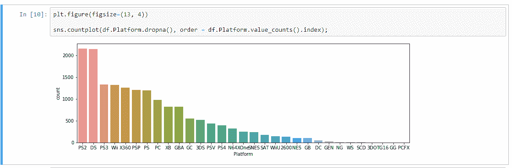

# 探索性数据分析初学者指南

> 原文：<https://towardsdatascience.com/exploratory-data-analysis-dcb5e7189c4e?source=collection_archive---------9----------------------->

## 包括一个简单的案例研究，以便更好地理解

Image by Author

## 目录:

1.  介绍
2.  数据类型
3.  单变量分析
4.  双变量分析
5.  结论

## **1。简介:**

假设你想为你的一次旅行预订一张机票。现在，你不会直接去一个特定的网站，并预订你看到的第一张票。你首先要在多家航空服务提供商的多个网站上搜索机票。然后你将比较票价和他们提供的服务。有免费 WiFi 吗？早餐和午餐是免费的吗？航空公司的总体评分比其他航空公司好吗？

从考虑买票到找到最适合你的票并预订，你将采取的任何措施都被称为“数据分析”。探索性数据分析的正式定义如下:

> **探索性数据分析(EDA)是指对数据进行初步调查的关键过程，以便在汇总统计和图形表示的帮助下发现模式、发现异常、测试假设和检查假设。**

## **2。数据类型:**

Types of Data [(Image by author)](https://medium.com/@unkletam/beginners-guide-exploratory-data-analysis-in-r-47dac64d95fe)

*   **二分变量:**二分变量是在测量时只取两个可能值之一的变量。性别:男性/女性。
*   **多项式变量:**多项式变量是有多个值可供选择的变量。教育资格:未受教育/本科/研究生/博士等。
*   **离散变量:**离散变量是可数变量。例如，您的银行存款余额、组织中的员工人数等。
*   **连续变量:**连续变量是一个有无限个可能值的变量。任何一种测度都是一个连续变量。温度是一个连续的变量。特定区域的温度可以描述为 30℃、30.2℃、30.22℃、30.221 ℃,等等。

所以你一定在想，为什么我们需要知道这些不同类型的数据来进行分析？答案是，统计方法是为处理特定类型的数据而设计的，而不是其他类型的数据。人们用来分析连续数据的许多方法可能不适用于分类数据。如果您不知道数据的类型，您可能会提供错误的数据分析！在统计学中，有大量可能的分析可以完成。了解我们可用的数据类型会限制可能性，并帮助我们选择最适合该数据的分析方法。

现在我们已经了解了不同类型的数据，让我们深入研究单变量分析。在应用任何类型的机器学习算法之前，了解您正在处理的数据类型非常重要。数据有什么样的特征(列)？它是数字数据还是分类数据？要了解数据，分析数据很重要。

## **3。单因素分析:**

单变量分析是分析数据的最简单形式。它是对一组不同特征中的一个特征的分析。它通常给我们一个特定特征的描述。它不处理原因或关系，它只是获取数据，对其进行总结，并以直方图、盒状图和须状图等形式表示出来。我们将在接下来的章节中了解这一点。

## **3.a 描述性统计:**

*   **集中趋势:**集中趋势是指一个分布的位置。它代表了我们通常对参与者的期望值。我们有三种选择来描述分布的中心趋势。

1.  **平均值:**平均值也称为算术平均值，计算分布中所有值的平均值。平均值容易出现异常值。
2.  **中位数(Q2):** 中位数是分布的第 50 个百分位数。如果分布具有奇数个值，则考虑中间元素；如果分布具有偶数个值，则考虑两个中间元素的平均值。
3.  **众数:**众数是分布中出现频率最高的值。数据分布中可以有一种或多种模式。

尽管集中趋势的度量告诉我们分布的中心，但它并不告诉我们分布中的每个值。参与者可以具有比平均值低得多或比平均值高得多的值。所以我们也应该知道分布的可变性。

*   **差异:**

使用范围、标准偏差和四分位间距来指定分布的方差。

1.  **范围:**范围就是分布中的最大值和最小值之差。
2.  **标准差:**标准差是一个描述一个组的成员与该组的平均值相差多少的量。
3.  **四分位间距:**四分位间距是第三个四分位(Q3)与第一个四分位之间的差值。

**a .第一个四分位数(Q1):** 第一个四分位数定义为最小数和数据集中位数之间的中间值。

**b .第二个四分位数(Q2):** 第二个四分位数不过是数据集的中位数。

**c .第三个四分位数(Q3):** 第三个四分位数是数据集的中值和最高值之间的中间值。

现在，让我们借助一个示例来理解可用于描述单变量数据的不同图表和图形。使用的数据集是“带评级的视频游戏销售”，可以在这里找到[。](https://www.kaggle.com/rush4ratio/video-game-sales-with-ratings)

首先，让我们**导入所需的库。**

Screenshot by Author

**加载数据:**

Screenshot by Author

**所有数字数据的五点汇总:**

在这里，我们可以看到一些描述性统计数据，如所有数字数据的平均值、标准差、最小值、Q1、Q2、Q3 和最大值。

Five-point summary (Screenshot by Author)

## **3.b 直方图:**

我们可以使用直方图了解更多关于数字数据的信息。数学分数具有单峰和对称分布。直方图是说明分布的集中趋势、可变性和形状的好方法。如果存在多种模式，这也是识别它们的好方法。然而，直方图并不是识别异常值的好方法。

Histogram (Screenshot by Author)

上面的直方图显示了一个特定游戏的发布时间。我们可以看到，最大游戏数量在 2005 年至 2012 年间推出，然后逐渐下降。

## **3.c 箱线图:**

箱线图是说明连续变量的另一种更可靠的方法。箱形图中的垂直线具有特定的含义。方框中的中心线是数据的第 50 个百分位数(中位数)。可变性由通过标记第一个和第三个四分位数形成的方框表示。这个方框代表四分位数范围。胡须从盒子向左右延伸。当没有异常值时，左栏和右栏代表最小值和最大值。当存在任何异常值时，用围栏外的小圆圈或星形表示。

箱线图是说明分布的集中趋势、可变性和偏斜度的有用方法。这也是检测异常值和极值的一个很好的方法。直方图和箱线图都有一定的局限性和限制。因此，在浏览数据时，您应该绘制直方图和箱线图，但只选择其中一个用于报告，以便我们更好地了解数据。如果你有一个有异常值的单峰分布，用一个箱线图，如果你有一个双峰分布，用一个直方图。

Boxplot (Screenshot by Author)

## **三维分类数据—条形图:**

这是一个条形图，显示了客户用来玩游戏的不同平台。我们可以看到，大多数客户使用 PS2 作为他们的控制台，较少的客户使用 GG 或 PCFX 等控制台。

条形图是表中信息的图形表示。条形图的一个关键特征是条形图彼此不接触。这一特征表明这些值是分类的而不是连续的。这是绘制分类数据的合适方法。

Bar Graph (Screenshot by Author)

这是条形图的另一个例子。该图显示了客户演奏的不同流派。最受欢迎的类型是动作片，而最不受欢迎的是益智片。

Bar Graph (Screenshot by Author)

## **4。双变量分析:**

在 EDA 中，我们经常会学到两个变量之间的关系。可以提出一些问题，例如:

1.  一个特征与另一个特征的相关程度如何？
2.  一个变量的较低值对应于另一个变量的较低值吗？
3.  一个变量的较高值对应于另一个变量的较高值吗？
4.  这两个特征遵循什么样的关系？

描述两个变量之间的关系比我们已经讨论过的方法更复杂，因为我们必须考虑两个变量中的数据类型。可能有不同的数据组合，例如一个可能是连续的，另一个可能是分类的，或者两个都是连续的，或者两个都是分类的。这些组合导致不同的统计和图形摘要。分析的必要部分是两个变量都必须有某种值。如果任何变量缺少任何值，它们就不能包含在分析中。

现在让我们来看一些可以在双变量分析中做出的图形总结。

## **4 .关联:**

数据关联是了解数据集中多个值或要素之间关系的一种方式。相关性有助于在一个属性的帮助下预测另一个属性(这可用于估算数据集中的缺失值)。

有三种不同类型的相关性:

1.  **正相关:**如果一个特征与另一个特征的值的变化成正比，则相关被认为是正的。

例如:如果特征 A 的值增加，那么特征 B 的值也增加，或者如果特征 A 的值减少，那么特征 B 的值也减少。

**2。负相关:**如果一个特征与另一个特征的值的变化成反比，则相关被认为是负的。

例如:如果特征 A 的值增加，那么特征 B 的值减少，反之亦然。

**3。不相关:**这两个属性之间不存在任何关系。

这些相关类型中的每一种都存在于由从-1 到+1 的值表示的谱中，其中轻微或高度正相关特征可以像 0.5 或 0.7。相关性分数为 0.9 或 1 表示非常强且完美的正相关性。如果有很强的负相关，就用-0.9 或-1 的值来表示。接近零的值表示没有相关性。

之所以要了解特征之间的相关性，是因为一个叫做“多重共线性”的概念。如果数据集具有完全正相关或负相关的属性，则模型可能会受到多重共线性的影响。当一个预测变量可以通过其他预测变量以较高的准确度进行线性预测时，就会出现多重共线性。虽然你可能认为这是一件好事，但事实并非如此，因为它会导致误导或扭曲的结果。

处理这个问题的一些方法是删除一个完全相关的特征或者使用降维算法，例如主成分分析(PCA)。

下面的代码显示了我们如何以矩阵的形式可视化特征之间的相关性。

Screenshot by Author

Heatmap (Screenshot by Author)

这里我们可以看到，有一些特征具有轻微的正相关或负相关，但没有完全的正相关或负相关。对角线元素的值将始终为 1，因为它们与相同的特征进行比较。

## **4.b 散点图:**

在散点图中，点分别用点、圆或其他形状表示。使用散点图可以轻松检测异常值和极值。

在下图中，绘制了全球销售和北美销售之间的散点图。我们可以在最右上方发现一个异常值。

Scatter Plot (Screenshot by Author)

## **4.c 配对图:**

除了单独绘制散点图，我们还可以绘制成对图。它会为每个特征和其他特征绘制一个散点图。请注意，默认的 seaborn 库只绘制数字的配对图。对角线上的直方图允许我们看到单个变量的分布，而上下三角形上的散点图显示了两个变量之间的关系(或缺乏关系)。

Screenshot by Author

Pair plot (Screenshot by Author)

## **5。结论:**

这只是探索性数据分析的一个小介绍。我的目的不是向您介绍各种其他类型的图表和图形摘要，而是让您了解应该对不同类型的数据进行什么样的分析。读完这篇文章后，我建议你选择任何数据集，自己完成 EDA。

如果你已经走了这么远，非常感谢。如果你有任何建议让这个博客更好，请在评论中提出。