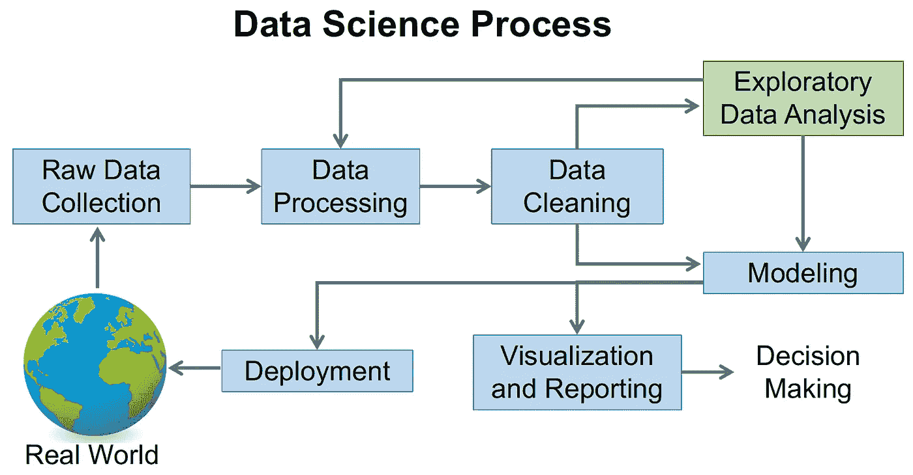
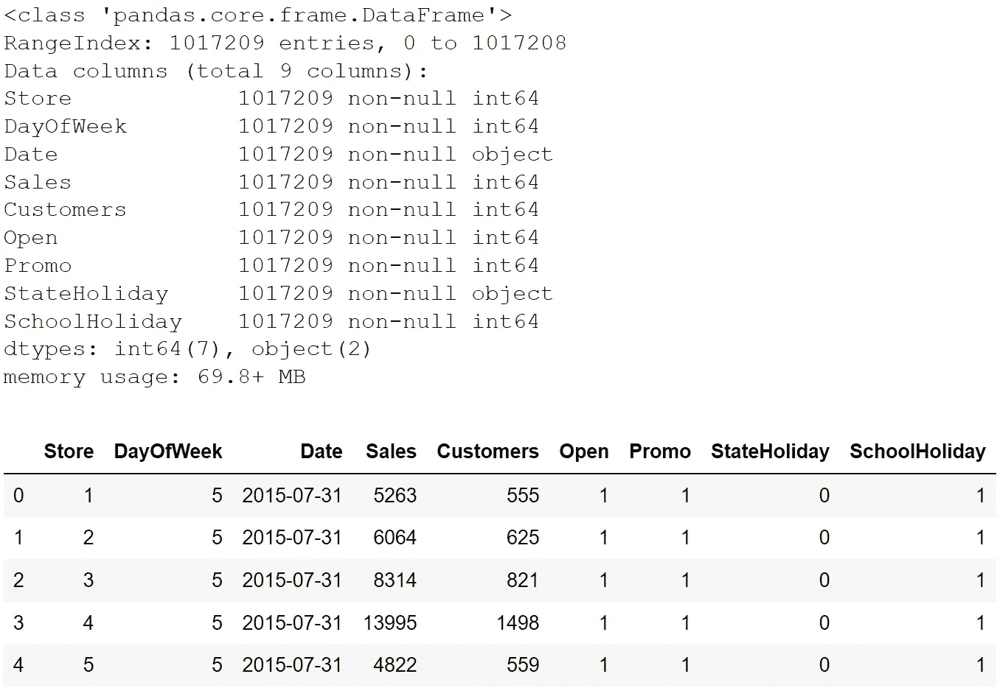
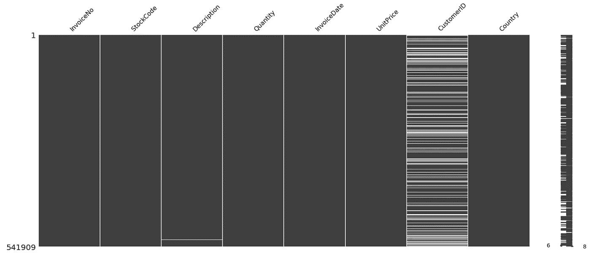
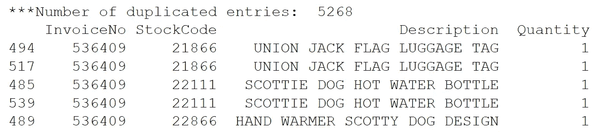
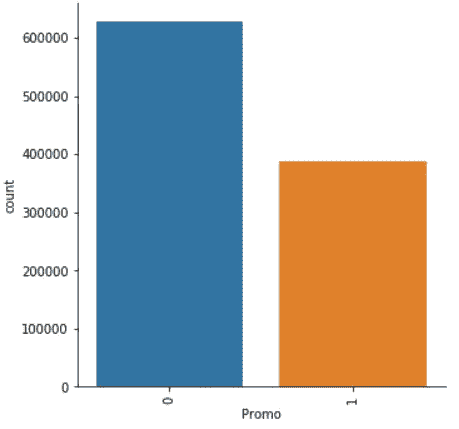
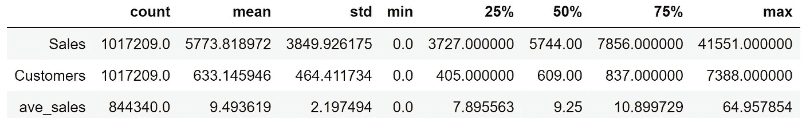
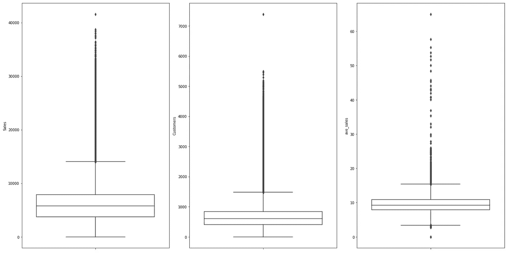
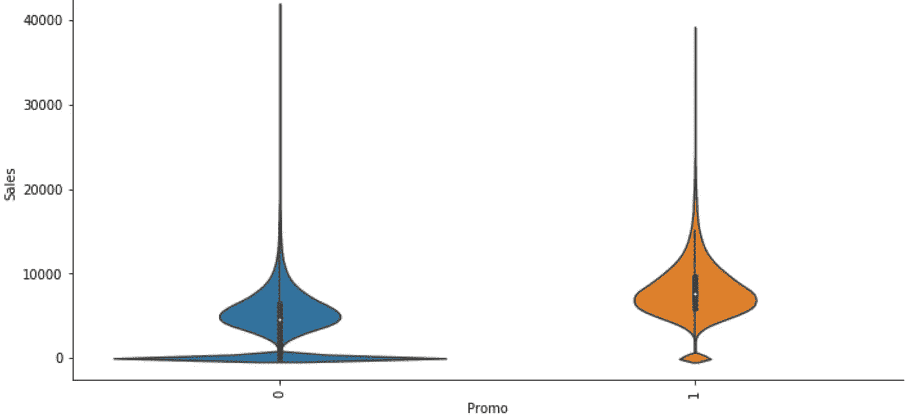
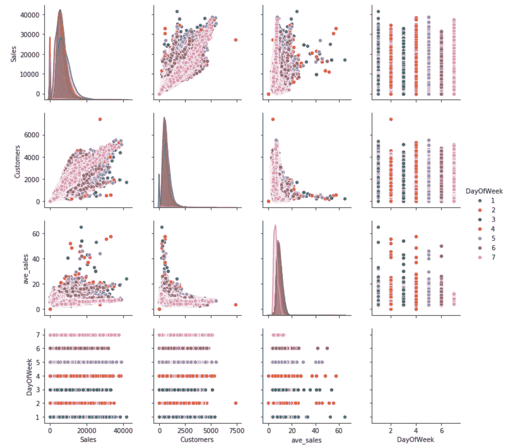
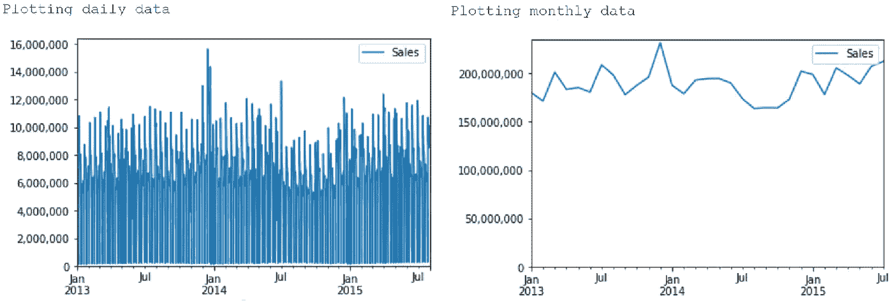

# 探索性数据分析:结构化数据的实用指南和模板

> 原文：<https://towardsdatascience.com/exploratory-data-analysis-eda-a-practical-guide-and-template-for-structured-data-abfbf3ee3bd9?source=collection_archive---------2----------------------->


Photo by [Rawpixel](https://depositphotos.com/portfolio-3591429.html) on [depositphotos](https://depositphotos.com/63016959/stock-photo-man-working-on-a-computer.html)

通常，最难的不是画画，而是在一张白纸上画什么会难倒人。

同样，对于数据科学，人们可能想知道在收到数据集后如何开始。这就是探索性数据分析(EDA)的用武之地。

根据维基百科，EDA“是一种分析数据集以总结其主要特征的方法，通常采用可视化方法”。用我自己的话来说，它是关于了解你的数据，在你开始从数据中提取洞察力之前，对数据有一定程度的熟悉。

由于 EDA 对于所有数据科学项目来说都是至关重要的第一步，懒惰的 me 决定编写一个代码模板，用于在结构化数据集上执行 EDA。这个想法是花更少的时间编码，更多地关注数据本身的分析。向下滚动到代码链接的底部，但是请继续阅读，找到更多关于 EDA 的信息，并理解代码的作用。

# EDA 在数据科学过程中处于什么位置

在我们深入研究 EDA 之前，首先了解 EDA 在整个数据科学过程中的位置非常重要。



Image by author, inspired by [Farcaster at English Wikipedia](https://commons.wikimedia.org/wiki/File:Data_visualization_process_v1.png)

参考维基百科中的流程图，在收集数据后，在清理之前会进行一些处理，然后执行 EDA。请注意，在 EDA 之后，我们可能会回到数据的处理和清理，也就是说，这可能是一个迭代过程。随后，我们可以使用干净的数据集和来自 EDA 的知识来执行建模和报告。

因此，我们可以这样理解 EDA 的目标:

*了解数据，从数据中寻找线索，*

1.  *为我们的建模制定假设和假说；和*
2.  *检查数据质量，必要时进行进一步处理和清理。*

为了更好地说明 EDA 的概念，我们将使用来自 Kaggle 的 [Rossmann 商店销售“train.csv”数据。请记住，问题陈述是为了预测商店销售，因此，我们的 EDA 目标是:](https://www.kaggle.com/c/rossmann-store-sales/data)

1.  检查有助于预测销售的功能；和
2.  检查可能影响我们预测模型的异常或异常值。

# EDA 概述

我们的代码模板将执行以下步骤:

1.  预览数据
2.  检查条目总数和列类型
3.  检查任何空值
4.  检查重复条目
5.  数值数据的图分布(单变量和成对联合分布)
6.  分类数据的绘图计数分布
7.  按每日、每月和每年的频率分析数字数据的时间序列

必要的依赖关系如下:

```
import pandas as pd
import numpy as np
import matplotlib
import matplotlib.pyplot as plt
import seaborn as sns
import missingno
%matplotlib inline
```

# 初步数据处理

首先，我们读入数据集，并生成数据的简单预览和统计。

```
df = pd.read_csv('train.csv')
df.info()
df.head()
```



输出显示我们有大约 100 万个条目，有 9 列。没有空值，但应该更改一些列的数据类型。正如我们将在后面看到的，正确设置数据类型可以在我们的数据科学过程中帮助我们。简而言之，有三种常见的数据类型(分类、数字和日期时间),我们对每种类型都有不同的 EDA 过程。

在我们的初步处理中，我们以下列方式更改了数据类型:

*   设置标识符*将*存储为字符串。
*   对于分类的列，也就是说，可能值的数量有限且通常是固定的列，我们将它们的类型设置为“category”。例如性别、血型和国家都是分类数据。
*   对于数值型的列，我们可以将它们的类型设置为“int64”(整数)或“float64”(浮点数)。例如，销售额、温度和人数都是数字数据。
*   将*日期*设置为“日期时间 64”数据类型。

```
# set identifier "Store" as string
df['Store'] = df['Store'].astype('str')# set categorical data
df['DayOfWeek'] = df['DayOfWeek'].astype('category')
df['Open'] = df['Open'].astype('category')
df['Promo'] = df['Promo'].astype('category')
df['StateHoliday'] = df['StateHoliday'].astype(str).str.strip().astype('category')
df['SchoolHoliday'] = df['SchoolHoliday'].astype('category')# set datetime data
df['Date'] = pd.to_datetime(df['Date'])
```

# 我们的 EDA 开始了

设置完数据类型后，我们就可以开始娱乐了。

要建立这个聚会，我们只需复制、粘贴并运行包含各种函数的[代码模板](https://gist.github.com/jiahao87/c97214065f996b76ab8fe4ca1964b2b5)，然后运行函数 *eda* ，该函数接收熊猫数据帧作为输入。

```
eda(df)
```

就是这样！简单:)

现在让我们来看一下输出的显著部分，以了解如何利用我们的 EDA 结果。

# 缺少值和重复条目

在我们的例子中，没有缺少值的条目。

但是，如果缺少值，代码将生成一个类似于下图的图表。注意 *CustomerID* 和*描述*下的空格；这些是缺失的值。因此，一眼就能看出我们价值观缺失的程度。



Missing entries chart

与检查缺失值相关的代码部分如下。

```
# generate preview of entries with null values
if df.isnull().any(axis=None):
    print("\nPreview of data with null values:\nxxxxxxxxxxxxx")
    print(df[df.isnull().any(axis=1)].head(3))
    missingno.matrix(df)
    plt.show()
```

在我们的例子中，也没有重复的条目，代码将通过输出“没有找到重复的条目”直接指出这一点。

如果出现重复条目，输出将显示重复条目的数量以及这些条目的预览。



Duplicated entries sample output

检查重复条目的代码:

```
# generate count statistics of duplicate entries
if len(df[df.duplicated()]) > 0:
    print("No. of duplicated entries: ", len(df[df.duplicated()]))
    print(df[df.duplicated(keep=False)].sort_values(by=list(df.columns)).head())
else:
    print("No duplicated entries found")
```

如果有任何丢失的值或重复的条目，您应该在进一步处理 EDA 的其他部分之前决定所需的清理步骤。

关于如何处理缺失值的参考，您可以参考这篇由[吴俊](https://medium.com/u/330285ecbc54?source=post_page-----abfbf3ee3bd9--------------------------------)撰写的[文章](/handling-missing-data-for-a-beginner-6d6f5ea53436)。

对于重复的条目，检查它们确实是重复的，并通过下面的代码删除它们。

```
df.drop_duplicates(inplace=True)
```

# 分类数据 EDA

我们针对分类数据的主要 EDA 目标是了解唯一值及其对应的计数。

使用 Rossmann 商店销售额，例如列 *Promo* 指示商店当天是否在进行促销。根据 *Promo* 的独特值对其进行计数显示，促销活动非常频繁，占据了大约 40% (388，080 / 1，017，209)的店铺天数。这可能表明*宣传片*是预测销量的一个重要特征。



为分类数据生成 EDA 的函数是*分类 eda* 。

```
def categorical_eda(df):
    """Given dataframe, generate EDA of categorical data"""
    print("To check: Unique count of non-numeric data")
    print(df.select_dtypes(include=['category']).nunique())
    top5(df)
    # Plot count distribution of categorical data
    for col in df.select_dtypes(include='category').columns:
        fig = sns.catplot(x=col, kind="count", data=df)
        fig.set_xticklabels(rotation=90)
        plt.show()
```

# 数字数据 EDA

对于数字数据，我们的 EDA 方法如下:

1.  绘制每个数字数据的单变量分布图
2.  如果分类数据可用，按每个分类值绘制单变量分布图
3.  绘制数值数据的两两联合分布

在运行 *eda* 函数之前，我们通过将*销售额*除以*客户*创建了一个新列 *ave_sales* ，这样我们就可以分析每个客户每天的平均销售额。

我们的数字数据 EDA 的第一个输出显示了一些简单的分布统计，包括平均值、标准差和四分位数。



我们可以从输出中获得的一些要点包括:

*   所有数值数据都没有负值。如果有任何负值，这可能意味着我们必须进一步调查，因为销售额和客户数量不太可能是负数，然后我们可能必须清理数据。
*   数值数据的最大值与 75%相差甚远，表明我们可能有异常值。



箱线图进一步证实了存在*销售额*超过 40，000 或*客户*超过 7，000 的异常值。因此，我们可能会进行检查，看看这是一个错误，还是有其他特殊情况导致的异常数字。

我们还按类别值为每个数字数据绘制了小提琴图，以调查*促销*对*销售*的影响。



从上面的小提琴图中，我们可以推断，在促销日，从小提琴图的更宽部分可以看出，销售额通常会增加。对于 *Promo* =0，靠近 0 *销售*的地块的宽部分可能是由于关闭的商店。在移除*打开* =0 的条目后，稍后再次运行 *eda* 函数，显示 0 附近的宽段不再存在，从而证实了我们的假设。

数字数据 EDA 的最后一个输出是成对联合分布图。

为了获得更深入的信息，我们运行了函数 *numeric_eda* 并添加了参数 *hue='DayOfWeek'* 。这使得我们可以根据一周中的每一天来给我们的成对绘图着色。

```
numeric_eda(df, hue='DayOfWeek')
```



通过将 *DayOfWeek* 合并到图中，我们注意到周日的 ave_sales(用粉色表示)相对来说比其他几天更稳定。因此，这是一个可以进一步研究和考虑的预测因素。

# 时间序列 EDA

最后，我们还绘制了时间序列图来检查趋势和季节性。

为了便于分析，在绘制图表之前，我们的代码会按照每天、每月和每年的频率自动汇总数字数据。这是通过[熊猫的重采样方法](https://pandas.pydata.org/pandas-docs/stable/reference/api/pandas.DataFrame.resample.html)实现的。



在我们的例子中，年度图表没有用，因为数据只包含 2015 年的部分数据，因此我们在截图中没有显示。

从日图可以看出，2013 年 12 月底有异常值。这也体现在每月的剧情上。

月度图还显示了一些季节性，即二月份销售额较低，这可能是由于短月效应，以及接近年底时销售额较高。如果我们要预测月销售额，我们的预测必须考虑这种季节性影响。

通过上面的例子，我们希望能够展示 EDA 是如何用于为我们的建模制定假设和假说，以及检查数据质量以进行进一步处理和清理的。

如果你错过了[代码模板链接](https://gist.github.com/jiahao87/c97214065f996b76ab8fe4ca1964b2b5)，这里再次出现。

最后，请注意，根据您的数据科学问题陈述，您可能希望执行额外的 EDA 步骤。尽管如此，代码模板应该能够涵盖基本的 EDA 并让您快速上手。

如果您也在考虑为文本数据执行 EDA，请查看这篇由 [neptune.ai](https://medium.com/u/a7a4a9e70d82?source=post_page-----abfbf3ee3bd9--------------------------------) 撰写的关于用于自然语言处理的 [EDA 的文章。在这篇文章中，作者举例说明了几乎所有可以用来理解文本数据的主要技术。](https://neptune.ai/blog/exploratory-data-analysis-natural-language-processing-tools)

感谢阅读，我希望代码和文章是有用的。如果您有任何问题或建议，请随时发表评论。

# 参考

*   https://en . Wikipedia . org/wiki/explorative _ data _ analysis # target text = In % 20 statistics % 2C % 20 explorative % 20 data % 20 analysis，modeling % 20 or % 20 hypothesis % 20 testing % 20 task。
*   [https://towards data science . com/explorative-data-analysis-EDA-techniques-for-ka ggle-competition-初学者-be4237c3c3a9](/exploratory-data-analysis-eda-techniques-for-kaggle-competition-beginners-be4237c3c3a9)
*   [https://medium . com/@ aiden . data miner/the-data-science-method-DSM-explorative-data-analysis-BC 84d 4d 8d 3 f 9](https://medium.com/@aiden.dataminer/the-data-science-method-dsm-exploratory-data-analysis-bc84d4d8d3f9)